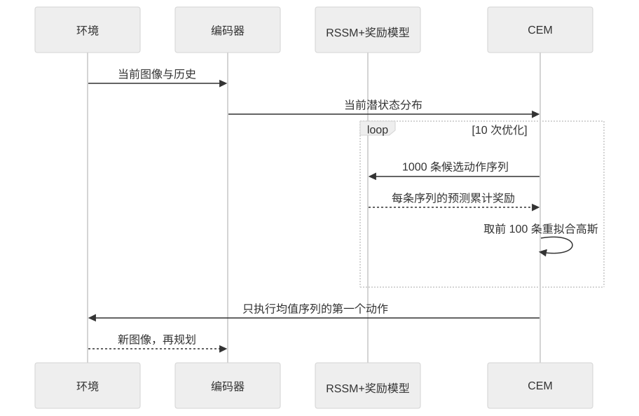

> - **公开入口：** [论文页](https://arxiv.org/abs/1811.04551) · [PDF](https://arxiv.org/pdf/1811.04551) · [正式页面](https://proceedings.mlr.press/v97/hafner19a.html) · [TeX 源码入口](https://arxiv.org/e-print/1811.04551)
> - **归档：** 2019 · ICML 2019 · 严格策略 RL · 系列第 10/51 篇
> - **模块：** B. 扩展、探索与世界模型
> - 正文中的本地文件名、SHA-256 与版本记录用于说明核验过程；博客不镜像原论文 PDF 或 TeX。

> **一句话地图：** 输入是图像、动作和奖励序列；训练信号是图像/奖励重建与潜变量先验—后验的一致性；更新的是带随机与确定性路径的世界模型；执行时用 CEM 在潜空间反复试动作，输出当前最值得执行的动作。

## 0. 阅读导航

- 需要的前置概念：POMDP、模型式强化学习、变分自编码器、KL 散度、模型预测控制（MPC）、交叉熵方法（CEM）。
- 读完应能解释：为什么像素重建只是训练信号、规划却不生成像素；RSSM 为什么同时保留确定性记忆与随机变量；latent overshooting 检验什么、又没有成为最终 PlaNet 的必要组件。
- 定位口径：PDF 文件 20 页；正文公式、图表和附录节号按 arXiv v5。页码以下以 PDF 页码为准。
- 证据标签：**[论文证据]** 来自原文；**[作者解释]** 是作者提出但未被实验单独证明的机制；**[机制推断]** 是本讲义给出的可证伪解释。

## 1. 它遇到了什么具体问题？

模型式强化学习想先学会“世界怎样变化”，再在模型里试动作。像素控制让这件事很难：相机画面有上万维，单张图还可能看不见完整状态；模型每向前滚一步都会有误差，十几步后偏差可能累积；确定性模型会把多个可能未来平均成一个模糊未来；规划器又会主动搜索模型最不准的角落，把小误差当成高奖励捷径。

例如，小车暂时移出镜头时，当前图像不足以确定它在哪里。纯前馈模型忘记历史；纯确定性循环模型可能过度确信唯一未来；逐像素生成一千条候选未来则太贵。PlaNet 要在每个真实环境步评估成千上万条动作序列，因此世界模型既要记住历史、表达不确定性，又要能快速向前滚动。

*图 1｜根据相邻正文中的问题、机制或算法流程重绘。*

论文限定在六个 DeepMind Control Suite 连续控制任务，只用第三人称图像作为观测。它没有声称解决任意真实世界视觉控制，也没有给出模型误差下的安全保证。

## 2. 前人怎样解决，为什么仍然不够？

| 路线 | 改了哪一环 | 仍留下的机制问题 |
|---|---|---|
| PILCO、PETS 等状态空间规划 | 直接在低维、近似 Markov 的真实状态上学习动力学 | 通常访问模拟器状态，有时还访问奖励函数；不等同于从像素推断隐藏状态 |
| 确定性 RNN / 视频预测 | 用循环状态记住历史，并预测未来观测 | 多种未来被压成一个预测；规划器容易利用过度自信的误差（图 2a，第 4 页） |
| 纯随机状态空间模型 SSM | 用随机潜变量表达多个未来 | 随机转移难以长期保存确定信息，优化未必学会把部分方差压到零（第 4 页） |
| observation overshooting | 对多步预测继续解码图像并加重建损失 | 在图像域为每个距离生成画面，计算昂贵（图 3b，第 5 页） |
| model-free A3C/D4PG | 不显式学习世界模型，直接学策略/价值 | 需要更多环境交互；奖励需要通过 Bellman 更新间接传播 |

PlaNet 的最小干预有两层：用 RSSM 把确定性记忆 $h_t$ 与随机状态 $s_t$ 合起来；用学习到的潜在动力学和奖励模型直接做 MPC，不训练策略网络或价值网络。

## 3. 核心想法：先说人话

把世界模型想成一块“可快速快进的草稿板”。编码器看真实图像，把当前处境压成潜在状态；规划器在草稿板上随机写下很多未来动作，世界模型只预测潜在状态与奖励，不画未来图；CEM 保留奖励最高的一小批动作，再围绕它们重新采样。反复十轮后，只执行第一步，看到新图像后重新规划。

RSSM 里有两种记忆：

- $h_t$ 像账本，确定地汇总历史，适合记住“刚才发生过什么”；
- $s_t$ 像抽签，表达从当前信息无法确定的未来分支。

类比的边界是：$s_t$ 的随机性由有限维高斯给出，不保证等于环境真实的不确定性；规划器也可能继续利用模型未见区域。

## 4. 算法与信息流

*图 2｜根据相邻正文中的问题、机制或算法流程重绘。*

训练和执行的边界如下：

- 采样分布：先有 5 个随机 seed episodes；之后每训练 100 个更新步，用当前模型规划收集 1 个新 episode，并向动作加 $\mathcal N(0,0.3)$ 噪声（附录 A，第 8 页）。
- 更新参数：编码器、RSSM、观测模型、奖励模型一起用 Adam 更新；批量 50 段、每段长度 50。
- 冻结参数：规划期间世界模型固定；没有独立策略或价值网络。
- CEM：规划长度 $H=12$，10 次迭代；每次采样 1000 条候选序列，保留 100 条精英序列重新拟合对角高斯（附录 A 与算法 2）。
- MPC：每个真实环境步只执行候选序列的第一个动作，新观测到来后从零均值、单位方差重新开始搜索。

*图 3｜根据相邻正文中的问题、机制或算法流程重绘。*

## 5. 公式逐步推导

### 5.1 符号表

| 符号 | 普通含义 | 数学对象/形状 | 从哪里得到 |
|---|---|---|---|
| $o_t$ | 第 $t$ 步图像 | $64\times64\times3$ 张量 | 环境 |
| $a_t$ | 连续动作 | 向量 | CEM 规划器 |
| $r_t$ | 标量奖励 | 标量 | 环境/奖励模型 |
| $h_t$ | 确定性历史记忆 | 200 维 GRU 状态 | RSSM 递推 |
| $s_t$ | 随机潜状态 | 30 维对角高斯样本 | 先验 $p$ 或后验 $q$ |
| $q(s_t\mid h_t,o_t)$ | 看过当前图像后的后验 | 对角高斯 | 编码器 |
| $p(s_t\mid h_t)$ | 只靠历史预测的先验 | 对角高斯 | 转移模型 |
| $\beta_d$ | 第 $d$ 步一致性权重 | 非负标量 | 超参数 |

### 5.2 从数据似然得到 ELBO

先看纯随机状态空间模型。观测似然需要积分掉所有隐藏状态：

$$
p(o_{1:T}|a_{1:T})=\int\prod_t p(s_t|s_{t-1},a_{t-1})p(o_t|s_t)\,ds_{1:T}.
$$

插入近似后验 $q(s_{1:T}\mid o_{1:T},a_{1:T})$，把它乘上再除掉；对 $\log\mathbb E_q[\cdot]$ 使用 Jensen 不等式，得到原论文公式 (3)：

$$
\log p(o_{1:T}|a_{1:T})\ge
\sum_t \underbrace{\mathbb E_q[\log p(o_t|s_t)]}_{\text{图像重建}}
-\underbrace{\mathbb E_{q(s_{t-1})}
\mathrm{KL}[q(s_t|o_{\le t},a_{<t})\|p(s_t|s_{t-1},a_{t-1})]}_{\text{后验与一步先验一致}}.
$$

第一项让潜状态保留足以解释图像的信息；第二项让“看见图像后的判断”不要偏离“只按动力学预测的判断”。这是下界，不是对数似然本身；实现用一次重参数化样本估计期望。奖励重建项同理加入。

RSSM 把状态拆为

$$
\begin{aligned}
h_t&=f(h_{t-1},s_{t-1},a_{t-1}),\\
s_t&\sim p(s_t|h_t),\\
o_t&\sim p(o_t|h_t,s_t),\\
r_t&\sim p(r_t|h_t,s_t).
\end{aligned}
$$

所有图像信息必须经过随机采样 $s_t\sim q(s_t\mid h_t,o_t)$，避免编码器开一条确定性“偷看当前图像”的捷径（公式 (4)，第 4 页）。

### 5.3 latent overshooting 为何出现

标准 ELBO 只让一步先验贴近后验。规划时却要连续应用转移模型：

$$
p(s_t|s_{t-d})=\int\prod_{\tau=t-d+1}^{t}p(s_\tau|s_{\tau-1})\,ds_{t-d+1:t-1}.
$$

若模型容量有限，一步最优不等于多步滚动最优。论文把所有 $1\le d\le D$ 的多步先验与同一时刻的后验对齐，得到公式 (7)：

$$
\sum_t\left[
\mathbb E_{q(s_t\mid o_{\le t})}\log p(o_t\mid s_t)
-\frac1D\sum_{d=1}^D\beta_d\,
\mathbb E_{\substack{
p(s_{t-1}\mid s_{t-d})\\
q(s_{t-d}\mid o_{\le t-d})
}}
\mathrm{KL}\!\left(
q(s_t\mid o_{\le t})
\middle\|
p(s_t\mid s_{t-1})
\right)
\right].
$$

该式与原文一样省略动作条件，完整分布见第 5 页公式 (7)。外层先从时刻 $t-d$ 的后验出发，连续滚动到 $s_{t-1}$，再要求下一步先验贴近时刻 $t$ 的后验；它不是简单把一个边缘化的 $d$ 步先验直接塞进 KL。对 $d>1$，实现停止后验梯度：让多步先验追后验，不让后验反向迎合错误预测。**关键边界：**正文明确说若干模型从 overshooting 受益，但最终 RSSM 版本不需要它；附录 A 也说明最终代理未使用它。因此不能把 PlaNet 的主结果归因于 overshooting。

### 5.4 一组小数字走完 CEM 与 KL

先看 CEM。设一维动作、规划两步，第一轮只采样 5 条序列，模型给出的累计奖励为：

| 动作序列 | 预测奖励 |
|---|---:|
| $(-1,0)$ | 0.2 |
| $(0,0)$ | 0.5 |
| $(1,0)$ | 1.4 |
| $(1,1)$ | 1.8 |
| $(0,1)$ | 0.9 |

保留前 2 条，第一维精英动作都是 1，第二维是 0 和 1，所以重拟合均值从 $(0,0)$ 移到 $(1,0.5)$。下一轮围绕这个均值采样。执行时只取第一维动作 1；真实新图像到来后第二维计划作废并重算。

再看 overshooting 的含义。假设某时刻后验为 $q=\mathcal N(1,1)$，一步滚动先验为 $p_1=\mathcal N(0.8,1)$，三步滚动先验为 $p_3=\mathcal N(0,1)$。同方差高斯的

$$
\mathrm{KL}[\mathcal N(\mu_q,1)\|\mathcal N(\mu_p,1)]
=\frac{(\mu_q-\mu_p)^2}{2}.
$$

所以一步罚项是 $0.02$，三步罚项是 $0.5$。只训练一步几乎看不见远期漂移；加入三步项会产生更大的纠正信号。请先自己解释：如果三步后验本身噪声很大，停止后验梯度保护了什么？它又不能修复什么？

## 6. 实验到底检验了什么？

| 研究问题 | 对照与控制变量 | 指标/样本 | 原论文结果与定位 | 能说明什么 | 不能说明什么 |
|---|---|---|---|---|---|
| 从像素规划是否比 model-free 更省交互？ | PlaNet、A3C、D4PG；六任务；A3C 用本体状态、D4PG/PlaNet 用像素 | 最终分数；5 seeds×10 trajectories | PlaNet 1000 episodes 得 821/832/662/700/930/951；D4PG 100000 episodes 得 862/967/524/985/980/968（表 1，第 6 页） | PlaNet 在该套任务上用约百分之一 episodes 达到接近 D4PG 的最终表现 | 各算法实现、观测和训练预算并非完全对齐；不是普适 100 倍定律 |
| 与 A3C 的差距多大？ | A3C 100000 episodes、本体状态；PlaNet 1000 episodes、像素 | 六任务最终分数 | A3C 为 558/285/214/129/105/311；PlaNet 六项全高（表 1） | 即使输入更难，学习模型并规划可显著节省交互 | A3C 是早期基线，不能代表后续 model-free 上限 |
| RSSM 两条路径是否必要？ | RSSM、纯 GRU、纯 SSM，其他训练设置一致 | 六任务学习曲线；5 seeds，阴影 5–95 百分位 | 纯随机 SSM 记忆不足；纯确定 GRU 多数任务弱；作者报告随机分量尤其关键（图 4，第 6 页） | 混合结构与高规划分数相关，消融覆盖六任务 | 不能单独确定是多模态未来、正则化噪声还是优化差异造成 |
| 在线收集与迭代搜索有无贡献？ | PlaNet；随机动作收集；每步从 1000 序列直接选最好而不迭代 CEM | 六任务曲线 | 在线收集全任务有益，对 cartpole/finger/walker 必要；CEM 迭代全任务提升（图 5，第 6 页） | 数据分布和规划优化都是系统有效性的组成部分 | 图中没有隔离全部交互项，不能把增益简单相加 |
| learned model 距真实模拟器多远？ | 同一 CEM 参数，学习模型 vs 真实 simulator | 最终分数 | 真模拟器为 850/964/656/825/993/994；PlaNet 为 821/832/662/700/930/951（表 1） | 若模型准确，CEM 本身能完成任务；PlaNet 在部分任务接近此参考 | “真模拟器”不是绝对上界；搜索预算有限，cheetah 中 PlaNet 662 略高于 656 |
| overshooting 是否是主结果必要条件？ | 附录中模型/overshooting 消融 | 学习曲线 | 作者明确称最终 RSSM 不需要 overshooting（第 5 页、附录 A） | 保留了干净负结果：结构改进可替代该正则 | 不否定 overshooting 对其他世界模型或更长预测距离的价值 |

## 7. 结果如何理解？

**[论文证据]** 表 1 的数据效率增益由 D4PG 曲线估读：cartpole 250×、reacher 40×、cheetah 500×以上、finger 300×、cup 100×、walker 90×。这些是“达到 PlaNet 最终分数所需 episodes”的近似，不是逐步严格配对统计。

**[论文证据]** PlaNet 在 cheetah 上 662，相比 D4PG 524 高约 $26.3\%$；finger 则 700，明显低于 D4PG 985。这种一正一负说明接触动力学并非统一解决，任务差异仍大。

**[作者解释]** 随机状态可能表达部分可观测初始状态，也可能给规划目标加入安全余量；论文没有在同一消融中区分这两种解释。

**[机制推断]** RSSM 的优势若主要来自“确定路径负责长期记忆、随机路径负责多未来”，那么在保持模型容量和数据量相同的可控 POMDP 中：延长遮挡时长应首先伤害纯 SSM；增加转移多模态性应首先伤害纯 GRU；RSSM 应在两轴同时增大时保持相对优势。若纯 GRU 加等量噪声即可完全追平，或 RSSM 优势与遮挡/多模态性无关，这个机制解释就不充分。

另一个可证伪预测针对 latent overshooting：当规划跨度超过训练的一步误差尺度、模型容量受限时，加入 $d>1$ KL 项应降低多步潜状态误差并提高长跨度规划；若多步误差下降而控制不变，则“规划受多步模型误差限制”不成立，瓶颈可能在奖励模型或 CEM。

## 8. 优点、代价与失效条件

### 优点

- 把视觉建模和控制放在同一潜空间，规划不必渲染图像，计算路径清楚。
- RSSM 的结构假设与失败模式对应：确定路径保留历史，随机路径表示未知未来。
- 模型、采集策略和规划器均有消融；表 1 同时报告真实性能参考与 model-free 基线。
- 论文诚实保留 overshooting 对最终 RSSM 非必要的结果，避免把方法包中的每一项都包装成必需创新。

### 代价

- 每个环境步要评估 $10\times1000$ 条长度 12 的候选序列；环境交互少不等于计算少。
- 需要训练图像解码器，尽管执行时不用它；重建像素可能把容量花在与控制无关的细节上。
- CEM 从固定高斯重新开始，可能漏掉多峰动作分布或需要更长规划跨度的策略。

### 已观察到的失败

- PlaNet 在 finger spin 明显落后 D4PG（700 vs 985，表 1）。
- 单一多任务模型能解六任务，但学习慢于逐任务模型（附录图 7）。
- 纯随机和纯确定模型均表现较弱；overshooting 不是最终 RSSM 的必要项。

### 尚未验证的外推

- 没有真实机器人、自然视频、离散语言动作或安全约束实验。
- 没有证明潜变量对应可解释物理状态，也没有校准不确定性。
- 训练和测试来自同一任务分布，不能推出跨环境泛化。

## 9. 它怎样影响后来的大模型强化学习？

这篇论文不是大模型 RLHF 的直接祖先。它对后续 agentic LLM 更有启发性的原则是：把昂贵真实交互压到学习模型中，在模型里评估候选行动，再用真实观测闭环重规划。语言 agent 若使用 learned world model、结果预测器或过程模拟器，也面临同样风险：规划器会主动找到预测器的漏洞。

直接类比有边界。PlaNet 的动作和状态低维且环境每步返回明确奖励；LLM 工具调用的状态开放、奖励含人类偏好、模型本身兼作策略与世界知识。不能从六个控制任务直接推出“潜空间规划优于语言策略优化”。

## 10. 三个自检问题

1. 为什么 PlaNet 在训练时重建图像，却在规划时故意不生成图像？
2. 纯 SSM 和纯 GRU 分别容易在哪类失败机制上出问题？请用遮挡和多未来各举一例。
3. latent overshooting 为什么能提供多步训练信号？为何最终主结果又不能归功于它？

## 11. 原文定位与核验记录

- 原论文：Danijar Hafner 等，*Learning Latent Dynamics for Planning from Pixels*，ICML 2019，arXiv:1811.04551v5。
- PDF 校验和：`abac727526e6a45669d3ab9957126587e22aacf4dc9bcd60ffe5c853108e5bcc`。
- 使用的 TeX/文本：`papers/2019/planet/source/`、`reading/source-expanded.tex`、`reading/paper.txt`；TeX 来自 scholarweave/arxiv-latex 文本镜像，可能缺二进制图片与原始归档元数据。
- 关键公式：公式 (3) ELBO（PDF 第 4 页）；公式 (4) RSSM（第 4 页）；公式 (5)–(7) 多步预测与 latent overshooting（第 5 页）。
- 关键图表：图 2 模型结构（第 4 页）；图 3 多步训练（第 5 页）；图 4–5 和表 1（第 6 页）；附录 A 超参数（第 8 页）。
- 二手资料仅用于：未使用；讲解与数字均回到本地原文核验。
- 尚未核验：论文网站视频的在线可用性；表 1 中数据效率因子依赖作者从 D4PG 曲线估读，未从原始运行日志重算。

---

本文属于[《强化学习论文精读：2016–2026》](/series/reinforcement-learning-paper-reading/)。
实验数字以文首链接的最终 PDF 为准；图为教学重绘，不是论文原图。
