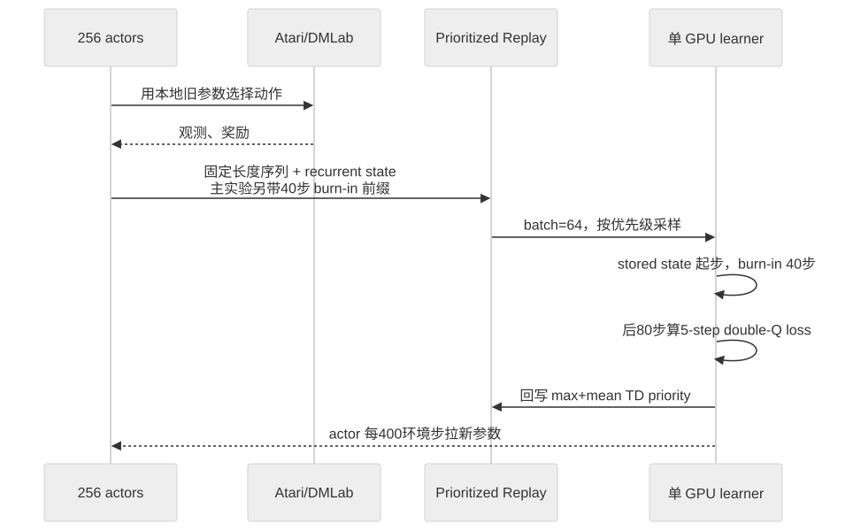

> - **公开入口：** [论文页](https://openreview.net/forum?id=r1lyTjAqYX) · [PDF](https://openreview.net/pdf?id=r1lyTjAqYX)
> - **归档：** 2019 · ICLR 2019 · 严格策略 RL · 系列第 11/51 篇
> - **模块：** B. 扩展、探索与世界模型
> - 正文中的本地文件名、SHA-256 与版本记录用于说明核验过程；博客不镜像原论文 PDF 或 TeX。

> **一句话地图：** 输入是 256 个 actor 收集的、带 LSTM 状态的重叠轨迹片段；训练信号是优先回放的 5-step double-Q TD 误差；单个 learner 更新卷积网络、LSTM 和 dueling Q heads；最后得到一套同时适用于 Atari-57 与 DMLab-30 的循环分布式 DQN。

## 0. 阅读导航

- 需要的前置概念：DQN、double Q-learning、dueling network、LSTM、经验回放、优先经验回放、分布式 actor–learner。
- 读完应能解释：为什么随机抽一段轨迹再把 LSTM 置零会制造错误 Q 值；stored state 为什么会过期；burn-in 为什么只前向计算、不对前缀反传；max+mean 序列优先级解决什么。
- 原论文版本与定位口径：ICLR 2019 conference paper，本地 PDF 19 页，页码按 PDF 文件；图表和章节按正式论文。
- 原文格式说明：该论文未找到公开 TeX 源码。本讲义逐项读取本地 PDF，并用 MinerU 生成的 `parsed/paper.md` 与 `reading/paper.txt` 交叉核验；公式的空格/OCR 断词已按 PDF 视觉内容校正。
- 证据标签：**[论文证据]**、**[作者假设]**、**[机制推断]** 分开标记。

## 1. 它遇到了什么具体问题？

经验回放会随机抽取过去的片段。前馈网络只要看到当前观测就能计算 Q 值；LSTM 的输出还依赖此前整段历史压成的隐藏状态。若训练时在片段开头把隐藏状态清零，网络看到的是一个现实中很少出现的“失忆状态”。前几步 Q 值严重偏差，反向传播却把这些错误当真，可能产生破坏性更新。

直接保存 actor 当时的 LSTM 状态也不完美。actor 生成它时用旧参数 $\theta$，learner 训练时已经是新参数 $\hat\theta$。同一历史经新旧网络编码后不同，这叫 representation drift；保存的隐藏状态因此变“陈旧”（recurrent state staleness）。分布式系统中的参数延迟会放大问题。

*图 1｜根据相邻正文中的问题、机制或算法流程重绘。*

论文研究的问题非常具体：如何在“随机短序列回放”与“循环网络需要历史”之间取得可训练的折中，而不是发明一种新的通用记忆架构。

## 2. 前人怎样解决，为什么仍然不够？

| 路线 | 改了哪一环 | 仍留下什么 |
|---|---|---|
| DRQN 的 zero start state | 每个回放片段从全零 LSTM 状态开始，采样简单且片段定长 | 初始状态不典型；前几步 Q 值错，网络可能学会不依赖长期记忆 |
| 回放完整 episode | 从真实 episode 起点重建循环状态 | 长度可变、样本相关性强、更新方差与计算/内存开销大 |
| Ape-X | 多 actor + 优先回放 + n-step double Q，大幅提高吞吐 | 原版是前馈网络；不能直接处理陈旧循环状态 |
| Reactor 等 recurrent replay | 循环网络从 replay 学习 | 仍采用 zero-state 类策略，长期依赖可能被压制 |

R2D2 的最小干预是把 recurrent state 随片段存入 replay，并在真正计算损失前增加 burn-in 前缀。保存状态提供较接近历史的起点；burn-in 用当前网络重新走一段观测，让状态向当前表示体系靠拢。

## 3. 核心想法：先说人话

把 LSTM 状态想成读长篇小说时的“脑内摘要”。随机从第 200 页开始读并把摘要清空，你不明白人物关系；拿出三天前写的摘要，又可能和今天采用的新记号不一致。R2D2 保存旧摘要，再用前 40 步内容让当前网络热身，之后才对接下来的 80 步计损失。

类比边界：burn-in 不是恢复完整真实历史。40 步以前的信息如果没有保存在 stored state 中，或者 stored state 已严重失真，热身无法凭空重建。

*图 2｜根据相邻正文中的问题、机制或算法流程重绘。*

## 4. 算法与信息流

*图 3｜根据相邻正文中的问题、机制或算法流程重绘。*

- actor：通常 256 个；Atari 每 actor 约 260 environment steps/s，DMLab 约 130。
- learner：约 5 updates/s；每次 64 条、每条 80 步。LSTM 隐层 512，后接 dueling value/advantage heads。
- replay：学习段长度 $m=80$，主实验另带 burn-in 前缀 $l=40$；相邻学习段重叠 40 步且不跨 episode。容量为 $4\times10^6$ observations，约 $10^5$ 条部分重叠序列（第 2.3 节、附录表 2）。
- burn-in：主实验 stored state + 40 步前缀；前缀用于重建状态，不接收损失更新。
- target network：每 2500 learner updates 从在线网络复制；R2D2+ 在 DMLab 用 400。
- 同一网络结构与超参数用于 Atari-57 与 DMLab-30；这点是论文跨域实验的核心控制条件。

## 5. 公式逐步推导

### 5.1 符号表

| 符号 | 普通含义 | 数学对象/形状 | 从哪里得到 |
|---|---|---|---|
| $h_t$ | actor 当时保存的循环状态 | LSTM hidden/cell state | replay |
| $\hat h_t$ | learner 重新展开得到的状态 | LSTM hidden/cell state | zero/stored + burn-in |
| $\theta,\theta^-$ | 在线网络与 target network 参数 | 参数向量 | learner |
| $q(h;\theta)$ | 所有动作的 Q 向量 | $\mathbb R^{\lvert A\rvert}$ | dueling head |
| $\delta_i$ | 序列第 $i$ 步绝对 TD 误差 | 非负标量 | 5-step target |
| $p$ | 一条序列的回放优先级 | 非负标量 | max+mean 混合 |
| $h(x)$ | 可逆价值缩放 | 标量函数 | 固定变换 |

### 5.2 5-step double-Q target 与价值缩放

R2D2 不裁剪奖励，而把大范围回报压缩后预测：

$$
h(x)=\operatorname{sign}(x)(\sqrt{|x|+1}-1)+\epsilon x,
\qquad \epsilon=10^{-3}.
$$

对于 $n=5$，在线网络选择动作、target network 评价动作：

$$
a^*=\arg\max_a Q(s_{t+n},a;\theta),
$$

$$
\hat y_t=h\!\left(
\sum_{k=0}^{n-1}\gamma^k r_{t+k}
+\gamma^n h^{-1}(Q(s_{t+n},a^*;\theta^-))
\right).
$$

这是第 2.3 节、PDF 第 3 页的公式。$h^{-1}$ 先把 target Q 还原到回报尺度，完成 Bellman 加法，再用 $h$ 压回网络输出尺度。若直接在缩放空间相加，非线性 $h(x+y)\ne h(x)+h(y)$ 会改变目标。

### 5.3 为什么序列优先级要混合 max 与 mean

Ape-X 式逐 transition 优先级扩展到长序列时，简单平均会把一个很大的学习信号稀释。R2D2 定义

$$
p=\eta\max_i |\delta_i|+(1-\eta)\frac1m\sum_{i=1}^{m}|\delta_i|,
\qquad \eta=0.9.
$$

max 保住序列里最稀有、最错的一步；mean 防止整条序列只因一个噪声尖峰长期霸占 replay。论文把 $\eta$ 和 priority exponent 都设为 0.9（第 2.3 节）。

### 5.4 如何量化 recurrent state staleness

为了只比较“隐藏状态不同”造成的输出差异，论文让同一个当前网络 $\hat\theta$ 分别读取训练展开状态 $\hat h$ 与 actor 存储状态 $h$：

$$
\Delta Q=
\frac{\|q(\hat h_{t+i};\hat\theta)-q(h_{t+i};\hat\theta)\|_2}
{\left|\max_{a,j}q(\hat h_{t+j};\hat\theta)_a\right|}.
$$

分母按片段内最大 Q 归一化，使不同任务和训练阶段更可比。它不是“训练时 Q 与 acting 时 Q 的差”，因为那还混入了参数本身变化；它只测同一参数下两种 recurrent states 的影响（第 3 节、图 1）。

### 5.5 一组小数字走完优先级与 $\Delta Q$

设一条 4 步教学用短序列的绝对 TD 误差为

$$
(0.1,0.2,3.0,0.1).
$$

平均值为 $0.85$，最大值为 $3.0$。R2D2 的优先级是

$$
p=0.9\times3.0+0.1\times0.85=2.785.
$$

只取平均会把关键尖峰压到 0.85；只取最大则忽略其余三步是否也普遍错误。

再设当前网络对 $\hat h$ 输出 $q=(5,2)$，对 stored $h$ 输出 $q=(4,2.5)$，片段最大 Q 的绝对值为 5：

$$
\Delta Q=\frac{\sqrt{(5-4)^2+(2-2.5)^2}}{5}
=\frac{\sqrt{1.25}}5\approx0.224.
$$

若 40 步 burn-in 后两向量变为 $(5,2)$ 与 $(4.9,2.1)$，则 $\Delta Q\approx0.028$。请先自己解释：这个下降能证明 stored state 更接近真实 POMDP 状态吗？答案是否定的——它只证明两种网络内部表示的 Q 输出更一致。

## 6. 实验到底检验了什么？

| 研究问题 | 对照与控制变量 | 指标/样本 | 原论文结果与定位 | 能说明什么 | 不能说明什么 |
|---|---|---|---|---|---|
| zero、stored、burn-in 谁能减轻状态错配？ | 同一 R2D2 架构；zero、stored、burn-in、stored+burn-in；DMLab 多关卡 | 首/末步 $\Delta Q$ 与学习曲线；3 seeds | zero 首步偏差最大；burn-in 改善初段；stored 更稳定；组合在末步偏差和回报上最稳健（图 1，第 4–5 页） | 两种干预针对的误差来源可互补 | 图 1 主要为选定 DMLab 关卡，不能保证所有 RNN/replay 设置相同 |
| Atari-57 总体表现如何？ | Ape-X、Reactor、IMPALA、R2D2 feed-forward；R2D2 256 actors，Ape-X 360 | human-normalized median/mean | R2D2 median 1920.6%、mean 4024.9%；Ape-X 434.1%/1695.6%；feed-forward 589.2%/1974.4%（表 1，第 7 页） | LSTM+训练策略在同系列分布式 Q-learning 中带来大幅总体增益 | Ape-X 采用论文所报 best score、R2D2 报 3-seed final score，系统实现也不同，非完全受控因果比较 |
| 是否跨越 Atari 人类水平？ | 57 游戏统一架构/超参 | 超过人类基线的游戏数 | R2D2 为 52/57；Ape-X 与 Rainbow 为 49/57（第 4.1 节） | 总体提升覆盖多数游戏 | human-normalized 分数会被个别游戏和人类基线尺度放大；不代表通用智能 |
| 同一配置能否迁移到 DMLab-30？ | R2D2 与作者重跑的 shallow/deep IMPALA，均 10B frames、改进动作集 | DMLab median 与 mean-capped HNS | R2D2 96.9%/78.3%；R2D2+ 99.5%/85.7%；重跑 deep IMPALA 107.5%/85.1%（表 1） | value-based recurrent replay 首次在 DMLab 接近当时强 on-policy 结果 | 标准 R2D2 未在两项都超过 deep IMPALA；R2D2+ 改了网络与 target period |
| 长期记忆是否真的被使用？ | R2D2 与 feed-forward；推理时把可用历史 $k$ 从无限降到 0 | MS.PACMAN 与 EMSTM WATERMAZE 的回报、max-Q 差、greedy action 一致率 | $k$ 越短，Q 质量、动作一致率和表现单调下降（图 5，第 9 页） | 模型行为因果依赖历史，而非 LSTM 只是增加参数 | 只测试两个任务；遮断历史的分布外干预可能有额外影响 |
| 分布式参数延迟怎样影响 staleness？ | actor 从 256 减到 64，其他设置尽量一致 | parameter lag 与 $\Delta Q$ | 平均 lag 从约 1500 增至约 5500 learner updates，首末步 $\Delta Q$ 总体上升（附录图 6，第 12 页） | 分布式系统规模会改变回放表示漂移 | actor 数还会改变数据吞吐/分布，不能把全部差异只归于 lag |

## 7. 结果如何理解？

**[论文证据]** R2D2 在 Atari 的 median 1920.6% 是 Ape-X 434.1% 的约 4.4 倍，支持摘要中的“quadruples”。mean 的比例只有约 2.4 倍，所以“4 倍”特指 median human-normalized score。

**[论文证据]** feed-forward 版本 median 589.2%，仍高于 Ape-X 434.1%；这说明一部分增益可能来自 R2D2 的其他实现选择。LSTM 版本 1920.6% 与 feed-forward 的受控对照才更直接支持“循环记忆重要”。

**[作者假设]** burn-in 的收益来自避免对零状态后的不准前缀做破坏性更新。论文报告“延长 zero-state 序列但不屏蔽前缀损失”仍较差的非正式实验，却未直接记录梯度破坏指标。

**[机制推断]** 若 burn-in 的核心机制确实是降低前缀状态错配，那么随着 burn-in 长度增加，首个计损失步的 $\Delta Q$ 应先下降，性能随后饱和；若屏蔽同样数量的损失步但不进行前向 burn-in 也有同等收益，则“状态恢复”解释不足，可能只是减少了训练样本或梯度长度。这个预测可用固定总序列长度、固定有效损失步数的三组对照检验。

另一个可证伪预测：增大 learner 更新速度而保持 actor 拉参频率不变，会增大参数 lag 与 stored-state staleness；stored+burn-in 相对 zero 的优势应随 lag 变大。若测得 lag 增大但 $\Delta Q$ 与回报不变，表示漂移不是该设置的主要瓶颈。

## 8. 优点、代价与失效条件

### 优点

- 观察到具体失败量 $\Delta Q$，再设计 stored state 与 burn-in，机制—干预对应清楚。
- 同一网络与超参数覆盖 Atari-57、DMLab-30，减少逐 benchmark 调参解释。
- 用 feed-forward、历史截断和 actor 数量消融，把“LSTM 是否真的用记忆”与“系统 lag”分别测试。
- max+mean priority 是针对长序列平均稀释的最小修改。

### 代价

- replay 必须存 recurrent state 与重叠序列，内存和数据管线更复杂。
- burn-in 40 步要前向计算却不产生直接损失，增加 learner 计算。
- 256 actors、10B frames 和单 GPU learner 的资源规模很大；高最终表现不等于高早期样本效率。

### 已观察到的失败

- Montezuma's Revenge 与 Pitfall 仍是探索失败项；R2D2 在 Pitfall 为 0，未解决稀疏奖励探索。
- DMLab 上标准 R2D2 的 mean-capped 78.3% 低于重跑 deep IMPALA 的 85.1%。
- 除 feed-forward 外，其他设计消融在某些 Atari 游戏反而更好；主配置优化的是跨域总体表现（附录图 7）。

### 尚未验证的外推

- 没有连续动作、真实机器人或开放式任务。
- stored state + burn-in 不保证恢复真正 sufficient statistic。
- 大规模异步系统结果可能依赖硬件、实现和 actor/learner 比率，论文也明确提醒直接系统比较困难。

## 9. 它怎样影响后来的大模型强化学习？

R2D2 不是语言模型 RLHF 方法，但它给带记忆的语言 agent 一个直接工程警告：从 replay 训练带内部状态的策略时，历史摘要、KV/cache、工具状态或 belief state 可能由旧策略生成，不能当作当前网络的无偏状态。保存上下文并用当前模型重放一段“burn-in”可减少错配，但增加计算，也无法恢复被截断的信息。

对 LLM 的外推仍是机制类比。Transformer 上下文通常显式保留 token，而 R2D2 的 LSTM 把历史压进固定维状态；LLM 还会经历文本策略、reward model 与数据生成策略的多重漂移。R2D2 的 Atari 数字不能直接预测语言 agent 的收益。

## 10. 三个自检问题

1. zero start state、stored state 和 burn-in 分别解决或引入哪一种状态错配？
2. 为什么 burn-in 前缀要前向展开却不计算梯度损失？
3. 序列优先级为什么同时需要 max 和 mean？只用其中一个会怎样？

## 11. 原文定位与核验记录

- 原论文：Steven Kapturowski、Georg Ostrovski、John Quan、Rémi Munos、Will Dabney，*Recurrent Experience Replay in Distributed Reinforcement Learning*，ICLR 2019。
- PDF 校验和：`0dc56326bb968d4ed5bfe6edf3da3c3ffcbc81525cd1ebe13e10db6db6c3f41c`。
- 使用的 TeX/Markdown：**没有公开 TeX**；使用 `papers/2019/r2d2/parsed/paper.md`（MinerU）、`reading/paper.txt` 与原 PDF 交叉核验。
- 关键公式：transformed 5-step double-Q target（第 2.3 节，PDF 第 3 页）；序列 priority（同节）；$\Delta Q$（第 3 节，PDF 第 5 页）。
- 关键图表：图 1 训练策略（第 4–5 页）；图 2 与表 1（第 6–7 页）；图 5 记忆截断（第 9 页）；附录图 6（第 12 页）、表 2（第 14 页）。
- 二手资料仅用于：未使用；OCR 仅作原文提取，不作事实来源。
- 尚未核验：公开 OpenReview 附件中是否曾存在未被索引的源码；图 1 柱高未做像素级重读，因此本讲义只报告其方向性结论。

---

本文属于[《强化学习论文精读：2016–2026》](/series/reinforcement-learning-paper-reading/)。
实验数字以文首链接的最终 PDF 为准；图为教学重绘，不是论文原图。
