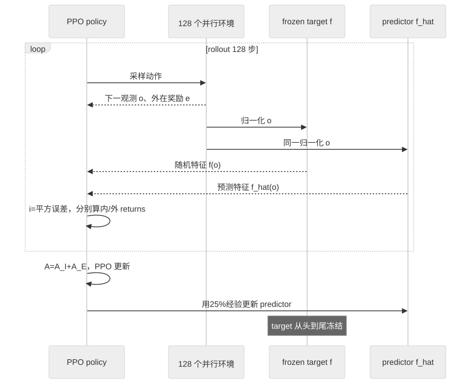

> - **公开入口：** [论文页](https://arxiv.org/abs/1810.12894) · [PDF](https://arxiv.org/pdf/1810.12894) · [正式页面](https://openreview.net/forum?id=H1lJJnR5Ym) · [TeX 源码入口](https://arxiv.org/e-print/1810.12894)
> - **归档：** 2019 · ICLR 2019 · 严格策略 RL · 系列第 12/51 篇
> - **模块：** B. 扩展、探索与世界模型
> - 正文中的本地文件名、SHA-256 与版本记录用于说明核验过程；博客不镜像原论文 PDF 或 TeX。

> **一句话地图：** 输入是 agent 访问到的图像；训练信号是 predictor 模仿一个冻结随机网络的均方误差；该误差作为内在奖励与环境奖励一起训练 PPO；最后得到愿意主动走向少见观测的探索策略。

## 0. 阅读导航

- 需要的前置概念：稀疏奖励、内在动机、访问计数、预测误差、PPO、episodic/non-episodic return、epistemic/aleatoric uncertainty。
- 读完应能解释：固定随机 target 为什么把预测误差变成“类似访问次数”的信号；它怎样减轻 forward-dynamics curiosity 的 noisy-TV 问题；双 value heads 与两种折扣为什么必要；RND 为什么仍不擅长长程全局探索。
- 定位口径：ICLR 2019；本地 arXiv v1 PDF 17 页，页码按 PDF 文件，公式/图表按原论文。
- 证据标签：**[论文证据]**、**[作者解释]** 与 **[机制推断]** 分开。

## 1. 它遇到了什么具体问题？

在 Montezuma's Revenge 中，agent 很久都拿不到环境分数。只优化外在奖励的 PPO 没有理由离开熟悉房间。表格环境可以奖励“访问次数少的状态”，例如 $1/\sqrt{N(s)}$；图像几乎每帧都不同，精确计数失效。

已有 curiosity 方法让网络预测下一帧特征，预测错就给奖励。但错误不只来自“没见过”，也来自不可预测的随机性。一台播放白噪声的电视永远预测不准，agent 可能守着它刷内在奖励。RND 要构造一个确定、已知落在 predictor 模型类内的预测问题，使误差更集中地反映训练数据覆盖，而非环境随机转移。

*图 1｜根据相邻正文中的问题、机制或算法流程重绘。*

## 2. 前人怎样解决，为什么仍然不够？

| 路线 | 改了哪一环 | 仍留下什么 |
|---|---|---|
| count bonus $1/N(s)$ 或 $1/\sqrt{N(s)}$ | 少见状态奖励更高 | 高维连续观测几乎不重复，真计数不可用 |
| pseudo-count / density model | 让相似观测共享“软计数” | 需要额外密度建模；表示与密度误差会进入奖励 |
| forward dynamics error | 预测 $s_{t+1}$ 或其特征 | 随机转移产生 aleatoric error，出现 noisy-TV 吸引子 |
| learning progress | 奖励“看一次后预测改善多少” | 更接近可学习新奇，但每步估计改善计算昂贵，难扩展 |
| parameter noise / NoisyNets | 在策略参数层制造行为多样性 | 不直接告诉 agent 哪些观测少见，长程稀疏奖励仍难 |

RND 的最小改动是把预测目标换成固定随机函数 $f(o)$。target 确定，所以相同观测不会因环境随机性改变标签；predictor $\hat f(o)$ 只在访问数据上学习，没见过的观测通常误差大。

## 3. 核心想法：先说人话

随机 target 像一位给每张图片盖上固定、杂乱印章的老师。predictor 是学生：见过某类图片很多次，就学会复现对应印章；第一次看到新房间，印章难猜，误差大，于是 agent 得到“新奇奖”。老师的印章没有语义，但必须固定，否则学生永远学不会，误差就不再代表新奇。

类比边界：神经网络会泛化。一个没访问过但长得像旧状态的观测可能误差很小；一个访问很多次但受归一化、优化或容量限制的观测也可能误差大。RND 不是严格计数器，也不是校准的贝叶斯不确定度。

*图 2｜根据相邻正文中的问题、机制或算法流程重绘。*

## 4. 算法与信息流

*图 3｜根据相邻正文中的问题、机制或算法流程重绘。*

- 先让随机 agent 走若干步，估计每个观测维度的均值/标准差；白化后裁剪到 ([-5,5])。policy 看原有预处理输入，target 与 predictor 看同一归一化观测。
- 内在奖励按 intrinsic return 的运行标准差归一化，减少跨环境、跨训练阶段的尺度漂移。
- 外在回报在 game over 截断；内在回报不截断。主设置 $\gamma_E=0.999,\gamma_I=0.99$，分别用 $V_E,V_I$ 拟合，再合并 advantage。
- 主实验每环境 30000 个长度 128 的 rollouts、128 个并行环境，总计约 1.97B frames（第 3 节）。
- predictor 只使用 25% 经验更新，避免它学得过快、内在奖励在策略来得及利用前消失（附录表 4）。

## 5. 公式逐步推导

### 5.1 符号表

| 符号 | 普通含义 | 数学对象/形状 | 从哪里得到 |
|---|---|---|---|
| $o_t$ | 当前图像观测 | 图像张量 | 环境 |
| $f(o)$ | 固定随机特征 | $\mathbb R^k$ 向量 | 冻结 target |
| $\hat f(o;\theta)$ | predictor 的特征估计 | $\mathbb R^k$ 向量 | 可训练网络 |
| $i_t$ | 内在奖励 | 非负标量 | distillation error |
| $e_t$ | 外在奖励 | 标量 | 游戏 |
| $R_I,R_E$ | 内在/外在 return | 标量 | 不同终止与折扣规则 |
| $V_I,V_E$ | 两条 value 估计 | 标量 | PPO value heads |

### 5.2 从计数奖励到随机蒸馏误差

表格计数希望 $N(s)$ 越大，奖励越小：

$$
i_t\propto\frac1{\sqrt{N(o_t)}}.
$$

RND 不显式估 $N$，而训练 predictor：

$$
\min_\theta\;\mathbb E_{o\sim D_t}
\left\|\hat f(o;\theta)-f(o)\right\|_2^2,
$$

并把单个新观测的误差作为内在奖励：

$$
i_t=\left\|\hat f(o_{t+1};\theta)-f(o_{t+1})\right\|_2^2.
$$

随着某类观测在 $D_t$ 中反复出现，梯度下降通常降低其误差，因此形成类似衰减计数的信号。这里的“通常”是经验归纳偏置，不是误差严格等于访问次数的定理。论文用 MNIST 控制实验验证：目标类训练样本越多，held-out 同类 MSE 越低（图 2 左，第 4 页）。

### 5.3 为什么它能减轻 noisy TV

forward-dynamics bonus 学的是

$$
\hat \phi(o_{t+1})\approx g(\phi(o_t),a_t).
$$

若相同 $(o_t,a_t)$ 会随机转移到不同下一状态，即使访问无限次，条件方差仍让误差不为零。RND 的标签 $f(o_{t+1})$ 只依赖已经观察到的 $o_{t+1}$，target 是确定函数；它不要求从前一状态猜随机结果。论文把误差来源分成数据不足、随机性、模型错设和优化动态。固定且落在 predictor 模型类内的 target 避开第 2 项的随机标签问题，也可避免第 3 项的模型类错设；优化误差仍可能存在（第 2.2.1 节）。

RND 仍可能有模型容量或优化误差，所以“减轻”比“消除所有 noisy-TV 行为”准确。

### 5.4 两种回报为什么分开

总即时奖励可写 $r_t=e_t+i_t$，但两条奖励流有不同终止与折扣。论文利用 return 对奖励的线性：

$$
R=R_E+R_I,
\qquad V(o)=V_E(o)+V_I(o).
$$

外在奖励在 episode 终止时截断，避免 agent 通过故意死亡重复拿开局奖励；内在奖励跨 game over 延续，让“死一次才能继续找新房间”仍有未来价值。不同 $\gamma_E,\gamma_I$ 也要求分别估计。实现计算 $A=A_E+A_I$ 后用于 PPO（算法 1，附录）。

### 5.5 一组小数字走完更新

设 target 对新观测输出

$$
f(o)=(1,-1,0.5),
$$

predictor 输出 $(0.2,-0.8,0.1)$。内在奖励为

$$
i=(0.2-1)^2+(-0.8+1)^2+(0.1-0.5)^2
=0.64+0.04+0.16=0.84.
$$

同类观测多次训练后，predictor 变为 $(0.9,-0.95,0.45)$，则

$$
i'=0.01+0.0025+0.0025=0.015.
$$

设两步外在奖励 $(0,10)$，内在奖励 $(0.84,0.20)$，为便于手算取 $\gamma_E=0.9,\gamma_I=0.5$。从第一步看：

$$
R_E=0+0.9\times10=9,
\qquad R_I=0.84+0.5\times0.20=0.94,
$$

合计 $R=9.94$。两条 head 可以分别学习“远处任务分数”和“短期新奇”。请先自己解释：若内在与外在都用 $\gamma=0.999$，为什么 agent 可能为了遥远、会消失的新奇而牺牲当前可获得的任务奖励？

## 6. 实验到底检验了什么？

| 研究问题 | 对照与控制变量 | 指标/样本 | 原论文结果与定位 | 能说明什么 | 不能说明什么 |
|---|---|---|---|---|---|
| 随机蒸馏误差是否随“见得多”下降？ | MNIST 中固定总样本，改变目标类别样本数，0 类作常见背景 | held-out 目标类 MSE | 样本数增加时 MSE 下降（图 2 左，第 4 页） | 标准梯度训练不会立刻在所有输入上完美模仿随机 target | MNIST 类别与 Atari 状态访问不是同一分布，非严格计数证明 |
| 没有外在奖励时能否定向探索？ | Montezuma，episodic vs non-episodic intrinsic return；纯 RND | 房间数与实际游戏回报，但训练看不到后者 | $\gamma_I=0.999$ 的 non-episodic 某次跑到 21 房；5 runs 中 4 次最佳回报 6700（图 2 右，第 4 页） | RND 信号本身能推动有结构的探索 | 最佳单次/4 of 5 不是稳定平均通关；游戏回报与房间数是事后指标 |
| 双 head 与 non-episodic 设计有什么作用？ | episodic/non-episodic intrinsic；single/dual value；CNN/RNN | 房间数、mean return | non-episodic 找到更多房间；当两流均 episodic 时双 head 没有优于单 head（图 3，第 5 页） | 跨 episode 的内在回报有机制收益；双 head 的必要性来自异质回报，不是普遍更准 | 不能把后续 RND 全部增益归于双 head |
| 折扣和并行规模怎样影响结果？ | $\gamma_E\in\{.99,.999\}$、$\gamma_I\in\{.99,.999\}$；32–1024 environments | Montezuma mean return | 提高 $\gamma_E$ 有益，提高 $\gamma_I$ 反而伤性能（图 4 左）；32-env RNN 最终均值 7570，1024-env 10070（第 3.4 节） | 外在长程信用与内在局部新奇需要不同时间尺度；规模帮助策略追上短暂奖励 | 并行设置改变 batch 与优化动态；不是只靠更多独立探索轨迹 |
| 相比 PPO 与 dynamics bonus 是否改善 hard exploration？ | RND、无内在奖励 PPO、随机特征 forward dynamics；其他设计保持一致 | 6 个 Atari 最终 mean score | Montezuma：8152/2497/400；Venture：1859/0/1712；PrivateEye：8666/105/33（表 1，第 8 页） | RND 在多项稀疏奖励游戏优于无 bonus；相对 dynamics 的控制对照支持减轻随机转移陷阱 | Gravitar/Solaris 没有稳定胜 PPO，Pitfall 三者均无正奖励 |
| 能否超过当时基线与人类？ | 与论文汇总的 SOTA、average human 比较 | 6 游戏分数 | RND 在 Montezuma 8152>human 4753、SOTA 3700；Gravitar 3906>human 3351；Venture 1859>human 1188（表 1） | 在三项达到当时强结果 | 训练约 1.97B frames，资源远高于人类体验；不同论文协议未完全统一 |

## 7. 结果如何理解？

**[论文证据]** RND 并非六项全胜：Gravitar 3906 只略高 PPO 3426；Solaris 3282 低于 PPO 3387；Pitfall 为 -3，而 PPO 与 dynamics 为 0。稳妥结论是它在 Montezuma、PrivateEye、Venture 显著改善，不能说解决了 hard exploration。

**[论文证据]** forward-dynamics agent 在 Montezuma 会在两房间边界来回振荡；sticky actions 让是否跨边界不可预测，产生不可约误差（第 3.6 节）。这直接连接了 noisy-TV 机制与观察行为，比只报总分更强。

**[论文证据]** 大规模训练贡献很大。RNN 32 环境在 1.6B frames 后均值 7570，一次访问 24 房并过第一关、best return 17500；1024 环境结尾均值 10070。论文还固定 predictor 有效 batch 尺度，尽量把增益解释为 policy 更快利用短暂奖励，而非 predictor 学得更快。

**[机制推断]** 若 RND 的优势主要来自移除转移随机性的不可约误差，则逐渐增加与任务无关的 transition stochasticity 时，forward-dynamics bonus 的长期误差应维持高位并吸引策略，RND 对已访问观测的误差应继续下降。若 RND 同样被随机性吸引，原因可能是随机性改变了观测本身的覆盖，而非 target 标签。

**[可证伪预测]** 若 predictor error 真充当近似访问新奇度，在固定表征和优化预算下，同一观测簇的访问次数与误差应单调负相关；控制像素噪声后，这一相关仍应存在。若误差主要由梯度干扰、容量或归一化漂移决定，相关会弱或反转，RND 的“软计数”解释就失败。

## 8. 优点、代价与失效条件

### 优点

- 两个前向网络和一个 MSE 即可实现，target 冻结使预测问题清晰。
- 用 MNIST、纯探索、回报组合、折扣、规模和 dynamics 对照建立了较完整机制链。
- 明确列出四种预测误差来源，没有把所有 error 都包装成 epistemic novelty。
- 可与任意 reward-based RL 结合；论文用 PPO 只是一个实例。

### 代价

- 每步额外执行 target 与 predictor，且 predictor 的训练速度成为敏感时间尺度。
- 需要观测与内在奖励归一化、两条 value heads、不同折扣和大量并行环境；“简单 bonus”不等于整个系统无超参。
- 内在奖励非平稳且最终会消失，策略必须及时把临时新奇转成稳定外在收益。

### 已观察到的失败

- Pitfall 没找到正奖励；Solaris 未胜 PPO。
- RND 擅长短程“局部探索”，却无法稳定完成需保留钥匙、牺牲即时奖励的全局计划（Discussion，第 9 页）。
- agent 会“与骷髅跳舞”等反复靠近危险物体；稀有不等于任务有用。
- RNN 结果跨代码版本和 seeds 有离群差异，作者在脚注中建议以后以公开代码复现实验为比较点。

### 尚未验证的外推

- 没有持续学习下的灾难性遗忘分析；旧状态误差可能再次升高。
- 随机 target 的表示质量、网络宽度和视觉噪声对 bonus 的校准缺少系统敏感性实验。
- Atari 的 room novelty 不等同于真实机器人或语言任务中的语义新奇。

## 9. 它怎样影响后来的大模型强化学习？

RND 对大模型 agent 的直接启发是“可学习的新奇奖励”：固定随机映射可以给罕见状态、工具结果或推理轨迹提供内在奖励，而无需人工标注。但语言空间中的表面差异巨大，随机特征很可能奖励措辞变化而非任务进展；一个 agent 也可能生成无意义的新字符串刷 RND 分。

要检验语言版 RND，必须先定义语义状态，并对“同义改写、随机 token 噪声、真正新子目标”做受控对照。若同义改写持续获得高奖励，bonus 测到的是表面 novelty，不能解释为探索能力。论文没有做 LLM 实验，因此这里只是可证伪的机制迁移，不是已证实继承关系。

## 10. 三个自检问题

1. RND 为什么不预测下一观测，而是预测当前观测的固定随机特征？
2. 为什么外在奖励适合 episodic、内在奖励适合 non-episodic？故意死亡的反例是什么？
3. 论文哪些结果说明 RND 更像局部探索器，而不是长程规划器？

## 11. 原文定位与核验记录

- 原论文：Yuri Burda、Harrison Edwards、Amos Storkey、Oleg Klimov，*Exploration by Random Network Distillation*，ICLR 2019，arXiv:1810.12894v1。
- PDF 校验和：`07ceae9300d9ba5871578e0e720b1cb3bec5c4d0aa894f9ee442f9e107761366`。
- 使用的 TeX/文本：`papers/2019/rnd/source/iclr2019_conference.tex`、`reading/source-expanded.tex`、`reading/paper.txt`；TeX 是 scholarweave/arxiv-latex 文本镜像，可能缺二进制图片与原始归档元数据。
- 关键公式：RND MSE（第 2.2 节，PDF 第 3 页）；两流 return/value 分解（第 2.3 节）；算法 1（附录，PDF 第 10 页）。
- 关键图表：图 1 novelty spikes（第 2 页）；图 2 纯探索（第 4 页）；图 3–4 消融（第 5–6 页）；图 5 与表 1（第 7–8 页）；附录表 4（PDF 第 13 页）。
- 二手资料仅用于：未使用；所有数字来自本地 TeX/PDF。
- 尚未核验：曲线中未在正文标数字的中间时点未做像素估读；跨论文 SOTA 行沿用作者表 1 的协议与引用。

---

本文属于[《强化学习论文精读：2016–2026》](/series/reinforcement-learning-paper-reading/)。
实验数字以文首链接的最终 PDF 为准；图为教学重绘，不是论文原图。
