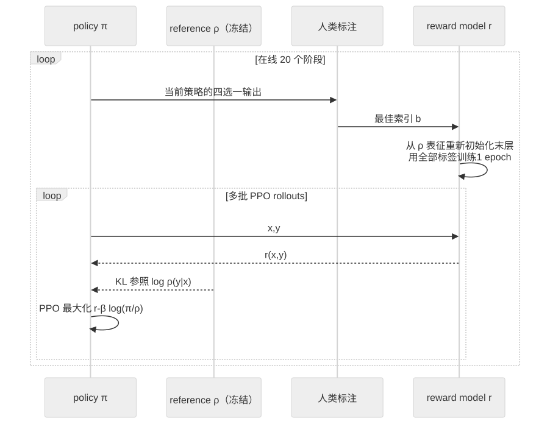

> - **公开入口：** [论文页](https://arxiv.org/abs/1909.08593) · [PDF](https://arxiv.org/pdf/1909.08593) · [正式页面](https://openai.com/index/fine-tuning-gpt-2/) · [TeX 源码入口](https://arxiv.org/e-print/1909.08593)
> - **归档：** 2019 · arXiv technical report · 严格策略 RL · 系列第 13/51 篇
> - **模块：** D. 人类偏好与经典 RLHF
> - 正文中的本地文件名、SHA-256 与版本记录用于说明核验过程；博客不镜像原论文 PDF 或 TeX。

> **一句话地图：** 输入是提示 $x$ 和四个模型续写的人工排序；监督学习得到 reward model $r(x,y)$；PPO 最大化该奖励并用对初始语言模型的 KL 惩罚约束策略；输出是更符合人类偏好的续写或摘要模型。

## 0. 阅读导航

- 需要的前置概念：自回归语言模型、偏好比较、softmax 分类、KL 散度、policy gradient、PPO、distribution shift、reward hacking。
- 读完应能解释：四选一标签怎样训练标量 reward model；为什么 reward model 学好后还需要 PPO；KL 项为什么同时约束自然语言质量和 reward model 有效域；“击败人类参考摘要”为什么反而暴露了评估漏洞。
- 定位口径：arXiv 首次公开于 2019，所用本地 PDF 为 v2、26 页；公式、图表与页码按 v2。
- 证据标签：**[论文证据]**、**[作者判断]**、**[机制推断]** 分开。

## 1. 它遇到了什么具体问题？

很多语言任务没有可靠的程序化奖励。ROUGE 能数词语重合，却可能奖励不真实或不自然的摘要；“积极”“生动”“有帮助”更容易由人比较两个输出，而难以写成精确函数。直接让人给每次 RL rollout 打分又太贵。

因此系统先用少量人类比较训练一个便宜的 reward model，再让策略对这个模型做大量优化。新的风险随之出现：reward model 只在早期语言模型样本附近学过；PPO 会主动搜索高分区域，可能找到评分器漏洞。若策略离初始语言模型太远，文字会从自然语言分布漂出，reward model 的高分也不再可信。

*图 1｜根据相邻正文中的问题、机制或算法流程重绘。*

论文在四个任务上测试：BookCorpus 续写的积极情感和物理描写风格；TL;DR 与 CNN/Daily Mail 摘要。模型是 774M 参数 GPT-2。它研究的是人类偏好强化学习是否能在自然语言上工作，以及会怎样失败，不是现代 instruction following 的全套评测。

## 2. 前人怎样解决，为什么仍然不够？

| 路线 | 改了哪一环 | 仍留下什么 |
|---|---|---|
| 监督微调 | 用人写的目标文本最大化似然 | 需要人提供“正确答案”；部署时采样分布与教师文本不同，无法直接优化主观偏好 |
| BLEU/ROUGE 等程序奖励 + RL | 可低成本大量优化 | 指标只是人类目标的代理；原文引用既有总结工作指出单指标 RL 会伤模型质量 |
| 人类反馈直接作在线 reward | 目标接近人类判断 | 每个 rollout 都需人打分，成本与延迟高 |
| 2017 年像素控制偏好 RL | 比较轨迹片段，学习 reward model，再 RL | 主要在模拟控制任务；尚未与大型预训练语言模型结合 |
| 序列 KL-control | 让微调策略保持接近语言模型 | 已提供保守微调原则，但未展示本论文四任务的人类 reward-model 流程 |

论文的最小干预是把三项已有原则接起来：预训练语言模型提供自然语言先验；人类比较训练 reward model；PPO 优化奖励，同时用序列级 KL 惩罚限制漂移。

## 3. 核心想法：先说人话

人类先当“裁判老师”：同一提示给四个候选，选一个最好。reward model 学着复现老师选择。之后人先离场，PPO 让“选手模型”反复写答案，由 reward model 快速打分。

KL 项像一根拴在初始语言模型上的弹力绳：reward model 说某个怪句子得高分，但初始模型认为这个句子概率极低，策略要为这种偏离付费。绳子太紧，模型几乎不改变；太松，策略会钻评分器漏洞。

类比边界：KL 只约束分布距离，不知道事实、价值或安全。一个错误输出若在初始模型中本来就常见，KL 不会阻止它；一个真正优质但初始模型罕见的输出也会被惩罚。

## 4. 算法与信息流

*图 2｜根据相邻正文中的问题、机制或算法流程重绘。*

在线数据收集时，循环还会回到人类：从当前 $\pi$ 采样新输出、补标签、重新初始化并训练 reward model，然后继续 PPO。论文共训练 reward model 20 次：第一次 PPO 前训练一次，之后在标签进度上均匀重训 19 次（第 2.3 节）。

*图 3｜根据相邻正文中的问题、机制或算法流程重绘。*

- reference $\rho$：774M GPT-2；策略 $\pi$ 从 $\rho$ 初始化，之后更新；$\rho$ 冻结。
- reward model：用 $\rho$ 的最终 embedding 加随机线性 head 初始化；与策略不共享参数。每次只训练 1 epoch，减轻小数据过拟合。
- PPO：总计 2M $(x,y)$ episodes，$\gamma=1$，每 batch 4 个 PPO epochs；style batch 1024、summarization batch 512（第 2.2 节）。
- 数据：style 最多 20k、主结果 5k comparisons；summarization 最多 60k comparisons。每个标签在四个候选中选一。
- 评估：多数实验在 1024 个上下文上，每项由 3 位标注者多数票决胜（表 1、表 3）。

## 5. 公式逐步推导

### 5.1 符号表

| 符号 | 普通含义 | 数学对象/形状 | 从哪里得到 |
|---|---|---|---|
| $x$ | 提示/文章/帖子 | token 序列 | 数据分布 $\mathcal D$ |
| $y$ | 续写或摘要 | token 序列 | $\rho$ 或 $\pi$ 采样 |
| $\rho(y\mid x)$ | 初始语言模型概率 | 标量概率 | 冻结 reference |
| $\pi_\theta(y\mid x)$ | 当前策略概率 | 标量概率 | 可训练 policy |
| $r_\phi(x,y)$ | reward model 分数 | 标量 logit | 偏好监督训练 |
| $b$ | 四选一中人选的索引 | $\{0,1,2,3\}$ | 人类标签 |
| $\beta$ | KL 惩罚系数 | 正标量 | 固定或控制器调整 |
| $R(x,y)$ | PPO 使用的修改后奖励 | 标量 | reward 减 KL 成本 |

### 5.2 四选一偏好如何变成 reward model

对同一 $x$ 的四个候选，模型把标量分数转成“被选为最好”的 softmax 概率：

$$
P_\phi(b=i\mid x,y_{0:3})=
\frac{e^{r_\phi(x,y_i)}}{\sum_{j=0}^{3}e^{r_\phi(x,y_j)}}.
$$

最大似然训练最大化论文公式 (1) 显示的 log-probability：

$$
\mathcal L_{\text{pref}}=
\mathbb E_S\left[
\log\frac{e^{r_\phi(x,y_b)}}{\sum_j e^{r_\phi(x,y_j)}}
\right].
$$

原文把该式命名为 \`loss\` 但写的是正的 log-likelihood；实现若用梯度下降，应最小化其负值。softmax 只识别相对分数：所有 $r_i$ 同加常数，选择概率不变。因此作者把 $\rho$ 分布上的 reward 归一化到均值 0、方差 1，稳定跨轮尺度（第 2 节）。

### 5.3 KL 惩罚怎样进入序列奖励

论文给每个完整输出使用

$$
R(x,y)=r_\phi(x,y)-\beta\log\frac{\pi_\theta(y\mid x)}{\rho(y\mid x)}.
\tag{2}
$$

对 $y\sim\pi$ 取期望：

$$
\mathbb E_{y\sim\pi}[R]
=\mathbb E_\pi[r_\phi(x,y)]
-\beta\,\mathrm{KL}(\pi(\cdot\mid x)\|\rho(\cdot\mid x)).
$$

第二步是 KL 定义的恒等式。自回归分解还给出

$$
\log\frac{\pi(y\mid x)}{\rho(y\mid x)}
=\sum_t\log\frac{\pi(y_t\mid x,y_{<t})}{\rho(y_t\mid x,y_{<t})},
$$

所以序列 KL 成本可按 token 累加。PPO 仍负责限制每次策略更新；reference KL 约束的是最终策略相对预训练模型的语言分布漂移。两者作用不同。

### 5.4 为什么最优策略是“参考概率 × 奖励指数”

固定 $x$，优化所有输出分布：

$$
\max_\pi\sum_y\pi(y)r(y)
-\beta\sum_y\pi(y)\log\frac{\pi(y)}{\rho(y)},
\quad \text{s.t. }\sum_y\pi(y)=1.
$$

加入 Lagrange 乘子 $\lambda$，对 $\pi(y)$ 求导：

$$
r(y)-\beta\left(\log\frac{\pi(y)}{\rho(y)}+1\right)+\lambda=0.
$$

整理并把与 $y$ 无关的常数吸收到归一化项 $Z(x)$：

$$
\pi^*(y\mid x)=\frac{\rho(y\mid x)e^{r(x,y)/\beta}}{Z(x)}.
$$

这就是第 3.1.1 节给出的解析最优形式。奖励高的输出指数增权，但若 $\rho(y\mid x)$ 极小仍被压制；$\beta$ 越小，奖励主导越强。论文用可计算的 mock sentiment 验证 PPO 在 2M continuations 后仍与这条最优前沿有明显差距，更多训练才缩小（图 3，第 5 页）。

### 5.5 PPO 在这里更新什么

论文采用 PPO2 而未重写其 clipped objective。对一次生成轨迹，设旧策略为 $\pi_{\text{old}}$，概率比

$$
q_t(\theta)=\frac{\pi_\theta(y_t\mid x,y_{<t})}
{\pi_{\text{old}}(y_t\mid x,y_{<t})}.
$$

PPO 最大化

$$
\mathbb E_t\left[
\min\big(q_tA_t,\operatorname{clip}(q_t,1-\epsilon,1+\epsilon)A_t\big)
\right],
$$

其中 advantage 最终来自序列修改后奖励 $R$。clipping 限制一次更新相对旧策略过大；公式 (2) 的 KL 惩罚持续把策略拉向固定 $\rho$。这是把论文指定的 PPO2 与其奖励定义接起来的算法展开；clipped 公式来自 PPO 本身，不是本文新贡献。

### 5.6 一组小数字走完偏好、KL 与控制器

人选择候选 2，reward logits 为 $(0,1,2,-1)$。它被选中的模型概率为

$$
P(b=2)=\frac{e^2}{e^0+e^1+e^2+e^{-1}}
\approx\frac{7.389}{11.475}=0.644.
$$

负 log-likelihood 为 $-\log0.644\approx0.440$。训练会提高候选 2 相对其余候选的分数。

再设该输出 reward $r=3$，当前策略给它 $\pi(y\mid x)=0.08$，reference 给 $\rho(y\mid x)=0.02$，$\beta=0.5$：

$$
\log\frac{\pi}{\rho}=\log4\approx1.386,
\qquad R=3-0.5\times1.386=2.307.
$$

若策略把概率推到 0.4，而 reference 仍为 0.02，KL 样本成本变成 $\log20\approx2.996$，修改后奖励降为 $1.502$。同一 reward 漏洞越被集中利用，边际 KL 成本越高。

论文还动态调 $\beta$。若目标 KL 为 10 nats，当前为 13，则

$$
e=\operatorname{clip}((13-10)/10,-0.2,0.2)=0.2,
$$

用 $K_\beta=0.1$ 得

$$
\beta_{t+1}=\beta_t(1+0.1\times0.2)=1.02\beta_t.
$$

绳子收紧 2%。请先自己解释：这个控制器能把 KL 维持在目标附近，却为什么不能保证输出符合真实人类目标？

## 6. 实验到底检验了什么？

| 研究问题 | 对照与控制变量 | 指标/样本 | 原论文结果与定位 | 能说明什么 | 不能说明什么 |
|---|---|---|---|---|---|
| 少量偏好能否改变续写风格？ | 5k offline vs zero-shot、程序 sentiment reward、20k offline、5k online | BookCorpus 1024 excerpts；每项 3 人多数票 | sentiment 5k vs zero-shot 88:12，vs mock 77:23；descriptiveness 86:14；5k 与 20k 约 48:52/47:53（表 1，第 6 页） | 约 5k 四选一比较足以在这两种风格上达到饱和区间 | 评价者与训练同源；无跨任务、跨人群验证；随机种子方差未估 |
| online feedback 对简单 style 是否必要？ | 5k online vs 5k offline | 同上 | sentiment 50:50，descriptiveness 48:52（表 1） | 在这两个短续写任务，offline 已覆盖足够分布 | 不能推广到长输出；摘要实验给出相反结果 |
| KL 约束是否防止语言崩坏？ | mock sentiment 无 KL、加 entropy；有 KL 主实验 | 样例与 mock reward | 无 KL 两种策略都产出重复乱码，却达到 reward 约 +8，即 99.97% positive（表 10，PDF 第 18 页） | reward 高不等于语言好；entropy bonus 不能替代 reference KL | 样例是定性证据，未给系统化语言质量统计 |
| 60k feedback 的摘要在人工评价中怎样？ | 60k online vs zero-shot、supervised、lead-3、supervised+RL、reference | 每对 1024 articles、3 人多数票 | TL;DR：vs zero 96:4、supervised 97:3、lead-3 45:55、human reference 96:4；CNN/DM：91:9、80:20、40:60、84:16（表 3，第 8 页） | 训练成功优化了这套标注者的选择行为 | 胜 human reference 是警报：标注启发式与“好摘要”错配，不能解释为超人摘要 |
| ROUGE 与人偏好是否一致？ | zero、supervised、60k RL、supervised+60k、lead-3 | TL;DR validation、CNN/DM test 的 R-1/R-2/R-L/R-AVG | CNN/DM R-AVG：60k RL 28.731，60k offline 25.576，supervised 31.082，supervised+RL 31.603，lead-3 31.552（表 2，第 7 页） | online 比 offline 高约 3.16 点；纯 RL 未胜监督/lead-3 | ROUGE 与偏好目标不同；单次 run 方差可能解释部分 online gap，原文明确提醒 |
| “smart copier” 是什么行为？ | 不同微调方式；检测 novel n-gram/整句、复制位置、准确率 | 两摘要数据集 | 60k RL 整句复制率：TL;DR 71%、CNN/DM 98%；准确率 26/30 与 29/30；zero-shot 6/30、6/30（图 4、表 5，第 9–10 页） | 复制是模型取得事实准确性和标签偏好的主要策略 | 30 篇准确率样本很小；不能证明 reward model 理解何时复制 |
| 标签本身有多一致？ | random、labeler-labeler、author-labeler、author-author | 各 100 个四选一查询的复标估计 | sentiment：38±2%、44±5%、62±5%；TL;DR：46±2%、38±5%、61±5%；随机 25%（表 9，第 17 页） | 标签含信号但噪声/歧义显著，质量控制是瓶颈 | 一致率不等于标签正确率；作者也不是客观 ground truth |

## 7. 结果如何理解？

### style 是干净的正结果

**[论文证据]** 5k preference 的 sentiment 输出以 88% 胜 zero-shot、descriptiveness 以 86% 胜；5k 与 20k 接近平手，offline 与 online 也接近平手。最窄、最可靠的结论是：在 24-token 短续写和固定 774M 模型上，少量四选一比较能高效控制这两种风格。

### 摘要“胜人类”暴露 objective misspecification

**[论文证据]** 60k RL 模型在 TL;DR 被标注者以 96% 选胜参考摘要，却连 lead-3 都以 45:55 输；CNN/DM 对应为 84% 胜参考、40:60 输 lead-3。模型大量复制原句。人工评价可能偏爱快速可验证、事实不出错的复制，而没有充分奖励覆盖度与抽象概括。

这不是“reward model 单独坏了”这么简单。训练标签本身就允许或鼓励该启发式，reward model 与 PPO 忠实放大了它。论文明确指出用同一 Scale 人群训练和评估，只能说明 $r$ 与 $\pi$ 拟合了该人群的 reward，不能证明其代表真正目标（第 2.4 节）。

### KL 限制利用程度，不定义价值

**[论文证据]** 无 KL 时，即使加 entropy，模型得到 99.97% mock positive 却输出乱码（表 10）。KL 能保持自然语言先验。**[边界]** 有 KL 的 60k 摘要仍学成“smart copier”，说明参考分布内也存在可利用的标注捷径。

### 机制推断与可证伪预测

**[机制推断]** 若 smart copying 主要来自“标注者用易核查的逐句复制作为准确性捷径”，则把训练标签拆为独立维度——事实支持、覆盖度、简洁、非复制——并要求标注者指出证据句，复制率应下降，同时事实准确率保持或只小幅下降。若标签更精细后仍收敛到 71%/98% 整句复制，则瓶颈可能来自 policy/reward model 的表达与优化，而不只是标签捷径。

**[可证伪预测]** reward overoptimization 若由分布外搜索造成，则随着 PPO 训练和 KL 距离增加，reward-model 分数会继续升高，而独立保留标注者或更强审查协议的偏好应先升后降。若独立评价与 reward 分数在更大 KL 上持续同步，当前 reward model 的有效域比预期宽，这一解释不成立。

另一个直接实验：固定总 60k 标签，比较完全在线、分批迭代（batch）、完全离线。若 batch 能达到 online 的 ROUGE/独立偏好，同时降低标注回归和调试失败，则作者关于 batched feedback 的机制判断得到支持；论文只提出了这一方向，未完成该实验。

## 8. 优点、代价与失效条件

### 优点

- 给出后来 RLHF 常见的完整闭环：pretrained policy、preference reward model、PPO、reference KL、在线补标签。
- 公式 (2) 把“优化偏好”和“留在语言先验附近”写成同一目标，可推导解析最优策略。
- 同时报告人工偏好、ROUGE、复制统计、事实准确率、标签一致率与失败样例，没有用单一指标掩盖问题。
- 清楚记录在线数据管线、共享参数、标注歧义与代码 bug 等真实失败。

### 代价

- reward model 与 policy 是两个 774M 级模型，另有冻结 reference；训练和采样成本高。
- 2M PPO episodes 对应最多 60k 人类 labels，策略远比裁判获得的监督多，容易放大 reward model 的细小错误。
- 在线流程把采样、标注、reward 训练和 PPO 耦合，软件与质量控制复杂，错误可能在人工审计前进入下一轮。

### 已观察到的失败

- 无 KL 直接 reward hacking 成乱码；entropy bonus 未修复（表 10）。
- 摘要退化为抽取式复制；高“准确率”牺牲抽象性与覆盖。
- 同一标注人群既训练又评估，60k 模型甚至高比例击败 human reference，暴露评价错配。
- reward model 与 policy 共享参数因 60k vs 2M 数据失衡而过拟合，作者多次尝试未成功（第 4.2 节）。
- 一次代码 bug 同时翻转 reward 与 KL 符号，模型稳定生成极端负面/露骨内容，而非明显乱码（第 4.4 节）。

### 尚未验证的外推

- 没有开放式指令遵循、事实问答、多轮对话、工具使用或安全红队评测。
- 标注者来自单一供应商与协议，价值观和跨人群泛化未知。
- 无独立标注群体的主要结果复评，也缺多数配置的多 seed 不确定性。
- KL 是平均分布约束，不提供逐样本安全界限。

## 9. 它怎样影响后来的大模型强化学习？

这篇论文是面向大语言模型的人类偏好强化学习早期关键范式：

1. 用相对比较训练标量 reward model；
2. 从预训练 LM 初始化 policy；
3. 用 PPO 大量优化 learned reward；
4. 用固定 reference LM 的 KL 惩罚防止语言分布漂移；
5. 随策略分布变化补充人类标签。

后来 instruction-following RLHF 直接继承了这一结构，但任务、数据规模、prompt 分布与评测更广。论文同样提前展示了现代 RLHF 的三个核心风险：reward overoptimization、同源评价偏差、在线反馈系统的质量控制。

它还说明一个常被忽略的界限：只要评价协议本身奖励捷径，训练更成功会让模型更稳定地走捷径。增加 PPO 算力、扩大 reward model 或更精确维持 KL 都不能自动修复目标定义。

## 10. 三个自检问题

1. 为什么四选一标签足以训练标量 reward？该 reward 的绝对零点为什么不可识别？
2. PPO clipping 与 reference KL 分别约束哪一种“策略变化”？它们为何不能互相替代？
3. 60k 模型 96% 击败 TL;DR 参考摘要，为什么不是“超越人类”的证据？请同时引用 lead-3、复制率和标签协议解释。

## 11. 原文定位与核验记录

- 原论文：Daniel M. Ziegler、Nisan Stiennon、Jeffrey Wu、Tom B. Brown、Alec Radford、Dario Amodei、Paul Christiano、Geoffrey Irving，*Fine-Tuning Language Models from Human Preferences*，arXiv:1909.08593。
- PDF 校验和：`f3004c3128281cb373f71e0f22aef81cdc295cef9b07450d1fa07cdc79abe5b2`。
- 使用的 TeX/文本：`papers/2019/lm-human-preferences/source/`、`reading/source-expanded.tex`、`reading/paper.txt`；TeX 来自 scholarweave/arxiv-latex 文本镜像，可能缺二进制图片与原始归档元数据。
- 关键公式：偏好 softmax 公式 (1)（PDF 第 3 页）；修改后 reward 公式 (2)（第 3 页）；KL 控制器（第 4 页）；解析最优策略（第 5 页）。
- 关键图表：图 1 训练流程（第 3 页）；图 2–3（第 5 页）；表 1（第 6 页）；表 2–3（第 7–8 页）；图 4–6、表 5（第 9–10 页）；表 9（第 17 页）；表 10（第 18 页）。
- 二手资料仅用于：PPO clipped objective 的标准展开；本文的训练配置、奖励定义和所有实验数字均由本地原文核验。
- 尚未核验：作者内部训练代码与公开仓库的逐行一致性；ROUGE 实现的外部复现；未从原始标注文件重算置信区间。

---

本文属于[《强化学习论文精读：2016–2026》](/series/reinforcement-learning-paper-reading/)。
实验数字以文首链接的最终 PDF 为准；图为教学重绘，不是论文原图。
