> - **公开入口：** [论文页](https://arxiv.org/abs/1912.01603) · [PDF](https://arxiv.org/pdf/1912.01603) · [正式页面](https://openreview.net/forum?id=S1lOTC4tDS) · [TeX 源码入口](https://arxiv.org/e-print/1912.01603)
> - **归档：** 2020 · ICLR 2020 · 严格策略 RL · 系列第 14/51 篇
> - **模块：** B. 扩展、探索与世界模型
> - 正文中的本地文件名、SHA-256 与版本记录用于说明核验过程；博客不镜像原论文 PDF 或 TeX。

> **一句话地图：** 输入是图像、动作和奖励的真实轨迹；先学一个潜状态世界模型，再用它想象轨迹；训练信号是想象奖励与 $\lambda$-回报；更新策略和价值网络，行为学习时冻结世界模型；输出是从像素出发的控制策略。

## 0. 阅读导航

- 前置：MDP、折扣回报、actor–critic、重参数化、变分模型中的 KL 项。
- 读完应能解释：为什么只算想象窗口内的奖励会短视；价值模型怎样补上窗口之外；梯度如何穿过动作、状态和奖励预测。
- 定位口径：以本地 ICLR 2020 PDF 印刷页码为准；方法见第 2–5 页，实验见第 4、6–9 页，附录见第 13–20 页。

## 1. 它遇到了什么具体问题？

设想机器人必须先向后摆，几秒后才能获得“站起来”的奖励。世界模型只向前想象 $H$ 步；若站起来发生在第 $H+1$ 步，“最大化窗口内奖励”会把准备动作当成没用。可观察结果是：反应型任务能学会，需要长期信用分配的 Acrobot 和 Hopper 失败（图 7，PDF 第 7 页）。

机制链是：有限想象窗口 → 远期奖励不在目标中 → 准备性动作没有梯度 → 行为短视。Dreamer 的最小修改是在想象轨迹末端加状态价值估计，再用 $\lambda$-回报混合不同长度的估计。

*图 1｜根据相邻正文中的问题、机制或算法流程重绘。*

## 2. 前人怎样解决，为什么仍然不够？

- PlaNet 在同类潜状态模型中每次行动前在线规划。它样本效率高，但仍受有限规划视野影响，而且每个环境步重复搜索（PDF 第 8 页）。
- 只学 actor、直接最大化想象奖励可以通过动力学传梯度，却没有窗口外信号。
- D4PG、A3C 等无模型方法从真实经验学价值，不受想象窗口限制，但没有利用已学转移模型的多步解析梯度，通常需要更多环境交互。

## 3. 核心想法：先说人话

世界模型像一台压缩模拟器。Dreamer 不必生成清晰的未来像素，而是在潜状态中并行跑许多条“假如这样做”的轨迹。actor 给动作，critic 在窗口末端估计后续收益。因为 actor、转移、奖励和 critic 都可微，“最后收益怎样受第一个动作影响”可以一路反传。

类比边界：模拟器由数据学得，可能在未见动作上说错。Dreamer 的梯度高效不等于梯度真实；世界模型误差会直接把 actor 引向错误方向。

## 4. 算法与信息流

*图 2｜根据相邻正文中的问题、机制或算法流程重绘。*

采样起点来自经验库中真实序列的后验潜状态，后续状态来自学得转移。世界模型用真实数据更新；学 actor/critic 时 $\theta$ 冻结，$\phi,\psi$ 更新。策略继续收集新数据，所以整体是在线循环，不是纯离线 RL（算法 1，PDF 第 3 页）。

## 5. 公式逐步推导

### 5.1 符号表

| 符号 | 普通含义 | 从哪里得到 |
|---|---|---|
| $o_t,a_t,r_t$ | 第 $t$ 步图像、动作、奖励 | 真实环境 |
| $s_t$ | 压缩后的潜状态向量 | 表示模型 $p_\theta(s_t\mid s_{t-1},a_{t-1},o_t)$ |
| $q_\theta(s_{t+1}\mid s_t,a_t)$ | 潜状态转移 | 世界模型 |
| $q_\phi(a\mid s)$ | actor/动作模型 | 想象轨迹上学习 |
| $v_\psi(s)$ | 从 $s$ 开始的折扣收益估计 | critic/价值模型 |
| $\gamma,\lambda,H$ | 折扣、混合系数、想象长度 | 超参数 |

### 5.2 从有限回报到 $\lambda$-回报

直接把窗口内奖励相加得到 $V_R$，等价于把窗口外价值设为 0。Dreamer 先构造 $k$ 步回报（原文式 4，PDF 第 4 页）：

$$
V_N^k(s_\tau)=\mathbb E\left[\sum_{n=\tau}^{h-1}\gamma^{n-\tau}r_n+
\gamma^{h-\tau}v_\psi(s_h)\right],\quad
h=\min(\tau+k,t+H).
$$

前半段是模型明确预测的奖励，末项是“从这里往后还有多少”。$k$ 小时更依赖 critic，模型累积误差小但 critic 偏差大；$k$ 大时相反。论文用指数加权混合（原文式 5）：

$$
V_\lambda=(1-\lambda)\sum_{k=1}^{H-1}\lambda^{k-1}V_N^k+
\lambda^{H-1}V_N^H.
$$

权重和为 1，因为 $(1-\lambda)(1+\cdots+\lambda^{H-2})+\lambda^{H-1}=1$。它是不同尺度回报的凸组合，不是额外奖励。

actor 最大化轨迹上 $V_\lambda$ 之和，critic 回归停止梯度的 $V_\lambda$ 目标（原文式 6–7，PDF 第 5 页）。连续动作使用

$$
a_\tau=\tanh\!\left(\mu_\phi(s_\tau)+\sigma_\phi(s_\tau)\epsilon\right),
\quad \epsilon\sim\mathcal N(0,I),
$$

把随机性移到与 $\phi$ 无关的 $\epsilon$，从而用链式法则计算 $\partial V/\partial a\cdot\partial a/\partial\phi$。这一步假设学得动力学在 actor 访问区域内足够准确且可微。

### 5.3 一组小数字走完更新

设 $\gamma=0.9,H=3,\lambda=0.5$，想象奖励为 $(1,2,0)$，三个 bootstrap 价值分别为 $4,3,2$：

- $V_N^1=1+0.9\times4=4.6$；
- $V_N^2=1+0.9\times2+0.9^2\times3=5.23$；
- $V_N^3=1+0.9\times2+0.9^2\times0+0.9^3\times2=4.258$。

权重为 $0.5,0.25,0.25$，故 $V_\lambda=4.672$。critic 若预测 4.0，该状态损失为 $\tfrac12(4-4.672)^2\approx0.226$；actor 沿使 4.672 增大的方向，穿过 critic、转移和动作网络反传。

**请先自己解释：** 若去掉末端 $v_\psi$，哪些准备动作会失去信号？

## 6. 实验到底检验了什么？

| 研究问题 | 对照与控制变量 | 指标/样本 | 原论文结果与定位 | 能说明什么 | 不能说明什么 |
|---|---|---|---|---|---|
| 总体样本效率和性能如何？ | Dreamer/PlaNet 5M 步；D4PG/A3C 文献分数 100M | Control Suite 20 个图像任务，平均回报 | Dreamer 823@5M，D4PG 786@100M；图 6，PDF 第 6、9 页 | 在该任务组和预算下潜想象更省交互 | 不是统一代码、硬件下的等算力比较 |
| critic 是否修复短视？ | Dreamer、无 critic actor、PlaNet；改变 $H$ | 代表任务终值及全曲线 | $H=20$ 时 Dreamer 在 20 任务中 16 胜、4 平；图 4、7，PDF 第 4、7、9 页 | 直接对应“末端价值补远期奖励” | 未单独量化 critic 与动力学误差 |
| 是否依赖表示目标？ | 像素重建、对比目标、仅奖励预测 | 多任务学习曲线 | 重建多数最好；对比约解决一半；仅奖励不够；图 8，PDF 第 8–9 页 | 行为算法可接不同模型，但受表示质量影响 | 不证明重建在复杂视觉中永远最好 |
| 计算成本如何？ | Dreamer、PlaNet，同文实现；引用 D4PG | 每 1M 环境步墙钟时间 | 约 3h、11h；D4PG 达相近性能约 24h；PDF 第 8 页 | 学 actor 减少在线搜索成本 | D4PG 不是严格等硬件对照 |

## 7. 结果如何理解？

最强机制证据来自图 7 的任务分化：去掉价值模型后，长程任务失败，短期反应任务仍可做。823 的总分主要证明整体性能。图 4 又显示有 critic 时对想象长度更不敏感，因为末端价值承担窗口外部分。

论文把平均分提升解释为世界模型从少量经验泛化。这个解释合理，但实验没有把潜表示、多步梯度、数据重用的贡献逐项分解。

## 8. 优点、代价与失效条件

### 优点

- actor/critic 在紧凑潜状态中训练，可并行产生大量轨迹。
- $\lambda$-回报把有限想象和长期目标连接起来，并有直接消融。
- actor 学好后，环境行动无需每步重做搜索。

### 代价

- 同时维护世界模型、actor、critic，梯度要穿过整条想象轨迹。
- actor 可能主动找到世界模型漏洞；主实验没有系统的模型利用压力测试。

### 已观察到的失败

- 仅用奖励预测学习表示不足（图 8）。
- 无 critic 的想象优化在长期任务上短视（图 7）。

### 尚未验证的外推

主结果来自 64×64 图像的控制套件，不足以证明方法在高度随机、多模态或开放世界中稳定。

**可证伪预测：** 固定世界模型和数据，把真实奖励延迟到 $H$ 之后，无 critic 版本的性能下降应显著大于 Dreamer；若两者下降相同，“末端价值修复有限视野”的机制解释就不充分。

## 9. 它怎样影响后来的大模型强化学习？

Dreamer 不是 LLM RLHF 的直接祖先。它对语言 agent 更有用的是一条原理：若能学到与决策有关的内部状态转移，可以在内部轨迹上训练行为；价值必须补上有限推演深度之后的后果。把它用于语言 agent 仍是外推，需要验证文本世界模型的偏差会不会被策略利用。

## 10. 三个自检问题

1. 为什么把 $H$ 加大不能完全替代 critic？
2. actor 梯度穿过哪些模块？哪些参数在这个阶段冻结？
3. 图 7 哪个对照最直接支持“价值模型修复短视”，它还没排除什么？

## 11. 原文定位与核验记录

- 原论文：papers/2020/dreamer/paper.pdf
- PDF SHA-256：318891d59ba0065f57eb0e735735700e5eb528f53bf08b81c773437385586c64
- TeX：papers/2020/dreamer/reading/source-expanded.tex；PDF 文本：papers/2020/dreamer/reading/paper.txt
- 关键公式：原文式 1、3–7，PDF 第 2–5 页。
- 关键图表：图 3、4、6、7、8。
- 数字核验：823/5M、786/100M、16 胜 4 平、3h/11h/24h 均已在本地 PDF 第 8–9 页或对应图中复核。
- 尚未核验：未把附录每个离散任务曲线数字化；本文未引用这些点估读数值。

---

本文属于[《强化学习论文精读：2016–2026》](/series/reinforcement-learning-paper-reading/)。
实验数字以文首链接的最终 PDF 为准；图为教学重绘，不是论文原图。
