> - **公开入口：** [论文页](https://arxiv.org/abs/1911.08265) · [PDF](https://arxiv.org/pdf/1911.08265) · [正式页面](https://www.nature.com/articles/s41586-020-03051-4) · [TeX 源码入口](https://arxiv.org/e-print/1911.08265)
> - **归档：** 2020 · Nature 2020 · 严格策略 RL · 系列第 15/51 篇
> - **模块：** B. 扩展、探索与世界模型
> - 正文中的本地文件名、SHA-256 与版本记录用于说明核验过程；博客不镜像原论文 PDF 或 TeX。

> **一句话地图：** 输入是过去的观察与候选动作；模型只预测规划需要的即时奖励、策略和价值；MCTS 用这些预测选择真实动作，并把搜索策略与实际回报反过来作为监督；输出是一个能在学得潜状态上规划的策略。

## 0. 阅读导航

- 前置：AlphaZero、蒙特卡洛树搜索（MCTS）、策略/价值函数、$n$ 步回报、交叉熵。
- 读完应能解释：为什么模型无需重建像素或复刻真实状态；表示函数、动力学函数、预测函数如何连接；搜索怎样同时负责行动和造训练标签。
- 定位：本地 PDF 第 1–7 页为正文核心，算法式 (1) 在第 4 页；搜索细节与超参数见第 11–18 页。

## 1. 它遇到了什么具体问题？

棋类搜索成功，是因为程序拥有绝对正确的规则模拟器；Atari 的像素、碰撞和隐藏状态没有这种便利。传统模型式 RL 常试图预测下一帧或完整环境状态。对于规划，背景纹理等细节可能无关，却消耗模型容量；长时间逐像素滚动还会累积误差。无模型 RL 避开模型，却难以获得精细前瞻搜索的收益（引言，PDF 第 1–2 页）。

机制解释是：要求“像真实世界”与要求“能做正确决策”并不等价。重建损失把容量分配给所有可见细节；规划只需要区分会改变奖励、价值和好动作的未来。MuZero 将学习目标直接压到这三个量上。

*图 1｜根据相邻正文中的问题、机制或算法流程重绘。*

## 2. 前人怎样解决，为什么仍然不够？

- AlphaZero 用真实棋规做 MCTS，搜索和搜索式策略迭代很强，但无法直接处理未知动力学和中间奖励。
- 像素级世界模型预测完整观察，目标明确，却把大量计算花在与决策无关的细节上；当时在 Atari 上落后于调好的无模型方法（PDF 第 2 页）。
- Predictron、Value Iteration Networks、TreeQN、VPN 已探索“价值等价”模型，即让内部模型服务价值计算；VPN 最接近，但没有策略预测，搜索只利用价值预测（PDF 第 2–3 页）。

## 3. 核心想法：先说人话

MuZero 学的是一副“足够下好棋的内部棋盘”。它无需生成可供人观看的游戏画面。内部状态不必对应真实坐标；只要给定候选动作后，它能预测这步奖励、后续胜算和好动作分布，MCTS 就能比较分支。

类比边界：一个只保留决策相关信息的内部棋盘可能在训练分布上够用，却不保证对所有干预都保持真实。论文的动力学还是确定性的，作者把随机转移扩展留作未来工作（PDF 第 4 页）。

## 4. 算法与信息流

*图 2｜根据相邻正文中的问题、机制或算法流程重绘。*

三个共享参数的函数：

1. $s^0=h_\theta(o_1,\ldots,o_t)$ 把观察历史编码为根状态；
2. $(r^k,s^k)=g_\theta(s^{k-1},a^k)$ 在潜空间执行候选动作；
3. $(\mathbf p^k,v^k)=f_\theta(s^k)$ 给策略先验和价值。

每个真实时间步都做 MCTS，根节点访问计数得到搜索策略 $\pi_t$，再选动作。轨迹进入回放；训练时按真实动作展开 $K$ 步，用真实奖励、回报和后来时刻的搜索策略监督。MuZero Reanalyze 还用最新网络重新搜索旧轨迹，刷新目标（PDF 第 3–5 页、附录 H）。

## 5. 公式逐步推导

### 5.1 符号表

| 符号 | 普通含义 | 来源 |
|---|---|---|
| $o_t,u_t,a_t$ | 真实观察、奖励、动作 | 环境 |
| $s^k$ | 从时间 $t$ 起想象第 $k$ 步的潜状态 | $h_\theta,g_\theta$ |
| $\mathbf p_t^k,r_t^k,v_t^k$ | 第 $k$ 步预测的策略、奖励、价值 | $f_\theta,g_\theta$ |
| $\pi_{t+k}$ | MCTS 根访问次数归一化后的改进策略 | 搜索 |
| $z_{t+k}$ | 价值监督目标 | 终局结果或 $n$ 步回报加搜索价值 |
| $K$ | 训练时循环展开步数 | 主实验固定为 5 |

### 5.2 搜索为什么能成为监督

Atari 的价值目标是

$$
z_t=u_{t+1}+\gamma u_{t+2}+\cdots+\gamma^{n-1}u_{t+n}
+\gamma^n\nu_{t+n},
$$

其中 $\nu_{t+n}$ 是未来根节点经搜索后的价值。前 $n$ 项是真实环境奖励，末项是 bootstrap 估计。棋类只有终局奖励，$z_t$ 直接使用输、和、赢的 $-1,0,+1$。

总损失（原文式 1，PDF 第 4 页）为

$$
\ell_t(\theta)=\sum_{k=0}^{K}\left[
\ell^r(u_{t+k},r_t^k)+
\ell^v(z_{t+k},v_t^k)+
\ell^p(\pi_{t+k},\mathbf p_t^k)
\right]+c\|\theta\|^2.
$$

逐项看：

- 奖励损失迫使内部转移保留“一步后得多少分”；
- 价值损失迫使潜状态保留“从这里最终有多好”；
- 策略交叉熵迫使原始策略头模仿更昂贵的搜索；
- 同一 $\theta$ 经时间反向传播，故早期潜状态也为后续预测负责。

这里没有观测重建项。由此只能推出模型对这三类训练目标有用，不能推出潜状态与真实环境状态一一对应。

### 5.3 MCTS 中一次选择和回传

搜索在节点选择使下式最大的动作（附录式，PDF 第 11 页）：

$$
Q(s,a)+P(s,a)\frac{\sqrt{\sum_bN(s,b)}}{1+N(s,a)}
\left(c_1+\log\frac{\sum_bN(s,b)+c_2+1}{c_2}\right).
$$

第一项偏向已有高回报分支；第二项让先验高、访问少的动作得到探索机会。叶节点展开后，路径回报

$$G^k=\sum_{\tau=0}^{l-1-k}\gamma^\tau r_{k+1+\tau}
+\gamma^{l-k}v^l$$

被平均回传到 $Q$ 和访问次数 $N$。

### 5.4 数值玩具例

一条两步搜索路径预测 $r_1=0.2,r_2=0.5$，叶价值 $v^2=0.8$，$\gamma=0.9$：

$$G^0=0.2+0.9\times0.5+0.9^2\times0.8=1.298.$$

该边此前访问 3 次、均值 $Q=1.1$，回传后

$$Q_{\text{new}}=\frac{3\times1.1+1.298}{4}=1.1495,\qquad N_{\text{new}}=4.$$

访问次数变大后探索加成下降；若这条分支持续给高 $G$，其 $Q$ 和访问计数会上升，根策略 $\pi(a)\propto N(a)^{1/T}$ 更偏向它。训练再让策略头逼近 $\pi$，于是一次较贵的搜索被“蒸馏”进网络。

**请先自己解释：** 若删除策略损失，只保留奖励和价值损失，搜索获得的动作偏好怎样传给原始策略头？

## 6. 实验到底检验了什么？

| 研究问题 | 对照与控制 | 指标/样本 | 原论文结果与定位 | 能说明什么 | 不能说明什么 |
|---|---|---|---|---|---|
| 未知规则下能否兼顾棋类和 Atari？ | AlphaZero、R2D2、SimPLe 等 | 棋类 Elo；57 个 Atari 人类归一化分数 | 棋类匹配/略超 AlphaZero；Atari 胜 R2D2 42/57、胜 SimPLe 57/57；图 2，PDF 第 5 页 | 决策相关模型可支持两类规划问题 | 棋类训练仍使用合法动作、终局等接口，并非无任何领域接口 |
| 大数据 Atari 的总体水平？ | Ape-X、R2D2 | 20B 帧设置，均值/中位数 | MuZero 2041.1%/4999.2%，R2D2 1920.6%/4024.9%；表 1，PDF 第 6 页 | 在报告协议下刷新两项汇总 | 20B 帧样本效率很低；均值受少数游戏影响 |
| 200M 帧时重分析是否有效？ | IMPALA、Rainbow、LASER | 57 游戏中位数/均值 | Reanalyze 731.1%/2168.9%；基线中位数 191.8%、231.1%、431%；表 1，第 5–6 页 | 刷新旧轨迹目标可用于较小数据预算 | 不是仅改变重分析的干净单因素消融 |
| 学得模型能否扩大搜索？ | Go 真规则 AlphaZero；不同思考时间 | 相对 Elo | 训练约 0.1s/步，MuZero 搜索扩到 10s 仍匹配真模型；图 3A，第 6–7 页 | 在 Go 中内部模型能支持超训练深度搜索 | 不推广到随机或视觉环境 |
| Atari 搜索收益是否同样扩大？ | 1 到更多模拟次数 | 57 游戏平均归一化分数 | 约 100 次模拟后平台；单次模拟也不差；图 3B，第 6–7 页 | Atari 模型/搜索收益与 Go 不同 | “因为模型不准”是作者推测，非直接因果证明 |
| 搜索式训练是否优于可比 Q-learning？ | 同框架替换为 R2D2 式 Q 目标且不搜索 | Ms. Pacman 学习曲线 | Q 版本达 R2D2 相近终值但学习慢、最终远低于 MuZero；图 3C，第 6–7 页 | 支持搜索产生更强训练信号 | 训练和行动都改变，不能只归因于某一个损失项 |

训练协议：主实验 $K=5$；棋类每次搜索 800 次模拟、Atari 50 次；训练 100 万 mini-batch，棋类 batch 2048、Atari 1024（PDF 第 4–5 页）。

## 7. 结果如何理解？

表 1 证明的是性能，不直接证明“无需重建”就是原因。图 3 更接近机制证据：Go 中学得模型可在比训练搜索深约两个数量级的条件下继续扩展；Atari 中收益在约 100 次模拟后平台，说明同一架构的模型质量或任务结构会限制规划。

“单次模拟也表现良好”与策略头模仿搜索策略相符：反复搜索生成的改进策略被训练进网络。它仍是机制推断；论文没有单独追踪每轮蒸馏的信息增益。

## 8. 优点、代价与失效条件

### 优点

- 把模型容量集中在奖励、策略、价值三个规划量上。
- 搜索既改善当前动作，又生成下一轮训练目标，形成搜索式策略迭代。
- 同一框架覆盖棋类终局奖励与 Atari 中间奖励。

### 代价

- 每个真实动作要运行 MCTS；20B 帧版本计算和样本成本都高。
- 学得状态没有可解释语义，不能拿来回答任意反事实问题。
- 训练目标依赖自身搜索，旧目标会陈旧，重分析增加额外计算。

### 已观察到的失败/边界

- Atari 的规划收益约在 100 次模拟后平台，远弱于 Go 的扩展（图 3A/B）。
- 论文明确未处理扑克等不完全信息游戏；动力学为确定性（PDF 第 4 页脚注与正文）。

### 尚未验证的外推

机器人、工业控制和智能助手只在动机中出现，没有真实实验。模型在分布外动作、随机转移和长时延任务上的校准也未被系统测量。

**可证伪预测：** 在控制网络规模与训练数据不变时，若把观测加入与奖励/最优动作无关的随机纹理，像素重建世界模型的规划性能应比 MuZero 式目标下降更多；若两者相同，节省无关建模容量未必是 MuZero 优势的关键机制。

## 9. 它怎样影响后来的大模型强化学习？

MuZero 不是现代 RLHF 的直接训练配方，但对大模型 agent 有两点明确启发：内部模型可只保留决策相关的“价值等价”信息；搜索生成的更强策略可以反过来监督基础策略。把它移到语言工具调用需要重新验证随机反馈、不可逆外部动作和开放式动作空间，不能由 Atari/棋类结果直接推出。

## 10. 三个自检问题

1. MuZero 为什么仍属于模型式 RL，即使它不重建下一帧？
2. 搜索策略 $\pi$、网络策略 $\mathbf p$ 和行为动作之间是什么关系？
3. 图 3A 与 3B 的差异对“搜索越多越好”提出了什么边界？

## 11. 原文定位与核验记录

- 原论文：papers/2020/muzero/paper.pdf
- PDF SHA-256：25588ee1d48690b33359a08a42fadfe86335aefefeee241d465b8bbd5eaa445c
- TeX：papers/2020/muzero/reading/source-expanded.tex；PDF 文本：papers/2020/muzero/reading/paper.txt
- 关键公式：正文式 (1)，PDF 第 4 页；PUCT、路径回报与回传式，PDF 第 11–12 页。
- 关键图表：图 1（表示/搜索/训练）、图 2（总性能）、表 1（Atari）、图 3（规划与学习消融）。
- 已核数字：42/57、57/57、2041.1/4999.2、731.1/2168.9、200M/20B、0.1s/10s 均来自本地 PDF 第 5–7 页。
- 尚未核验：未逐游戏转录补充表 S1 的 57 行分数；本文不使用其中单游戏数字。

---

本文属于[《强化学习论文精读：2016–2026》](/series/reinforcement-learning-paper-reading/)。
实验数字以文首链接的最终 PDF 为准；图为教学重绘，不是论文原图。
