> - **公开入口：** [论文页](https://arxiv.org/abs/2006.04779) · [PDF](https://arxiv.org/pdf/2006.04779) · [正式页面](https://proceedings.neurips.cc/paper/2020/hash/0d2b2061826a5df3221116a5085a6052-Abstract.html) · [TeX 源码入口](https://arxiv.org/e-print/2006.04779)
> - **归档：** 2020 · NeurIPS 2020 · 严格策略 RL · 系列第 16/51 篇
> - **模块：** C. 离线 RL 与序列建模
> - 正文中的本地文件名、SHA-256 与版本记录用于说明核验过程；博客不镜像原论文 PDF 或 TeX。

> **一句话地图：** 输入是固定、不可再交互的轨迹数据；标准 Bellman 误差之外加入保守正则，压低广泛候选动作的 Q 值并相对抬高数据动作；更新 Q 函数及其 actor；输出是在数据支持范围内寻优、且预测策略价值倾向于下界的离线策略。

## 0. 阅读导航

- 前置：Q-learning、Bellman backup、actor–critic、离线 RL、行为策略、log-sum-exp、分布偏移。
- 读完应能解释：为什么离线数据中 OOD 动作会获得虚高 Q；CQL 正则为何同时“压候选、托数据”；论文保证的是逐动作 Q 下界还是策略期望价值下界。
- 定位：本地 PDF 第 1–6 页给出问题、目标和理论；实验第 7–10 页；证明与消融第 11–31 页。

## 1. 它遇到了什么具体问题？

医院留下的治疗日志只包含医生实际采用的剂量。离线策略发现一个日志里几乎没出现的极端剂量；Q 网络恰好把它估得很高，actor 就会偏向它。在线 RL 可以尝试后纠错，离线 RL 不能再与病人互动，错误会经 Bellman bootstrap 反复放大。

机制链是：数据只覆盖行为策略 $\pi_\beta$ 的动作 → 目标策略在下一状态查询数据外动作 → 函数逼近对这些动作任意外推 → 最大化 Q 的 actor 专挑正误差 → 虚高值被 bootstrap 传播。论文将这称为动作分布偏移；训练 Bellman backup 本身只在数据状态上计算，所以主问题是数据状态内的未见动作，不是训练时直接查询全新状态（PDF 第 2 页）。

*图 1｜根据相邻正文中的问题、机制或算法流程重绘。*

## 2. 前人怎样解决，为什么仍然不够？

- BC 只模仿数据，避免外推，但不能组合数据中的好片段来超过行为策略。
- BEAR、BRAC 等把新策略约束在行为策略附近，改变的是 actor 可选动作范围；它们常要显式估计行为策略，而多来源、多峰数据使这个估计困难（PDF 第 7 页）。
- Q ensemble/不确定性方法试图识别不可信值，但离线 RL 对不确定性精度要求高；表 4 显示即使取 20 个 Q 的最小值仍可严重高估（PDF 第 9 页）。

CQL 改的是评分器本身：即使 actor 仍探索候选动作，Q 也不轻易给数据外动作高分。

## 3. 核心想法：先说人话

把 Q 想成二手车估价师。日志里见过的车型有成交证据；没见过的车型可以先保守估价。每轮训练做两件事：

1. Bellman 误差让有数据的动作符合奖励与后续价值；
2. 保守项寻找当前评分高的候选动作并压低它们，同时把数据动作作为参照托住。

只压所有 Q 会让有证据的动作也一起下沉。减去数据动作的平均 Q 后，正则惩罚的是“候选动作相对数据动作高多少”。类比边界：保守不等于安全。若数据遗漏了真正优良动作，CQL 也会压低它；若惩罚太强，策略退化为接近行为克隆。

## 4. 算法与信息流

*图 2｜根据相邻正文中的问题、机制或算法流程重绘。*

离散动作可精确算 log-sum-exp；连续动作从均匀分布和当前策略采样，用重要性权重近似。实际 actor–critic 版本建立在 SAC 上，并使用自动调节 $\alpha$ 的拉格朗日版本。数据不新增、循环使用，属于纯离线训练（算法 1，PDF 第 6 页；实现细节第 29–30 页）。

## 5. 公式逐步推导

### 5.1 符号表

| 符号 | 普通含义 | 来源 |
|---|---|---|
| $\mathcal D$ | 固定转移集合 $(s,a,r,s')$ | 行为策略预先收集 |
| $\pi_\beta,\hat\pi_\beta$ | 真实/经验行为策略 | 数据生成过程/计数估计 |
| $\pi$ | 要评估或学习的新策略 | actor |
| $\hat{\mathcal B}^{\pi}\hat Q^k$ | 用数据样本计算的 Bellman 目标 | 奖励、下一状态和目标策略 |
| $\mu(a\mid s)$ | 被保守项压低的动作分布 | 理论中可选；实际取高 Q 倾向 |
| $\alpha$ | 保守程度 | 超参数或拉格朗日乘子 |

### 5.2 从 Bellman 误差到期望价值下界

标准离线策略评估只最小化

$$
\frac12\mathbb E_{(s,a,s')\sim\mathcal D}
\left[Q(s,a)-\hat{\mathcal B}^{\pi}\hat Q^k(s,a)\right]^2.
$$

它没有约束数据外动作。式 (1) 加入 $\alpha\mathbb E_{s\sim\mathcal D,a\sim\mu}Q(s,a)$，会把 $\mu$ 覆盖动作压低，理论上可得到逐点下界，但过于保守。式 (2) 再减去数据动作平均值：

$$
\min_Q\ \alpha\left(
\mathbb E_{s\sim\mathcal D,a\sim\mu}Q(s,a)-
\mathbb E_{s\sim\mathcal D,a\sim\hat\pi_\beta}Q(s,a)
\right)+\frac12\mathbb E_{\mathcal D}
\left(Q-\hat{\mathcal B}^{\pi}\hat Q^k\right)^2.
$$

在表格、精确 Bellman 情形，令 $\mu=\pi$，对每个 $Q(s,a)$ 求导并置零，可得（附录推导，PDF 第 16 页）：

$$
\hat Q^{k+1}(s,a)=\mathcal B^\pi\hat Q^k(s,a)
-\alpha\left[\frac{\pi(a\mid s)}{\pi_\beta(a\mid s)}-1\right].
$$

若目标策略比数据更爱某动作，比例大于 1，该动作被下压；若数据比目标策略更常做，修正可为正。所以逐动作不一定全是下界。对 $a\sim\pi$ 取期望：

$$
\mathbb E_\pi\left[\frac{\pi}{\pi_\beta}-1\right]
=\sum_a\frac{\pi(a\mid s)^2}{\pi_\beta(a\mid s)}-1\ge 0,
$$

最后一步可由 Cauchy–Schwarz 得到。因此策略期望价值被向下修正。定理 3.2 再加上有限样本误差项，要求 $\alpha$ 大到足以覆盖该误差（PDF 第 3–4 页）。这个保证有支持集、采样误差和函数逼近条件，不能简化成“深网 CQL 永远给真实下界”。

### 5.3 实用的 CQL(H) 目标

对 $\mu$ 做带熵最大化：

$$
\max_\mu\ \mathbb E_\mu Q(s,a)+\mathcal H(\mu),
$$

其最优分布是 $\mu^*(a\mid s)\propto e^{Q(s,a)}$，代回得到 log-sum-exp。于是式 (4) 为

$$
\min_Q\ \alpha\,\mathbb E_{s\sim\mathcal D}
\left[\log\sum_a e^{Q(s,a)}
-\mathbb E_{a\sim\hat\pi_\beta}Q(s,a)\right]
+\frac12\mathbb E_{\mathcal D}
\left(Q-\hat{\mathcal B}^{\pi_k}\hat Q^k\right)^2.
$$

log-sum-exp 是平滑最大值，重点压当前最高的候选动作；减去数据动作 Q 防止所有值无差别下沉。

### 5.4 数值玩具例

某状态只有两个动作。数据只支持 $a_1$，当前 $Q(a_1)=2$；未见动作 $a_2$ 因外推得 $Q(a_2)=4$。保守项为

$$\log(e^2+e^4)-2\approx4.127-2=2.127.$$

梯度对 $a_2$ 的权重约为 $e^4/(e^2+e^4)=0.881$，所以主要压 $a_2$。若压到 $Q(a_2)=1$，正则变成

$$\log(e^2+e^1)-2\approx0.313.$$

再看理论修正：若 $\pi_\beta(a_2)=0.1$、新策略 $\pi(a_2)=0.8$、$\alpha=0.1$，则相对 Bellman 目标的修正为
$-0.1(0.8/0.1-1)=-0.7$。目标策略越偏离数据，惩罚越大。

**请先自己解释：** 为什么只把 $\alpha$ 调大不能无代价地提高安全性？

## 6. 实验到底检验了什么？

| 研究问题 | 对照与控制 | 指标/样本 | 原论文结果与定位 | 能说明什么 | 不能说明什么 |
|---|---|---|---|---|---|
| 多峰离线数据上是否优于约束策略法？ | BC、SAC、BEAR、BRAC；D4RL Gym | 18 任务标准化回报，4 seeds | 混合/随机专家/中等专家数据常大幅领先；如 walker2d-medium-expert 98.7，对次优 BC 11.3；表 1，PDF 第 8 页 | CQL 对复杂数据组成有优势 | 部分简单数据并非最佳；未报告显著性检验 |
| 困难导航和人类示范能否学到非零策略？ | 同上 | AntMaze、Adroit、Kitchen，4 seeds | medium/large AntMaze 仅 CQL 有明显非零；Kitchen 三项均 >40；表 2，第 8–9 页 | 保守 Q 仍可组合数据片段、超过 BC | 不等于真实机器人安全保证 |
| 极小 Atari 数据下怎样？ | QR-DQN、REM | 5 游戏，1%/10% DQN replay | 1% 时 Q*bert 14012.0 对最佳 383.6，Breakout 61.1 对 11.0；论文概括 36×、6×；表 3，第 9 页 | 数据少时抑制虚高值可改善稳定性 | 10% 时 Seaquest、Asterix 不是最佳 |
| 学到的值是否确实保守？ | CQL(H)、逐点 CQL、Q ensemble、BEAR | 3 个 Hopper 数据集，预测值减真实回报 | CQL(H) 为 -43.20、-10.93、-7.48；所有列中仅 CQL 两版均为负；表 4，第 9 页 | 直接支持在三任务上得到下界；CQL(H) 比逐点版紧 | 只有 3 个任务，真实回报还依赖在线评估 |
| 训练是否稳定？ | CQL、QR-DQN、REM | 前 20% DQN 数据，4 个绘图游戏 | 3/4 游戏稳定，Seaquest 衰减较缓；图 1，第 9 页 | 支持防止离线 Q 崩坏 | Asterix 未画；“稳定”非统一统计指标 |

## 7. 结果如何理解？

表 4 最接近机制检验：CQL(H) 的预测值减真实策略回报为负，而 ensemble 与 BEAR 为正，且逐点式 (1) 比 CQL(H) 更负。这同时符合“下界”和“期望下界更紧”两项理论主张。

性能结果也保留反例。hopper-random 上 CQL(H) 10.8 低于 BRAC-v 12.0；10% Atari 的 Seaquest 与 Asterix 也不是最佳。CQL 的主要优势集中在复杂混合数据、困难 OOD 和很小数据条件，不能写成逐任务统治。

## 8. 优点、代价与失效条件

### 优点

- 直接修 Q 而非只束缚 actor，可叠加在 DQN 或 SAC 上。
- 正则的方向与离线 RL 的具体失败机制对应。
- 理论区分逐点 Q 下界与策略期望价值下界，实验表 4 做了对应检查。

### 代价

- $\alpha$ 过大会低估真正优良但稀有的动作，过小又盖不住外推误差。
- 连续高维动作需要采样近似 log-sum-exp，重要性权重可高方差；论文在 Adroit 观察到 CQL($\rho$) 更稳定（表 2）。
- 拉格朗日阈值 $\tau$ 等选择仍依赖任务。

### 已观察到的失败

- 简单/随机数据上不保证超过所有基线。
- 10% Atari 中有两项落后最佳基线。
- 论文承认深神经网络的一般严格理论仍缺失，且离线训练没有成熟的验证集式早停标准（PDF 第 10 页）。

### 尚未验证的外推

“预测价值是下界”不自动推出策略满足真实安全约束；数据外状态在测试时仍可能出现。医疗等高风险场景需要独立的覆盖度、因果混杂和安全约束验证。

**可证伪预测：** 固定 MDP 和样本数，逐渐降低行为策略对目标策略高概率动作的覆盖，标准离线 SAC 的预测值减真实值应变得更正，而 CQL 应保持更小或为负；若 CQL 同样快速高估，保守正则未解决设定中的主要外推机制。

## 9. 它怎样影响后来的大模型强化学习？

CQL 不是偏好 RL 的直接配方，但对固定日志训练的 LLM agent 有直接问题映射：语言策略会在巨大动作空间中选择日志未覆盖的工具调用或文本，而价值模型可能对它们虚高。CQL 原理提示应让价值对数据外动作保守。离散 token 的长序列、行为策略未知和奖励模型偏差会改变理论条件，不能直接照搬表 4 的下界结论。

## 10. 三个自检问题

1. 为什么离线 Q-learning 中“最大化”会系统性挑中正误差？
2. CQL(H) 中减去数据动作平均 Q 起什么作用？
3. 定理 3.2 保证的是哪个期望下界？哪些条件使“深网永远下界”成为错误表述？

## 11. 原文定位与核验记录

- 原论文：papers/2020/cql/paper.pdf
- PDF SHA-256：2bae51a0b45635ab714df39446cd656a9f4f1c503f512d6d0ce1eec3198d1716
- TeX：papers/2020/cql/reading/source-expanded.tex；PDF 文本：papers/2020/cql/reading/paper.txt
- 关键公式：式 (1)、(2)、(3)、(4)，PDF 第 3–5 页；表格情形导数结果见附录第 16 页。
- 关键图表：表 1（Gym）、表 2（AntMaze/Adroit/Kitchen）、图 1（Atari 曲线）、表 3（小数据 Atari）、表 4（下界检验）。
- 数字核验：98.7/11.3、14012/383.6、61.1/11.0、表 4 三组负差值均从本地 PDF 第 8–9 页逐项复核。
- 边界核验：深网一般理论和早停限制来自 PDF 第 10 页；未把论文主张扩成部署安全保证。

---

本文属于[《强化学习论文精读：2016–2026》](/series/reinforcement-learning-paper-reading/)。
实验数字以文首链接的最终 PDF 为准；图为教学重绘，不是论文原图。
