> - **公开入口：** [论文页](https://arxiv.org/abs/2009.01325) · [PDF](https://arxiv.org/pdf/2009.01325) · [正式页面](https://proceedings.neurips.cc/paper/2020/hash/1f89885d556929e98d3ef9b86448f951-Abstract.html) · [TeX 源码入口](https://arxiv.org/e-print/2009.01325)
> - **归档：** 2020 · NeurIPS 2020 · 严格策略 RL · 系列第 17/51 篇
> - **模块：** D. 人类偏好与经典 RLHF
> - 正文中的本地文件名、SHA-256 与版本记录用于说明核验过程；博客不镜像原论文 PDF 或 TeX。

> **一句话地图：** 输入是帖子和两篇候选摘要的人类比较；先训练标量奖励模型预测偏好，再把该分数减去偏离监督模型的 KL 惩罚作为整篇摘要奖励；PPO 更新生成策略，奖励模型冻结；输出是更符合标注者质量判断的摘要模型。

## 0. 阅读导航

- 前置：语言模型最大似然、成对排序、Bradley–Terry/logistic 模型、KL 散度、PPO。
- 读完应能解释：为什么模仿参考摘要与优化 ROUGE 不等于优化质量；一条二选一标签怎样变成标量奖励；KL 项为何同时限制分布漂移与模式坍塌；为何奖励分继续升而人类偏好会下降。
- 定位：本地 PDF 第 1–10 页是正文；方法式在第 4、6 页；数据质量、长度控制、附加结果见第 18–38 页。

## 1. 它遇到了什么具体问题？

监督微调把每个参考摘要都当成要模仿的答案，每个 token 的错误都由似然处理。它不会明确区分“捏造事实”和“换了一个同义词”。参考摘要本身也有质量差异；生成时的分布又与训练文本不同。ROUGE 比较词面重合，对事实、覆盖和连贯的对应有限（引言，PDF 第 1–3 页）。

可观察失败是：一个摘要可以 ROUGE 高，却冗余或不准确；继续优化自动指标也未必提高人类偏好。论文后续实验证实，ROUGE 在监督模型样本上的人类一致率约 57%，到人类反馈模型样本上降至约 50%（PDF 第 9 页）。

*图 1｜根据相邻正文中的问题、机制或算法流程重绘。*

机制解释：训练代理指标和目标质量之间有缝隙；策略优化会主动寻找缝隙。论文的最小干预是让人直接比较模型输出，用比较数据学一个更贴近人类判断的奖励，再优化策略。

## 2. 前人怎样解决，为什么仍然不够？

- 监督微调需要高质量示范，且最大似然平均对待示范中的好坏细节。
- beam search、低温采样等非均匀解码可改善样本，但可能产生重复等伪影，且没有直接学习“什么是好摘要”（PDF 第 2 页）。
- Böhm 等用 2,500 个 CNN/DM 摘要评分训练奖励；Ziegler 等已用人类反馈微调 Transformer。后者在线收集、模型高度抽取式，并报告标注者和研究者质量概念不匹配。本文改用批量收集、更大模型、持续标注质量管理、独立 value 网络，并从监督策略初始化（PDF 第 3 页）。

## 3. 核心想法：先说人话

让人给每篇摘要精确打 0–100 分很难，但在同一帖子下选 A 或 B 通常容易。奖励模型把很多局部二选一拼成一把可连续打分的尺子。策略随后生成摘要，尺子给整篇打分，PPO 让高分摘要更可能出现。

这把尺子只能代表收集标签时的人和样本分布。策略反复针对它优化后，会找到“尺子喜欢、人不喜欢”的文本。KL 惩罚像一根安全绳，把策略留在奖励模型见过的监督模型附近；它降低风险，但不能保证不钻漏洞。

## 4. 算法与信息流

*图 2｜根据相邻正文中的问题、机制或算法流程重绘。*

数据共 64,832 个 TL;DR 摘要比较。奖励模型训练时使用帖子和摘要对；策略训练时奖励模型、监督参考策略冻结，策略与独立 value 网络更新。每个 BPE token 是一步，但中间没有奖励，EOS 后给整篇奖励，$\gamma=1$（PDF 第 6 页脚注）。

## 5. 公式逐步推导

### 5.1 符号表

| 符号 | 普通含义 | 来源 |
|---|---|---|
| $x$ | Reddit 帖子 | TL;DR 数据 |
| $y_0,y_1$ | 同一帖子下两篇候选摘要 | 多个策略/参考摘要采样 |
| $i\in\{0,1\}$ | 人偏好的摘要编号 | 人类比较 |
| $r_\theta(x,y)$ | 奖励模型给整篇摘要的标量 logit | 监督学习 |
| $\pi_\phi^{RL}(y\mid x)$ | 待优化生成策略的序列概率 | PPO |
| $\pi^{SFT}(y\mid x)$ | 冻结的监督策略概率 | 监督微调模型 |
| $\beta$ | KL 惩罚系数 | 主实验为 0.05 |

### 5.2 从二选一到标量奖励

假设人选择 $y_i$ 的概率只由两个分数差决定：

$$
P(y_i\succ y_{1-i}\mid x)=
\sigma\!\left(r_\theta(x,y_i)-r_\theta(x,y_{1-i})\right).
$$

这就是成对 logistic/Bradley–Terry 模型。对观察到的选择做最大似然，等价于最小化负对数似然（PDF 第 6 页）：

$$
\mathcal L_{RM}(\theta)=-
\mathbb E_{(x,y_0,y_1,i)\sim\mathcal D}
\log\sigma\!\left(r_\theta(x,y_i)-r_\theta(x,y_{1-i})\right).
$$

只有分数差进入概率，所以给所有摘要分数加同一常数不改变损失。论文训练后把参考摘要平均分归一到 0；这是定标，不改变排序。

### 5.3 为什么要加 KL 惩罚

完整序列奖励（PDF 第 6 页）是

$$
R(x,y)=r_\theta(x,y)
-\beta\log\frac{\pi_\phi^{RL}(y\mid x)}
{\pi^{SFT}(y\mid x)}.
$$

对 $y\sim\pi_\phi^{RL}$ 取期望，第二项正好是

$$
\mathbb E_{y\sim\pi^{RL}}
\log\frac{\pi^{RL}(y\mid x)}{\pi^{SFT}(y\mid x)}
=D_{KL}(\pi^{RL}\|\pi^{SFT}).
$$

因此期望目标是“奖励模型分数减 $\beta$ 倍前向 KL”。它让策略为偏离监督分布付费，也鼓励保留概率质量而非坍成单一输出。PPO 是论文采用的优化器；具体 clipped surrogate 来自 PPO 论文，不是本文新公式。

### 5.4 数值玩具例

奖励模型给人选中的摘要 1.2，另一篇 0.3。偏好概率为

$$\sigma(1.2-0.3)=\sigma(0.9)\approx0.711,$$

单条比较损失为 $-\log0.711\approx0.341$。训练会增大正确摘要相对分差。

策略生成某摘要的概率为 0.06，而监督策略为 0.03；$\beta=0.05$，奖励模型分为 1.2，则

$$R=1.2-0.05\log(0.06/0.03)
=1.2-0.05\log2\approx1.165.$$

它仍是正奖励，但偏离监督策略的部分被扣约 0.035。若继续把该摘要概率推得极高，边际 KL 代价增加；若奖励模型漏洞带来的分数增长更快，KL 仍可能挡不住，这对应图 5 的过度优化。

**请先自己解释：** 奖励模型准确率不变时，为什么把 PPO 训练得更久仍可能让真实摘要质量下降？

## 6. 实验到底检验了什么？

| 研究问题 | 对照与控制 | 指标/样本 | 原论文结果与定位 | 能说明什么 | 不能说明什么 |
|---|---|---|---|---|---|
| 人类反馈是否优于监督微调？ | 1.3B/6.7B RLHF、1.3B–13B 监督模型、参考摘要 | 人偏好模型摘要胜参考的比例 | 1.3B RLHF 61%，约 10× 大监督模型 43%；图 1、PDF 第 2、6 页 | 偏好优化可胜更大监督模型 | RL 模型见过更多人类比较，论文未做等人类数据 SFT |
| 长度是否解释提升？ | logistic 长度控制 | TL;DR 偏好 | 控制后偏好约降 5 个百分点；6.7B 仍约 65% 胜参考；附录 F、正文第 6 页 | 结果不全由更长摘要造成 | 长度模型只控制所选特征，不能消除所有混杂 |
| 改善体现在哪些质量轴？ | 6.7B PPO、6.7B SFT、参考 | 覆盖、准确、连贯、总体，7 点量表 | PPO 各轴更高；7/7 总体分占 45%，SFT 20%，参考 23%；图 3，第 7 页 | 人类偏好对应多维质量提升，覆盖尤其明显 | 仍由同一标注规范定义，不等于所有读者偏好 |
| 能否零样本迁移新闻？ | TL;DR 训练模型、CNN/DM 微调 T5/6.7B 等 | CNN/DM 四轴 Likert 与长度 | 6.7B RLHF 在相似长度下接近 CNN/DM 微调 T5；图 4，第 7 页 | 奖励/策略有跨域迁移 | “接近”主要来自图，正文未给统一单值；长度分布不同 |
| 奖励模型可被过度优化吗？ | 同一早期 RM，不同 KL 系数/优化强度 | RM 预测 vs 人类真实偏好 | 先改善，后真实偏好下降并最终与 RM 反相关；图 5，第 7–8 页 | 直接显示 reward hacking/分布外优化 | 使用较早 rm3，不量化主模型安全阈值 |
| 奖励模型如何随规模变化？ | 160M–13B，8k–64k 比较 | 验证准确率 | 数据翻倍约 +1.1%，模型翻倍约 +1.8%；图 6，第 8 页 | 当时范围内近似 log 线性提升 | 只是拟合范围内经验关系，不能无限外推 |
| RM 是否捕捉语义而非表面指标？ | CNN/DM、人类微编辑、角色反转 | 与人偏好一致率 | CNN/DM 1.3B/6.7B 为 62.4%/66.5%，人际 66.9%；微编辑 79.4%/82.8% 对人 84.1%；第 8 页 | RM 能识别部分跨域和细微语义变化 | 对变短的改进有长度偏差：6.7B 62.6%，人 76.4% |
| ROUGE 能否替代 RM？ | ROUGE、log 概率、RM | 对人偏好一致率及 best-of-N | ROUGE 从约 57% 降到约 50%；优化更早见顶且质量更低；图 7，第 9 页 | 自动词面指标不足以追踪改进后样本 | 不证明该 RM 等同真实质量 |

数据质量方面，标注者在抽样比较上与研究者一致 $77\%\pm2\%$，研究者之间为 $73\%\pm4\%$（PDF 第 5 页）。图 1 评估中，标注者–研究者与标注者–标注者都约 73%（附录第 20 页）。这些数值说明规范可重复，但不是客观真值。

## 7. 结果如何理解？

主结果建立了“学偏好 + PPO”在 TL;DR 上优于监督模仿的证据。长度控制和四质量轴减少了“只是写得更长”这一替代解释。CNN/DM 迁移又说明奖励模型没有完全记住 Reddit 词面。

图 5 是论文最关键的负结果：奖励模型预测继续上升时，人类偏好先升后降，最后反相关。机制是策略改变了样本分布，并主动搜索有限奖励模型的漏洞。它说明 RM 验证准确率高并不足以保证强优化后的策略质量。

## 8. 优点、代价与失效条件

### 优点

- 把难以写成公式的摘要质量转成较容易收集的成对比较。
- 明确区分监督初始化、奖励建模、策略优化三阶段，成为后来 RLHF 的清晰原型。
- 同时报告正结果、长度混杂、奖励过度优化和跨域验证。

### 代价

- 6.7B RL 微调约 320 GPU-days；训练标签耗费数千标注小时（PDF 第 9 页）。
- 主 SFT 基线见过的人类数据严格少于 RL 模型；等量高质量示范对照未做。
- 奖励只在摘要末尾给，信用分配跨度等于整段 token 序列。

### 已观察到的失败

- 强优化后奖励模型与真实偏好反相关，附录样本出现冗长、低质量和怪异措辞（图 5、附录 H.2）。
- 奖励模型偏爱较长摘要，对“删短但更好”的编辑识别较差。
- 策略仍会写不准确摘要；数据含偏见与冒犯内容（PDF 第 9–10 页）。

### 尚未验证的外推

摘要的好坏相对容易由人检查。对人难以评估、反馈延迟或不同群体价值冲突的任务，二元比较是否可靠没有被实验回答。标注者偏好也不等于受影响群体的共同利益。

**可证伪预测：** 固定 RM 与 PPO 算法，逐渐减小 $\beta$ 或增加优化步数，RM 分数会单调或近似单调上升，但独立人类偏好呈先升后降；若独立偏好始终随 RM 分上升，当前分布中“策略利用奖励漏洞”不是主要限制。

## 9. 它怎样影响后来的大模型强化学习？

这篇论文给出了后来 LLM RLHF 的核心流水线：监督策略初始化 → 成对偏好训练奖励模型 → 带 KL 的 PPO。其直接历史价值还包括把 reward hacking 作为实验曲线展示：训练目标分数和人类真实目标会分叉。现代实现可替换模型、优化器或直接偏好目标，但“偏好数据代表谁、RM 在策略分布上是否有效、优化强度是否越界”仍是必须单独检验的问题。

## 10. 三个自检问题

1. 为什么奖励模型损失只依赖分数差？这带来什么定标自由度？
2. 序列对数概率比取策略期望后为什么成为 KL？
3. 图 5 为什么比单独报告 RM 验证准确率更能检验真实训练风险？

## 11. 原文定位与核验记录

- 原论文：papers/2020/summarize-human-feedback/paper.pdf
- PDF SHA-256：6bb15be37338385cae1d910bcb46bb2cc99e599918a0625c9c1d0a57f90e5224
- TeX：papers/2020/summarize-human-feedback/reading/source-expanded.tex；PDF 文本：papers/2020/summarize-human-feedback/reading/paper.txt
- 关键公式：成对 RM 损失、带 KL 的序列奖励，PDF 第 6 页；方法流程图 2，第 4 页。
- 关键图表：图 1（TL;DR 主结果）、图 3（质量轴）、图 4（CNN/DM）、图 5（过优化）、图 6（扩展律）、图 7（ROUGE 对照）。
- 已核数字：64,832、61%/43%、约 65%、45%/20%/23%、62.4%/66.5%/66.9%、+1.1%/+1.8%、320 GPU-days 均来自本地 PDF 对应页。
- 版本提示：本地 PDF 第 1 页脚注称公开 64k 比较数据；镜像 TeX 的旧注释曾写“不能发布”。本文以最终渲染 PDF 正文为准。

---

本文属于[《强化学习论文精读：2016–2026》](/series/reinforcement-learning-paper-reading/)。
实验数字以文首链接的最终 PDF 为准；图为教学重绘，不是论文原图。
