> - **公开入口：** [论文页](https://arxiv.org/abs/2106.01345) · [PDF](https://arxiv.org/pdf/2106.01345) · [正式页面](https://proceedings.neurips.cc/paper/2021/hash/7f489f642a0ddb10272b5c31057f0663-Abstract.html) · [TeX 源码入口](https://arxiv.org/e-print/2106.01345)
> - **归档：** 2021 · NeurIPS 2021 · 离线序列建模，非策略梯度 · 系列第 18/51 篇
> - **模块：** C. 离线 RL 与序列建模
> - 正文中的本地文件名、SHA-256 与版本记录用于说明核验过程；博客不镜像原论文 PDF 或 TeX。

> **一句话地图：** 输入是离线轨迹、当前还想获得的回报、最近的状态与动作；训练信号是数据中真实动作的监督损失；更新的是因果 Transformer；输出是满足目标回报条件的下一动作。它是**离线条件序列建模**，训练时没有策略梯度、在线采样或 Bellman 回传。

## 0. 阅读导航

- 前置概念：马尔可夫决策过程、回报、行为克隆、因果注意力、离线强化学习。
- 读完应能解释：为什么“想拿多少分”可以成为一个 token；它与行为克隆、Q-learning 各差在哪里；实验何时支持“长程信用分配”，何时只支持“从成功轨迹学习”。
- 定位口径：本地 PDF 共 22 页；正文页码按 PDF 页计。方法见第 4–5 页，主实验见第 6–10 页，讨论与边界见第 11–12 页。

## 1. 它遇到了什么具体问题？

离线强化学习只有一批历史轨迹，不能回环境试错。常见的 Q-learning 路线先估计“在状态 $s$ 做动作 $a$ 将来值多少”，再挑估值最高的动作。危险之处在于：模型最容易高估的动作往往正是数据没覆盖的动作；一旦拿近似的 Q 函数做最大化，微小误差会被主动放大。因此 CQL、BEAR 等方法需要悲观估值或限制策略别离数据太远。

行为克隆避开了这个最大化问题，却把好轨迹和坏轨迹都当成同一种示范。相同状态附近若出现多种水平的行为，普通行为克隆只能学平均动作，读者也无法在推理时说“这次请按高手水平做”。

*图 1｜根据相邻正文中的问题、机制或算法流程重绘。*

论文的机制假说是：用轨迹似然训练 Transformer，并用“还希望得到的总分”区分不同水平的行为，可以在不显式拟合并最大化价值函数的情况下选择动作。作者把避免悲观正则的原因写成**推测**，不是严格证明（第 11 页，§5.7）。

## 2. 前人怎样解决，为什么仍然不够？

| 路线 | 改了哪一环 | 留下的限制 |
|---|---|---|
| CQL、BEAR、BRAC | 对离线 Q 学习加入悲观估值或行为约束 | 仍要做 Bellman 备份，并依赖近似价值函数来改进策略 |
| 行为克隆（BC） | 直接监督预测动作，不估 Q | 不区分轨迹最终好坏；混合数据可能学出折中行为 |
| Percentile BC | 只克隆回报最高的前 $X\%$ 数据 | $X$ 要靠环境 rollout 选择；丢弃低回报数据也会减少覆盖与泛化 |
| Upside-Down RL | 用目标回报条件化监督策略 | 本文把长上下文与 Transformer 序列建模作为主要表达方式；论文实验证明 $K=1$ 明显较弱 |

Decision Transformer（DT）的最小改动，是给行为克隆加上“目标回报”和历史上下文。这个改动没有把监督学习神奇地变成策略梯度；它只是换了一个条件分布：从 $p(a_t\mid s_t)$ 变成 $p(a_t\mid \widehat R_{\le t},s_{\le t},a_{<t})$。

## 3. 核心想法：先说人话

把一条游戏录像写成：

> “从这里开始还得拿 20 分；画面是这样；高手按了左；现在还得拿 18 分；新画面是这样；高手按了跳……”

训练时，Transformer 反复做“看前文，猜录像中下一动作”。测试时，我们把开头的“还得拿多少分”改成想要的目标。模型据此续写动作；环境给了 $r_t$ 分后，就从剩余目标中减掉 $r_t$。

类比边界：语言里的下一词只需像训练文本，控制中的动作还必须在真实环境中产生正确后果。DT 没有学习一个可供反事实查询的显式动力学模型，也不能保证给出数据外目标就真的做到。

## 4. 算法与信息流

*图 2｜根据相邻正文中的问题、机制或算法流程重绘。*

- **采样分布：** 训练 minibatch 来自固定离线轨迹，截取长度 $K$ 的片段。
- **token：** 每个时间步有回报、状态、动作三种模态，共 $3K$ 个 token；同一时间步共享时间嵌入。
- **更新参数：** Transformer、各模态投影层和动作预测头；没有单独的 actor、critic 或冻结参考策略。
- **训练目标：** 只在动作预测上求损失；作者报告同时预测状态或回报没有提升（第 4 页，§3）。
- **推理：** 保留最近 $K$ 步，执行动作后用 $\widehat R_{t+1}=\widehat R_t-r_t$ 更新条件。

## 5. 公式逐步推导

### 5.1 符号表

| 符号 | 普通含义 | 数学对象 | 从哪里得到 |
|---|---|---|---|
| $s_t$ | 第 $t$ 步看到的状态 | 向量或图像 | 数据集/环境 |
| $a_t$ | 第 $t$ 步动作 | 离散类别或连续向量 | 数据集；推理时由模型生成 |
| $r_t$ | 执行动作后所得即时奖励 | 标量 | 数据集/环境 |
| $\widehat R_t$ | 从 $t$ 到终点还会得到的回报 | 标量 | 离线时由未来奖励求和 |
| $K$ | 模型能看到的最近时间步数 | 正整数 | 超参数 |
| $\theta$ | DT 的全部可训练参数 | 参数集合 | 监督训练更新 |

### 5.2 从奖励到训练序列

论文用未折扣的 return-to-go（第 4 页，式 (1)）：

$$
\widehat R_t=\sum_{t'=t}^{T}r_{t'}.
$$

这不是估计量：对一条已经结束的离线轨迹，它是未来奖励的精确求和。接着把轨迹重排为

$$
\tau=(\widehat R_1,s_1,a_1,\widehat R_2,s_2,a_2,\ldots,\widehat R_T,s_T,a_T).
$$

因果掩码保证预测 $a_t$ 时只能看到 $a_t$ 之前的 token。连续动作的论文伪代码等价于最小化

$$
\mathcal L_{\text{act}}(\theta)
=\frac{1}{BK}\sum_{b=1}^{B}\sum_{t=1}^{K}
\left\|f_\theta(\widehat R_{\le t},s_{\le t},a_{<t})-a_t\right\|_2^2,
$$

离散动作则把平方误差换成交叉熵。这里没有 $\nabla_\theta\log\pi_\theta(a_t\mid s_t)\widehat A_t$，所以**训练不是策略梯度**；也没有 $r+\gamma\max Q$，所以没有 Bellman 目标。

### 5.3 一组小数字走完训练与推理

一条三步轨迹的奖励为 $(0,2,3)$，则

$$
(\widehat R_1,\widehat R_2,\widehat R_3)=(5,5,3).
$$

若第 2 步真实连续动作为 $a_2=0.50$，模型在条件 $(\widehat R_2=5,s_{\le2},a_1)$ 下预测 $0.40$，这一项平方误差是 $(0.40-0.50)^2=0.01$。梯度只要求模型更像数据里的动作。

测试时指定目标 5：第一步拿到 0 分，剩余目标仍为 5；第二步拿到 2 分，剩余目标变成 3。这个递减使测试时的提示格式与离线序列中的 return-to-go 对齐。若指定 9，而数据从未展示过如何拿 9 分，公式本身不提供可达性保证。

## 6. 实验到底检验了什么？

| 研究问题 | 对照与控制变量 | 指标/样本 | 原论文结果与定位 | 能说明什么 | 不能说明什么 |
|---|---|---|---|---|---|
| DT 能否与专门离线 RL 方法竞争？ | Atari 上对 CQL/QR-DQN/REM/同架构 BC；只用 DQN replay 的 1% | gamer-normalized return，3 seeds | Breakout 267.5±97.5、Pong 106.1±8.1；Qbert 15.4，明显低于 CQL 104.2（表 1，第 6–7 页） | 回报条件序列模型在部分离线控制任务有竞争力 | 不能说所有任务都胜过 CQL；方差也不小 |
| 连续控制总体表现如何？ | D4RL 9 个 locomotion 设置，对 CQL/BEAR/BRAC/AWR/BC | normalized return | 不含 Reacher 平均 DT 74.7、CQL 63.9、BC 46.4（表 2，第 7 页） | 监督序列目标可达到强离线 RL 水平 | 基线数字部分取自原论文，训练预算未完全统一 |
| 是否只是挑高回报子集做 BC？ | Percentile BC 扫 $X=10,25,40,100\%$ | 8 个 D4RL 设置平均 | DT 56.1，最佳 10%BC 56.7；Atari 多数游戏 DT 更强（表 3–4，第 8 页） | DT 使用全数据仍可接近事后最优子集 | D4RL 平均没有胜过最佳 %BC；%BC 用 rollout 选 $X$，不是可部署基线 |
| 模型是否真的响应目标回报？ | 只改变测试时 target return | 实际回报—目标回报曲线 | 多数任务高度相关；Pong、HalfCheetah、Walker 近 oracle 线（图 4，第 8–9 页） | 条件 token 没被完全忽略 | 相关不等于任意目标可达；Seaquest 的外推只是个别现象 |
| 长历史是否有用？ | 完整 DT 对 $K=1$ | Atari return | Pong 106.1±8.1 对 2.5±0.2；Breakout 267.5±97.5 对 73.9±10（表 5，第 9 页） | 混合行为数据中长上下文携带决策信息 | 没隔离“更长上下文”与更多计算的影响 |
| 稀疏/延迟奖励下怎样？ | 把 D4RL 奖励全移到终点；比较 DT/CQL/BC/%BC | Hopper 三种数据设置 | Medium-Expert：DT 107.3±3.5、CQL 9.0；原密集奖励 CQL 111.0（表 7，第 10 页） | DT 不依赖逐步 Bellman 传播 | BC/%BC 也稳健，故不能把结果全归因于 Transformer 的信用分配 |

## 7. 结果如何理解？

最稳妥的结论是：在这些离线数据上，**回报条件 + 长上下文的监督动作预测**足以达到强离线 RL 基线。它展示了一种新的问题分解，不是证明“强化学习已经等价于语言建模”。

Key-to-Door 是最容易误读的实验。10K 随机轨迹下，DT 成功率 94.6%，%BC 为 95.1%，CQL 为 13.3%（表 6，第 10 页）。这证明成功轨迹的终局标签能让序列模型学到开头拿钥匙的行为；但 %BC 几乎相同，说明实验也符合“从成功子集做带历史的模仿”解释。注意力集中在拿钥匙和到门时刻（图 5）是诊断证据，不是因果证明。

## 8. 优点、代价与失效条件

### 优点

- 训练稳定而简单：标准 teacher forcing，不迭代生成 Bellman 目标。
- 统一处理离散/连续动作和长历史；测试时目标回报提供可控接口。
- 不显式最大化近似 Q 值，减少一种典型的离线分布外误差放大路径。

### 代价

- 性能依赖数据中“状态、历史、回报、动作”的可辨识关系；目标回报不是规划器。
- Transformer 长上下文带来推理与训练成本。
- 目标回报要人工选择和缩放；随机或多峰回报可能需要建模分布，论文未解决。

### 已观察到的失败

- Atari Qbert 上 DT 15.4±11.4，远低于 CQL 104.2（表 1）。
- $K=1$ 在多款 Atari 游戏大幅退化（表 5）。
- D4RL 上经过事后选择的 %BC 平均略高于 DT（表 3），削弱“超越模仿”的强解释。

### 尚未验证的外推与可证伪预测

作者未在在线学习、大规模真实数据或严重数据外目标上建立结论。一个直接可证伪预测是：**若回报条件确实承担行为选择作用，在保持轨迹和动作不变时随机打乱 $\widehat R_t$，实际回报对目标回报的响应曲线应显著变平；若曲线几乎不变，则模型主要靠状态/历史做行为克隆。** 另一个预测是：混合了多种隐含策略的数据比单一策略数据更受益于长上下文；可用相同 token/参数预算比较 $K=1$ 与 $K>1$。

## 9. 它怎样影响后来的大模型强化学习？

它提供了“轨迹也是 token 序列”的早期范式：大模型可以把目标、观察、工具动作与反馈统一放进上下文，再做条件生成。直接继承的是序列表示与条件生成思想。把后来的语言模型偏好优化、在线 RL 或 agent 搜索都称为 DT，则会混淆训练机制；DT 本身没有人类偏好奖励模型，也没有 PPO。

## 10. 三个自检问题

1. 为什么训练数据中的 $\widehat R_t$ 可以精确计算，而测试时指定的目标回报不保证可达？
2. 表 7 中 BC 也不怕延迟奖励，这对“DT 解决信用分配”的说法加了什么边界？
3. DT 为什么不是策略梯度？请从损失、数据来源和梯度路径三方面回答。

## 11. 原文定位与核验记录

- 原论文：[arXiv:2106.01345](https://arxiv.org/abs/2106.01345)；NeurIPS 2021。
- 本地 PDF SHA-256：`6ff675a7b8286ca7bf8e01e4b90a41bf5c90f4c3c007e17fdb4d24e26fd05e28`。
- 使用的 TeX：`papers/2021/decision-transformer/source/`（Hugging Face 文本源码镜像，二进制图片可能缺失）；交叉核验 `reading/paper.txt`。
- 关键公式：正文第 4 页式 (1)，方法伪代码第 4–5 页。
- 关键图表：表 1–7、图 4–5，正文第 6–10 页。
- 二手资料仅用于：无；技术与数字均回查本地论文。
- 尚未核验：论文未为“无需悲观”的机制主张提供专门因果消融；此处按作者推测标记。

---

本文属于[《强化学习论文精读：2016–2026》](/series/reinforcement-learning-paper-reading/)。
实验数字以文首链接的最终 PDF 为准；图为教学重绘，不是论文原图。
