> - **公开入口：** [论文页](https://arxiv.org/abs/2106.02039) · [PDF](https://arxiv.org/pdf/2106.02039) · [正式页面](https://proceedings.neurips.cc/paper/2021/hash/099fe6b0b444c23836c4a5d07346082b-Abstract.html) · [TeX 源码入口](https://arxiv.org/e-print/2106.02039)
> - **归档：** 2021 · NeurIPS 2021 Spotlight · 离线序列建模，非策略梯度 · 系列第 19/51 篇
> - **模块：** C. 离线 RL 与序列建模
> - 正文中的本地文件名、SHA-256 与版本记录用于说明核验过程；博客不镜像原论文 PDF 或 TeX。

> **一句话地图：** 输入是离线的状态—动作—奖励轨迹；训练信号是每个离散 token 的最大似然；更新的是一个因果 Transformer；控制时用 beam search 生成并筛选高回报轨迹，再执行第一个动作。它是**离线生成式世界模型 + 推理时规划**，不是策略梯度。

## 0. 阅读导航

- 前置概念：自回归模型、模型预测控制（MPC）、beam search、离线强化学习、回报到终点（reward-to-go）。
- 读完应能解释：为什么连状态每个维度都变成 token；beam search 怎样从“找最可能的句子”变成“找高回报轨迹”；为什么 AntMaze 的强结果不能只归功于 Transformer。
- 定位口径：本地 PDF 共 18 页。核心表示与训练目标见第 3–4 页，三种规划方式见第 4–6 页，实验见第 6–10 页，限制见第 10 页。当前 TeX 镜像未取回，因此公式和数字以最终 PDF 提取文本为主，未补写不可见细节。

## 1. 它遇到了什么具体问题？

传统模型式控制通常学一步动力学 $p(s_{t+1}\mid s_t,a_t)$，然后反复滚动很多步。即使每一步误差很小，滚动后模型自己的预测会成为下一步输入，状态逐渐离开训练分布；几十步后，模拟轨迹可能已经不符合物理。离线场景更危险：规划器会主动搜索最能“骗过模型”的数据外动作。

另一条模型无关路线学 Q 函数，也面临数据外动作被高估。已有方法用模型 ensemble、不确定性惩罚、保守 Q 或动作约束来堵这些漏洞，每个部件解决一段风险，却形成复杂系统。

*图 1｜根据相邻正文中的问题、机制或算法流程重绘。*

论文提出的机制解释是：直接建模整条状态、动作、奖励的联合序列，让动作也只能从数据支持的条件分布中生成；长历史和自回归的逐维状态分布提高长程预测表达力。这个解释有模型似然与 Markov 上下文消融支持，但“联合建模自动足以约束所有数据外行为”仍非理论保证。

## 2. 前人怎样解决，为什么仍然不够？

| 路线 | 做法 | 与本文的关键差别 |
|---|---|---|
| PETS 等一步模型 | 高斯动力学 + ensemble，短视野滚动规划 | 状态分布常作简化；动作是外部优化变量，容易查询数据外组合 |
| MOPO/MBOP | 对离线模型规划加不确定性惩罚或专门约束 | 需要额外保守机制和规划设计 |
| CQL/BRAC | 学 Q/策略并惩罚数据外动作 | 依赖 Bellman 动态规划；没有显式生成完整未来 |
| Decision Transformer | 给定目标回报直接生成动作 | 模型无关、主要做动作条件生成；TT 预测状态/奖励并在推理时搜索 |
| 行为克隆 | 预测当前动作 | TT 可生成整段轨迹并按目标或奖励重排候选 |

## 3. 核心想法：先说人话

把机器人轨迹当成一句很长的话：

> “左膝角度 token、右膝角度 token、……、动作第 1 维 token、……、奖励 token；下一时刻再来一组。”

训练时只做下一 token 预测。测试时先让模型续写若干条“模型认为像历史数据”的未来，再保留累计奖励高、未来回报也高的候选，执行最佳候选的第一个动作，然后看到真实新状态后重新规划。

类比边界：beam search 在这里生成受物理约束的轨迹；离散化误差、模型误差和有限 beam 宽度都会改变控制结果。序列概率与任务回报是两个量，所以离线 RL 模式必须修改候选排序准则。

## 4. 算法与信息流

*图 2｜根据相邻正文中的问题、机制或算法流程重绘。*

- **训练数据：** 固定离线轨迹；没有新环境采样。
- **表示：** $N$ 维状态、$M$ 维动作和 1 个奖励形成每步 $N+M+1$ 个 token；离线 RL 还加入 reward-to-go token。
- **离散化：** uniform bins 等宽；quantile bins 各含近似相同数据量。
- **训练参数：** 单个 Transformer；teacher forcing 最大化轨迹似然。
- **规划参数：** beam 宽、预测视野和评分规则；每步只执行首动作，所以属于 receding-horizon control。
- **不是策略梯度：** 没有 $\nabla\log\pi\,A$；性能改进来自推理时搜索，而非用奖励对模型参数做在线 RL 更新。

## 5. 公式逐步推导

### 5.1 符号表

| 符号 | 普通含义 | 数学对象 | 来源 |
|---|---|---|---|
| $s_t^i$ | 第 $t$ 步状态第 $i$ 维 | 离散 token | 连续值分箱 |
| $a_t^j$ | 第 $t$ 步动作第 $j$ 维 | 离散 token | 连续值分箱 |
| $r_t$ | 即时奖励 | 标量 token | 数据/模型预测 |
| $R_t$ | 从 $t$ 起的折扣回报 | 标量 token | 离线 Monte Carlo 求和 |
| $P_\theta$ | Transformer 的条件分布 | 概率分布 | 最大似然训练 |
| $B$ | beam 中保留的候选数 | 正整数 | 规划超参数 |

### 5.2 联合轨迹与最大似然

连续轨迹先写成

$$
\tau=(s_1,a_1,r_1,s_2,a_2,r_2,\ldots,s_T,a_T,r_T).
$$

逐维分箱后，一步变成 $(s_t^1,\ldots,s_t^N,a_t^1,\ldots,a_t^M,r_t)$。链式法则把联合概率精确分解为一串条件概率；论文第 4 页最大化

$$
\mathcal L(\tau)=\sum_{t=1}^{T}\left[
\sum_{i=1}^{N}\log P_\theta(s_t^i\mid s_t^{<i},\tau_{<t})
+\sum_{j=1}^{M}\log P_\theta(a_t^j\mid a_t^{<j},s_t,\tau_{<t})
+\log P_\theta(r_t\mid a_t,s_t,\tau_{<t})
\right].
$$

“链式分解”是恒等式；用有限 Transformer 逼近这些条件分布、把连续值离散化，才是建模选择。训练时最大化 $\mathcal L$ 等价于最小化各 token 交叉熵。

为避免只追逐眼前奖励，论文增加

$$
R_t=\sum_{t'=t}^{T}\gamma^{t'-t}r_{t'}
$$

并让模型在 $r_t$ 后预测 $R_t$。它是收集数据的行为策略之 Monte Carlo 回报，不等于 TT 规划策略的真实价值；论文明确把它当 beam search 的启发式（第 5 页）。稀疏长程任务中，这个启发式不够，作者换成 IQL 训练的 Q 函数。

### 5.3 Beam search 怎样改成规划

普通 beam search 每个 token 扩展所有可能值，只保留累计 $\log P_\theta$ 最大的 $B$ 条序列。模仿学习直接用这一规则；目标到达把目标状态前置，让后续 token 都能注意它；离线 RL 则用模型似然生成完整转移，并按“累计奖励 + 预测的 reward-to-go”筛选转移序列（第 5 页）。论文没有给这个评分加一个可任意解释的权重，讲义也不补写。

玩具例子：当前 beam 里有两个模型支持的候选。A 的下一转移概率为 0.6，即时奖励 0，预测剩余回报 4；B 的概率为 0.4，即时奖励 2，预测剩余回报 1。似然扩展确保两者都来自模型支持区域；回报启发式分别给出 $0+4=4$ 与 $2+1=3$，所以保留 A。若只看即时奖励会选 B，这就是 reward-to-go 防止短视的作用。若 A 的“4”因分布外误差被高估，beam 仍可能选错。

## 6. 实验到底检验了什么？

| 研究问题 | 对照与控制变量 | 指标/样本 | 原论文结果与定位 | 能说明什么 | 不能说明什么 |
|---|---|---|---|---|---|
| 长程预测是否比一步高斯模型稳？ | TT 对调参后的 PETS ensemble；另有只看一步历史的 Markov TT | 100 步预测的状态边缘对数似然；Humanoid | TT 误差随视野增长更慢；完全可观测时 Markov TT 接近完整 TT，50% 随机遮蔽状态后长历史优势增大（图 2–3，第 6–7 页） | 自回归离散表达很关键；部分可观测时历史确有贡献 | 图 2 的“视觉不可区分”不是控制性能；没覆盖所有动力学 |
| 一套序列规划能否做 D4RL locomotion？ | BC、MBOP、BRAC、CQL、DT；两种离散化 | v2 normalized return，TT 为 5 个模型×每模型 3 条轨迹 | quantile TT 平均 78.9，CQL 77.6，DT 74.7；uniform TT 72.6（表 1、图 5，第 9 页） | 序列世界模型 + search 在这 9 个设置有竞争力 | 平均数掩盖任务差异，部分基线数字来自别处 |
| 分箱方式何时重要？ | 同模型与规划，只换 uniform/quantile | HalfCheetah Medium-Expert | uniform 40.8±2.3，quantile 95.0±0.2（表 1，第 9 页） | 大范围速度中的等宽分箱浪费精度 | 不能推出 quantile 在所有任务更好；多数任务两者接近 |
| 稀疏长程 AntMaze 能否拼接片段？ | TT(+Q) 对 BC/CQL/IQL/DT | 5 个 AntMaze v0 设置，15 seeds | 平均 TT(+Q) 84.0、IQL 63.2、DT 11.8；各任务 TT(+Q) 最高（表 2，第 10 页） | TT 规划能利用 Q 启发式组合数据片段 | 不是“纯序列建模”结果；关键价值信号来自 IQL 动态规划 |
| 不按奖励排序时能否模仿/到达目标？ | 标准 likelihood beam search；目标状态前置 | Hopper/Walker2d expert、Four Rooms | 模仿归一化回报 104%/109%；Four Rooms 展示真实控制轨迹（第 9 页、图 6） | 同一解码骨架可复用于模仿与目标条件控制 | 任务较受控，不能证明复杂目标泛化 |

## 7. 结果如何理解？

论文的机制证据形成三段链条：自回归逐维模型能维持更好的长程预测；动作也由模型生成，使候选倾向训练分布；beam search 再把这些候选按任务目标排序。每一段仍会失败：分箱限制精度，有限 beam 会漏掉好轨迹，回报或 Q 启发式会误导搜索。单一平均分不足以验证整条机制。

TT 与 Decision Transformer 的边界要说清。DT 直接学习“给目标回报时该做什么”，更像条件策略；TT 学整条联合轨迹，并在推理时显式展开未来，更像模型式规划。两者的参数训练都是离线监督序列建模，都不是策略梯度。

## 8. 优点、代价与失效条件

### 优点

- 一个联合模型同时承担动力学、行为先验、奖励预测和候选动作生成。
- 自回归逐维分布比对角高斯能表达多峰相关性。
- 同一 beam search 骨架可切换模仿、目标到达、回报规划，并可接入 Q 启发式。

### 代价

- 推理慢：作者报告上下文较长时一次动作选择可达数秒，标准动力系统难以实时控制（第 10 页）。
- 连续值离散化给预测精度设上限，词表与序列长度也随维数增长。
- beam search 的计算随 beam 宽与预测视野上升；在线 RL 实验因此笨重。

### 已观察到的失败

- HalfCheetah Medium-Expert 上 uniform 分箱只有 40.8，quantile 为 95.0（表 1）。
- AntMaze 中简单 Monte Carlo reward-to-go 不够，需要 IQL Q 函数；DT 在四个较难设置为 0（表 2）。
- 完全可观测 Humanoid 中长历史 TT 未明显胜过 Markov TT，说明优势不全来自长注意力（图 3）。

### 尚未验证的外推与可证伪预测

没有真实机器人实时控制、在线采样效率或高维视觉状态的大规模证据。一个可证伪预测是：**若联合生成动作确实是避免模型利用的关键，在保持状态/奖励模型与规划预算不变时，把动作改成不受数据条件分布约束的连续优化变量，应增加模型预测回报与真实回报的差距。** 若差距不增，论文关于联合动作建模的机制解释就需要收窄。另一个测试是在相同离散误差下增加部分可观测程度；完整历史相对 Markov TT 的似然优势应随遮蔽增强而扩大。

## 9. 它怎样影响后来的大模型强化学习？

TT 展示了 agent 轨迹可以像文本一样被统一建模，并在推理时用搜索改变行为。这条思想后来容易与世界模型、工具调用轨迹和 test-time search 结合。直接继承的是“联合建模观察—动作—反馈”和“生成后搜索”；把 TT 简称为端到端策略优化会遗漏其模型式规划与外部 Q 启发式。

## 10. 三个自检问题

1. 为什么 $R_t$ 只是行为策略的 Monte Carlo 回报，却仍可能作为 beam search 启发式？
2. 表 2 的 84.0 平均分为何不能证明纯 Transformer 解决了 AntMaze？
3. uniform 与 quantile 分箱分别保留了什么，又分别可能丢掉什么？

## 11. 原文定位与核验记录

- 原论文：[arXiv:2106.02039](https://arxiv.org/abs/2106.02039)；NeurIPS 2021 Spotlight。
- 本地 PDF SHA-256：`f935734f7bcc85f9d1069b5c89a674b04848a9e4ade8f1b360c33577cf2d029d`。
- 使用的 TeX/Markdown：TeX 镜像当前不可用；使用 `papers/2021/trajectory-transformer/reading/paper.txt` 与本地 PDF。
- 关键公式：第 3–5 页的轨迹表示、最大似然目标、reward-to-go；Algorithm 1 beam search。
- 关键图表：图 2–6、表 1–2，第 6–10 页。
- 二手资料仅用于：无。
- 尚未核验：源码镜像及原始图片文件；正文公式的内容已从 PDF 文本逐项核对，未推断不可见超参数。

---

本文属于[《强化学习论文精读：2016–2026》](/series/reinforcement-learning-paper-reading/)。
实验数字以文首链接的最终 PDF 为准；图为教学重绘，不是论文原图。
