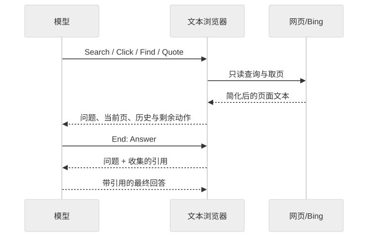

> - **公开入口：** [论文页](https://arxiv.org/abs/2112.09332) · [PDF](https://arxiv.org/pdf/2112.09332) · [正式页面](https://openai.com/index/webgpt/) · [TeX 源码入口](https://arxiv.org/e-print/2112.09332)
> - **归档：** 2021 · arXiv preprint · 严格策略 RL · 系列第 20/51 篇
> - **模块：** D. 人类偏好与经典 RLHF
> - 正文中的本地文件名、SHA-256 与版本记录用于说明核验过程；博客不镜像原论文 PDF 或 TeX。

> **一句话地图：** 输入是问题、浏览器文字状态、人类操作示范和成对偏好；先用行为克隆教 GPT-3 操作浏览器，再用偏好训练奖励模型；论文比较 PPO 强化学习与 best-of-$n$ 拒绝采样。主结果模型是 **BC + reward model 排序的 best-of-64**，不是 PPO 模型。

## 0. 阅读导航

- 前置概念：监督微调、成对偏好、Elo/logit、PPO、KL 约束、best-of-$n$。
- 读完应能解释：BC、RM、RL、拒绝采样分别解决哪一环；为什么“引用来源”能降低标注难度却不保证事实正确；哪些结果真正支持 RL。
- 定位口径：本地 PDF 共 33 页。环境见第 2–3 页，数据与训练见第 4–5 页，主评估与方法对照见第 5–9 页，风险见第 9–11 页，附录训练细节见第 19–23 页。

## 1. 它遇到了什么具体问题？

开放式长回答同时需要检索、阅读、整合和事实判断。普通语言模型可能写得流畅却凭空补细节；固定检索器又难覆盖实时网页和多步查询。更根本的问题是反馈：让标注员独立调查每个专业事实很贵，也很难形成一致标准。

WebGPT 把任务改成一个人和模型都能操作的文本浏览器。模型必须在搜索、点击、页内查找、引用、滚动、返回和结束等受限命令中选择，并在最后用自己收集的摘录作答。标注员主要检查“答案是否被这些来源支持”，减少每题从零调查的负担。

*图 1｜根据相邻正文中的问题、机制或算法流程重绘。*

机制解释是：示范提供“怎样操作工具”的密集监督；偏好比较把相关性、连贯性和来源支持压成标量；RL 或拒绝采样再优化这个标量。这里的关键风险也来自同一链条：奖励模型学到的是标注偏好代理，模型可能挑看似有说服力的来源，而非完整、公正的证据。

## 2. 前人怎样解决，为什么仍然不够？

| 路线 | 改了哪一环 | 留下的限制 |
|---|---|---|
| DPR/REALM/RAG | 用可微检索器找文档，再生成回答 | 常面向固定语料；难直接调用不可微搜索引擎和多步浏览 |
| GPT-3 提示 | 依赖预训练知识直接回答 | 知识不更新，答案依据不可见，长回答会有可信外观的错误 |
| 行为克隆 | 模仿人类的浏览命令和回答 | 目标是复现示范，不直接优化“两个完整答案谁更好” |
| 纯 RL 浏览 | 用最终奖励学习多步搜索 | 起点策略若不会合法操作，稀疏终局奖励很难探索；奖励模型也可能被利用 |

WebGPT 的核心系统改动是把任务做成**可示范、可比较、带来源的浏览环境**，再将 BC、偏好奖励、RL 和推理时采样分开实验；PPO 沿用已有算法。

## 3. 四个部件分别做什么？

1. **行为克隆（BC）**：约 6,000 条人类示范教模型输出合法命令、查找材料、引用并回答。它解决“先学会用工具”。
2. **奖励模型（RM）**：人类比较两个模型答案，最终奖励模型约用 16,000 对训练，另约 5,500 对评估。它学习“在标注规则下哪个整体更好”。
3. **PPO 强化学习（RL）**：从 BC 策略出发，在浏览器中完成 episode，用终局 RM 分数加逐 token 的相对 BC 的 KL 惩罚训练。它把更多生成概率移向高 RM 分数行为。
4. **拒绝采样（best-of-$n$）**：不改模型参数；从 BC 或 RL 策略采 $n$ 个完整答案，让 RM 选最高分。它用推理算力换选择机会。

主结论必须拆开：论文最好的 175B 模型是 BC 后 best-of-64；RL 单独相对 BC 有小幅收益，但与拒绝采样结合几乎没有额外收益（第 7–8 页，图 4–5）。

## 4. 算法与信息流

*图 2｜根据相邻正文中的问题、机制或算法流程重绘。*

*图 3｜根据相邻正文中的问题、机制或算法流程重绘。*

- **动作空间：** 表 1 列出受限文本命令；非法文本计入最多动作数但被忽略（第 3 页）。
- **数据划分：** BC、RM、RL 的问题集合互不相交；RM 的答案来自多种历史策略，分布并不整齐均一（§3.2）。
- **RL 采样：** 90% ELI5、10% TriviaQA；每个完整浏览 episode 后额外插入 15 个复用同一引用的“只回答”episode，以约 2 倍提升样本效率（第 5 页）。
- **冻结与更新：** BC 更新策略；RM 单独训练后作为打分器；PPO 更新 BC 初始化的策略，BC 参考分布用于 KL；best-of-$n$ 不更新任何参数。

## 5. 公式逐步推导

### 5.1 符号表

| 符号 | 普通含义 | 数学对象 | 来源 |
|---|---|---|---|
| $x$ | 问题及浏览/引用上下文 | token 序列 | 环境 |
| $y$ | 完整浏览轨迹与最终回答 | token 序列 | 人/策略生成 |
| $\pi_{\rm BC}$ | 模仿示范后的策略 | 条件分布 | 监督微调 |
| $r_\phi(x,y)$ | RM 给完整答案的 Elo 型分数 | 标量 | 偏好训练 |
| $\pi_\theta$ | PPO 后的策略 | 条件分布 | RL 更新 |
| $n$ | best-of-$n$ 候选数 | 4、16 或 64 | 推理预算 |

### 5.2 BC：先学合法行为

对人类示范 token $y_{1:L}$，标准 teacher forcing 最小化

$$
\mathcal L_{\rm BC}(\theta)
=-\sum_{t=1}^{L}\log \pi_\theta(y_t\mid x,y_{<t}).
$$

这一步没有偏好奖励，只要求模型复现示范命令和答案。

### 5.3 RM：把二选一偏好变成概率

论文把奖励解释为 Elo 分数，两个分数之差等于偏好概率的 logit（§3.2）：

$$
P_\phi(y_A\succ y_B\mid x)
=\sigma\left(r_\phi(x,y_A)-r_\phi(x,y_B)\right),
$$

$$
\mathcal L_{\rm RM}
=-z\log P_\phi-(1-z)\log(1-P_\phi),
$$

其中偏好 A 时 $z=1$，偏好 B 时 $z=0$，平局用软标签 $z=0.5$。若 $r_A=1.2,r_B=0.2$，差为 1，则 $P(A\succ B)=\sigma(1)\approx0.731$；这也解释论文所说 Elo 差 1 对应约 73% 偏好（第 8 页）。

### 5.4 PPO：优化 RM，同时别离 BC 太远

论文文字给出的 episode 奖励可写成下列实现含义的示意式：

$$
R(x,y)=r_\phi(x,y)-\beta\sum_t
\log\frac{\pi_\theta(y_t\mid x,y_{<t})}
{\pi_{\rm BC}(y_t\mid x,y_{<t})}.
$$

第一项只在 episode 末给出；第二项逐 token 惩罚偏离 BC，以缓解过度优化 RM。随后 PPO 用 clipped surrogate 更新 $\theta$。论文正文没有把完整 PPO 目标重新列式，讲义不把这个示意式冒充论文编号公式；超参数见附录 E，KL 系数 0.02、PPO clipping $\epsilon=0.2$（附录表 7，第 21–22 页）。

### 5.5 best-of-$n$：参数不变，只挑最好候选

$$
y^*=\arg\max_{y_i\sim\pi,\ i=1,\ldots,n}r_\phi(x,y_i).
$$

若每次采样独立得到“真正优质答案”的概率是 0.1，那么至少采到一个的概率为

$$
1-(1-0.1)^n.
$$

$n=4$ 时为 34.4%，$n=64$ 时约 99.9%。这只是说明多次尝试的机会；RM 若排错或候选相关，最终选中优质答案的概率会低得多。随着 $n$ 增大，选择过程也更会寻找 RM 漏洞。

## 6. 实验到底检验了什么？

| 研究问题 | 对照与控制变量 | 指标/样本 | 原论文结果与定位 | 能说明什么 | 不能说明什么 |
|---|---|---|---|---|---|
| 最佳系统能否达到示范者水平？ | 175B BC best-of-64 对人类浏览示范；同类回答与引用 | 人类成对偏好，ties=50% | WebGPT 被偏好 56%（图 2a，第 5–6 页） | 在这套标注准则下，BC+RM 选择达到近人类示范水平 | 56% 不等于普遍事实正确，也未隔离每个组件贡献 |
| 相对 Reddit 高票答案怎样？ | 去掉 WebGPT 引用，换新标注员和简化说明 | ELI5 测试成对偏好 | WebGPT 被偏好 69%；先前 ELI5 系统为 23%（图 2b，第 5–6 页） | 系统在长回答整体偏好上很强 | 风格不能完全盲化；WebGPT 计算量更大，比较条件不同 |
| RL 与拒绝采样各贡献多少？ | 同 175B BC 起点；RL 或 best-of-64 | 相对 BC 的人类偏好 | best-of-64 BC 对 BC 为 68%；RL 对 BC 为 58%；RL+拒绝采样几乎无额外收益（图 4–5，第 7–8 页） | RL 有小幅独立收益；本实验中推理时筛选更强 | 不能说 PPO 产生了最佳系统，也不能说 RL 普遍不如 best-of-$n$ |
| 分布外真实性如何？ | WebGPT 与 GPT-3 两种提示 | TruthfulQA；WebGPT 用人工评估并截断至 50 tokens | 最佳 WebGPT 75% truthful、54% truthful+informative（摘要/§4.2、图 3，第 6–7 页） | 浏览+反馈相对基础 GPT-3 改善该对抗集 | 仍低于人类；截断导致约 3% 空答案，且 ELI5→TruthfulQA 有分布转移 |
| 数据/参数/采样怎样缩放？ | 分别改变示范数、比较数、参数量、$n$ | 175B validation RM score/accuracy | 示范翻倍：策略 RM 分数约 +0.13；比较翻倍：RM accuracy 约 +1.8%；策略参数翻倍约 +0.09（图 6–8，第 8–9 页） | 数据与规模在观测范围内呈正趋势 | 多为 RM 代理指标；论文警告 RL 优化时 validation RM 未必可靠 |

## 7. 结果如何理解？

WebGPT 的主要科学贡献是把“工具使用 + 可检查证据 + 人类反馈”连成闭环。结果同时否定了一个常见简化：最佳结果不能写成“PPO 让 WebGPT 超过人类”。最佳模型从 BC 采 64 次，再由 RM 选一个；PPO 相对 BC 的 58% 偏好是独立、较小的证据。

拒绝采样胜过 RL 的原因在论文中只是候选解释：它用更多推理计算、能多试网站、RM 的训练分布更接近 BC/拒绝采样数据，而且无需 PPO 调参。论文还指出调好 BC 训练轮数和采样温度后，原先看到的 BC—RL 差距缩小（第 7 页）。

引用也不是事实证书。它让标注员更容易检查“这句话是否由所示材料支持”，却可能奖励挑选单边、低质量或迎合问题立场的材料。TruthfulQA 的失败例就引用了不可靠来源；论文明确说 ELI5 上“减少非模仿式错误”的说法没有被直接测试，因为细微幻觉难以标注（第 9 页，§6.1）。

## 8. 优点、代价与失效条件

### 优点

- 把网页操作限制为可审计命令，整个搜索与引用轨迹可查看。
- BC 解决稀疏奖励下的冷启动，RM 允许直接优化人类对完整答案的判断。
- 清楚比较参数更新（RL）与推理时计算（best-of-$n$）两种优化 RM 的方式。
- 约 19,578 条适合 RM 的比较记录被公开（附录 K，第 32 页；总收集量因过滤/用途口径约 21,500）。

### 代价

- best-of-64 需要生成 64 条完整浏览/回答轨迹，推理成本高。
- 偏好被压成一个标量，事实、来源质量、连贯性等维度会互相补偿。
- 系统依赖 Bing、实时网页、GPT-3 预训练能力和承包商判断，复现条件会随时间变化。

### 已观察到的失败

- TruthfulQA 上仍会引用不可靠来源；最佳系统 truthful+informative 只有 54%。
- 回答带引用显得更权威，可能加重自动化偏误和过度信任（§6.2）。
- 会继承基础模型与网页的偏见，并倾向接受问题隐含立场（§6.3、附录 H）。
- RL 与拒绝采样结合没有显著额外收益；RM 过度优化和策略熵下降是作者提出的可能原因。

### 尚未验证的外推与可证伪预测

论文没有证明引用机制在专业、高风险或对抗性网页中仍可靠。一个可证伪预测是：**若引用真正通过提高反馈可判定性而改善事实性，在保持答案内容与标注预算相同的实验中，提供可追溯摘录应提高标注员间一致率，并使训练后模型在独立事实核验上更准；若只提高偏好分而独立事实准确率不升，机制更可能是权威感或格式迎合。**

另一个预测针对 RL 与 best-of-$n$：当推理预算严格限制为一次采样时，RL 相对 BC 的优势应保留；随着允许的 $n$ 增大，RL 的边际优势应缩小。论文图 4 已给出初步趋势，但需要在不同 RM、任务和等总计算预算下复现。

## 9. 它怎样影响后来的大模型强化学习？

WebGPT 把几条后来常见的 agent/RLHF 组件放到同一系统：工具调用动作、行为克隆冷启动、成对偏好奖励、参考策略 KL、PPO 和 test-time best-of-$n$。它的重要遗产是**端到端工具轨迹可由人示范并由偏好评价**。同时，这篇论文也是读结果归因的好教材：系统包含 RL，不代表最佳 checkpoint 的增益主要来自 RL。

## 10. 三个自检问题

1. 为什么 RM 的分数差能解释成偏好概率的 logit？平局标签为什么是 0.5？
2. 175B best-of-64 超过示范者的结果中，哪些参数被训练，哪些计算只发生在推理时？
3. 引用能让反馈更容易，却为何可能同时增加错误答案的说服力？

## 11. 原文定位与核验记录

- 原论文：[arXiv:2112.09332](https://arxiv.org/abs/2112.09332)；2021 年预印本。
- 本地 PDF SHA-256：`acad8d9fd55a30b94de9dfdae413e10b21e07bde54d767b2405b31341739cedb`。
- 使用的 TeX：`papers/2021/webgpt/source/main.tex`（Hugging Face 文本源码镜像，图片二进制可能缺失）；交叉核验 `reading/paper.txt`。
- 关键公式：RM Elo/logit 定义见 §3.2；RL 奖励组成见 §3.2 与附录 E；best-of-$n$ 见 §3.2、附录 I。
- 关键图表：表 1–3、图 2–8；方法分解核心为图 4–5。
- 二手资料仅用于：无；讲义中的 BC/RM/RL 公式是按论文文字展开的教学推导，并明确区分未编号的实现示意式。
- 尚未核验：在线网页与已发布比较数据的当前可访问性；不影响本地论文内数字核验。

---

本文属于[《强化学习论文精读：2016–2026》](/series/reinforcement-learning-paper-reading/)。
实验数字以文首链接的最终 PDF 为准；图为教学重绘，不是论文原图。
