> - **公开入口：** [论文页](https://arxiv.org/abs/2203.02155) · [PDF](https://arxiv.org/pdf/2203.02155) · [正式页面](https://proceedings.neurips.cc/paper_files/paper/2022/hash/b1efde53be364a73914f58805a001731-Abstract.html) · [TeX 源码入口](https://arxiv.org/e-print/2203.02155)
> - **归档：** 2022 · NeurIPS 2022 · 严格策略 RL · 系列第 21/51 篇
> - **模块：** D. 人类偏好与经典 RLHF
> - 正文中的本地文件名、SHA-256 与版本记录用于说明核验过程；博客不镜像原论文 PDF 或 TeX。

> **一句话地图：** 输入是用户指令；训练信号先是标注员示范，再是标注员对多个回答的排序；更新的是 GPT-3 策略及其奖励模型；最后得到更常被这一组标注员偏好的指令跟随模型。

## 0. 阅读导航

- 需要的前置概念：监督微调（SFT）、成对偏好、Bradley–Terry 模型、策略、KL 散度、PPO。
- 读完应能解释：为什么“更大的续写模型”未必“更会听指令”；人类排序怎样变成标量奖励；为什么还要用 KL 约束和预训练梯度；论文的结果为什么不能解释成“模型已经普遍安全”。
- 原论文版本与定位口径：本地 PDF 为 arXiv v1，共 69 个 `pdftotext` 分页；正文公式 (1)、(2)，图 1–6，表 6，以及第 5.2–5.3 节是主要核验位置。

## 1. 它遇到了什么具体问题？

GPT-3 的预训练任务是：看到互联网文本的前缀，猜下一个 token。用户真正需要的任务却是：理解指令、完成任务、在不确定时诚实，并避免不合适的内容。两个目标相关，却不相同。一个模型可以很会续写“问答网页”，仍然可能忽略格式要求、编造输入里没有的信息，或者继续生成有害文本。

*图 1｜根据相邻正文中的问题、机制或算法流程重绘。*

这里的失败机制很具体：训练损失只要求模型拟合文本分布，没有告诉模型“哪个回答更符合当前用户的意图”。提示工程能临时把模型引到合适的行为区域，监督微调能模仿高质量答案，但两者都没有直接利用“回答 A 比回答 B 好”这种细粒度比较信息。论文用人类偏好补上这条信号。

需要保护一条结论边界：论文里的“human intent”实际由约 40 名受指导、以英语为主的承包标注员、研究团队的说明和 API 提示分布共同操作化。它不是全人类一致价值的观测值（第 5.2–5.3 节）。

## 2. 前人怎样解决，为什么仍然不够？

| 做法 | 改了哪一环 | 仍留下什么 |
|---|---|---|
| 少样本提示 GPT-3 | 在输入里展示“听指令”的范例 | 依赖提示设计，且没有修改模型目标 |
| 监督微调（SFT） | 用标注员示范直接训练回答 | 每个提示要写完整高质量答案，成本高；只学“像示范”，没有显式学习候选间的相对优劣 |
| 公开任务指令微调（FLAN/T0） | 在大量公开 NLP 任务上学习指令格式 | 任务分布与真实 API 用户提示不同；论文在 API 分布上发现其版本不如 SFT 与 InstructGPT（第 4.1 节） |
| 早期语言模型 RLHF | 用偏好模型给摘要等任务打分，再做 RL | 多集中于较窄任务；本文测试开放式 API 指令分布、多个模型规模和一组行为评估 |

本文的最小干预是：不重做预训练架构，只在 GPT-3 后接三步后训练——示范、排序、PPO。

## 3. 核心想法：先说人话

把训练过程想成“学徒—裁判—练习”三段：

1. 标注员先写一些标准答案，模型照着学，得到 SFT 学徒。
2. 对同一个问题让模型给出 4–9 个答案，标注员只需排序；奖励模型学习当裁判。
3. 学徒反复作答，裁判给分，PPO 更新学徒，使高分回答更常出现。

裁判只是从有限比较数据中拟合出来的模型。策略如果离开裁判熟悉的回答分布，可能找到“裁判喜欢、人未必喜欢”的漏洞。论文因此把策略拴在 SFT 附近，并额外混入预训练文本的似然梯度以减少能力回退。

## 4. 算法与信息流

*图 2｜根据相邻正文中的问题、机制或算法流程重绘。*

数据规模见正文第 3.2 节与表 6：SFT 约 13k 个训练提示，RM 约 33k，PPO 约 31k；表 6 给出更精确的训练项：SFT 为 11,295 个标注员提示加 1,430 个客户提示，RM 为 6,623 个标注员提示加 26,584 个客户提示，PPO 为 31,144 个客户提示。每个 RM 提示的完整排序产生 ${K\choose2}$ 个成对比较。

- **采样分布**：SFT/RM 混合标注员提示与早期 API 用户提示；PPO 训练提示来自 API 客户分布。
- **冻结参数**：PPO 阶段奖励模型和 SFT 参考策略不随策略更新。
- **更新参数**：SFT 阶段更新语言模型；RM 阶段更新奖励模型；RL 阶段更新策略与价值函数。
- **交互形式**：每个提示—回答被视为一次 bandit episode；回答结束时取得 RM 奖励。论文使用 PPO，但核心行为目标由公式 (2) 给出。
- **数据复用**：论文说明步骤 2、3原则上可迭代；本研究多数比较数据来自 SFT 策略，少量来自 PPO 策略（第 3.1 节）。

## 5. 公式逐步推导

### 5.1 符号表

| 符号 | 普通含义 | 数学对象/形状 | 从哪里得到 |
|---|---|---|---|
| $x$ | 用户提示 | token 序列 | API 或标注员 |
| $y_w,y_l$ | 一对回答中更受偏好/较不受偏好的回答 | token 序列 | 人类排序拆成的成对数据 |
| $r_\theta(x,y)$ | 奖励模型给回答的分数 | 标量 | 6B RM 前向计算 |
| $\pi_\phi^{RL}(y\mid x)$ | 当前策略生成回答的概率 | 条件分布 | PPO 更新的模型 |
| $\pi^{SFT}(y\mid x)$ | SFT 参考策略 | 条件分布 | RL 阶段冻结 |
| $\beta$ | 偏离 SFT 的惩罚强度 | 非负标量 | 超参数 |
| $\gamma$ | 预训练似然项权重 | 非负标量 | PPO-ptx 超参数；纯 PPO 为 0 |

### 5.2 排序怎样变成奖励

论文公式 (1) 假设两回答分数差决定人选 $y_w$ 的概率：

$$
P_\theta(y_w\succ y_l\mid x)
=\sigma\!\left(r_\theta(x,y_w)-r_\theta(x,y_l)\right).
$$

对正确偏好做最大似然，等价于最小化负对数似然：

$$
\mathcal L_{RM}(\theta)
=-\frac{1}{{K\choose2}}
\mathbb E_{(x,y_w,y_l)\sim D}
\log\sigma(r_\theta(x,y_w)-r_\theta(x,y_l)).
$$

这是建模假设，不是恒等式：它把分数差解释成偏好的对数几率。给所有回答的奖励同时加常数不会改变差值，因此论文在 RL 前加一个偏置，使标注员示范的平均奖励为 0。

论文把同一提示的全部 ${K\choose2}$ 对放在同一个 batch element 中。原因是这些对共享回答，若拆散随机洗牌，同一回答一轮内会被使用 $K-1$ 次，作者观察到 RM 很快过拟合（第 3.5 节）。

### 5.3 RL 目标中的两条“安全绳”

论文公式 (2) 为：

$$
J(\phi)=
\mathbb E_{(x,y)\sim D_{\pi_\phi}}
\left[r_\theta(x,y)-\beta\log\frac{\pi_\phi(y\mid x)}{\pi^{SFT}(y\mid x)}\right]
+\gamma\mathbb E_{x\sim D_{pretrain}}\log\pi_\phi(x).
$$

第一项追求 RM 高分。第二项是按当前策略采样得到的对数概率比；取期望后对应 $D_{KL}(\pi_\phi\Vert\pi^{SFT})$，阻止策略为了骗过 RM 而离 SFT 太远。第三项继续提高预训练文本的似然，用来修复部分公开 NLP 任务回退。纯 PPO 令 $\gamma=0$，论文默认的 InstructGPT 指 PPO-ptx。

PPO 是实现这一目标的策略梯度算法。PPO 的裁剪只控制每次参数更新幅度；公式 (2) 的 KL 项控制最终策略相对 SFT 的行为距离。两者不是同一个约束。

### 5.4 一组小数字走完更新

以下数字只为复算，不是论文实验数据。

假设同一提示的优选回答得分 2.0，落选回答得分 0.5。偏好概率为

$$
\sigma(1.5)=0.8176,\qquad -\log 0.8176=0.2014.
$$

若策略生成一个 RM 奖励 1.2 的回答，回答级对数概率比为 0.4，取 $\beta=0.1$，则 KL 后奖励是 $1.2-0.1\times0.4=1.16$。再假设一个预训练样本对数似然为 $-2$，$\gamma=0.05$，PPO-ptx 的这个玩具目标贡献变为 $1.16+0.05\times(-2)=1.06$。优化会提高高 RM 奖励动作的概率，同时为偏离 SFT 和遗忘预训练分布付费。

**请先自己解释：** 如果 RM 在训练分布外把一个花哨但错误的回答打成高分，KL 项为什么只能降低风险，不能保证把错误识别出来？

## 6. 实验到底检验了什么？

| 研究问题 | 对照与控制变量 | 指标/样本 | 原论文结果与定位 | 能说明什么 | 不能说明什么 |
|---|---|---|---|---|---|
| 人类反馈是否改善 API 提示上的偏好？ | 同规模 GPT-3、提示版 GPT-3、SFT、PPO、PPO-ptx | 标注员两两偏好，95% CI | 175B InstructGPT 对 175B GPT-3 胜率 $85\pm3\%$，对 few-shot GPT-3 为 $71\pm4\%$；图 1、第 4.1 节 | 在该提示和标注协议下，三段式训练显著提高偏好 | 不代表所有文化、用户或任务都偏好它 |
| 小模型对齐能否超过大模型原始能力？ | 1.3B PPO-ptx 对 175B GPT-3 | 人类偏好 | 1.3B InstructGPT 被偏好于 175B GPT-3；摘要、图 1 | 后训练目标可比参数规模更直接地影响指令体验 | 不代表 1.3B 的知识与推理能力全面超过 175B |
| 是否减少编造？ | 同提示下 GPT-3 与 InstructGPT | 闭域任务的人工幻觉率 | 21% 对 41%；第 1、4.1 节 | 在“答案应只来自输入”的测试中编造约减半 | 不是开放域事实正确率，也不能推出诚实意图 |
| 毒性和偏见是否一起改善？ | RealToxicityPrompts、Winogender、CrowS-Pairs | 自动与人工指标 | 被要求尊重时毒性输出约少 25%；两项偏见基准无显著改善；第 1、4.2 节、图 6 | 一部分毒性代理指标改善 | 不能外推为普遍无害或公平；偏见结果明确未改善 |
| RLHF 的能力回退能否缓解？ | PPO 与加入预训练梯度的 PPO-ptx | SQuAD、DROP、HellaSwag、WMT 等 | PPO 有回退；PPO-ptx 大幅缓解且未明显损害标注员偏好；第 1、4.2 节及附录图 29–31 | 预训练似然项能缓解这组任务的 alignment tax | 不是对所有能力无损的保证 |
| 偏好是否跨标注员泛化？ | 训练标注员与 held-out 标注员 | 对模型输出的偏好率 | 两组对 InstructGPT 的偏好率大致相同；图 3、第 4.1 节 | 不完全是训练标注员身份记忆 | held-out 人数仍来自相近招募和说明，不能代表公众 |

## 7. 结果如何理解？

最直接的结果是：把训练目标从“像互联网”改成“更符合标注偏好”，对用户可见行为的影响可以大过 100 倍参数差异。这个结论由同架构、不同后训练方式的比较支撑。

机制证据来自逐级基线：提示 GPT-3、SFT、PPO 的偏好依次提高；加入 pretraining mix 对人类偏好影响不大，却缓解公开 NLP 回退（第 4.1–4.2 节）。这符合“排序信号改善行为，预训练梯度保留一般能力”的解释，但论文没有做因果隔离来证明所有变化只由单一机制产生。

安全相关结果必须拆开读：幻觉代理与特定毒性设置改善，Winogender/CrowS-Pairs 没有显著改善。论文自己也说明“潜在有害”高度依赖部署情境，所以改用多项代理指标（第 3.6 节）。因此合适的表述是“某些受测行为代理改善”，而不是“模型更安全”。

## 8. 优点、代价与失效条件

### 优点

- 把开放式人类判断压缩为可优化的奖励，并在多种真实 API 提示上验证。
- SFT、RM、RL 各自职责清楚，图 2 给出可复用的工程范式。
- 同时报告偏好、真实性、毒性、偏见和能力回退，没有用单一胜率覆盖所有结论。
- 明确讨论“对齐到谁”，承认标签来自小而特定的群体。

### 代价

- 需要示范、排序和持续评估；价值判断被编码在标注说明和标注员构成中。
- PPO 需要同时运行策略、价值模型、RM 与参考模型，训练复杂且昂贵。
- PPO-ptx 的预训练梯度是为能力回退加入的额外目标；它也可能与当前用户偏好发生冲突。

### 已观察到的失败

- 模型仍会犯简单错误（第 1、4.3 节）。
- 纯 PPO 在 SQuAD、DROP、HellaSwag、WMT 等出现回退。
- 偏见基准没有显著改善；毒性改善依赖提示“保持尊重”的设置。
- 175B RM 训练不稳定，论文实际只使用 6B RM（第 3.5 节）。

### 失效条件与可证伪预测

机制假设是“RM 在策略访问的区域内近似人类偏好”。可证伪预测：逐步增大 $D_{KL}(\pi\Vert\pi_{SFT})$ 时，RM 分数最终会继续上升，而独立人评停滞或下降；如果在严格独立、持续更新的人评上始终同步上升，则这一 reward-hacking 预测在该范围内不成立。

第二个预测针对 PPO-ptx：在相同 RM 奖励与 KL 下提高 $\gamma$，公开预训练型任务回退应减小；若完全不变，则“回退主要来自遗忘预训练分布”的机制解释不足。

### 尚未验证的外推

- 没有验证多语言、多文化、儿童或高风险专业场景中的共同偏好。
- 没有证明模型“理解”人类价值，也没有证明它在部署中不会策略性利用 RM。
- 人类偏好、真实性代理与安全性是不同测量对象；一个改善不能替代另两个。

## 9. 它怎样影响后来的大模型强化学习？

这篇论文把“指令 SFT → 偏好奖励模型 → 带 KL 的 PPO”确立为大模型 RLHF 的标准公开范式。后续工作分别替换其中某一环：更细的规则奖励、AI 反馈、过程监督，以及不显式训练 RM/PPO 的直接偏好优化。理解这些工作时，应先问它替换的是数据、奖励估计还是策略优化，而不是把所有偏好后训练都叫 PPO。

## 10. 三个自检问题

1. 为什么成对排序可以训练标量 RM？给所有奖励加同一个常数为什么不影响训练？
2. KL 惩罚与 PPO 裁剪分别限制什么？它们为什么都不能保证 RM 没有漏洞？
3. “175B InstructGPT 对 GPT-3 胜率 85%”为什么不能推出模型已普遍安全或普遍符合人类价值？

## 11. 原文定位与核验记录

- 原论文：`papers/2022/instructgpt/paper.pdf`；arXiv:2203.02155v1。
- PDF 校验和：SHA-256 `c1984bb50a5b90fddb895fdc3a0f72e5bc977148c9f63ef6040cbe7a3e1f0d98`。
- 使用的 TeX/Markdown：`papers/2022/instructgpt/reading/source-expanded.tex`、`reading/paper.txt`、`reading/packet.md`。TeX 是 `scholarweave/arxiv-latex` 的文本镜像，状态文件注明二进制图片和原始归档元数据可能缺失；实验数字另由本地 PDF 核验。
- 关键公式：公式 (1) RM 损失（PDF 第 8–9 页）；公式 (2) PPO/PPO-ptx 目标（PDF 第 9 页）。
- 关键图表：图 1（偏好与规模，PDF 第 2 页）、图 2（三步流程，第 3 页）、图 3–6（主结果，第 11–16 页）、表 6（数据规模，PDF 第 33 页）。
- 二手资料仅用于：无；讲解事实与数字均回到本地原论文。
- 尚未核验：论文未公开足以重跑全套训练的模型权重与所有生产级细节；这里未复现实验，只复算了公式中的玩具数值。

---

本文属于[《强化学习论文精读：2016–2026》](/series/reinforcement-learning-paper-reading/)。
实验数字以文首链接的最终 PDF 为准；图为教学重绘，不是论文原图。
