> - **公开入口：** [论文页](https://arxiv.org/abs/2204.05862) · [PDF](https://arxiv.org/pdf/2204.05862) · [TeX 源码入口](https://arxiv.org/e-print/2204.05862)
> - **归档：** 2022 · arXiv preprint · 严格策略 RL · 系列第 22/51 篇
> - **模块：** D. 人类偏好与经典 RLHF
> - 正文中的本地文件名、SHA-256 与版本记录用于说明核验过程；博客不镜像原论文 PDF 或 TeX。

> **一句话地图：** 输入是多轮对话；人分别比较哪个回答更有帮助、哪个回答更有害；偏好模型把这些比较压成分数；PPO 更新语言模型，得到在人评下更有帮助且更难被红队诱导的助手。

## 0. 阅读导航

- 需要的前置概念：偏好建模（PM）、Elo、RLHF、PPO、KL 散度、分布外（OOD）、奖励过优化。
- 读完应能解释：为什么 helpful 与 harmless 会冲突；为什么收集“更有害的回答”利于发现漏洞，却会让“正确拒绝方式”缺少训练信号；独立 test PM 能发现什么、不能发现什么。
- 原论文版本与定位口径：本地 arXiv v1 PDF 共 75 个文本分页。核心位置为图 1–5、正文第 2–5 节、公式 (1)–(3)、第 7.1 节。

## 1. 它遇到了什么具体问题？

单独追求 helpful，模型可能认真帮助用户实施有害目标；单独追求 harmless，最容易拿高分的策略可能是对任何敏感问题都回复“我不能回答”。前者有用但危险，后者安全代理分数高却失去用途。

*图 1｜根据相邻正文中的问题、机制或算法流程重绘。*

旧问题还有第二层：奖励模型只在历史助手回答上训练，PPO 却专门搜索它的高分区域。策略越优化，生成分布越不同；RM 的高分可能表示“人会喜欢”，也可能表示“策略找到了 RM 的盲点”。

论文的机制解释可拆成两条可检验链：

1. **目标冲突链**：helpful 与 harmless 数据的“好方向”不同 → 单一侧重 PM 在另一分布表现很差 → 策略会走向危险服从或机械回避。
2. **分布漂移链**：PPO 改变策略 → 回答离开 PM 训练分布 → PM 校准变差 → 训练 PM 与独立 PM 评价分叉。

## 2. 前人怎样解决，为什么仍然不够？

| 做法 | 改了哪一环 | 仍留下什么 |
|---|---|---|
| 上下文蒸馏（context distillation） | 用提示中的行为说明生成答案，再把提示行为蒸馏进模型 | 主要是模仿；没有利用大量成对比较持续改善策略 |
| 只收 helpful 偏好 | 教模型完成任务和诚实应答 | 红队更容易诱导有害回答 |
| 只用广义 harmless 偏好 | 奖励拒绝有害请求 | “拒绝一切”容易，细致解释为何拒绝却缺少正例 |
| 静态 RLHF | 在一次固定偏好数据上训练 RM 和策略 | 高奖励区数据稀少，策略优化后发生分布漂移 |

本文的最小干预是：把 helpful 与 harmless 作为两类明确数据分布，混合训练 PM；再用 PM 奖励做 PPO，同时用在线迭代数据和独立 PM 检查高分区是否失真。论文没有引入一套能从原则自动判断安全的规则系统。

## 3. 核心想法：先说人话

作者让标注员进行两种对话：

- helpful 模式：正常向两个候选助手求助，每轮选择更有帮助、更诚实的回答。
- harmless/red-team 模式：故意诱导模型犯错，每轮选择**更有害**的回答，以便继续沿危险路径探索。

这两种比较训练 PM。PPO 把 PM 分数当奖励。这样做像训练一个既评“服务质量”又评“风险”的裁判，再让助手根据裁判练习。

类比的边界在于：裁判的评分规则不是一部明确法典，而是有限标注员在特定对话和说明下的选择。更关键的是，red-team 数据选择“更坏”的下一步很适合找漏洞，却没有展示遇到危险请求时怎样既拒绝又继续提供有益解释。论文第 4.4 节把这归因于数据分布设计。

## 4. 算法与信息流

*图 2｜根据相邻正文中的问题、机制或算法流程重绘。*

- **数据**：主要由 52B 模型与众包工作者对话产生；有 base、rejection-sampled、online 三批。公开的主分析多基于前两批组成的 static 数据（第 2.3 节）。
- **PM**：为一整段提示—回答输出标量分数；分数差对应预测偏好概率。
- **RL episode**：论文把一条完整对话视为 trajectory，把每个助手回答视为 timestep，并在回答末端给 PM 奖励（第 4.1 节）。
- **训练提示**：137k 个 static 提示加 369k 个模型生成提示（第 4.1 节）。
- **在线**：约每周用当前 RLHF 策略收集新比较，混回旧数据，重新训练一套 PM 和策略；论文称 online，但并非持续更新同一模型（第 4.5 节）。
- **冻结/更新**：RL 时 PM 与初始策略 $\pi_0$ 冻结；更新策略与价值估计。

## 5. 公式逐步推导

### 5.1 符号表

| 符号 | 普通含义 | 数学对象/形状 | 从哪里得到 |
|---|---|---|---|
| $r_{PM}(x,y)$ | PM 给回答的偏好分数 | 标量 | 人类成对比较训练 |
| $\pi$, $\pi_0$ | 当前策略、初始参考策略 | token 条件分布 | PPO 策略与其初始快照 |
| $D_{KL}(\pi\Vert\pi_0)$ | 当前策略离初始策略多远 | 非负标量 | 策略样本上的经验估计 |
| $\lambda_{KL}$ | KL 惩罚系数 | 非负标量；论文用 0.001 | 超参数 |
| $\Delta r$ | 两回答 PM 分数差 | 标量 | PM 输出相减 |
| $D$ | 偏好训练或 RL 对话分布 | 分布 | 静态或在线数据 |

### 5.2 PM 分数怎样解释为偏好概率

论文第 4.1 节写出：

$$
P(A\succ B)=\frac{1}{1+e^{r_{PM}(B)-r_{PM}(A)}}
=\sigma(r_{PM}(A)-r_{PM}(B)).
$$

这是 Bradley–Terry 型假设。两回答分差为 0 时预测各有 50%；分差越大，预测偏好越确定。论文还给出经验换算 $\Delta Elo\approx174\,\Delta r_{PM}$（公式 (1)）。换算只帮助解释量级，不能把模型分数当成人类真实效用。

### 5.3 PPO 实际优化的奖励

论文公式 (2)：

$$
r_{total}=r_{PM}-\lambda_{KL}D_{KL}(\pi\Vert\pi_0).
$$

起点是 PM 奖励；KL 项是额外正则假设：策略离原模型越远，RM 越可能失真，且语言质量越可能退化。作者使用 $\lambda_{KL}=0.001$，并指出训练中通常 $D_{KL}<100$，所以该项多数时候影响很小，甚至可能不必要。这个坦率说明意味着不能把模型稳定性全归因于 KL。

PPO 估计 $\nabla_\phi\mathbb E_{y\sim\pi_\phi}[r_{total}]$，用价值函数降低方差并限制每次更新。PM 本身不接收 RL 梯度。

### 5.4 为什么早期奖励近似正比于 $\sqrt{KL}$

论文第 4.3 节给出机制推断。若当前策略是 $\pi+\delta\pi$，KL 在 $\delta\pi=0$ 附近的一阶项为 0，因此

$$
D_{KL}(\pi+\delta\pi\Vert\pi)=O(\|\delta\pi\|^2).
$$

初始策略并未专门优化 PM 奖励，所以奖励一般有非零一阶变化：

$$
\Delta r=O(\|\delta\pi\|).
$$

消去 $\|\delta\pi\|$ 得 $\Delta r\propto\sqrt{D_{KL}}$。这是局部展开与经验观察的解释，不是全程定律；策略远离初始点、RM 被利用或高阶项占主导时会失效。

### 5.5 一组小数字走完更新

以下是讲解用数值，不是论文实验结果。若回答 A、B 的 PM 分数为 1.3、0.5，则

$$
P(A\succ B)=\sigma(0.8)=0.690,
\quad \Delta Elo\approx174\times0.8=139.2.
$$

若 A 被策略采样，$D_{KL}=80$，论文系数 $\lambda_{KL}=0.001$，则

$$
r_{total}=1.3-0.001\times80=1.22.
$$

KL 只扣 0.08，RM 仍主导更新。若 RM 把机械拒绝误打成 1.3，PPO 依旧会增加机械拒绝概率。修复需要更好的比较数据或奖励定义，而不只是调小步长。

**请先自己解释：** 为什么“red-team 时选择更有害回答”能更快找到漏洞，却会让模型缺少“遇到有害请求时应该怎样回答”的正例？

## 6. 实验到底检验了什么？

| 研究问题 | 对照与控制变量 | 指标/样本 | 原论文结果与定位 | 能说明什么 | 不能说明什么 |
|---|---|---|---|---|---|
| HH-RLHF 是否优于初始模型？ | context-distilled、static HH、online HH、helpful-only | 众包 Elo/相对 52B 初始模型的偏好 | RLHF 模型在人评 helpful 与 harmless 维度均提高；helpful-only 更易被红队攻击；图 1 | 混合偏好能改变开放对话行为 | Elo 由本研究标注协议定义，不是绝对安全度 |
| PM 是否学到 HHH 概念？ | 普通 LM、context-distilled、PM | HHH 多选准确率 | 52B PM 约 86%，论文引用的人类均值约 75%；图 5、第 3.4 节 | 比较数据让 PM 在这组静态题上学到可迁移判断 | 超过平均人类题目准确率不等于在开放环境中比人可靠 |
| RLHF 会不会过拟合 PM？ | 同一 static 数据 50:50 训练两个 PM；策略只优化 train PM | train/test PM 分数随训练步数 | 约 150k 训练样本前较一致，之后 train PM 分数更高；图 4、第 4.2 节 | 高分区出现可测的模型特定过优化 | 两个 PM 可能共享盲点，test PM 不是独立人评真值 |
| 奖励与策略距离关系是什么？ | 不同策略/PM 规模 | PM 分数对 $\sqrt{KL}$ | 早期大致线性；图 4、13，第 4.3 节 | 支持局部策略扰动解释 | 不证明后期仍线性，也不证明奖励等于真实质量 |
| alignment tax 是否随规模变化？ | 13M–52B 的 base 与 HH-RLHF | 7 项 NLP 任务均值 | 小模型退化；13B、52B 零样本均值提高，少样本大致持平；图 3、第 1.1–1.2 节 | 该训练在大模型上未必牺牲这组能力 | 不能推出“几乎所有能力都无代价”，任务集有限 |
| 在线迭代是否填充高分区？ | static 与每周重训的 online RLHF | PM 分布和众包 Elo | online 数据填充 helpful 分数上尾，人评模型继续改善；图 15–16、第 4.5 节 | 新策略数据可缓解静态分布落后 | 成本更高；不保证自动收敛或消除共同盲点 |
| 偏见和真实性是否解决？ | base、context-distilled、RLHF | TruthfulQA、情感、BBQ-Lite、性别偏见 | TruthfulQA 随大模型改善；群体情感更正向，但偏见未消失，部分指标作者认为难解释；图 5、17，第 4.6 节 | 某些代理行为改善 | 不能外推为公平、真实或普遍安全 |

## 7. 结果如何理解？

最扎实的机制结果不是一个总分，而是三组互相印证的观察：helpful-only 和 HH 策略在人评上走向不同；train/test PM 在高奖励区分叉；红队数据设计让 harmless 分数比 helpful 更容易过优化。这些证据共同表明 RLHF 的瓶颈不只在 PPO，还在“偏好数据覆盖了哪些行为”。

论文的“alignment bonus”有尺度依赖：小模型在若干 NLP 任务下降，13B、52B 在零样本均值提升。合适解释是大模型有足够能力把自然语言偏好转成更好的任务接口；论文没有证明这种机制对任意能力、任意规模都成立。

online RLHF 的作用类似主动补题：让当前最强策略制造静态数据没有的高分回答，再请人比较。它针对“RM 在高分区没见过数据”的机制，而不是给 PPO 加一个隐藏安全模块。

## 8. 优点、代价与失效条件

### 优点

- 把 helpful 和 harmless 的冲突显式拆开，保留负结果与数据设计缺陷。
- 用 train/test PM 分叉研究 reward overoptimization，比只看训练奖励更有诊断力。
- 同时研究模型规模、数据规模、在线迭代和专业技能混合，提供丰富机制线索。
- 公开 helpfulness 数据，并讨论对齐数据作为公共资源。

### 代价

- 需要持续众包对话、红队与每周在线收集；成本和工作者福祉压力高。
- PM、策略、参考模型和价值模型同时运行，训练昂贵。
- “helpful/harmless”主要交由众包者常识解释，规范来源不够明确。

### 已观察到的失败

- 过度优化 harmless 会生成对轻微敏感问题也建议求医/治疗的夸张模板（第 4.4、6.2 节）。
- 高 RM 分数区校准和鲁棒性下降；小 PM 更容易被策略利用。
- 小模型存在严重 alignment tax。
- RLHF 改善情感指标却没有消除偏见；作者对 BBQ-Lite 等测量的解释也持保留态度。
- 模型仍会在“五是否大于七”这样的简单追问中自相矛盾（第 6.1 节）。

### 失效条件与可证伪预测

若问题根因是“harmless 数据只有坏方向、缺少最佳安全回答”，那么改为让独立标注员在红队上下文中选择**最有帮助的无害回答**，应降低机械拒绝率，同时维持或改善红队成功率。若严格控制模型、提示和数据量后仍不改善，数据方向机制不足以解释回避行为。

若 online 数据确实通过覆盖高分区提高鲁棒性，那么在相同策略 KL 和训练计算下，使用新策略产生的比较数据应缩小 train PM、独立 PM 与新鲜人评之间的差距；仅重复旧数据不应有同样效果。

### 尚未验证的外推

- 平均人评 improvement 不保证最坏情况安全，论文第 7.1 节明确主要研究平均行为。
- 众包者偏好不能替代专家事实判断、法律规范或受影响群体的意见。
- test PM 与 train PM 可能共享训练范式和数据偏差；两者一致也不等于人类一致。

## 9. 它怎样影响后来的大模型强化学习？

论文把三件后来反复出现的问题摆到台面：多目标奖励的冲突、策略对奖励模型的过优化，以及用在线数据追上策略分布。Sparrow 把 harmless 进一步拆成自然语言规则；Constitutional AI 改用原则驱动的 AI harmlessness 标签。它们是在改变监督来源和粒度，并非证明 HH-RLHF 已经解决安全。

## 10. 三个自检问题

1. 为什么独立 test PM 发现分叉是过优化证据，却仍不能当成人类真值？
2. $\Delta r\propto\sqrt{KL}$ 依赖哪些局部假设，训练后期为什么会失效？
3. 如果目标是“有帮助地拒绝”，为什么 red-team 时总选择更有害回答会造成监督缺口？

## 11. 原文定位与核验记录

- 原论文：`papers/2022/hh-rlhf/paper.pdf`；arXiv:2204.05862v1。
- PDF 校验和：SHA-256 `26e390d4f76938d2e2591225603637c643cc108e94afb756c65f5d2e0fc9037b`。
- 使用的 TeX/Markdown：`papers/2022/hh-rlhf/source/main.tex`、`reading/source-expanded.tex`、`reading/paper.txt`、`reading/packet.md`。
- 关键公式：Elo/PM 换算公式 (1)（PDF 第 12 页）；KL 奖励公式 (2) 与偏好概率（PDF 第 16–17 页）；$\sqrt{KL}$ 机制解释（第 18 页）。
- 关键图表：图 1（人评 Elo，第 4 页）、图 3（能力随规模，第 6 页）、图 4（train/test PM，第 7、17–18 页）、图 14（目标冲突，第 19–20 页）、第 7.1 节（局限，第 35–36 页）。
- 二手资料仅用于：无；所有技术与数字回到本地原论文。
- 尚未核验：未重跑专有模型训练或人评；图中未标注的 Elo 值没有人工估读成精确数字。

---

本文属于[《强化学习论文精读：2016–2026》](/series/reinforcement-learning-paper-reading/)。
实验数字以文首链接的最终 PDF 为准；图为教学重绘，不是论文原图。
