> - **公开入口：** [论文页](https://arxiv.org/abs/2209.14375) · [PDF](https://arxiv.org/pdf/2209.14375) · [TeX 源码入口](https://arxiv.org/e-print/2209.14375)
> - **归档：** 2022 · arXiv preprint / DeepMind research paper · 严格策略 RL · 系列第 23/51 篇
> - **模块：** D. 人类偏好与经典 RLHF
> - 正文中的本地文件名、SHA-256 与版本记录用于说明核验过程；博客不镜像原论文 PDF 或 TeX。

> **一句话地图：** 输入是多轮信息检索对话；人分别标注回答偏好、证据质量和 23 条规则是否被违反；两个奖励模型给回答打分；A2C 强化学习与测试时重排共同得到 Sparrow。

## 0. 阅读导航

- 需要的前置概念：RLHF、指令条件分类、Elo 偏好模型、检索增强、重排、A2C/REINFORCE、KL 正则。
- 读完应能解释：为什么问“违反了哪条具体规则”比问“是否有害”更容易收集可用监督；偏好奖励与规则奖励怎样保持独立；Sparrow 为什么不是 PPO；“证据支持回答”为什么仍不等于答案为真。
- 原论文版本与定位口径：本地 PDF 有 78 个文本分页。正文图 2–15、表 1–5、公式 (1) 和第 2.1–4.5 节为主要核验位置。

## 1. 它遇到了什么具体问题？

把“做一个安全、正确、有帮助的聊天机器人”直接交给标注员，任务太宽。不同人对“安全”理解不同；稀有伤害不容易自然出现；标注员也可能没有知识判断开放域事实。一个总安全标签把“医疗建议”“威胁”“刻板印象”“假装有身体”等机制完全混在一起，模型不知道具体哪里错，研究者也难以定向补数据。

*图 1｜根据相邻正文中的问题、机制或算法流程重绘。*

论文的机制解释是：监督只有在评审者“知道该看什么、掌握相关证据、任务说明足够具体”时才可靠。因此它做两个最小干预：把要求拆成 23 条短规则，逐条收集对抗探测；对事实回答展示检索证据，让标注员能核对支持关系。

这仍只覆盖**实例级**行为。论文明确发现，单个回答更守规则时，模型的群体分布偏差仍可能放大（摘要、第 3.6 节）。

## 2. 前人怎样解决，为什么仍然不够？

| 做法 | 改了哪一环 | 仍留下什么 |
|---|---|---|
| LaMDA 式规则标注与安全分类 | 让人评估若干安全目标 | 没有在缓解和评估中始终保留逐规则条件，也主要用 SFT/排序而非本文多目标 RL |
| HH-RLHF | 用 helpful/harmless 人类比较训练单一偏好模型 | “harmless”粒度粗；没有外部证据；很难定位哪一类伤害缺数据 |
| GopherCite | 检索并让回答引用证据 | 面向单轮问答，不处理多轮追问和“何时不该搜索” |
| 提示式 Chinchilla（DPC） | 用手写对话样例诱导角色行为 | 参数没变，红队可突破；是否搜索依赖提示或简单似然规则 |

本文的最小科学干预不是再造基础模型，而是改变监督接口：具体规则、针对性红队、证据可见，再比较 SFT、重排和 RL 能否利用这些信号。

## 3. 核心想法：先说人话

偏好模型回答“这几个答案里，人更喜欢哪个”；规则模型回答“给定这条规则，这段对话有没有违反它”。二者必须分开，因为一个回答可能很讨喜，却违反医疗建议规则；也可能十分谨慎，却完全没回答问题。

Sparrow 在回答事实问题时还可以先生成搜索词，从 Google Search 取得片段，再基于片段回答并把证据展示给人。这样评审者不必只靠记忆判断“听起来对不对”，可以判断回答是否被所示片段支持。

类比成考试：偏好分像综合表达分，规则分像逐项扣分表，检索片段像允许核对的资料。资料可能错误、片段可能断章取义，学生也可能只是抄资料，所以“有引用”不能自动变成“事实正确”。

## 4. 算法与信息流

*图 2｜根据相邻正文中的问题、机制或算法流程重绘。*

### 4.1 两种人类监督不能混为一谈

- **response preference**：给同一上下文的多个续句，选整体更好者；训练 Preference RM。
- **rule violation**：先给一条自然语言规则，让人故意诱导违反，再判断是否违反；训练 $r(x,rule)\in[0,1]$ 的 Rule RM。
- **evidence ratings**：判断是否需要外部证据、证据是否 plausible/supporting；作为 Preference RM 的辅助监督并用于评估。

Rule RM 是**规则条件化**分类器：同一段对话与不同规则拼成不同输入。它不是写死的 if/else，也不是一条笼统的“安全奖励”。

### 4.2 搜索、重排与 RL 是不同层

*图 3｜根据相邻正文中的问题、机制或算法流程重绘。*

- **@8 重排**：推理时多采样再选，增加推理成本，不更新模型。
- **SFT**：模仿人选中的回答和守规对话，作为强基线与 RL 初始点。
- **RL**：每个 episode 是给定对话上下文生成一个 User、Agent 或 Search Query 语句；终局奖励后用同步 A2C 更新。**Sparrow 用 A2C，不是 PPO**（第 2.8 节）。
- **自博弈**：合格的新语句进入对话缓冲区，最长 12 条语句；Search Result 由程序查询 Google 添加。
- **参数**：冻结 Chinchilla 底部 64/80 层，只训练顶部 16 层；策略、价值、teacher、两个 Preference RM 与 Rule RM 共享底部 trunk（图 8）。
- **KL**：策略相对初始 teacher 受 KL 惩罚，防止坍缩到单一高奖励句式。

## 5. 公式逐步推导

### 5.1 符号表

| 符号 | 普通含义 | 数学对象/形状 | 从哪里得到 |
|---|---|---|---|
| $c$ | 当前对话上下文 | token 序列 | 问题、人类对话、红队 LM 或自博弈缓冲区 |
| $s=a_{1:T}$ | 当前角色生成的一句话 | token 序列 | 策略 $\pi$ 采样 |
| $R_{pr}$ | 人类偏好模型分数 | 标量 | Preference RM |
| $R_{rule_i}$ | 第 $i$ 条规则被遵守的概率 | $[0,1]$ 标量 | Rule RM；论文重排公式中越高越好 |
| $n$ | 参与评分的规则数 | 正整数 | 规则集合 |
| $D$ | RL 对话上下文分布 | 分布 | ELI5、人类、红队 LM、自博弈混合 |
| $V(c)$ | 上下文的期望回报基线 | 标量 | value head |

### 5.2 测试时重排目标

论文公式 (1)：

$$
R_{rerank}=
\frac{e^{R_{pr}}}{e^{R_{pr}}+e^{AVG(R_{pr})}}
\left(\prod_{i=1}^{n}R_{rule_i}\right)^{1/n}.
$$

第一因子是把偏好分相对验证集均值压到 0–1；第二因子是各规则遵守概率的几何平均。几何平均使一个很低的规则分明显拉低总分，又不让规则数改变整体尺度。这是论文选定的组合方案，不是从最优决策理论唯一推出的公式。

### 5.3 RL 目标和 A2C 更新

正文第 2.8 节将目标写成

$$
\max_\pi\;\mathbb E_{c\sim D,\,s\sim\pi}[R(s\mid c)].
$$

一个 episode 只有句末奖励，因而省去逐步奖励和显式折扣。Agent 回答的 $R$ 汇总归一化后的偏好奖励、所有规则平均奖励，以及有效性/简洁性程序奖励；User 和 Search Query 只取偏好奖励。附加 KL 惩罚约束策略靠近 teacher。

A2C 用优势

$$
A(c,s)=R(s\mid c)-V(c)
$$

估计策略梯度 $A(c,s)\nabla\log\pi(s\mid c)$。论文指出 nucleus sampling 使采样相对模型分布呈 off-policy，而训练没有做校正；这是已知近似条件（正文第 2.8 节）。

### 5.4 一组小数字走完选择与更新

以下数字只用于复算。候选 A 的 $R_{pr}=1$，验证均值为 0，三条规则遵守概率为 0.90、0.80、0.95：

$$
\sigma(1)=0.731,\quad
(0.90\times0.80\times0.95)^{1/3}=0.881,
\quad R_A=0.644.
$$

候选 B 的偏好因子为 0.75，三条规则分都是 0.99，则 $R_B=0.75\times0.99=0.743$。重排会选 B：它的表达偏好项未必最高，但规则项更稳。

若一次 RL episode 的总奖励为 1.4，价值基线预测 1.0，优势为 0.4；A2C 会提高这条语句的 log probability。若另一句奖励 0.7、基线仍为 1.0，优势 $-0.3$，其概率会下降。

**请先自己解释：** 为什么把规则分并入奖励能减少已知规则违反，却不能推出未知伤害、群体偏差或事实错误也减少？

## 6. 实验到底检验了什么？

| 研究问题 | 对照与控制变量 | 指标/样本 | 原论文结果与定位 | 能说明什么 | 不能说明什么 |
|---|---|---|---|---|---|
| RL 与规则奖励能否同时改善偏好和违规？ | DPC、SFT、RL；有无红队数据、规则奖励和重排 | 对两个 DPC 基线的三模型偏好率；定向红队违规率 | RL@8 位于最佳 Pareto 区域，定向规则在约 8% 探测对话中被违反；图 2、6、9–11，第 3.1 节 | 这些干预在已列规则上兼顾两目标 | 8% 不是所有安全事件率；红队只针对前 18 条规则 |
| 具体规则是否比总“有害”标签更易学？ | 同 538 个定向对话上规则条件分类器与总安全分类器 | “是否任一规则违反”的 AUC | 全数据 0.85 对 0.77；半数据 0.81 对 0.69；图 14、第 3.5 节 | 规则条件化提高样本效率和分类性能 | 不证明规则集合完备，也不保证新规则零样本准确 |
| 具体规则是否改善人际一致性？ | 同一批对话的具体规则聚合 vs general harm | Krippendorff’s alpha | 0.53（95% CI [0.47,0.59]）对 0.37（[0.29,0.46]）；第 3.5 节 | 具体问题降低部分标注歧义 | 一致不等于规范正确 |
| 证据是否更可核验？ | DPC/SFT/RL 与不同 @N | supported & plausible，仅在提供证据的回合 | RL@8 为 $0.78\pm0.028$，$n=220$，证据使用率 0.84；表 2 | 评审者认为所示证据支持且答案看似合理的比例提高 | supported/plausible 不等于事实为真；样本以信息问答为主 |
| 模型会不会在不必要时乱搜？ | 评审者先判断是否需要证据，再看 Sparrow 决策 | 631 回合混淆矩阵 | 总一致率超过 90%；图 12、第 3.2 节 | 偏好监督学到一定选择性检索 | 错误搜索结果质量和漏搜仍存在 |
| 事实正确率是否提高？ | 各 100 段自由对话：DPC 无证据 vs RL@8；作者事后核验 | true/mostly true | 0.63±0.045 → 0.82±0.032；严格 true 0.44→0.63；表 4 | 非对抗自由对话中，检索训练与更高正确率相关 | 小规模作者评估，非红队分布，不是独立大样本事实审计 |
| 已知规则改善是否等于公平改善？ | DPC 与 RL 在 Winogender、BBQ 等 | stereotype bias scores | 三数据集偏差分均 >0；RL 在 BBQ 歧义题显著增加，Winogender 略增；图 15、第 3.6 节 | 实例级规则优化可与分布公平性冲突 | 不能据此量化所有群体伤害 |

## 7. 结果如何理解？

最直接的机制证据是规则粒度消融：同样数据、同一“任一规则是否违反”测试，规则条件模型 AUC 更高且半数据仍占优。配合标注一致性从 0.37 到 0.53，支持“具体问题更容易让人和模型抓住同一失败机制”。

图 6 进一步说明偏好奖励不能代理安全：只优化 Preference RM 会提高被偏好率，却增加规则违反；加入红队上下文或规则奖励都能下降违规，两者合用最低。这是多目标冲突的证据，不是某个总奖励天然包含全部价值。

证据结果需要三层分开：是否选择搜索、所示片段是否支持回答、回答是否真实。论文对前两者做较大规模人评，对真实正确性只做 200 段非对抗对话的作者评估。78% 应读作“带证据回答中，评审者认为 supported 且 plausible 的比例”，不能写成“78% 的回答是真的”。

## 8. 优点、代价与失效条件

### 优点

- 把笼统安全拆成可标、可红队、可诊断的规则条件任务。
- 同时报告偏好、违规、证据、正确性、信任感和分布偏差。
- 用同一数据上的 AUC 与 IAA 对比直接检验规则粒度机制。
- 公开承认若干规则表现更差，以及实例安全不等于分布公平。

### 代价

- 23 条规则由研究团队为实验设计，论文明确称不完整，部署前需大幅扩展与修订（第 2.1 节）。
- 人类红队可能接触有害内容；部分规则因工作者福祉少收数据，恰好成为薄弱项。
- @8 需要 8 个候选、搜索与多个 RM，推理成本高；RL 的 hydra 共享是为降低显存而做的系统设计。
- 检索依赖 Google 片段，来源质量、版权、时效和恶意网页都会进入系统。

### 已观察到的失败

- 医疗建议、法律建议、刻板印象、微侵犯、侮辱等规则没有明显改善，部分比基线更差（图 11、第 3.1 节）。
- 规则列表之外仍有新伤害：general-harm 红队的 566 段对话中至少 19 段发现未覆盖的信息危害/错误信息伤害（第 3.5 节）。
- RL 放大部分群体偏差；模型提供证据也可能复制错误片段或逐字抄写（第 3.6、4.1 节）。
- nucleus sampling 造成 off-policy 数据，A2C 未校正。

### 失效条件与可证伪预测

若样本效率来自“同一模型可共享规则语义”，那么增加有清晰定义但训练样本很少的新规则时，规则条件 RM 应比逐规则独立二分类器更快达到相同 AUC。若优势随新规则立即消失，说明现有提升主要来自固定规则集合的记忆。

若红队数据与规则奖励是互补机制，固定训练计算与 Preference RM 后，二者同时使用应在偏好—违规 Pareto 前沿上优于仅使用任一项；图 6 支持当前设置，换领域后可再次证伪。

### 尚未验证的外推

- 守 23 条规则不能外推为普遍安全；规则制定的合法性和受影响群体参与不在技术实验中解决。
- 评审者觉得可信不代表模型更真实；论文表 5 的 trustworthiness 是主观感受。
- 搜索片段支持回答不代表来源真实、完整或不带偏见。

## 9. 它怎样影响后来的大模型强化学习？

Sparrow 提供了“细粒度、自然语言条件的奖励”路线：把一个抽象安全目标展开为可扩展的规则输入，再与一般偏好奖励组合。它与 Constitutional AI 的相似处是都把原则写成自然语言；关键差别是 Sparrow 的规则违反标签来自人类定向判断，Constitutional AI 的 harmlessness 比较主要由反馈模型依据原则生成。Sparrow 的策略优化用 A2C，不能误写成 PPO。

## 10. 三个自检问题

1. Preference RM 与 Rule RM 分别回答什么问题？为什么不能只保留其中一个？
2. 表 2 的 78% 与表 4 的 82% 分母、评审者和测量对象分别是什么？
3. 为什么实例级违规率下降仍可能伴随群体分布偏差上升？

## 11. 原文定位与核验记录

- 原论文：`papers/2022/sparrow/paper.pdf`；arXiv:2209.14375v1。
- PDF 校验和：SHA-256 `e7df8fc1e41dfc3b47a781958fc53e6467f3b0ba3b0c10db5040f7924097709a`。
- 使用的 TeX/Markdown：`papers/2022/sparrow/source/main.tex`、`reading/source-expanded.tex`、`reading/paper.txt`、`reading/packet.md`。状态文件仍记有早期 TeX 下载错误，但本地源目录与展开 TeX 实际存在；事实数字均由 PDF 再核验。
- 关键公式：重排公式 (1)（PDF 第 11 页）；RL 期望回报目标、A2C 说明（第 13 页）。
- 关键图表：图 2（Pareto，第 4 页）、图 6（奖励/数据消融，第 12 页）、表 2–5（第 17–19 页）、图 14（规则粒度，第 21 页）、图 15（偏差，第 22 页）。
- 二手资料仅用于：无。
- 尚未核验：没有运行 Google 检索、专有模型训练或人评复现；状态文件中的 TeX provenance 需要主下载流程统一刷新。

---

本文属于[《强化学习论文精读：2016–2026》](/series/reinforcement-learning-paper-reading/)。
实验数字以文首链接的最终 PDF 为准；图为教学重绘，不是论文原图。
