> - **公开入口：** [论文页](https://arxiv.org/abs/2212.08073) · [PDF](https://arxiv.org/pdf/2212.08073) · [正式页面](https://www.anthropic.com/research/constitutional-ai-harmlessness-from-ai-feedback) · [TeX 源码入口](https://arxiv.org/e-print/2212.08073)
> - **归档：** 2022 · arXiv preprint / Anthropic research paper · 严格策略 RL · 系列第 24/51 篇
> - **模块：** E. AI 反馈、直接偏好与奖励评测
> - 正文中的本地文件名、SHA-256 与版本记录用于说明核验过程；博客不镜像原论文 PDF 或 TeX。

> **一句话地图：** 输入是红队提示、帮助性提示和一组人写的原则；模型先批评并修订自己的有害回答，再由反馈模型按原则比较候选；偏好模型把 AI 标签变成奖励，PPO 得到 RL-CAI。

## 0. 阅读导航

- 需要的前置概念：监督微调、偏好模型、RLHF、RLAIF、PPO、soft label、chain-of-thought、Goodhart/reward hacking。
- 读完应能解释：SL-CAI 与 RL-CAI 是哪两个不同阶段；“AI feedback”具体替代了哪类人类标签；为什么模型自我批评不等于强化学习；论文为什么没有证明普遍安全。
- 原论文版本与定位口径：本地 arXiv v1 PDF 有 35 个文本分页。核心位置为图 1–10，第 3–4 节，附录 A、C、E 和第 6 节。

## 1. 它遇到了什么具体问题？

HH-RLHF 通常需要数万个人类偏好标签。若研究者每次修改安全要求都重新让人阅读有害回答、比较哪个更糟，迭代慢，标注员也承受内容风险。更深的机制问题是：大量分散比较标签很难让外部观察者看懂“模型到底按什么原则行事”。

另一个已观察失败来自 HH-RLHF：为了在 harmless 评价上得高分，模型常学成统一回避，敏感话题一律说“我不能回答”。这样的模型可能无害，却不解释风险，也难继续提供允许范围内的帮助。

*图 1｜根据相邻正文中的问题、机制或算法流程重绘。*

论文提出的机制解释是：强语言模型已经能理解自然语言规则，也能在提示中识别自己回答的问题。若把少量人写的原则放进批评、修订和比较提示，模型可以放大这些原则，生成训练数据和 harmfulness 标签。可证伪前提是反馈模型确实具备识别相应伤害的能力；它不懂的风险不会因“自我监督”自动出现。

## 2. 前人怎样解决，为什么仍然不够？

| 做法 | 改了哪一环 | 仍留下什么 |
|---|---|---|
| HH-RLHF | 人比较 helpful 与 harmless 回答，PM+PPO 训练助手 | harmlessness 依赖大量人类比较；数据目标不易概括；可能奖励回避 |
| 红队 | 人或模型主动诱导有害行为 | 能发现失败，却仍需决定每个回答怎样改、哪个更好 |
| 自我批评/自然语言反馈 | 在 prompt 中让模型指出并改正自身错误 | 推理时提示可脆弱；没有把修订稳定写回模型或继续做 RL |
| Sparrow 细粒度规则 | 人对具体规则做定向标签并训练规则 RM | 标签仍来自人；本文改为由反馈模型依据原则生成 harmlessness 比较 |

本文的最小干预是保留既有 RLHF 后半段，只替换 harmfulness 数据来源：先用原则生成修订训练 SL-CAI，再用原则生成 AI 比较标签训练 PM；PPO 管线本身与先前 RLHF 相同。

## 3. 核心想法：先说人话

CAI 有两堂课，不能混成一个“模型自己反省就变安全”的故事。

1. **监督课（SL-CAI）**：给 helpful RLHF 模型一个红队问题，让它先回答，再按随机原则批评这个回答，最后重写。拿“原问题—修订后回答”训练一个预训练模型。这里是生成数据后做普通监督微调，没有策略奖励。
2. **强化课（RL-CAI/RLAIF）**：SL-CAI 对同一问题生成两个回答。另一个反馈模型读原则，判断 A/B 哪个更无害。大量 AI 比较训练 PM；PPO 再把 PM 当奖励优化策略。

人类没有完全退出：原则由人写；helpfulness 比较仍是人类反馈；最终 helpfulness/harmlessness Elo 仍由人类比较评估。论文精确替代的是**训练阶段的 harmfulness 比较标签**。

## 4. 算法与信息流

*图 2｜根据相邻正文中的问题、机制或算法流程重绘。*

### 4.1 SL-CAI 的数据与更新

- 42,496 个真人红队提示，加 140,335 个模型生成红队提示，共 182,831 个。
- 每个红队提示采样 4 组 critique–revision。
- 135,296 个真人 helpfulness 提示，每个从 helpful RLHF 采 2 个回答。
- 温度均为 $T=1$。用修订和 helpful 回答微调预训练模型 1 个 epoch，batch size 1024，学习率为预训练学习率的 0.5（第 3.2 节）。
- 论文使用 16 条为实验临时选择的原则，每次修订随机抽一条；作者明确称这些原则是 ad hoc，并非完整的公共规范（第 3.1 节脚注 7、附录 C）。

### 4.2 RLAIF 的数据与更新

- PM 数据：135,296 个人类 helpfulness 比较，182,831 个宪法生成的 harmlessness 比较。
- RL 提示还加入模型生成的 491,142 个红队提示和 474,300 个 helpfulness 提示（第 4.2 节）。
- 反馈模型输出 A、B 的 log probability，归一化成 soft label，而非只保留 0/1。
- PM 混合人类 helpfulness 与 AI harmlessness 标签；RL 阶段的 PM+PPO 与 RLHF 相同。
- RL-CAI 以 SL-CAI 为初始策略。这个选择还减少早期探索困难：初始策略已经能生成相对无害且非回避的回答（图 1 说明）。

### 4.3 CoT 版本

*图 3｜根据相邻正文中的问题、机制或算法流程重绘。*

CoT 让比较理由可见，但生成理由后模型往往已明确承诺某个选项，A/B 概率变得过度自信。论文主 CoT 实验把概率夹在 40%–60%。因此“CoT 版本更稳”的结果同时改变了推理形式和标签置信度，不能把差异全部归因于 CoT。

## 5. 公式逐步推导

### 5.1 符号表

| 符号 | 普通含义 | 数学对象/形状 | 从哪里得到 |
|---|---|---|---|
| $x$ | 红队或 helpfulness 提示 | token 序列 | 人类或模型生成 |
| $y_A,y_B$ | SL-CAI 生成的两个回答 | token 序列 | 策略采样 |
| $c$ | 本次比较采用的宪法原则 | 自然语言 | 16 条原则中随机采样 |
| $z_A,z_B$ | 反馈模型对选项 A/B 的 logit 或 log probability | 两个标量 | multiple-choice 前向计算 |
| $q_A,q_B$ | AI soft preference label | 和为 1 的概率 | 对 $z_A,z_B$ 归一化 |
| $r_\theta(x,y)$ | PM 分数 | 标量 | 人类 helpful + AI harmless 数据训练 |
| $\pi_\phi$ | RL-CAI 策略 | 条件分布 | PPO 更新 |

### 5.2 AI 选择怎样变成 soft label

反馈模型看到 $(x,y_A,y_B,c)$ 后输出：

$$
q_A=\frac{e^{z_A}}{e^{z_A}+e^{z_B}},\qquad q_B=1-q_A.
$$

soft label 保留“不太确定”和“非常确定”的差异。若只取 $\arg\max$，0.51 与 0.99 都会变成同一个硬标签，丢掉校准信息。论文图 9检查 52B 反馈标签在 HHH 选择题上的校准，并报告无 CoT 的概率大致校准。

### 5.3 soft 偏好怎样训练 PM

PM 用分数差预测

$$
p_\theta(A\succ B)=
\sigma(r_\theta(x,y_A)-r_\theta(x,y_B)).
$$

若 AI 标签为 $(q_A,q_B)$，交叉熵为

$$
\mathcal L_{PM}=
-q_A\log p_\theta-q_B\log(1-p_\theta).
$$

当 $q_A=1$ 时退化为通常的硬偏好损失。混合数据中，human helpfulness 对回答“是否帮到人”提供标签，AI harmlessness 对回答“按这条原则哪个更少害”提供标签。一个来源不能自动替代另一个维度。

### 5.4 PPO 在哪里出现

PM 训练完成后，RLAIF 与 RLHF 使用同一类目标：

$$
\max_\phi\;
\mathbb E_{x,y\sim\pi_\phi}[r_\theta(x,y)]
-\beta D_{KL}(\pi_\phi\Vert\pi_{SL-CAI}),
$$

并用 PPO 近似更新。论文没有提出新的 PPO 推导；创新在监督生成和初始策略。SL 批评/修订阶段没有这条目标，因此不能把全部 CAI 叫作 RL。

### 5.5 一组小数字走完 AI 标签、PM 与 RL

以下是讲解用数字。反馈模型对 A、B 的 logit 为 2 和 1：

$$
q_A=\frac{e^2}{e^2+e^1}=0.731,
\qquad q_B=0.269.
$$

若 CoT 后几乎给出 $(0.98,0.02)$，主实验 40–60 clamp 会把它改成 $(0.60,0.40)$。再假设 PM 当前分数差是 0.4，$p_\theta=\sigma(0.4)=0.599$。用 clamped 标签的损失约为

$$
-0.6\log0.599-0.4\log0.401\approx0.673.
$$

它鼓励 A 分高于 B，但不会像 0.98 硬推到极端。随后若 PPO 采到一个 PM 奖励 1.0、KL 代价 0.15 的回答，净目标贡献为 0.85；策略提高其概率。若反馈模型原本就误判，soft label 和 clamp 只能减弱过度自信，不能自动修正方向。

**请先自己解释：** 为什么“标签由 AI 生成”减少了人工比较量，却没有移除人的价值选择，也没有保证标签比人类更正确？

## 6. 实验到底检验了什么？

| 研究问题 | 对照与控制变量 | 指标/样本 | 原论文结果与定位 | 能说明什么 | 不能说明什么 |
|---|---|---|---|---|---|
| 模型能否做 HHH 选择题监督？ | 预训练模型、helpful RLHF、human-feedback PM | HHH 多选准确率与规模 | 大模型选择题能力接近 PM，并随规模提高；图 4、5，第 2 节 | 强 LM 能生成有用的原则条件标签 | 静态选择题准确不保证开放式红队判断 |
| 自我修订是否改善 harmlessness？ | 初答与 1–4 次修订；human-trained 52B PM 评估 | harmless/helpful/HH PM score | 修订次数增加，harmless 与 HH 分数单调提高，pure helpful 分数下降；图 6、第 3.3 节 | 原则驱动修订沿受测无害方向移动 | PM 是代理；后续修订边际收益、事实质量未充分检验 |
| critique 是否必要？ | critique→revision 与直接 revision | human-trained PM score，按模型规模 | 大模型上两者相近；小模型有 critique 通常更好；图 8、第 3.4 节 | critique 不是所有规模下的必要步骤 | 不能据此删除 critique 的可解释性或探索价值 |
| RLAIF 是否改善人评 harmlessness？ | helpful RLHF、HH RLHF、SL-CAI、RL-CAI、RL-CAI CoT | 众包 helpful/harmless Elo，24 个 snapshots | RL-CAI 比 RLHF 与 SL-CAI 更 harmless；CoT 略少 helpful、略多 harmless；图 2、3、8，第 4.3 节 | AI harmfulness 标签能驱动可见行为改变 | 结果受人评说明、反馈模型、原则和数据分布限定 |
| 改善是否只是机械拒绝？ | 人评说明在同样无害时偏好非回避回答；样本分析 | Elo 与示例 | RL-CAI 在测试中几乎不回避，常解释拒绝理由；第 4.4 节、附录 D | 在论文红队提示上减轻先前的 canned refusal | “几乎不回避”是该评估分布与定性观察，不是任意部署输入保证 |
| soft label/ensemble/clamp 是否影响过优化？ | hard vs soft；单原则 vs 16 原则；CoT clamp 20–80/40–60 | 训练稳定性与定性回答 | soft label 与原则 ensemble 更稳；40–60 clamp 主结果最好；第 4.3 节 | 标签校准和多原则多样性影响 Goodharting | 多项同时变化、以定性判断为主，因果归因有限 |
| 绝对有害度是否同向？ | 52B RL snapshots | 64 个手挑 held-out 红队提示，每提示 256 回答；0–4 预测分 | helpful RLHF 随训练更 harmful；HH RLHF、RL-CAI/CoT 下降；图 10、第 4.5 节 | 另一代理指标方向一致 | 提示是手挑，分数模型可能未校准，不能当总体风险率 |

SL-CAI 的人类 A/B 测试共收集 10,274 个 helpfulness 比较，另有 8,135 个比较，用于图 2、3 所含 24 个模型快照（第 3.3 节）。原文在“8,135”后漏写了类别名；从上下文推测它对应 harmlessness，但这里不把推测写成原文事实。这个分母说明 Elo 来自成对偏好，不是安全事件计数。

## 7. 结果如何理解？

最关键的因果链是：原则能让强模型生成更无害的修订 → 修订把初始策略移到更好的探索区域 → 原则条件 AI 比较提供大量 harmlessness 标签 → PM+PPO 进一步提高人评无害度。SL 与 RL 都有贡献，图 3/8 的 SL-CAI、RL-CAI 对比提供阶段证据。

“AI feedback”并非让策略直接听自己打分。反馈模型先生成离线比较标签，标签再训练独立 PM，PPO 读取 PM。这个中间蒸馏层让训练与普通 RLHF 兼容，也把反馈模型偏差固定进奖励。

CoT 结果必须校准表述。论文观察 CoT RL-CAI 略偏 harmless，但 CoT 还伴随 40–60 概率夹紧，作者没有隔离两者。最可靠结论是“CoT+clamp 这一配置改变了 Pareto 位置”，不是“推理链单独提高安全”。

## 8. 优点、代价与失效条件

### 优点

- 把规范压缩为可阅读的自然语言原则，改目标时不必先收数万 harmfulness 比较。
- 清楚分成监督自修订与 RLAIF 两阶段，能分别做消融。
- soft label 保留反馈模型不确定性；图 9对校准做了检查。
- 直接处理 HH-RLHF 的机械回避，并在评估说明中要求“同样无害时偏好有解释的非回避回答”。

### 代价

- 大规模采样、多个模型、PM 与 PPO 仍很昂贵；节省的是 harmfulness 人类标签，不是全部计算。
- 原则由少数研究者临时设计，规范代表性与冲突解决没有技术答案。
- 模型既生成回答又参与监督，能力盲区和预训练偏差可能形成闭环放大。

### 已观察到的失败

- 过度训练出现 Goodharting：过度严厉、指责性强，或在多种红队问题重复“you are valid, valued, and cared for”等模板（第 4.3 节）。
- 修订提高 harmless PM 分数时，pure helpful PM 分数下降（图 6）。
- CoT 概率过度自信，需要人为 clamp；这说明“解释得很确定”不等于校准良好。
- 原则数量增加并未显著提高 harmless PM 分数，只提高修订多样性（图 7、第 3.3 节）。

### 失效条件与可证伪预测

核心前提是反馈模型能可靠识别目标行为。可证伪预测：在反馈模型能力明显弱于被监督任务的领域（例如需要专门医学证据的细微风险），AI 标签与独立专家比较的一致率会下降，RLAIF 的 PM 分数仍可能上升而专家评价不升。若在严格专家测试中无此差距，当前能力限制假说在该领域不成立。

关于自我修订的预测：控制采样数和 token 预算后，提供正确且相关的原则应比无关/对立原则产生更高的独立 human harmlessness 评价；若原则内容不影响结果，改善可能主要来自通用“再想一次”而非宪法语义。

### 尚未验证的外推

- 论文只替代 harmfulness 训练标签，helpfulness 仍用人类反馈；不能称完全自监督对齐。
- 人评 harmlessness 是相对偏好，不能外推成真实世界事故概率或鲁棒安全保证。
- 16 条 ad hoc 原则不代表社会共识；不同原则间冲突、恶意原则和制度监督仍未解决。
- 可见 CoT 不保证真实反映内部决策，也可能只是事后合理化。

## 9. 它怎样影响后来的大模型强化学习？

这篇论文明确展示了 RLAIF：人定义原则，AI 扩展成比较标签，PM+PPO 消化标签。后续 AI judge、合成偏好、自我改进等路线都可用这个分层来审视：谁写规范，谁生成候选，谁打标签，谁被更新，最终由谁独立评估。只要最终仍训练 PM 并用 PPO 更新策略，它仍是强化学习；批评—修订 SFT 本身则不是。

## 10. 三个自检问题

1. SL-CAI、RL-CAI 和 RLHF 三者的数据来源、被更新模型、训练目标分别是什么？
2. AI soft label 为什么可能优于 hard label？它为什么仍不能纠正反馈模型的系统性误判？
3. 为什么论文结果支持“在这组人评下更无害、少回避”，却不支持“模型普遍安全”？

## 11. 原文定位与核验记录

- 原论文：`papers/2022/constitutional-ai/paper.pdf`；arXiv:2212.08073v1。
- PDF 校验和：SHA-256 `9a456a07ad346e3372f9867d346f69f5b0f68b4c65f060aca0b8a13fa9d98e83`。
- 使用的 TeX/Markdown：`papers/2022/constitutional-ai/source/main.tex`、`reading/source-expanded.tex`、`reading/paper.txt`、`reading/packet.md`。状态文件仍保留早期 source 下载错误，但本地 TeX 树实际存在；数字由 PDF 再核验。
- 关键方法：SL critique/revision（PDF 第 7–10 页）；RLAIF multiple choice、soft labels、CoT/clamp（第 10–13 页）。
- 关键图表：图 1（全流程，第 2 页）、图 2–3（Elo，第 3–4 页）、图 6–8（修订/critique 消融，第 8–10 页）、图 9–10（校准与绝对分数，第 12–14 页）。
- 二手资料仅用于：无。
- 尚未核验：未复现专有模型、PPO 或众包人评；图中 Elo 未人工估读为精确数值；正文第 3.3 节“8,135 comparisons”缺少类别名；TeX provenance 待主下载状态刷新。

---

本文属于[《强化学习论文精读：2016–2026》](/series/reinforcement-learning-paper-reading/)。
实验数字以文首链接的最终 PDF 为准；图为教学重绘，不是论文原图。
