> - **公开入口：** [论文页](https://arxiv.org/abs/2210.01241) · [PDF](https://arxiv.org/pdf/2210.01241) · [正式页面](https://openreview.net/forum?id=8aHzds2uUyB) · [TeX 源码入口](https://arxiv.org/e-print/2210.01241)
> - **归档：** 2023 · ICLR 2023 · 严格策略 RL · 系列第 25/51 篇
> - **模块：** D. 人类偏好与经典 RLHF
> - 正文中的本地文件名、SHA-256 与版本记录用于说明核验过程；博客不镜像原论文 PDF 或 TeX。

> **一句话地图：** 输入是文本任务的提示；策略逐 token 生成文本；自动指标或学习到的偏好模型给奖励；NLPO 用“滞后策略的 top-p 词表”限制探索，再按 PPO 更新当前策略；输出是在任务奖励与语言自然度之间折中的语言模型。

## 0. 阅读导航

- 需要的前置概念：语言模型条件概率、马尔可夫决策过程（MDP）、PPO、KL 散度、top-p 采样。
- 读完应能解释：为什么“奖励升高”可能伴随文本变坏；NLPO 比 PPO 多了哪一个约束；监督预热何时不可省。
- 分类：**严格策略强化学习**。训练包含当前策略采样、序列奖励、优势估计、价值网络和 PPO 更新。
- 年份口径：论文 2022 年首次公开，正式发表于 ICLR 2023，本库按正式发表年归入 2023。
- 原文定位口径：正文节、公式号、图表号均以本地 ICLR 最终 PDF 为准。

## 1. 它遇到了什么具体问题？

设想让 GPT-2 续写一段影评，并把“正面情感分类器的分数”当奖励。普通 PPO 很快会发现一些能讨好分类器的词串。分类器分数确实升高，但句子可能开始重复、突兀，甚至失去语义。只看训练奖励会误以为模型进步了。

论文把故障拆成两层：

1. 语言动作空间巨大。GPT-2 每一步约有 5 万个 token 可选，而许多离散动作 RL 算法面对的动作数小得多。
2. 序列奖励稀疏且只是人类偏好的代理。策略能在巨大空间里找到指标漏洞，形成 reward hacking；KL 约束若锚定一个不会做任务的初始模型，又会把策略拉回无意义输出。

作者提出的机制假说是：**巨大动作空间是语言策略训练不稳定的核心原因之一**（正文 §4）。这是作者假说，不是由论文严格证明的唯一因果解释。

*图 1｜根据相邻正文中的问题、机制或算法流程重绘。*

## 2. 前人怎样解决，为什么仍然不够？

| 方法 | 改了哪一环 | 留下的问题 |
|---|---|---|
| 监督微调（SFT） | 用参考答案逐 token 教模型 | 只能优化可微似然，不能直接优化不可微的人类偏好代理；还会遇到训练时看真前缀、生成时看自生成前缀的偏移 |
| REINFORCE / actor-critic | 把整段文本指标作为回报 | 高方差、奖励稀疏；大词表使探索困难 |
| PPO + KL | 裁剪策略更新，并让策略不要远离初始语言模型 | 仍在完整词表中探索；若初始模型不懂任务，KL 锚点也不合适 |
| 动作消除 / invalid-action masking | 在一般 RL 中删去无效动作 | 需要把“哪些 token 暂时无效”改造成随上下文和训练进度变化的语言版本 |

本文的贡献其实有三件：RL4LMs 库提供统一环境与算法接口；GRUE 用多任务、多指标检验“奖励与自然度”；NLPO 则是针对动作空间的最小算法改动。最终 PDF 的正文 §3 记录初始库支持 6 个任务、16 类指标/奖励和 4 个 RL 算法；同一最终版本的 GRUE 基准另列 7 个评测任务。

## 3. 核心想法：先说人话

NLPO 像给当前策略配一个“慢半拍的词表管理员”。管理员是当前模型的一份拷贝，但每隔若干步才同步一次。对每个前缀，管理员只保留累计概率刚超过 (p) 的最小 token 集合；当前策略采样时只能从这个集合选。

这个设计同时利用两种先验：

- 固定初始模型通过 KL 提供“像自然语言”的远距离锚点；
- 滞后遮罩策略包含最近 RL 学到的任务信息，提供会随训练移动的局部动作约束。

类比的边界：管理员并不知道哪个词在语义上真正正确，它只相信滞后模型的概率。初始/滞后模型若把正确 token 排得很低，遮罩会直接删掉正确动作。

## 4. 算法与信息流

*图 2｜根据相邻正文中的问题、机制或算法流程重绘。*

- **采样分布：** 当前策略经过 (pi_psi) 产生的 top-p mask 后的分布；这是 on-policy rollout。
- **更新参数：** 当前策略 $\theta$ 与价值网络 $\phi$。
- **冻结参数：** 初始语言模型 (pi_0) 用作 KL 参考；一个同步周期内的遮罩策略 (psi) 固定。
- **奖励：** 任务分数通常在序列末尾给出，同时每个 token 加入偏离 (pi_0) 的惩罚。
- **同步：** 每 (mu) 次迭代把当前策略复制给遮罩策略。

## 5. 公式逐步推导

### 5.1 符号表

| 符号 | 普通含义 | 数学对象 | 从哪里得到 |
|---|---|---|---|
| (x,y) | 提示与参考输出 | token 序列 | 数据集 |
| (s_t) | 提示加已生成前缀 | 状态 | 确定性拼接 |
| (a_t) | 下一 token | 词表中的离散动作 | 策略采样 |
| $\pi_\theta$ | 正在学习的语言策略 | 条件分布 | 初始 LM 初始化，PPO 更新 |
| (pi_0) | 自然度参考模型 | 冻结条件分布 | 初始 LM |
| $\pi_\psi$ | 滞后遮罩策略 | 条件分布 | 每 $\mu$ 步复制 $\pi_\theta$ |
| (R) | 任务/偏好奖励 | 标量 | 自动指标或奖励模型 |
| $\beta$ | KL 约束强度 | 正标量 | 动态调节 |
| (p) | 保留的累计概率阈值 | (0<p\le1) | 超参数 |
| (gamma) | 时间折扣 | ([0,1]) | 超参数，标准实验为 0.95 |

### 5.2 从语言生成到回报

把生成写成 token 级 MDP 后，目标是

$$
J(\theta)=\mathbb E_{\tau\sim\pi_\theta}
\left[\sum_{t=0}^{T}\gamma^t R(s_t,a_t,y)\right].
$$

环境转移只是把 (a_t) 接到前缀后面。关键困难是最终指标常在 (T) 才出现，所以前面 token 要依靠回报传播和价值估计获得信用。

论文正文公式 (1) 用 KL 项约束策略。按策略优化中常用的逐样本写法，可理解为

$$
\hat r_t=r_t-\beta\log\frac{\pi_\theta(a_t\mid s_t)}{\pi_0(a_t\mid s_t)}.
$$

若当前模型给已采 token 的概率比参考模型高很多，log 比值为正，奖励被扣减。PDF 在公式后的“KL”逐样本展开存在符号表述歧义；算法意图和消融均是惩罚偏离，而不是奖励偏离。这里采用与该意图一致的标准写法。

### 5.3 top-p 遮罩如何形成

先把 token 按 (pi_psi(a\mid s)) 从大到小排列，取累计概率至少为 (p) 的最小集合 (V^p_psi(s))。再重归一化：

$$
\tilde\pi_\theta(a\mid s)=
\begin{cases}
\dfrac{\pi_\theta(a\mid s)}{\sum_{b\in V^p_\psi(s)}\pi_\theta(b\mid s)},&a\in V^p_\psi(s),\\[6pt]
0,&a\notin V^p_\psi(s).
\end{cases}
$$

这是精确重归一化；“top-p 集合有助于稳定”则是算法假设。(p=1) 时不删 token，退化为 PPO；(p) 太小时会删掉有用动作。

### 5.4 遮罩之后仍是 PPO

rollout 得到优势估计 (hat A_t) 后，当前策略最大化

$$
L^{\text{clip}}(\theta)=\mathbb E_t\left[
\min\bigl(q_t(\theta)\hat A_t,
\operatorname{clip}(q_t(\theta),1-\epsilon,1+\epsilon)\hat A_t\bigr)
\right],
$$

其中 (q_t(\theta)=\pi_\theta(a_t\mid s_t)/\pi_{\theta_{old}}(a_t\mid s_t))。遮罩改变“采到什么”，PPO 裁剪改变“一次更新能走多远”，两者不是同一约束。

### 5.5 一组小数字走完一次动作选择

假设滞后策略对五个 token 的概率为 ([0.50,0.25,0.15,0.07,0.03])，取 (p=0.9)。前三项之和正好是 0.90，所以只保留前三个 token。

当前策略对这五项给出 ([0.40,0.30,0.10,0.15,0.05])。遮罩后归一化常数为 (0.40+0.30+0.10=0.80)，实际采样概率变成

$$
[0.50,0.375,0.125,0,0].
$$

第四个 token 虽被当前策略赋予 0.15，也暂时不能采到。若选中第一个 token，当前策略概率 0.40、参考模型概率 0.50，且 $\beta=0.1$，KL 样本惩罚为

$$
-0.1\log(0.40/0.50)\approx +0.0223.
$$

它略微鼓励当前策略回到参考分布。若当前概率是 0.80、参考概率 0.20，惩罚会变为 (-0.1\log4\approx-0.139)。

> 请先自己解释：为什么遮罩可以降低探索噪声，却不能保证不会 reward hacking？答案必须同时提到“滞后策略也可能错”和“奖励仍是代理指标”。

## 6. 实验到底检验了什么？

| 研究问题 | 对照与控制变量 | 指标/样本 | 原论文结果与定位 | 能说明什么 | 不能说明什么 |
|---|---|---|---|---|---|
| NLPO 是否比 PPO 更好平衡偏好与自然度？ | 同一骨干、任务和奖励；PPO 对 NLPO | GRUE 7 个生成任务；任务指标、自然度指标与 5 个任务的人评 | Supervised+NLPO 在自动指标的 7/7 任务优于 Supervised+PPO，人评覆盖的 5/5 任务也如此（表 2、图 2） | 在该实现与任务集，遮罩版 PPO 的结果更稳定 | 不能隔离出“动作空间缩小”是唯一原因 |
| 是否需要监督预热？ | 零样本、SFT、RL、SFT+RL | 同上 | SFT+RL 自动指标 6/7 优于 SFT；人评 3/5 优于 SFT；CommonGEN、ToTTo 尤其依赖预热（表 2） | 初始策略需先含任务信号，KL 和 mask 才有好锚点 | 不能推出所有任务都需要 SFT；IMDB 就不依赖预热 |
| KL 与 top-p 各自做什么？ | 去 KL；改变 (p) | IMDB 情感与 PPL | NLPO 0.611 / PPL 33.832；去 KL 后 0.858 / 41.429；(p=0.1) 为 0.579 / 32.451，(p=0.5) 为 0.588 / 32.447（表 3） | 去 KL 会用自然度换奖励；遮罩过紧也压低任务分数 | 单个 IMDB 消融不能确定通用最优 (p) |
| 折扣是否有用？ | 标准 (gamma=0.95) 与 (gamma=1) | IMDB 情感与 PPL | (gamma=1) 时 PPO 为 0.651 / 41.035，NLPO 为 0.624 / 43.72（表 3） | bandit 式整句回报在这里使自然度明显变差 | 不能说明所有序列任务都应折扣早期 token |
| 同样数据预算应改进奖励还是多收示范？ | 少量标签训练不同质量分类器；相应规模 SFT | IMDB | 论文报告：用学习奖励做 RL，比使用 5 倍数据的监督模型表现更高（§5.3，附录表 7） | 在该模拟预算下，标签可比完整示范更省数据 | 标注成本比例是任务特定的，不能直接外推到开放式对话 |

GRUE 的七项任务是 IMDB、CommonGEN、CNN/DailyMail、ToTTo、WMT-16 英德翻译、NarrativeQA 和 DailyDialog（表 1）。每个 RL 实验只优化一个奖励，但测试同时看多种任务与自然度指标，用来暴露“只讨好一个分数”的行为。

## 7. 结果如何理解？

主结果不是“RL 永远胜过监督学习”。更准确的结论是：

- 零样本已经有任务能力的文本续写、摘要任务更容易从 RL 获益；
- 零样本几乎不会做的 CommonGEN、ToTTo 更依赖监督预热；
- SFT 后再做 RL 通常最好；
- NLPO 在该基准上持续优于普通 PPO，但原因证据主要是性能、top-p 消融与训练现象，而不是直接测量动作空间导致的梯度方差。

表 3 还展示了典型代理冲突：去掉 KL 后 IMDB 情感分数大幅上升，同时 PPL 变差。前一个数字若单独报告，会把 reward hacking 误写成进步。

## 8. 优点、代价与失效条件

### 优点

- 把环境、奖励、算法、任务和评估做成统一接口，便于可复现实验。
- 同时报告任务指标、自然度和人评，主动检查单指标漏洞。
- NLPO 对 PPO 的干预很小：只改变 rollout 动作集合，仍沿用成熟的 actor-critic 更新。
- 表 2 用“问题—任务”矩阵呈现负结果，没有把 RL 描绘成普遍最优；例如 SFT+RL 在人评中只在 3/5 任务优于 SFT。

### 代价

- 严格 on-policy PPO 仍需 rollout、价值模型和多轮策略更新，计算与工程复杂度没有消失。
- top-p mask 增加遮罩策略及同步频率 (mu) 等选择。
- 多奖励、多随机种子和人评让完整基准开销较大。

### 已观察到的失败

- 没有 KL 时，NLPO 情感分数由 0.611 升至 0.858，但 PPL 由 33.832 恶化至 41.429（表 3）。
- 初始策略不懂 CommonGEN/ToTTo 时，KL 和遮罩会保留错误先验，出现输入重复（§5.2、附录定性表）。
- 训练使用 dropout 会使损失发散；探索和推理采样方式不一致会造成训练奖励高、测试指标低（§5.4）。

### 尚未验证的外推与可证伪预测

作者机制假说导出一个可证伪预测：在保持 PPO 其余部分、奖励和 KL 强度不变时，存在中间 (p) 使训练方差和任务—自然度前沿优于 (p=1)；过小 (p) 会因删掉正确 token 而退化。若在更多模型规模和任务上，控制有效动作数后 NLPO 不再改善，或改进与梯度方差无关，“大动作空间是核心原因”的解释就不受支持。

论文没有检验现代超大指令模型、长链推理、工具调用、强奖励模型或离线偏好优化。不能把 117M/220M 骨干上的排序直接外推到这些设置。

## 9. 它怎样影响后来的大模型强化学习？

论文直接提供的资产是 RL4LMs、GRUE 和 NLPO。概念上，它把后来 LLM RL 常见的三个问题提前摆在同一张实验桌上：参考策略 KL、代理奖励利用、策略采样约束。这里说的是**研究问题的连续性**；本讲义没有核验每个后续方法是否直接引用或继承 NLPO，因此不声称具体谱系。

## 10. 三个自检问题

1. 为什么 KL 锚定原始预训练模型，在 CommonGEN 这类低零样本任务上可能反而有害？
2. NLPO 的 top-p mask 与 PPO 的 probability-ratio clip 分别约束什么？
3. 若去 KL 后情感分数从 0.611 升到 0.858，为什么不能说模型整体更好？

## 11. 原文定位与核验记录

- 原论文：arXiv:2210.01241；ICLR 2023，OpenReview `8aHzds2uUyB`。
- PDF 校验和：`6dadf36a61c50a7344acc0f751f2fcbfaaf38177a9ed7f69cd44125c1580f58c`。
- 使用的 TeX/文本：`papers/2023/rl4lms-nlpo/reading/paper.txt` 是最终 PDF 的主证据；`source/` 与 `reading/source-expanded.tex` 是较早 TeX 镜像，只用于核对方法结构。
- 关键公式：正文公式 (1) KL 正则奖励；算法 1 PPO 更新；附录 A.3 公式 (5) top-p 重归一化。
- 关键图表：图 1 问题与机制；图 2 主结果；表 1 GRUE；表 2 问题矩阵；表 3 IMDB 消融。
- 数字核验：表 1–3 和 §5.1–§5.4 均以最终 PDF 提取文本核验；遇到 TeX 旧稿差异时未采用旧稿数字。
- 尚未核验：未复现实验；NLPO 改进是否确由梯度方差降低，论文未做直接机制测量；TeX 镜像与最终 PDF 的版本差异仍待补齐最终源码。

---

本文属于[《强化学习论文精读：2016–2026》](/series/reinforcement-learning-paper-reading/)。
实验数字以文首链接的最终 PDF 为准；图为教学重绘，不是论文原图。
