> - **公开入口：** [论文页](https://arxiv.org/abs/2305.18290) · [PDF](https://arxiv.org/pdf/2305.18290) · [正式页面](https://proceedings.neurips.cc/paper_files/paper/2023/hash/a85b405ed65c6477a4fe8302b5e06ce7-Abstract-Conference.html) · [TeX 源码入口](https://arxiv.org/e-print/2305.18290)
> - **归档：** 2023 · NeurIPS 2023 · 直接偏好优化，非策略 RL · 系列第 26/51 篇
> - **模块：** E. AI 反馈、直接偏好与奖励评测
> - 正文中的本地文件名、SHA-256 与版本记录用于说明核验过程；博客不镜像原论文 PDF 或 TeX。

> **一句话地图：** 输入是固定的三元组 ((x,y_w,y_l))，其中人更喜欢 (y_w)；训练信号是“策略相对参考模型，应更偏向 (y_w) 而非 (y_l)”的 logistic 损失；更新的是语言模型参数；输出是偏好对齐后的策略，全程没有 rollout、环境交互或策略梯度。

## 0. 阅读导航

- 需要的前置概念：条件语言模型、交叉熵、Bradley–Terry 两两偏好模型、KL 正则化。
- 读完应能解释：DPO 如何从 RLHF 目标推导出来；参考模型为什么出现在损失里；DPO 为什么**不是 RL 训练**。
- 分类：**直接偏好优化，不是强化学习训练**。DPO 的理论起点是 KL 约束的 RLHF 目标，但实际算法是在固定偏好数据上做普通反向传播。
- 原文定位口径：NeurIPS 2023 论文正文与附录；本地 PDF 为 2024-07-31 生成的 proceedings 版本。

## 1. 它遇到了什么具体问题？

标准 RLHF 通常要先训练一个奖励模型，再用 PPO 让语言模型追逐这个奖励。一次训练同时牵涉策略、参考模型、奖励模型和价值模型；还要处理 rollout、优势估计、KL 系数与 PPO 稳定性。

这条链上有两个误差源：奖励模型把有限偏好压成一个标量，策略随后又近似求解“最大化该标量”的 RL 问题。即使奖励模型学得对，PPO 也可能没有把同一个目标优化好；即使 PPO 优化好，策略也可能走到奖励模型数据分布之外。

*图 1｜根据相邻正文中的问题、机制或算法流程重绘。*

DPO 改问一个更直接的问题：在常用偏好模型下，能否把奖励函数消掉，直接求它对应的最优策略？

## 2. 前人怎样解决，为什么仍然不够？

| 方法 | 做法 | 本文关心的剩余问题 |
|---|---|---|
| SFT / Preferred-FT | 只提高被选答案的似然 | 不显式利用被拒答案，也没有相对参考策略的保守度 |
| Unlikelihood | 提高 (y_w)，压低 (y_l) | 没有根据当前“错排程度”自适应加权，论文附录表 3 报告朴素版本可能退化 |
| 奖励模型 + PPO | 先用 Bradley–Terry 损失学奖励，再做 KL 约束策略优化 | 两阶段、需采样和价值估计，工程复杂且优化不稳定 |
| Best-of-(N) | 采样 (N) 个，再由奖励模型挑最好 | 训练简单，但推理时每个问题要生成 (N) 次 |

## 3. 核心想法：先说人话

KL 约束的最优策略有一个闭式形状：参考模型原本越可能生成的答案越容易保留，奖励越高的答案被指数放大。反过来，若知道一个策略相对参考模型把某答案的概率放大了多少，就能读出它的“隐式奖励”。

两两偏好只关心奖励差。每个提示都共有、又很难计算的归一化常数会在差分中消掉。于是可直接让策略的隐式奖励把 (y_w) 排在 (y_l) 前面。

类比成考试：参考模型给“原始分”，DPO 学的是每个答案相对原始分的加分幅度；偏好标签只要求好答案的加分比坏答案大。类比的边界是，人类偏好未必真的服从单一标量分数和 logistic 噪声。

## 4. 算法与信息流

*图 2｜根据相邻正文中的问题、机制或算法流程重绘。*

- **数据：** 离线、固定的偏好对；论文算法概要从 (pi_{ref}) 采样并标注，也允许复用公开偏好集。
- **冻结：** (pi_{ref})，通常是 SFT 模型。
- **更新：** $\pi_\theta$，通常从同一 SFT 模型初始化。
- **没有：** 新策略 rollout、环境状态转移、reward-to-go、价值网络、GAE 或 PPO。

## 5. 公式逐步推导

### 5.1 符号表

| 符号 | 普通含义 | 数学对象 | 来源 |
|---|---|---|---|
| (x) | 提示 | token 序列 | 偏好数据 |
| (y_w,y_l) | 被偏好/被拒答案 | token 序列 | 人类比较 |
| (r^*(x,y)) | 潜在人类奖励 | 未知标量函数 | Bradley–Terry 假设 |
| (pi_{ref}) | 参考策略 | 冻结条件分布 | 通常为 SFT |
| $\pi_\theta$ | 待训练策略 | 条件分布 | 从 SFT 初始化 |
| $\beta$ | 偏离参考策略的代价/温度 | 正标量 | 超参数 |
| (Z(x)) | 对每个提示的归一化常数 | 正标量 | 对所有可能输出求和 |

### 5.2 起点：Bradley–Terry 偏好似然

假设偏好来自潜在奖励差：

$$
p^*(y_w\succ y_l\mid x)
=\sigma\bigl(r^*(x,y_w)-r^*(x,y_l)\bigr).
$$

标准奖励模型因此最小化

$$
L_R=-\mathbb E\log\sigma\bigl(r_\phi(x,y_w)-r_\phi(x,y_l)\bigr)
$$

（正文公式 (1)–(2)）。这一步是统计建模假设；现实中的偏好循环、多人价值差异和位置偏差不一定能由单一标量表示。

### 5.3 KL 约束最优策略的闭式解

标准 RLHF 目标是

$$
\max_\pi \;\mathbb E_{y\sim\pi(\cdot\mid x)}r(x,y)
-\beta D_{KL}(\pi(\cdot\mid x)\|\pi_{ref}(\cdot\mid x)).
$$

对固定 (x) 展开，并加入归一化约束 (sum_y\pi(y\mid x)=1)。对每个 (pi(y\mid x)) 求导为零，可得

$$
r(x,y)-\beta\left(\log\frac{\pi(y\mid x)}{\pi_{ref}(y\mid x)}+1\right)+\lambda=0.
$$

把只依赖 (x) 的常数并入 (Z(x))，得到正文公式 (4)：

$$
\pi_r(y\mid x)=\frac{1}{Z(x)}\pi_{ref}(y\mid x)
\exp\left(\frac{r(x,y)}{\beta}\right).
$$

这是对非参数策略类别的解析最优解；实际神经网络训练仍只能近似这个策略。

### 5.4 反解奖励，并让归一化常数消失

两边取 log：

$$
r(x,y)=\beta\log\frac{\pi_r(y\mid x)}{\pi_{ref}(y\mid x)}+\beta\log Z(x).
$$

对同一提示比较 $(y_w,y_l)$ 时，$\beta\log Z(x)$ 相消：

$$
r(x,y_w)-r(x,y_l)
=\beta\left[
\log\frac{\pi_r(y_w\mid x)}{\pi_{ref}(y_w\mid x)}
-\log\frac{\pi_r(y_l\mid x)}{\pi_{ref}(y_l\mid x)}
\right].
$$

把未知最优策略换成参数策略 $\pi_\theta$，代回 Bradley–Terry 最大似然，就得到正文公式 (7)：

$$
L_{DPO}=-\mathbb E\log\sigma\left(
\beta\log\frac{\pi_\theta(y_w\mid x)}{\pi_{ref}(y_w\mid x)}
-\beta\log\frac{\pi_\theta(y_l\mid x)}{\pi_{ref}(y_l\mid x)}
\right).
$$

因此 DPO 的“奖励”是

$$
\hat r_\theta(x,y)=\beta\log\frac{\pi_\theta(y\mid x)}{\pi_{ref}(y\mid x)}.
$$

它只在偏好差与所选等价类代表的意义下可辨识；不能当作绝对、跨提示可比的人类价值分数。

### 5.5 梯度为什么会关注错排样本

记 (Delta=\hat r_\theta(x,y_w)-\hat r_\theta(x,y_l))。则

$$
\nabla_\theta L_{DPO}
=-\beta\,\sigma(-\Delta)
\left[\nabla\log\pi_\theta(y_w\mid x)-\nabla\log\pi_\theta(y_l\mid x)\right].
$$

若模型错把坏答案排得更高，(Delta<0)，权重 (sigma(-\Delta)) 较大；若已经排得很对，权重变小。这是 DPO 与“对所有偏好对一视同仁地做正负似然”不同的一环（正文公式后的梯度解释）。

### 5.6 一组小数字走完损失

设 $\beta=0.5$。对同一提示：

- 当前策略：(log\pi_\theta(y_w)=-2.0, \log\pi_\theta(y_l)=-1.5)；
- 参考策略：(log\pi_{ref}(y_w)=-2.4, \log\pi_{ref}(y_l)=-1.4)。

当前策略相对参考的 log-ratio 分别为 (0.4) 和 (-0.1)，所以

$$
\Delta=0.5[0.4-(-0.1)]=0.25.
$$

单样本损失为

$$
-\log\sigma(0.25)\approx0.576.
$$

虽然当前策略的绝对概率仍是 (y_l) 更高，但相对参考模型，它已经把 (y_w) 提升了更多；DPO 就继续推高这个相对优势。若把两者的相对改变量对调，(Delta=-0.25)，损失升到约 (0.826)，更新权重也更大。

> 请先自己解释：为什么损失必须减去参考模型的 log-ratio？若删掉参考项，算法会失去哪一个“别偏离太远”的信息？

## 6. 实验到底检验了什么？

| 研究问题 | 对照与控制变量 | 指标/样本 | 原论文结果与定位 | 能说明什么 | 不能说明什么 |
|---|---|---|---|---|---|
| DPO 是否更好优化 reward–KL 折中？ | GPT-2-large、同一 IMDB 偏好数据；DPO、PPO、可见真奖励的 PPO-GT、unlikelihood、Preferred-FT | 真情感奖励与相对参考模型的序列 KL；共 22 次超参运行 | DPO 的 reward–KL 前沿支配 PPO，甚至优于 PPO-GT（图 2 左，§6.1） | 在可知真奖励的受控任务中，PPO 优化误差确实是瓶颈 | 没有给出前沿置信区间，不能证明所有实现都会如此 |
| 能否扩展到真实偏好摘要？ | 同一 GPT-J SFT；DPO、PPO、Preferred-FT、Best-of-128 | TL;DR 测试集；GPT-4 对人写摘要的胜率 | 温度 0 时 DPO 约 61%，PPO 最好约 57%；人评中 DPO 对 PPO 胜率 58%（图 2 右，§6.2/6.4） | DPO 在该数据和规模上达到/超过 PPO，且对采样温度更稳 | GPT-4 评价依赖提示；模型只有 GPT-J 规模 |
| 对话偏好是否改善？ | Pythia-2.8B 经 Preferred-FT 后作为参考；DPO、Preferred-FT、Best-of-128 | Anthropic-HH 单轮子集；GPT-4 对 chosen 的胜率 | DPO 是图 3 中唯一高效且超过数据 chosen 的方法；最佳温度接近/超过 Best-of-128（§6.2） | 固定偏好对可直接改进策略 | PPO 对照无法调到优于基座，作者把 Best-of-128 当“粗略 PPO 代理”，比较并不完整 |
| 分布外摘要如何？ | 同一 TL;DR 训练所得 DPO/PPO | CNN/DailyMail；GPT-4 对真摘要胜率 | 温度 0：0.36 vs 0.26；温度 0.25：0.31 vs 0.23（表 1） | 提供了初步分布转移证据 | 只有一个新数据集和同一自动评审，不能得出普遍 OOD 优势 |
| GPT-4 评审可靠吗？ | DPO/SFT/PPO 样本对 PPO；两种 GPT-4 提示与人评 | 272/122/199 个 respondent judgments | DPO：人胜率 58%，GPT-4 简单/简洁提示为 47%/54%；GPT-4–人一致 70%/67%，人–人 65%（表 2） | 自动评审与人有相近量级的一致性 | 评审提示显著改变胜率，不能当无偏真值 |

## 7. 结果如何理解？

DPO 的最强证据来自受控 IMDB：真奖励已知，PPO-GT 也能访问真奖励，DPO 仍给出更好的 reward–KL 前沿。这支持“解析重参数化避开了策略优化难题”。

真实任务的证据更复杂。TL;DR 的 DPO 对 PPO 有自动和人评优势；HH 中作者没有得到强 PPO 基线，主要比较 Best-of-128。因此“DPO 普遍优于 PPO”超过了论文直接证据。更稳妥的结论是：在这三类任务、最高约 6B 模型上，DPO 用更简单训练取得与强偏好方法相当或更好的结果。

## 8. 优点、代价与失效条件

### 优点

- 实现只需参考模型和训练模型的序列 log 概率；附录给出的核心 PyTorch 损失只有几行。
- 消除了显式奖励模型、rollout、价值网络和 PPO 超参数。
- 推导说明参考模型定义了隐式奖励的坐标系，同时约束策略偏移。
- 梯度自动强调当前错排严重的偏好对。

### 代价

- 仍要保存/运行冻结参考模型，且需要成对偏好数据。
- $\beta$ 同时控制隐式奖励尺度和相对参考策略的保守度；不同实现中对它的口头解释容易混淆。
- 离线数据无法主动访问新提示或当前策略的新失败；覆盖不足会直接限制学习范围。

### 已观察到的失败

- 朴素去掉自适应权重的版本会使语言模型退化（正文 §4 指向附录表 3）。
- 图 3 右在后期有轻微性能回落；作者提出可能与 reward over-optimization 有关，但没有确证。
- GPT-4 评审偏好会随“是否强调简洁”的提示改变（§6.4）。

### 尚未验证的外推与可证伪预测

DPO 的等价推导依赖：偏好可由 Bradley–Terry/Plackett–Luce 型标量奖励表示、数据覆盖相应答案、策略类足以逼近闭式最优策略。若存在稳定的偏好循环或强烈的标注者异质性，单一隐式奖励排序可能不成立。

可证伪预测：在同一偏好集、参考模型和模型容量下，若 PPO 能精确优化同一个 KL 约束奖励目标，DPO 与 PPO 应收敛到同一策略分布；若即使消除估计/优化误差后仍系统不同，则闭式等价所依赖的偏好模型、奖励拟合或策略表达假设至少有一项不成立。

原论文只评估到 6B 左右、单轮对话与摘要。多轮交互、在线探索、超大模型和偏好分布漂移当时都未验证。

## 9. 它怎样影响后来的大模型强化学习？

DPO 把研究问题从“怎样把 PPO 调稳”改成“哪些偏好目标根本不需要 RL 求解”。从分类上看，它属于偏好学习/直接策略优化，而不是严格 RL；把所有 DPO 后续工作统称为“强化学习算法”会掩盖是否存在在线交互与信用分配这一关键差异。

## 10. 三个自检问题

1. 为什么 (Z(x)) 在 DPO 推导中可以消掉？若比较的是不同提示，它还会消掉吗？
2. DPO 的 (pi_{ref}) 同时承担哪两个作用：数学坐标系与行为约束？
3. 为什么固定偏好对上的 DPO 训练不是 RL，即使它优化的是“policy”且从 RLHF 目标推导？

## 11. 原文定位与核验记录

- 原论文：arXiv:2305.18290；NeurIPS 2023 proceedings，论文哈希前缀 `a85b405e`。
- PDF 校验和：`92cb3a2b71362acda98a789b03d88688fd33cf5fcf13f81d2b1de30ee7d3b67a`。
- 使用的本地材料：`papers/2023/dpo/paper.pdf`、`reading/paper.txt`。
- 关键公式：正文 (1)–(3) 标准 RLHF；(4) 闭式最优策略；(5) 奖励反解；(7) DPO；附录 A.1/A.2 推导、附录 B 参考代码。
- 关键图表：图 2 IMDB/TL;DR；图 3 HH；表 1 OOD；表 2 人与 GPT-4 一致性。
- 事实保护：61%/57%、58%、CNN/DM 0.36/0.26 与 0.31/0.23、表 2 样本数和一致率均对 PDF 行文核验。
- 尚未核验：TeX 镜像本轮不可用，故未做 TeX–PDF 双源核对；未复现实验。

---

本文属于[《强化学习论文精读：2016–2026》](/series/reinforcement-learning-paper-reading/)。
实验数字以文首链接的最终 PDF 为准；图为教学重绘，不是论文原图。
