> - **公开入口：** [论文页](https://arxiv.org/abs/2306.01693) · [PDF](https://arxiv.org/pdf/2306.01693) · [正式页面](https://proceedings.neurips.cc/paper_files/paper/2023/hash/b8c90b65739ae8417e61eadb521f63d5-Abstract-Conference.html) · [TeX 源码入口](https://arxiv.org/e-print/2306.01693)
> - **归档：** 2023 · NeurIPS 2023 · 严格策略 RL · 系列第 27/51 篇
> - **模块：** D. 人类偏好与经典 RLHF
> - 正文中的本地文件名、SHA-256 与版本记录用于说明核验过程；博客不镜像原论文 PDF 或 TeX。

> **一句话地图：** 输入是提示和策略在线生成的长文本；多个奖励模型分别在子句、句子或整段边界检查相关性、事实性与完整性；这些密集奖励加上 KL 惩罚进入 PPO；输出是能按不同奖励权重调节行为的语言策略。

## 0. 阅读导航

- 需要的前置概念：token 级 MDP、PPO、GAE、奖励模型、KL 约束。
- 读完应能解释：奖励“密度”和“错误类别”是两个不同维度；密集奖励怎样改善信用分配；多奖励为什么会互相竞争。
- 分类：**严格策略强化学习**。策略在线生成，奖励模型评分，价值模型估计优势，PPO 更新策略。
- 原文定位口径：NeurIPS 2023 最终 PDF；本地暂以 PDF 提取文本为主证据。

## 1. 它遇到了什么具体问题？

传统 RLHF 常把一整段长答案压成一个总分。假设一篇五句回答中，第二句跑题、第四句捏造事实、最后还漏掉关键结论。总分只告诉策略“整篇不太好”，却没有告诉它哪次 token 决策造成哪种错误。

这个故障有两条机制链：

1. **时间信用分配模糊：** 长序列末尾才给一个分数，许多 token 共享同一回报，定位错误慢。
2. **目标混合：** 一个“总体偏好”分数把事实、相关、完整等不同维度混在一起。模型改善一个维度时，可能悄悄牺牲另一个维度。

*图 1｜根据相邻正文中的问题、机制或算法流程重绘。*

## 2. 前人怎样解决，为什么仍然不够？

| 方法 | 改了哪一环 | 留下的问题 |
|---|---|---|
| 整体偏好奖励 + PPO | 用人类比较训练一个序列标量奖励 | 信号只在末尾，类别混合 |
| 多属性奖励加权 | 分开若干属性模型，再合成总分 | 若仍只在序列末尾给分，时间定位仍稀疏 |
| 受控生成 GeDi/DExperts | 推理时重排 token 分布 | 不学习一个持久的新策略；本文关心训练期信用分配 |
| SFT | 用完整正确答案逐 token 监督 | 撰写长答案标注成本高，也不直接学习“这段错在哪” |

本文保留 PPO，只改变进入 PPO 的奖励：每类错误使用一个奖励模型，并在与该错误自然匹配的片段边界给分。

## 3. 核心想法：先说人话

把老师的批改从“整篇 70 分”改成三支笔：

- 每个子句检查是否跑题、重复或不连贯；
- 每句话对照材料检查事实；
- 全篇结束时检查是否漏掉关键信息。

策略仍用 PPO 学习，但错误发生后尽快收到对应反馈。不同用户需求可通过权重 (w_k) 改变，例如更偏向简洁或更偏向完整。

类比的边界：奖励模型不是可靠教师。它可能把有用背景当跑题，把抽象改写当事实错误；策略还可能学会利用每支“批改笔”的漏洞。

## 4. 算法与信息流

*图 2｜根据相邻正文中的问题、机制或算法流程重绘。*

- **在线部分：** 每轮从当前 (P_	heta) 采样答案。
- **冻结部分：** 多个奖励模型 (R_{phi_k}) 和初始参考策略 (P_{	heta_{init}})；PPO 期间不更新奖励模型。
- **更新部分：** 策略 (P_	heta) 与价值模型 (V_psi)。
- **密度：** 一个奖励模型可在子句、句子或完整序列末尾给分。
- **类别：** 每个 (R_{phi_k}) 只针对一种定义明确的错误。

## 5. 公式逐步推导

### 5.1 符号表

| 符号 | 普通含义 | 数学对象 | 来源 |
|---|---|---|---|
| (x) | 任务提示 | token 序列 | 数据集 |
| (a_t,s_t) | 第 (t) 个 token 与当前前缀 | 离散动作、状态 | 策略与确定性拼接 |
| (y_j^k) | 按第 (k) 类密度切出的第 (j) 段 | token 子序列 | 分句/分段器 |
| (T_j^k) | 该片段最后一个 token 的时刻 | 整数 | 分段边界 |
| (R_{phi_k}) | 第 (k) 类错误的奖励模型 | 标量函数 | 细粒度人类反馈训练 |
| (w_k) | 第 (k) 类奖励权重 | 实数 | 用户/开发者设定 |
| (P_	heta,P_{	heta_{init}}) | 当前与冻结初始策略 | 条件分布 | PPO 学习 / SFT 初始化 |
| (eta) | KL 惩罚强度 | 正标量 | 超参数 |

### 5.2 token 级联合奖励

第 (k) 个奖励模型把答案切成 (L_k) 段，只在每段末尾 (T_j^k) 发放对应分数。正文公式 (1) 为

$$
r_t=
\sum_{k=1}^{K}\sum_{j=1}^{L_k}
\mathbf 1(t=T_j^k)w_kR_{\phi_k}(x,y,j)
-\beta\log\frac{P_\theta(a_t\mid s_t)}{P_{\theta_{init}}(a_t\mid s_t)}.
$$

第一项是按类别、按片段落点的奖励；第二项每个 token 都存在，防止策略远离初始语言分布。该 KL 项作为 reward 数值输入，不对其内部再反向传播（正文 §2）。

若只有一个整段奖励，(L_1=1,T_1^1=T)，前一项只在最后一个 token 非零；细粒度版本增加了中间非零奖励点。

### 5.3 奖励怎样进入 GAE

价值模型估计 (V_\psi(s_t))。一步 TD 残差是

$$
\delta_t=r_t+\gamma V_\psi(s_{t+1})-V_\psi(s_t).
$$

广义优势估计为

$$
\hat A_t=\sum_{t'=t}^{T}(\gamma\lambda)^{t'-t}\delta_{t'}.
$$

这一式没有被细粒度方法改变；变化来自 (r_t) 在更多片段边界非零。离错误 token 更近的奖励经过的折扣次数更少，优势估计更能定位局部行为。这是合理机制解释；论文用样本效率曲线支持它，但没有直接测量优势方差。

### 5.4 三类 QA 奖励如何训练

- (R_{phi_1})：子句级二分类，预测无关、重复或不连贯；无错给 (+1)，有错给 (-1)。
- (R_{phi_2})：句子级二分类，对照给定段落判断错误或不可验证事实。
- (R_{phi_3})：整段完整性标量，用偏好对最大化

$$
-\log\sigma\left(R_{\phi_3}(x,\bar y_p)-R_{\phi_3}(x,\bar y_l)\right)
$$

（正文公式 (2)），其中 (ar y_p) 比 (ar y_l) 漏掉的信息更少。

### 5.5 一组小数字走完奖励

假设答案有两句话，token 时刻 1–3 和 4–6；事实模型在每句末 (t=3,6) 给分，完整性模型在 (t=6) 给分。取 (w_{fact}=0.5,w_{comp}=0.3,eta=0.1)。

- 第一句事实正确：(R_{fact}=+1)；
- 第二句事实错误：(R_{fact}=-1)；
- 全文不完整：(R_{comp}=-1)；
- 在 (t=6)，当前 token 的 (log(P_\theta/P_{init})=0.4)。

忽略其他 token 的 KL，则

$$
r_3=0.5,
\qquad
r_6=0.5(-1)+0.3(-1)-0.1(0.4)=-0.84.
$$

若只给整段总分，第一句的正确贡献和第二句的双重错误会混成一个数；现在 (t=3) 附近先得到正向信用，(t=6) 附近收到明确负向信用。若 (gamma=0.95)，传到 (t=5) 的 (-0.84) 约为 (-0.798)，传到很早 token 时进一步衰减。

> 请先自己解释：增加奖励点为何可能降低信用分配难度，却也会增加 reward-model 查询成本？

## 6. 实验到底检验了什么？

| 研究问题 | 对照与控制变量 | 指标/样本 | 原论文结果与定位 | 能说明什么 | 不能说明什么 |
|---|---|---|---|---|---|
| 密集奖励能否更快去毒？ | 同一 GPT-2-large/Perspective；整段 RLHF 对句级 F.G. RLHF；另含 GeDi、DExperts | RealToxicityPrompts；4 个样本的最大毒性、PPL、多样性；3 次运行 | 毒性 0.081、PPL 9.77；整段 RLHF 为 0.130、11.75；GPT-2 为 0.192、9.58（表 1）。曲线显示更快降毒（图 2） | 在同一检测器下，差分句级奖励更省训练样本且保持流畅度 | 训练和评价都依赖 Perspective，可能共同继承其偏差 |
| 多类别奖励能否同时改善长问答？ | T5-large SFT、SFT-Full、整体 Preference RLHF、F.G. RLHF；奖励数据约 2.8K | QA-FEEDBACK；200 个测试问题人评，自动奖励与 Rouge | 自动表 3：F.G. 为 rel 0.513、fact 0.816、comp 0.139、Rouge 49.93；Preference RLHF 为 0.482、0.781、0.101、49.84 | 分类别奖励改善了奖励模型测得的三类表现，且 Rouge 相近 | 自动指标由训练同源奖励模型产生，不能单独证明真实质量 |
| 人类是否也看到改善？ | 同上 | 相关/事实错误 span；完整性两两比较 | F.G. 对 SFT 完整性 23.0% 胜、65.5% 平、11.5% 负；对 Preference RLHF 19.5/71.0/9.5（表 2）。总体质量对 Preference RLHF 为 30.5% 胜、45% 平、24.5% 负（§4.4） | 人评方向与自动分数基本一致 | 大量平局，优势幅度有限；错误率图的精确柱高不从提取文本转录 |
| 权重是否真能控制行为？ | 固定事实/完整权重，相关权重 0.4/0.3/0.2 | 自动奖励、Rouge、平均长度；30 例人工检查 | 平均长度 74.92/98.66/109.63；24/30 例符合短—中—长规律（表 4、§4.5） | 权重变化能系统改变输出长度和三类得分 | 权重到行为不是独立旋钮：相关、事实、完整会竞争 |
| 每个奖励模型是否都被策略使用？ | 逐个移除 (R_{phi_1},R_{phi_2},R_{phi_3}) | dev 奖励、Rouge、长度、定性输出 | 去相关奖励后长度 179.31、comp 0.742、Rouge 38.52；去事实奖励后 fact 0.640；去完整奖励后 comp 0.123（表 5） | 各奖励确实约束了对应行为，且揭示具体退化模式 | 不能证明奖励模型概念完全解耦 |

## 7. 结果如何理解？

去毒实验最干净地检验“密度”：奖励模型和错误类别不变，只把整段毒性分改为每句的毒性增量。句级版本的毒性更低且 PPL 接近初始 GPT-2，支持密集反馈有助于优化。

长问答同时改变密度和类别，证据回答的是“整个细粒度设计是否有用”。奖励权重消融显示目标间真实冲突：提高相关性权重会让答案更短，却降低完整性并可能增加事实错误。多奖励没有消除价值取舍，只让取舍可见、可调。

奖励模型本身也不完美：相关性模型准确率/F1 为 69.6/68.5，事实模型为 77.8/67.5，完整性两两准确率 70.9；整体偏好奖励只有 57.2（§4.6）。因此策略得分提高不等于对应人类属性被完全解决。

## 8. 优点、代价与失效条件

### 优点

- 把“奖励密度”和“反馈类别”明确分开，机制可检验。
- 错误类别与标注粒度匹配：子句查相关，句子查事实，整段查完整。
- 人评、自动评估、权重实验和逐奖励消融形成相对完整的证据链。
- QA 中细粒度与整体偏好标注平均都约 6 分钟/题，论文没有用更贵的完整示范来掩盖成本。

### 代价

- 每个片段都要调用一个或多个奖励模型；去毒时一句一查，必然比整段一查贵。
- 每个任务都要人工定义错误类型、边界和互斥规则，再分别训练奖励模型。
- PPO 的 rollout、价值网络、KL 调节和训练不稳定性仍然存在。
- 多奖励权重不是自然常数，需要按用途选择。

### 已观察到的失败

- 相关奖励过强时答案缩短，事实与完整性下降（表 4）。
- 去相关奖励后模型大量复制材料，答案极长；去事实奖励后直接回答却产生幻觉；去完整奖励后答案简洁但漏信息（表 5、附录表 9）。
- 事实奖励模型容易误判高度抽象的改写，相关奖励模型难判断辅助背景（§4.6）。

### 尚未验证的外推与可证伪预测

论文只研究去毒与带材料的长问答，策略为 GPT-2-large/T5-large。开放式聊天、多轮代理、代码和长链推理中的最佳错误类别与密度尚未验证；公开用户反馈还会比受控标注更噪。

可证伪预测：若改进主要来自更短的信用分配路径，那么在总 reward-model 调用预算、模型和奖励定义相同时，奖励边界越接近真实错误位置，优势估计方差应越低、达到同等人评质量所需 rollout 越少；若随机放置同样数量的奖励点也同样有效，或方差/样本效率不随定位精度改变，“局部信用分配”机制便不受支持。

## 9. 它怎样影响后来的大模型强化学习？

这篇论文建立的直接原则是：奖励设计不只决定“分数是什么”，还决定“何时给分”和“把哪些价值维度分开”。这与后来过程监督、多目标奖励和可控 RL 的问题设置相连。这里不声称具体后续论文的直接引用谱系，因为本讲义未逐一核验引用关系。

## 10. 三个自检问题

1. 为什么“多个整段奖励模型”仍不等于本文的“细粒度奖励”？
2. 权重 (w_1) 提高后，为什么相关性可能升高而完整性和事实性下降？
3. 自动奖励表 3 与人评表 2 各自排除了什么疑问，又各自留下什么偏差？

## 11. 原文定位与核验记录

- 原论文：arXiv:2306.01693；NeurIPS 2023 proceedings，论文哈希前缀 `b8c90b65`。
- PDF 校验和：`c0616dfbade348a6ac9365528dc383f1900b543140545762a760d8b137d35abb`。
- 使用的本地材料：`papers/2023/fine-grained-rlhf/paper.pdf`、`reading/paper.txt`。
- 关键公式：正文 (1) 多模型密集奖励；正文 (2) 完整性偏好损失；附录算法 1 PPO；正文 §2 GAE。
- 关键图表：图 1 框架；表 1/图 2 去毒；图 3/表 2–3 QA 主结果；表 4 权重；图 4/表 5 竞争与消融。
- 数字核验：表 1–5、§4.4–4.6、附录 B/C 的数据量、运行和人评条件已对 PDF 提取文本核验。
- 尚未核验：TeX 镜像本轮不可用；图 3 的柱高未手工估读，故只报告论文文字支持的方向；未复现实验。

---

本文属于[《强化学习论文精读：2016–2026》](/series/reinforcement-learning-paper-reading/)。
实验数字以文首链接的最终 PDF 为准；图为教学重绘，不是论文原图。
