> - **公开入口：** [论文页](https://arxiv.org/abs/2304.05302) · [PDF](https://arxiv.org/pdf/2304.05302) · [正式页面](https://proceedings.neurips.cc/paper_files/paper/2023/hash/23e6f78bdec844a9f7b6c957de2aae91-Abstract-Conference.html) · [TeX 源码入口](https://arxiv.org/e-print/2304.05302)
> - **归档：** 2023 · NeurIPS 2023 · 直接偏好优化，非策略 RL · 系列第 28/51 篇
> - **模块：** E. AI 反馈、直接偏好与奖励评测
> - 正文中的本地文件名、SHA-256 与版本记录用于说明核验过程；博客不镜像原论文 PDF 或 TeX。

> **一句话地图：** 输入是同一提示的多个候选答案及其人类/奖励模型分数；语言模型用长度归一化 log 概率给候选重新打分；排序 hinge 损失纠正错序，SFT 损失模仿最高奖励答案；输出是既生成又能排序的模型，不执行 PPO 或策略梯度。

## 0. 阅读导航

- 需要的前置概念：自回归语言模型、序列 log 概率、pairwise ranking hinge loss、SFT、Best-of-(N)。
- 读完应能解释：RRHF 怎样同时利用好答案和坏答案；为什么采样质量决定上限；为什么 RRHF **不是 RL 训练**。
- 分类：**离线排序偏好优化，不是强化学习训练**。候选先生成、先评分，训练时只最小化可微的排序 + 交叉熵损失。
- 原文定位口径：NeurIPS 2023 PDF 与本地 TeX；论文中 “RRHF/DP” 的 DP 指 diverse-beam sampling policy，不是 DPO。

## 1. 它遇到了什么具体问题？

PPO 式 RLHF 在大模型训练时通常同时需要策略、价值、奖励和参考模型，还要在线采样、估优势、调 KL 与裁剪范围。作者希望保留“比较多个答案、偏向高奖励答案”的能力，同时把训练改造成普通微调。

只对最好答案做 SFT 也有信息浪费：同一个问题可能有六个候选，第二名和最差答案为什么不同没有进入损失。RRHF 让模型自身的序列概率排序去匹配外部奖励排序。

*图 1｜根据相邻正文中的问题、机制或算法流程重绘。*

## 2. 前人怎样解决，为什么仍然不够？

| 方法 | 改了哪一环 | 留下的问题 |
|---|---|---|
| SFT | 模仿选中的好答案 | 忽略被拒答案之间的相对信息 |
| 奖励模型 | 用 [CLS]/[EOS] 标量学习偏好排序 | 它本身不生成，仍需 PPO 或推理重排把排序变成策略 |
| PPO | 在线采样并最大化奖励，KL 约束偏移 | 需要 4 类模型和 RL 工程，绝对奖励尺度也影响训练 |
| Best-of-(N) | 推理时生成 (N) 个候选并挑最高分 | 每次推理要生成 (N) 次；没有把“挑选结果”蒸馏回单次生成 |
| BRIO 式排序 | 用候选质量训练摘要模型排序 | RRHF 将其推广到人类反馈对齐，并加入最高奖励答案的 SFT |

## 3. 核心想法：先说人话

先举办一次“候选答案比赛”：候选可来自初始模型、其他模型、ChatGPT/GPT-4 或人写答案；外部评分给出名次。然后让当前语言模型也给这些答案打分。如果它把差答案排在好答案前，就罚；同时要求它逐 token 模仿第一名。

这样把 Best-of-(N) 的选择蒸馏进一个模型：训练时多看候选，推理时只生成一次。

类比的边界：训练模型只能学到候选池里出现的质量。如果所有候选都差，第一名只是“矮子里拔高个”；外部奖励模型若偏了，排序损失会忠实放大这个偏差。

## 4. 算法与信息流

*图 2｜根据相邻正文中的问题、机制或算法流程重绘。*

- **采样：** 主实验在训练前完成。BP/DP 分别是 beam/diverse beam 加数据集 good/bad；每题 4 个模型候选加 2 个数据集候选。
- **评分：** 主实验用固定代理奖励模型 `Dahoas/gptj-rm-static`。
- **更新：** 仅更新语言模型 (pi)。训练只需加载一个模型；若在线采样/打分则需要第二个评分或参考模型。
- **不是 RL：** 没有从当前策略持续与环境交互，没有 reward-to-go、价值函数、优势或策略梯度。

## 5. 公式逐步推导

### 5.1 符号表

| 符号 | 普通含义 | 数学对象 | 来源 |
|---|---|---|---|
| (x) | 用户问题 | token 序列 | 数据集 |
| (y_i) | 第 (i) 个候选回答 | token 序列 | 采样策略/人类/其他模型 |
| (
ho_i) | 产生候选 (y_i) 的策略 | 条件分布或数据源 | 可不同 |
| (r_i=R(x,y_i)) | 外部偏好分数 | 标量 | 人类或奖励模型 |
| (pi) | 正在训练的语言模型 | 条件分布 | 初始模型 (
ho) 初始化 |
| (p_i) | 模型给整个候选的长度归一化 log 分 | 标量 | (pi) 的 token log 概率 |

### 5.2 为什么要长度归一化

自回归模型给序列的 log 概率是 token log 概率之和：

$$
\log P_\pi(y_i\mid x)=\sum_t\log P_\pi(y_{i,t}\mid x,y_{i,<t}).
$$

长答案有更多负数相加，天然更小。RRHF 用平均值

$$
p_i=\frac{1}{\lVert y_i\rVert}\sum_t
\log P_\pi(y_{i,t}\mid x,y_{i,<t})
$$

（正文公式 (1)），降低纯长度造成的排序偏差。它并不能消除所有长度偏好，因为平均 token 可预测性仍和文本风格、重复有关。

### 5.3 排序 hinge 损失

若外部奖励说 (r_i<r_j)，模型应满足 (p_i<p_j)。违反量用

$$
L_{rank}=\sum_{r_i<r_j}\max(0,p_i-p_j)
$$

（正文公式 (2)）。

- 若排序正确 (p_i<p_j)，该对损失为 0；
- 若差答案分数更高，损失就是反序差距；
- 论文不加 margin，因此“只高一点”和“高很多”在排序正确后都不再受该项区分。

### 5.4 最高奖励答案的 SFT

选

$$
i'=\arg\max_i r_i,
$$

再最小化

$$
L_{ft}=-\sum_t\log P_\pi(y_{i',t}\mid x,y_{i',<t}).
$$

总损失是

$$
L=L_{rank}+L_{ft}
$$

（正文公式 (3)–(5)）。排序项利用所有有严格奖励差的 pair；SFT 项保证模型不只是会“打分”，还提高第一名的生成概率。作者试过给 (L_{rank}) 乘 10 或 100，结果更差，因此主实验等权相加。

### 5.5 一组小数字走完更新

一题有坏、中、好三个候选，外部奖励为 (r=[1,2,3])。当前模型的平均 log 分为

$$
p=[-0.6,-1.0,-0.8].
$$

数值越大表示模型越喜欢。三对排序损失：

- 坏 < 中：(max(0,-0.6-(-1.0))=0.4)；
- 坏 < 好：(max(0,-0.6-(-0.8))=0.2)；
- 中 < 好：(max(0,-1.0-(-0.8))=0)。

所以 (L_{rank}=0.6)。若最高奖励答案有 4 个 token，token log 概率和为 (-4.0)，则 (L_{ft}=4.0)，总损失为 4.6。梯度会压低坏答案的相对分数、提高中/好答案，同时直接提高最好答案的 token 概率。

注意一个细节：中和好已正确排序，虽然分差只有 0.2，排序项仍为 0。RRHF 的无 margin hinge 只要求次序，不校准奖励差大小。

> 请先自己解释：为什么候选池的最高奖励决定了 RRHF 的学习上限？若池里从未出现安全且正确的回答，损失能凭空创造它吗？

## 6. 实验到底检验了什么？

| 研究问题 | 对照与控制变量 | 指标/样本 | 原论文结果与定位 | 能说明什么 | 不能说明什么 |
|---|---|---|---|---|---|
| RRHF 是否能追上 PPO 的代理奖励？ | LLaMA/Alpaca/Alpaca-sft 7B；各自 PPO 与 RRHF-DP；同一 HH 代理奖励 | GPT-2-medium PPL；`gptj-rm-static` 平均奖励 | Alpaca：PPO -1.03/PPL 13.84；RRHF-DP -1.02/14.75。LLaMA、Alpaca-sft 也由 RRHF 高于各自 PPO 奖励（表 2） | 在这套代理奖励上，离线排序训练能达到 PPO 量级 | 代理奖励与真实偏好可不一致，PPO 超参未全面调优 |
| 人类是否偏好 RRHF？ | 都从 Alpaca 出发；RRHF-DP 对数据 good、PPO、迭代 RRHF | 胜/平/负百分比 | 对数据 good 为 60/32/8；对 PPO 为 28/52/20；对 IP-2 为 0/92/8（表 3） | 人评支持 RRHF-DP 至少不弱于这些对照，迭代版又略优 | 论文未清楚报告评审人数、置信区间，且 52%/92% 为平局 |
| 模型是否学会了偏好排序？ | 原始 LM、PPO、RRHF、原代理奖励 | 在奖励模型测试集上的 good>bad 准确率 | 原代理 68.49%；Alpaca 45.13%；PPO 46.03%；RRHF-DP 61.75%（表 5） | RRHF 的序列概率确实吸收了相当一部分排序 | 同源教师上测试，不能证明对独立人类偏好泛化 |
| 采样质量是否决定结果？ | BP、DP、仅数据 P、仅模型 D、迭代 IP | HH 代理奖励、PPL、训练候选均值/最大值 | Alpaca：P -1.31，D -1.08，DP/IP-1 -1.02，IP-2 -0.96，IP-3 -0.94（表 6） | 多样且更好的候选会抬高学习结果，迭代可继续改善 | 在线/迭代同时改变数据分布，可能加剧奖励利用 |
| 排序项是否必要？ | Alpaca-BP，保留/移除 (L_{rank}) | 奖励与 PPL | 完整 RRHF -1.03；去排序为 -1.14，PPL 14.37/14.74（表 7） | 不只模仿第一名，pairwise 次序信息有增益 | 只有一个设置，未与不同 margin/损失系统比较 |

训练资源也限定了“简单”的含义：预采样 BP/DP 要 8×80GB A100 上 4–6 小时；RRHF 微调再需约 4–6 小时。它比同时驻留四类 PPO 模型简单，但候选生成不是零成本（正文 §4.1）。

## 7. 结果如何理解？

最可信的机制证据是表 6 和表 7。表 7 说明排序项确实贡献增益；表 6 显示结果紧跟候选的平均和最大质量。RRHF 更像把候选池中的 Best-of-(N) 行为蒸馏到一次生成，而不是探索候选池外的新策略。

论文写出

$$
\mathbb E_{x,y\sim\pi}R(x,y)
=\max_i\mathbb E_{x,y_i\sim\rho_i}R(x,y_i)
$$

并称其学习 Best-of-(N)（§5）。这是一项由表 6 现象支持的**经验解释**，不是由 RRHF 损失严格推出的恒等式；讲义不把等号当已证明定理。

主表中的 RRHF 与 PPO 奖励差很小，人评又有大量平局。论文支持“更简单且相当”，不支持“全面显著优于 PPO”。

## 8. 优点、代价与失效条件

### 优点

- 训练阶段是常规微调，可只加载一个模型，不需价值网络和 GAE。
- 候选可来自不同模型或人类，复用已有 good/bad 数据。
- 只用奖励次序，不依赖跨问题不可比的绝对奖励尺度。
- 模型的长度归一化 log 概率同时可用于生成和候选排序。

### 代价

- 每个提示要准备多个候选；预采样时间、存储和外部评分成本随 (N) 增长。
- 学习上限受候选池和评分器共同限制。
- 无 margin hinge 在正确排序后梯度归零，不能拟合偏好强度。
- 长度归一化会引入自己的偏好，未必等同人类质量。

### 已观察到的失败

- 非指令微调 LLaMA 生成的候选较差（初始奖励 -1.89），拖累 RRHF；只用相同数据候选时三个初始模型都约 -1.31，说明采样而非容量是关键因素之一（表 6）。
- 在线/迭代采样可产生“Assistant: 我的回答是否有帮助？Human: 是”的奖励作弊模式；论文用截断减轻评估污染（§5、Limitations）。
- 在线 RRHF 加 KL 后奖励 -0.86、PPL 19.76，但重新需要参考模型和 KL 系数，违背原本的简化目标（正文分析）。

### 尚未验证的外推与可证伪预测

论文主实验只有 Anthropic HH 和一个代理奖励模型。真实人类多维偏好、不同语言、多轮对话与更大模型未形成充分证据；Wombat 案例主要是定性展示，不能证明通用能力提升。

可证伪预测：若 RRHF 的主要机制是蒸馏候选池的 Best-of-(N)，在模型容量和训练量固定时，测试奖励应随候选池最大/平均奖励提高而提高，并在候选质量封顶后饱和；若加入更高分候选不改变结果，反而仅增加候选数量就持续提升，则“候选质量决定上限”的机制解释需要修正。

## 9. 它怎样影响后来的大模型强化学习？

RRHF 与同年的 DPO 一起说明：偏好对齐不必都实现为策略强化学习。RRHF 直接拟合候选的奖励次序，DPO 拟合相对参考模型的隐式奖励差；两者都用离线、可微损失，但目标、参考模型作用和统计假设不同，不能合并成同一个算法。

## 10. 三个自检问题

1. RRHF 为什么既需要 (L_{rank}) 又需要 (L_{ft})？它们分别利用哪些候选？
2. 长度归一化解决了什么偏差，又可能留下什么偏差？
3. 论文中的 IP-2 为什么比 DP 更像迭代数据改进，而仍不是逐步 on-policy RL？

## 11. 原文定位与核验记录

- 原论文：arXiv:2304.05302；NeurIPS 2023 proceedings，论文哈希前缀 `23e6f78b`。
- PDF 校验和：`83f5defd5676fd198ab8c8151afefc94523b5dcc6313c99ba98a7e3f07494ba5`。
- 使用的 TeX/文本：`papers/2023/rrhf/source/acl2023.tex`、`reading/source-expanded.tex`、`reading/paper.txt`。
- 关键公式：正文 (1) 长度归一化分；(2) 排序损失；(3)–(5) 最优候选 SFT 与总损失；§5 Best-of-(N) 经验式。
- 关键图表：图 1 流程；表 1 采样策略；表 2 自动评估；表 3 人评；表 5 排序准确率；表 6/7 消融。
- 数字核验：表 2、3、5、6、7 已对 TeX 与 PDF 提取文本交叉检查。
- 尚未核验：未复现实验；人评样本规模/置信区间在正文中未明确，因此不推断统计显著性。

---

本文属于[《强化学习论文精读：2016–2026》](/series/reinforcement-learning-paper-reading/)。
实验数字以文首链接的最终 PDF 为准；图为教学重绘，不是论文原图。
