> - **公开入口：** [论文页](https://arxiv.org/abs/2305.20050) · [PDF](https://arxiv.org/pdf/2305.20050) · [正式页面](https://proceedings.iclr.cc/paper_files/paper/2024/hash/aca97732e30bcf1303bc22ac3924fd16-Abstract-Conference.html) · [TeX 源码入口](https://arxiv.org/e-print/2305.20050)
> - **归档：** 2024 · ICLR 2024 · 奖励建模/评测，非策略 RL · 系列第 29/51 篇
> - **模块：** F. 可验证奖励与推理 RL
> - 正文中的本地文件名、SHA-256 与版本记录用于说明核验过程；博客不镜像原论文 PDF 或 TeX。

> **一句话地图：** 输入是数学题及生成器写出的多个逐步解答；训练信号是最终答案对错或人类对每个推理步的标注；更新的是结果奖励模型（ORM）或过程奖励模型（PRM）；最后用奖励模型从 $N$ 个候选中选解答。论文没有用奖励更新生成器，因此它是**奖励建模与搜索**论文，不是策略强化学习实验。

## 0. 阅读导航

- 需要的前置概念：链式思考（chain-of-thought）、交叉熵、信用分配（credit assignment）、best-of-$N$ 搜索、主动学习。
- 读完应能解释：为什么只看最终答案会丢失大量信息；PRM 怎样把步级正确率合成整题分数；为什么候选越多，对奖励模型可靠性的要求越高。
- 原论文版本与定位口径：本地 PDF 为 arXiv v1，共 30 个 `pdftotext` 分页；方法见第 2 节，主结果见图 3–4、表 1、附录表 4。

## 1. 它遇到了什么具体问题？

一道长数学题可能有十步推导。如果第三步把符号写反，后面七步即使形式漂亮，整个答案也已失效。结果监督只告诉奖励模型“整串错”；模型还要自己猜是哪一步造成失败。

反向也会出问题：错误推理偶然得到正确答案时，自动终值检查会把整串标成正例。ORM 于是可能学会奖励“看起来像对的错误过程”。

*图 1｜根据相邻正文中的问题、机制或算法流程重绘。*

论文的机制解释是信用分配：硬题中大多数采样都有某处错误，一个整串负标签的边际信息很少；首错位置同时告诉模型“前缀哪些正确”和“从哪里开始失效”（PDF 第 10–11 页）。

## 2. 前人怎样解决，为什么仍然不够？

| 做法 | 改变的环节 | 留下的边界 |
|---|---|---|
| 多数投票 / self-consistency | 多采样，选最常出现的答案 | 相同错误可以高频重复；它不检查推理步 |
| 结果监督 ORM | 用可自动检查的最终答案训练排序器 | 错误定位是隐变量，伪阳性解答会被当正例 |
| Uesato 等的过程监督 | 为中间步标注 | 在小学数学上的最终性能与结果监督相近；数据规模和任务难度较小 |
| 随机收集步级标签 | 直接增加过程数据 | 大量显然错误对当前 PRM 信息量低，人工标注被浪费 |

本文的最小改动是用更强的固定生成器、更难的 MATH 任务和大规模步级标注，并用主动学习优先送标“当前 PRM 很相信、但最终答案错”的解答。

## 3. 核心想法：先说人话

把奖励模型想成数学作业阅卷员。ORM 只在卷尾看答案，然后给整卷打一个分。PRM 每读完一步就判断这步是否合理，并且训练时只监督到首个错步。这样的对比很克制：正确解答中两者都知道全部正确；错误解答中，PRM 只多知道错误位置，没有再额外利用后续标签（PDF 第 6 页）。

类比的边界是：PRM 仍是学出来的评分器，不是符号定理证明器。它会受标注错误、分布偏移和可读性偏好影响。

## 4. 算法与信息流

*图 2｜根据相邻正文中的问题、机制或算法流程重绘。*

- **采样分布**：测试时两种 RM 对同一生成器的均匀采样排序；大规模 PRM 的训练数据含主动选样，ORM 则用每题 100 个均匀样本。
- **冻结参数**：评测期间生成器和奖励模型都冻结。
- **更新参数**：只更新 ORM/PRM；论文第 2.1 节明确说没有用 RL 改进生成器。
- **数据规模**：PRM800K 含 12,000 道题、75,000 个解答和 800,000 个步级标签（PDF 第 4–5 页）。
- **搜索与训练分开**：best-of-$N$ 在推理时只做选择，不把选中解答再用于策略更新。

## 5. 公式逐步推导

### 5.1 符号表

| 符号 | 普通含义 | 数学对象 | 从哪里得到 |
|---|---|---|---|
| $q$ | 题目 | token 序列 | MATH 或 OOD 试题 |
| $o=(s_1,\ldots,s_K)$ | 由 $K$ 个步骤组成的解答 | 序列的序列 | 固定生成器 |
| $z_k$ | 第 $k$ 步的标签 | 正/负/中性类别 | 人工标注 |
| $p_k$ | PRM 认为第 $k$ 步正确的概率 | $[0,1]$ 标量 | 读到该步末 token 时的预测 |
| $S_{PRM}(o)$ | 整个解答的 PRM 分数 | $[0,1]$ 标量 | 对步级分数做归约 |
| $N$ | 每题候选解答数 | 正整数 | 测试计算预算 |
| $\phi$ | PRM 的可训练参数 | 参数向量 | 以步级交叉熵更新 |

### 5.2 步级分类与整题得分

论文第 2.6 节说，PRM 在每步末端预测正、负、中性标签，并最大化目标 token 的对数似然。写成标准交叉熵形式为：

$$
\mathcal L_{PRM}=-\sum_{k\in\mathcal L(o)}\log P_\phi(z_k\mid q,s_{\le k}),
$$

其中 $\mathcal L(o)$ 是有标注的步骤索引。这是对原文训练描述的数学展开，原文没有给它公式号。

测试时要把多个步级概率压成一个排序分数。主设置为：

$$
S_{PRM}(o)=\prod_{k=1}^{K}p_k,
\qquad
o^*=\arg\max_{o\in\{o^{(1)},\ldots,o^{(N)}\}}S_{PRM}(o).
$$

乘积等价于假定读完当前前缀后，“每一步都正确”的联合可信度由这些条件概率连乘表示。附录 F.2 比较了乘积与最小值归约；差异不大，“中性当正、分数相乘”的 best-of-1860 为 78.2%，“中性当负、分数相乘”为 77.4%（表 4，PDF 第 20 页）。

乘积会给更长的解答额外惩罚：只要每个 $p_k<1$，多乘一项就会变小。论文明确承认这一偏差。

### 5.3 一组小数字走完排序

以下是教学例子，不是论文数据。候选 A 的三步正确率为 $(0.95,0.90,0.80)$，候选 B 为 $(0.99,0.99,0.65)$：

$$
S(A)=0.95\times0.90\times0.80=0.684,
$$
$$
S(B)=0.99\times0.99\times0.65=0.637.
$$

B 的前两步更漂亮，最薄弱的第三步使整串可信度低于 A，所以 PRM 选 A。若只检查最终答案，两者恰好都对，ORM 的训练标签不会暴露 B 的薄弱步。

**请先自己解释：** 为什么在困难题上，“错了”这一个负标签比“前五步对，第六步错”更难学？

## 6. 实验到底检验了什么？

| 研究问题 | 对照与控制变量 | 指标/样本 | 原论文结果与定位 | 能说明什么 | 不能说明什么 |
|---|---|---|---|---|---|
| 大规模下 PRM 是否比 ORM 更会选答案？ | 同一生成器、同一测试集和同一候选池；训练集不同 | 500 道 MATH 题，best-of-$N$ | $N=1860$ 时 PRM 78.2%、ORM 72.4%、多数投票 69.6%；图 3，PDF 第 7 页 | 当计算预算增大时，该 PRM 排序更可靠 | 两种 RM 的训练集规模和选样方式不匹配，不是严格单变量对比 |
| 在同一数据上，过程标签本身是否有优势？ | 小模型、数据集相同，只替换 PRMlarge 过程标签、PRMlarge 结果标签或终值检查 | 每题 1–200 个训练样本；best-of-500 | 过程监督在各数据规模都更好；图 4a–b，PDF 第 8–9 页 | 在大 PRM 充当标注器的代理实验中，错误位置提供了更高信息量 | 合成监督不等于人类监督，也可能继承 PRMlarge 的偏差 |
| 主动选样是否节省标注？ | 均匀选样 vs. 偏向“高分但终值错”的样本 | 学习曲线斜率 | 估计数据效率提高 2.6 倍；图 4a、第 4.2 节，PDF 第 9 页 | 定向标注当前评分器容易被骗的样本更有效率 | 2.6 倍是基于拟合斜率的估计；迭代重训 selector 反而不稳定 |
| 分布外题目上是否仍有优势？ | ORM、PRM、多数投票，每题 100 候选 | 近期 AP/AMC 的 234 道题 | 汇总 PRM 72.9%、ORM 63.8%、多数投票 61.3%；表 1，PDF 第 10 页 | 在这组时间更新的 STEM 题上优势保留 | 题型仍为学术数学/理科，不能外推到自由文本或长程任务 |

原文第 5 节正文写“224 道”，但同页表 1 的分项数 $45+60+45+84$ 以及 Aggregate 行都为 234。讲义采用可逐项复算的表值 234，并保留这处原文内部不一致。

## 7. 结果如何理解？

图 3 最有信息的部分不只是 78.2% 这个终点。随 $N$ 增大，PRM 与 ORM 的差距扩大。候选越多，越可能出现能骗过排序器的“对抗式解答”；曲线说明 PRM 在这个范围内更能承受搜索压力。附录图 6 还显示，ORM 在最简单题的候选数增多时性能略降，这是搜到 ORM 漏洞的直接迹象（PDF 第 21 页）。

小规模实验更接近机制对照：数据相同，只改标签粒度。它支持“首错位置缓解信用分配”。但这些标签来自大 PRM，论文用它为费用高的人类标注做替身，并未证明大 PRM 和人在所有边界样本上一致。

主动学习的负结果也要保留：迭代重训 selector 出现未诊断的不稳定，最终没比固定 selector 好（PDF 第 10 页）。

## 8. 优点、代价与失效条件

### 优点

- 把“过程监督更可解释”转成可测量的 best-of-$N$ 排序实验。
- 大规模结果追求上限，小规模合成监督隔离混杂因素，两者的证据职责分开。
- 发布 PRM800K，并说清了标注界面、中性标签和只标到首错的决策。
- 报告测试集污染风险、长度偏置和主动学习不稳定。

### 代价

- 步级人工标注昂贵，还要标注员真正验算数学推理。
- 每题生成 1,860 个候选是很高的推理计算预算；78.2% 不是单次生成准确率。
- 分数乘积偏向短解答，过于简短的步骤划分可改变排序。

### 已观察到的失败

- 迭代重训主动学习 selector 不稳定，没有提高下游 RM。
- 活跃选样到每题 200 个时略低于拟合趋势；作者推测候选池仅 1,000 个，可选多样性不足。
- MATH 可能出现在预训练数据中；作者只能提供间接证据，无法排除细微记忆。

### 失效条件与可证伪预测

核心机制是“定位首错提高单个标签的信息量”。可证伪预测：在终值很容易检查、中间步错误很难偶然抵消、且解答很短的任务上，同标注成本的 PRM–ORM 差距应显著缩小。若在这类任务上仍稳定保持同等大的差距，“信用分配是主因”的解释就不足。

第二个预测针对搜索压力：随候选数 $N$ 增大，独立人工审核发现的高分错解比例应上升；PRM 的上升速度应低于 ORM。若两者的高分错解随 $N$ 同速增加，则当前曲线差距可能来自其他训练集差异。

### 尚未验证的外推

- 没有验证过程监督在开放式问答、代码、工具调用和不可观测长期任务上仍胜出。
- 没有证明 PRM 训练的策略在 RL 中也会更好；这需要真正的策略更新实验。
- “过程更对齐”是作者的安全论证；论文测到的是数学正确性和排序，没有直接测量更广泛的安全行为。

## 9. 它怎样影响后来的大模型强化学习？

该工作把过程奖励的数据规模和搜索性能推高，并发布 PRM800K。后续数学 RL 工作可以把 PRM 作为步级奖励，但这是下游策略优化方法的选择。本文自身只证明 PRM 更会从固定生成器的候选中选答案。

*图 3｜根据相邻正文中的问题、机制或算法流程重绘。*

## 10. 三个自检问题

1. 为什么“只标到首个错步”已经比整串结果标签多给了信息？
2. 为什么 $S(o)=\prod_kp_k$ 可能偏向短解答？换成最小步分数会带来哪种新偏差？
3. 为什么图 3 不能单独证明“标注粒度”是 PRM 超越 ORM 的唯一原因？

## 11. 原文定位与核验记录

- 原论文：`papers/2024/verify-step-by-step/paper.pdf`；arXiv:2305.20050v1。
- PDF 校验和：SHA-256 `fbd170e2042c32950c3fe97d3a558d89e8a8dffaadc942e774ccb4b751abc123`。
- 使用的 TeX/Markdown：当前未取得可核验的本地 TeX；本讲义使用 `papers/2024/verify-step-by-step/reading/paper.txt` 并回对 PDF。状态文件记录了 arXiv 源码与文本镜像获取失败。
- 关键公式：论文第 2.6 节的步级标签似然与乘积归约（PDF 第 5–6 页）；附录 F.2 的归约比较（PDF 第 20 页）。本文给出的交叉熵式是对原文描述的显式化，已标明为我们的展开。
- 关键图表：图 3（MATH best-of-$N$，PDF 第 7 页），图 4（小规模对照与主动学习，第 8–9 页），表 1（OOD，第 10 页），表 4（分数归约，第 20 页）。
- 二手资料仅用于：无；数字、分类和边界均回到本地原论文。
- 尚未核验：未复现模型训练或 1,860 候选搜索；未核对原始 TeX 中的宏和图像资产。

---

本文属于[《强化学习论文精读：2016–2026》](/series/reinforcement-learning-paper-reading/)。
实验数字以文首链接的最终 PDF 为准；图为教学重绘，不是论文原图。
