> - **公开入口：** [论文页](https://arxiv.org/abs/2309.00267) · [PDF](https://arxiv.org/pdf/2309.00267) · [正式页面](https://proceedings.mlr.press/v235/lee24t.html) · [TeX 源码入口](https://arxiv.org/e-print/2309.00267)
> - **归档：** 2024 · ICML 2024 · 严格策略 RL · 系列第 30/51 篇
> - **模块：** E. AI 反馈、直接偏好与奖励评测
> - 正文中的本地文件名、SHA-256 与版本记录用于说明核验过程；博客不镜像原论文 PDF 或 TeX。

> **一句话地图：** 输入是 Reddit 帖子和两个候选摘要；偏好信号由 PaLM 2 或人类给出；先更新奖励模型，再用 A2C 更新摘要策略；最后比较 RLAIF 和 RLHF 在同任务、同类模型与人评协议下的效果。这是严格的在线策略强化学习实验。

## 0. 阅读导航

- 需要的前置概念：成对偏好、奖励模型（RM）、软标签交叉熵、A2C、KL 散度、位置偏差。
- 读完应能解释：RLAIF 替换了 RLHF 的哪一环；为什么要交换两个候选的顺序判两次；“71% 对 73% 且差异不显著”为什么不是等价性证明。
- 原论文版本与定位口径：本地 PDF 为 arXiv v1，共 19 个 `pdftotext` 分页；方法见第 2–4 节，主结果见第 5 节和表 2–5，A2C 公式见附录 B。

## 1. 它遇到了什么具体问题？

RLHF 需要人为同一输入的多个回答排序。这一环要反复阅读、遵循详细准则，并随策略和任务更新重新收集。模型和算力可以批量扩展，经过训练的人类标注时间成为瓶颈。

直接让现成 LLM 当裁判也会失败。较小的 PaLM 2 XS 在候选对换顺序后，56% 的样本仍选同一个展示位置；这不是在稳定偏好同一内容，而是内容位置换了后仍偏爱位置（表 5，PDF 第 12 页）。

*图 1｜根据相邻正文中的问题、机制或算法流程重绘。*

本文的可检验问题很克制：在摘要任务上，仅把人类偏好标签换成现成 LLM 标签，最终策略的人类偏好能否保持？

## 2. 前人怎样解决，为什么仍然不够？

| 做法 | 改了哪一环 | 剩余问题 |
|---|---|---|
| 监督微调（SFT） | 模仿人工摘要 | 只能学示例，不直接利用候选间的相对质量 |
| RLHF | 人类成对偏好 → RM → RL | 人工比较是扩展瓶颈，价值取样受标注人群影响 |
| Constitutional AI / 混合 AI 反馈 | 用原则和 AI 帮助一部分偏好产生 | 早期设置常与人类标签混合，难以干净比较“标注源”本身 |
| 直接用大 LLM 在 RL 时打分 | 省去小 RM | 大标注器每个 rollout 都要推理，计算成本高 |

本文先离线用 PaLM 2 L 产生软偏好，再把这些偏好蒸馏到较小 RM。RL 期间只查 RM，因此大标注器的费用只支付一次。

## 3. 核心想法：先说人话

这是一个“控制变量的换裁判实验”：

1. SFT 策略、偏好数据中的帖子/候选、RM 架构、A2C 算法和人评方式尽量保持一致。
2. RLHF 组用原有人类标签训练 RM；RLAIF 组用 PaLM 2 的标签训练 RM。
3. 两个策略最终都交给人评，避免用 AI 裁判自己评价自己。

AI 裁判先阅读摘要准则，可选地写出理由，再比较生成 token `1` 和 `2` 的对数概率，软最大化后得到例如 ([0.6,0.4]) 的软偏好。每对候选对换顺序再判一次，平均两次分布以抵消位置偏差。

## 4. 算法与信息流

*图 2｜根据相邻正文中的问题、机制或算法流程重绘。*

- **采样分布**：RL 从经过过滤的 Reddit TL;DR 帖子作为初始状态，当前策略以温度 0.9 生成摘要。
- **冻结参数**：RL 期间 RM 和 SFT 参考策略冻结；PaLM 2 L 标注器不再参与 rollout。
- **更新参数**：策略 $\pi_\theta$ 和价值函数 $V_\psi$ 由 A2C 更新。
- **训练量**：RM 训练 3 个 epoch；RL 训练 8 个 epoch，约 100 万 episode，$\beta=0.05$（附录 C，PDF 第 13 页）。
- **评价独立性**：1,200 次人工评分，每次对 RLAIF、RLHF、SFT 和人类参考摘要排序，不允许并列（PDF 第 6 页）。

## 5. 公式逐步推导

### 5.1 符号表

| 符号 | 普通含义 | 数学对象 | 从哪里得到 |
|---|---|---|---|
| $x$ | Reddit 帖子 | token 序列 | TL;DR 数据集 |
| $y_1,y_2$ | 两个候选摘要 | token 序列 | 多个策略生成 |
| $p^{AI}=(p_1,p_2)$ | AI 偏好软标签 | 2 维概率向量 | PaLM 2 对 `1`/`2` 的概率，双顺序平均 |
| $r_\phi(x,y)$ | RM 对摘要的分数 | 标量 | 奖励模型 |
| $\pi_\theta$ | 当前摘要策略 | 条件概率分布 | A2C 更新 |
| $\pi_{SFT}$ | 参考策略 | 冻结的条件分布 | SFT 检查点 |
| $R_T$ | 完整摘要的终止奖励 | 标量 | RM 分数与 KL 整形 |
| $V_\psi(X_t)$ | 从当前前缀出发的预期终止奖励 | 标量 | 学习的 critic |
| $\beta$ | 偏离 SFT 策略的惩罚强度 | 非负标量；本文为 0.05 | RL 超参数 |

### 5.2 AI 软标签怎样训练 RM

AI 标注器给出 (p^{AI})。RM 对两个摘要的分数做 softmax：

$$
q_i=\frac{e^{r_\phi(x,y_i)}}{e^{r_\phi(x,y_1)}+e^{r_\phi(x,y_2)}}.
$$

用软标签交叉熵训练（第 3.2 节）：

$$
\mathcal L_{AI\text{-}RM}(\phi)
=-p^{AI}_1\log q_1-p^{AI}_2\log q_2.
$$

人类标签是硬偏好时，这个式子退化为标准 Bradley–Terry 成对损失。软标签保留了 AI 裁判的不确定性；它也会忠实保留 AI 的系统性偏差。

### 5.3 KL 约束的 A2C

论文第 2.3 节给出策略目标：

$$
\max_\theta\;
\mathbb E\left[r_\phi(x,y)-\beta D_{KL}
(\pi_\theta(\cdot\mid x)\Vert\pi_{SFT}(\cdot\mid x))\right].
$$

对自回归生成，每个 token 是动作 $A_t$，帖子加已生成前缀是状态 $X_t$。RM 只在完整回答后给分，所以 $R_t=0$ 对 $t<T$，只有 $R_T\ne0$。论文取 $\gamma=1$，每个前缀的 Monte Carlo 回报都是同一个 $R_T$。附录 B 的 actor 估计量为：

$$
\mathcal L_{A2C}
=\sum_{t\ge0}\log\pi_\theta(A_t\mid X_t)
\;\overline{\left(R_T-V_\psi(X_t)\right)}.
$$

横线表示优势项对 actor 停止梯度。critic 用平方误差训练：

$$
\mathcal L_V=\sum_t\left(R_T-V_\psi(X_t)\right)^2.
$$

### 5.4 一组小数字走完更新

以下是教学例子。AI 经双顺序平均后认为摘要 1 更好的概率是 0.7，故 (p^{AI}=[0.7,0.3])。RM 当前预测 (q=[0.6,0.4])：

$$
\mathcal L=-0.7\log0.6-0.3\log0.4\approx0.632.
$$

梯度会把 $q_1$ 从 0.6 向 0.7 推，而不会硬推到 1。假设后续 RM 给某个完整摘要 1.4 分，KL 代价为 2.0，论文的 $\beta=0.05$，则整形终止奖励是 $R_T=1.4-0.05\times2=1.3$。若 critic 在某前缀预测 0.9，优势为 $1.3-0.9=0.4$；该摘要所有 token 的对数概率都被同向提高。

**请先自己解释：** 双顺序平均为什么能缓解“偏爱第一个位置”，却无法纠正“AI 系统性更喜欢冗长摘要”？

## 6. 实验到底检验了什么？

| 研究问题 | 对照与控制变量 | 指标/样本 | 原论文结果与定位 | 能说明什么 | 不能说明什么 |
|---|---|---|---|---|---|
| RLAIF 能否达到 RLHF 的人评效果？ | 同任务、PaLM 2 XS 初始模型、RM/RL 流程；替换偏好标注源 | 1,200 次人类排序 | RLAIF 对 SFT 胜率 71%，RLHF 对 SFT 73%；差异的双样本 t 检验 $p=0.25$；第 5.1 节，PDF 第 6 页 | 这一实验没有检测到 RLAIF 与 RLHF 的差异，两者都明显超过 SFT | $p>0.05$ 不是两方法等价的证明；需预设等价界值和相应置信区间 |
| 直接对打时是否有胜者？ | RLAIF 摘要 vs. RLHF 摘要 | 人类偏好胜率 | 两者各 50%；第 5.1 节，PDF 第 6 页 | 在当前样本和评价协议下未见净偏好 | 不能排除细粒度质量差异、特定错误类型或其他任务差异 |
| 提示方式是否改善 AI–人一致性？ | 简短/详细准则、有无 CoT、0/1/2/8-shot | 2,851 个高信心人类偏好上的一致率 | Base 0-shot 76.1%；OpenAI+CoT 0-shot 78.0%；OpenAI 8-shot 69.8%；表 2，PDF 第 7 页 | 详细标准和贪心 CoT 在这个设置中小幅改善一致率；few-shot 示例可能干扰裁判 | 差值小，论文未证明一致率的增加必然改善最终策略 |
| self-consistency 是否更好？ | 贪心 1 个 CoT vs. 温度 1 的 4/16 个 CoT 平均 | AI Labeler Alignment | 78.0%、72.6%、72.8%；表 3，PDF 第 7–8 页 | 本文的高温多理由平均降低了人类一致率 | 不能否定低温、筛选理由或其他聚合器 |
| 标注器规模和数据量如何影响效果？ | PaLM 2 XS/S/L；RM 训练对数 128 到全量 | AI–人一致率、RM 人类偏好准确率 | XS/S/L 为 62.7%/73.8%/78.0%；AI RM 约 5,000 对已接近全量；表 4、图 5，PDF 第 8 页 | 在该范围内，大标注器比一味增加标注对更有价值 | 不是通用成本曲线；论文未估算 LLM 推理与人类标注的货币成本 |
| 长度是否解释了全部改善？ | 事后 logistic 回归把 RL/SFT 摘要长度比固定为 1 | 长度控制胜率 | RLAIF 59%、RLHF 61% 对 SFT；附录 D，PDF 第 13 页 | 事后模型估计两者在等长时仍超过 SFT | 回归控制依赖函数形式，不如预先约束生成长度的实验 |

## 7. 结果如何理解？

最稳妥的结论是：在单一英文摘要任务、PaLM 2 模型系列和当前评价样本上，AI 偏好支持的 RL 策略达到了与人类偏好支持策略相近的人评胜率。

“相近”不应写成“完全等价”。论文报告 (p=0.25)，只表示在零差异的原假设下，现有样本没有给出足够证据拒绝它。真正的等价研究要事先规定“差多少仍算等价”，再检查整个置信区间是否落入该范围。

提示消融说明 AI 标注不是“只要模型够大就自动正确”。详细准则和 CoT 各带来约 1 个百分点的变化，位置偏差随标注器变小而急剧上升。这些都是可传递到 RM 和策略的测量误差。

定性审查发现 RLAIF 较少出现 RLHF 那类看似合理但原帖未提及的细节，同时 RLAIF 有时语法与连贯性更差（表 11–12，PDF 第 17–18 页）。这是小规模定性模式，论文没有给幻觉率或语法错误率的统计估计。

## 8. 优点、代价与失效条件

### 优点

- 直接头对头比较 RLAIF 与 RLHF，且最终由人而不是标注 LLM 判胜负。
- 把位置偏差、详细标准、CoT、few-shot、self-consistency、标注器规模与数据量逐项拆开。
- 用软标签保留 AI 裁判的不确定性，大 LLM 只离线标注一次。
- 报告了不支持直觉的负结果：few-shot 和高温 self-consistency 都变差。

### 代价

- 需要一个比 RM 大得多的现成 LLM 做标注，本文未完成货币成本对比。
- RLAIF 仍需 RM、critic、参考策略和 A2C 训练；它只减少了人工偏好收集。
- AI 标注器的知识、偏好和提示敏感性会被蒸馏到 RM。

### 已观察到的失败

- PaLM 2 XS 的位置偏差很大；对换顺序前后 56% 的样本仍选同一位置。
- OpenAI 8-shot 的 AI–人一致率降到 69.8%，比 0-shot 的 77.4% 低 7.6 个百分点。
- 温度 1 下 4/16 个 CoT 的 self-consistency 降到 72.6%/72.8%。
- RLAIF 摘要的定性样本中有连贯性和语法问题。

### 失效条件与可证伪预测

机制假设是：离线 AI 偏好在任务上与人偏好足够对齐，RM 能学会这一信号，RL 再把它转成策略改善。可证伪预测：在其他任务上人为构造 AI 与人偏好分歧的子类，分歧越大，RLAIF 相对 RLHF 的独立人评差距应越大。若两者仍无关，“标签对齐度控制策略差异”的解释就不足。

第二个预测针对标注器规模：若固定总标注计算量，用更大标注器生成较少但更准的偏好对，应在某个区间优于用小标注器生成大量低一致率数据。这需要真实计算成本曲线，本文未做。

### 尚未验证的外推

- 实验只覆盖 Reddit TL;DR 英文摘要，未验证对话安全、代码、数学或工具使用。
- 未验证混合人类与 AI 偏好是否优于任一单一源。
- 未验证标注器与策略同规模时的“自我改进”。
- 人类偏好也是特定评审协议下的测量，不是所有人价值观的真值。

## 9. 它怎样影响后来的大模型强化学习？

该文提供了一个干净的工程分层：强 AI 只做一次离线比较，小 RM 承担大规模 rollout 打分，策略仍用标准 RL 更新。它同时说明，“反馈由 AI 产生”不会自动消除数据问题；提示、顺序、温度、模型规模和评价协议都是奖励测量系统的一部分。

*图 3｜根据相邻正文中的问题、机制或算法流程重绘。*

## 10. 三个自检问题

1. RLAIF 相对 RLHF 替换了哪一环？为什么它仍然是真正的强化学习？
2. 为什么“71% 与 73% 差异不显著”不能直接改写成“两种方法等价”？
3. 双顺序平均能消除哪类偏差，对哪些内容偏差无能为力？

## 11. 原文定位与核验记录

- 原论文：`papers/2024/rlaif-vs-rlhf/paper.pdf`；arXiv:2309.00267v1。
- PDF 校验和：SHA-256 `afac8f42dd040e213e0af9a6efd6a5608477c9b9270dbdfb884122aaf9b88207`。
- 使用的 TeX/Markdown：`papers/2024/rlaif-vs-rlhf/reading/source-expanded.tex`、`reading/paper.txt`。TeX 来自 `scholarweave/arxiv-latex` 文本镜像；状态文件明确说二进制图像和原始 arXiv 归档元数据可能缺失，数字因此另回对 PDF。
- 关键公式：RM 偏好损失与 KL 策略目标（PDF 第 2–3 页）；A2C actor/critic 损失（附录 B，PDF 第 12–13 页）。
- 关键图表：主人评（第 5.1 节，PDF 第 6 页），表 2（提示，第 7 页），表 3（self-consistency，第 7–8 页），表 4–5（规模与位置偏差，第 8、12 页），图 6（长度控制，第 13 页）。
- 二手资料仅用于：无；技术事实与数字来自本地原论文。
- 尚未核验：未复现 PaLM 2 标注、RM 或约 100 万个 RL episode；主表格编号在 PDF 文本中存在版式重排，本讲义同时用节号和 PDF 页码定位。

---

本文属于[《强化学习论文精读：2016–2026》](/series/reinforcement-learning-paper-reading/)。
实验数字以文首链接的最终 PDF 为准；图为教学重绘，不是论文原图。
