> - **公开入口：** [论文页](https://arxiv.org/abs/2402.03300) · [PDF](https://arxiv.org/pdf/2402.03300) · [TeX 源码入口](https://arxiv.org/e-print/2402.03300)
> - **归档：** 2024 · arXiv technical report · 严格策略 RL · 系列第 31/51 篇
> - **模块：** F. 可验证奖励与推理 RL
> - 正文中的本地文件名、SHA-256 与版本记录用于说明核验过程；博客不镜像原论文 PDF 或 TeX。

> **一句话地图：** 输入是数学题；当前策略每题采样一组解答，奖励模型打分；GRPO 用组内平均值和标准差得到相对优势，在 PPO 式裁剪和 KL 约束下更新 7B 策略；最后得到 DeepSeekMath-RL 7B。

## 0. 阅读导航

- 需要的前置概念：策略梯度、优势函数、PPO 概率比裁剪、critic/价值模型、KL 散度、结果奖励与过程奖励。
- 读完应能解释：GRPO 为什么能去掉 critic；“组相对”的基线消除了什么，又丢掉了什么；论文为什么认为 RL 主要在重排已有能力分布。
- 原论文版本与定位口径：本地 PDF 为 arXiv v3，共 31 个 `pdftotext` 分页；GRPO 见第 4.1 节公式 (1)–(4)与算法 1，主结果见表 5，机制分析见图 5–7。

## 1. 它遇到了什么具体问题？

数学解答的奖励常在整个回答结束后才出现。PPO 仍把每个 token 当动作，为每个前缀训练价值函数 (V_\psi)，再用 GAE 估计每个 token 的优势。在 LLM 中 critic 通常与策略模型同等大，这意味着要多存一份巨型模型、优化器状态和激活。终止奖励还要穿过长序列，使每个前缀的价值目标难学（PDF 第 13 页）。

*图 1｜根据相邻正文中的问题、机制或算法流程重绘。*

失败的机制链是：终止奖励稀疏 → token 级 critic 难估准 → 训练一个与策略同级的模型仍会带来估计误差 → 计算和显存成本很高。但同一题的多个回答已经提供了一个局部比较集，可以用它们估计该题的难度基线。

## 2. 前人怎样解决，为什么仍然不够？

| 做法 | 改变的环节 | 留下的问题 |
|---|---|---|
| SFT | 对人工/筛选解答做 token 级模仿 | 训练分布固定，不会利用当前策略的新错误 |
| 拒绝采样微调（RFT） | 采样多个答案，只模仿正确答案 | 离线 RFT 仍用初始 SFT 采样；错误答案不提供负梯度 |
| PPO | 在线采样，用 critic+GAE 估计优势 | critic 显存/计算成本大，长序列终止奖励下难学 |
| 单个全局平均奖励基线 | 不需要 critic | 不区分题目难度；简单题与难题的原始分数不宜直接比 |

GRPO 的最小改动是保留 PPO 的在线采样、概率比和裁剪，把学出来的 critic 换成“同一题 (G) 个答案的组内平均值”。

## 3. 核心想法：先说人话

同一次考试里，90 分在简单卷和超难卷上的含义不一样。GRPO 不拿原始分数跨题比；它对同一道题采样 64 份解答，看每份比同题平均水平高还是低。高于同组平均的回答得正优势，低于平均的得负优势。

这个类比的边界是：组内相对分数只知道“谁比同伴好”。如果 64 份答案全部错且得分相同，标准差为 0，这组没有可用的相对信号。原文公式没写标准差为 0 时的实现处理，因此不应自行补写具体平滑常数。

## 4. 算法与信息流

*图 2｜根据相邻正文中的问题、机制或算法流程重绘。*

- **采样分布**：题目来自 GSM8K/MATH 的 CoT 形式 SFT 子集；回答由每轮当前策略在线采样。
- **冻结参数**：每次策略更新期间 old policy、奖励模型与参考模型冻结。
- **更新参数**：主实验更新 DeepSeekMath-Instruct 7B 策略；迭代 GRPO 实验还用新样本与 10% 历史数据更新 RM。
- **主设置**：$G=64$，最大长度 1024，batch size 1024，策略学习率 $10^{-6}$，KL 系数 $0.04$，每次探索后只更新策略一次（PDF 第 15 页）。
- **奖励形式**：同时讨论结果监督（整串同一优势）和过程监督（将未来步奖励累加回当前 token）。

## 5. 公式逐步推导

### 5.1 符号表

| 符号 | 普通含义 | 数学对象 | 从哪里得到 |
|---|---|---|---|
| $q$ | 数学题 | token 序列 | 训练题集 $P(Q)$ |
| $o_i=(o_{i,1},...,o_{i,T_i})$ | 第 $i$ 个解答 | token 序列 | $\pi_{\theta_{old}}(\cdot\mid q)$ 采样 |
| $G$ | 同题解答数 | 正整数；主实验 64 | 超参数 |
| $r_i$ | 第 $i$ 个解答奖励 | 标量 | RM 或结果规则 |
| $\hat A_{i,t}$ | 第 $i$ 个解答在 token $t$ 的组相对优势 | 标量 | 组内标准化奖励 |
| $\pi_\theta,\pi_{\theta_{old}}$ | 当前策略与采样该批解答的旧策略 | 条件概率分布 | 当前参数与采样前快照 |
| $\rho_{i,t}(\theta)$ | 新旧策略对已采样 token 的概率比 | 正标量 | $\pi_\theta/\pi_{\theta_{old}}$ |
| $\epsilon$ | PPO 裁剪带宽 | 非负标量 | 超参数 |
| $\pi_{ref}$ | 参考策略 | 冻结概率分布 | 初始/上轮策略 |
| $\beta$ | KL 惩罚强度 | 非负标量；主实验为 0.04 | 超参数 |

### 5.2 从 PPO 到组相对优势

PPO 对每个已采样 token 计算概率比：

$$
\rho_{i,t}(\theta)=
\frac{\pi_\theta(o_{i,t}\mid q,o_{i,<t})}
{\pi_{\theta_{old}}(o_{i,t}\mid q,o_{i,<t})}.
$$

对结果监督，GRPO 先在同题组内标准化：

$$
\tilde r_i=\frac{r_i-\operatorname{mean}(r_1,...,r_G)}
{\operatorname{std}(r_1,...,r_G)},
\qquad
\hat A_{i,t}=\tilde r_i\quad\forall t.
$$

去均值让优势的组内和为 0，因而问题的绝对难度偏移不直接改变更新方向；除标准差让奖励尺度不同的题目有较接近的梯度尺度。这是估计和归一化，不是对真实优势的恒等式。

### 5.3 GRPO 目标与 KL

论文公式 (3) 可整理为：

$$
J_{GRPO}(\theta)=\mathbb E\left[
\frac1G\sum_{i=1}^G\frac1{T_i}\sum_{t=1}^{T_i}
\left(
\min\left[\rho_{i,t}\hat A_{i,t},
\operatorname{clip}(\rho_{i,t},1-\epsilon,1+\epsilon)\hat A_{i,t}\right]
-\beta\widehat D_{KL}
\right)\right].
$$

裁剪在正优势时限制“提高概率”的收益，在负优势时限制过大的概率变化，避免用同一批旧样本更新太远。

公式 (4) 对采样 token 用下式估计 KL：

$$
\widehat D_{KL}=
\frac{\pi_{ref}(o_{i,t}\mid\cdot)}{\pi_\theta(o_{i,t}\mid\cdot)}
-\log\frac{\pi_{ref}(o_{i,t}\mid\cdot)}{\pi_\theta(o_{i,t}\mid\cdot)}-1.
$$

令 $x=\pi_{ref}/\pi_\theta>0$，由 $x-1\ge\log x$，每个样本的 $x-\log x-1\ge0$。论文把 KL 直接放进目标，而不是先改写奖励后再计算优势，避免 KL 扰动组相对奖励的语义。

### 5.4 过程监督怎样回传到 token

若解答有多个步末奖励 $\tilde r_{i,index(j)}$，论文第 4.1.3 节定义：

$$
\hat A_{i,t}=\sum_{j:\,index(j)\ge t}
\tilde r_{i,index(j)}.
$$

当前 token 取它之后所有步级标准化奖励之和。这个回传规则依然把后续奖励归因给当前 token，只是奖励时间分辨率比整串终止分更高。

### 5.5 一组小数字走完更新

以下是教学例子，不是论文数据。同一题四个答案得分为 ([1,0,-1,2])。均值为 0.5，按总体标准差计算为 (sqrt{1.25}\approx1.118)，因此优势约为：

$$
[0.447,-0.447,-1.342,1.342].
$$

第四个答案最值得提高概率，第三个应降低。若第四个答案某 token 的概率比为 1.30，$\epsilon=0.2$，未裁剪贡献是 $1.30\times1.342=1.745$，裁剪为 $1.20\times1.342=1.610$，目标取较小的 1.610。这使高分答案的概率不会因一批旧样本而一次跃升太多。

**请先自己解释：** 若同题 64 个答案全部同分，GRPO 的机制为什么无法告诉策略“应该向哪里改”？

## 6. 实验到底检验了什么？

| 研究问题 | 对照与控制变量 | 指标/样本 | 原论文结果与定位 | 能说明什么 | 不能说明什么 |
|---|---|---|---|---|---|
| GRPO 能否在强 SFT 基线上提高数学准确率？ | DeepSeekMath-Instruct 7B vs. 以其初始化的 DeepSeekMath-RL 7B | 无工具 top-1 | GSM8K 82.9%→88.2%；MATH 46.8%→51.7%；表 5，PDF 第 12 页 | 整个 GRPO 后训练配方在这两个域内基准上有提升 | 论文不是只替换 critic 的 PPO–GRPO 等计算单变量对照，不能把所有提升归因于去 critic |
| 只在英文 GSM8K/MATH 上做 RL 是否会外溢？ | 同一组 Instruct/RL 模型 | MGSM-zh、CMATH 等 | 无工具 MGSM-zh 73.2%→79.6%，CMATH 84.6%→88.8%；表 5，PDF 第 12 页 | 训练外评估也提高，改善没有完全限于训练基准 | 这些任务仍是数学，且可能与预训练/SFT 有共性；不是广义推理转移证明 |
| 在线数据是否比固定离线数据更有用？ | RFT vs. Online RFT，其他核心设置相近 | 1.3B 模型的 GSM8K/MATH 曲线 | Online RFT 早期接近 RFT，后期超过；图 5、第 5.2.1 节，PDF 第 19–20 页 | 策略变化后，从当前策略采样能更好跟上它的错误分布 | 曲线没有隔离所有在线系统差异，也未给统计不确定性 |
| 细粒度奖励是否有帮助？ | GRPO+结果监督（OS）vs. GRPO+过程监督（PS） | 1.3B MATH 训练曲线 | GRPO+PS 曲线高于 GRPO+OS；图 5、PDF 第 19–20 页 | 在该小模型设置中，步级梯度系数更有效 | 图中对照不等于主 7B 结果都由 PS 产生，也未隔离 PRM 质量 |
| RL 提高了新能力，还是重排已有答案？ | Instruct vs. RL，多个 $K$ | Maj@K 和 Pass@K | RL 提高 Maj@K，没提高 Pass@K；图 7，PDF 第 21 页 | 正确答案已在采样支持集时，RL 主要把概率质量推向正确答案 | Pass@K 是特定温度和 $K\le64$ 下的观测，不能排除更稀有的新行为 |

## 7. 结果如何理解？

表 5 显示整个 DeepSeekMath 配方很强：7B RL 模型在无工具 MATH 上从 46.8% 提到 51.7%，64 样本 self-consistency 达 60.9%（摘要，PDF 第 1 页）。60.9% 含有 64 倍采样与投票预算，不能与 top-1 混写。

图 7 是更关键的机制证据。Pass@K 问“(K) 个样本里至少有一个对吗”，Maj@K 问“投票后能选对吗”。RL 只提高后者，表明它主要把已经偶尔出现的正确答案提升到分布主体。论文自己将这解释为提高输出分布的稳定性，而不是基础能力显著增长（第 5.2.2 节）。

去掉 critic 的资源优势是方法设计直接带来的：不再训练一个同规模价值模型。但论文没有在主表报告与等设置 PPO 的峰值显存、token/s 或端到端费用，所以不应自行补一个百分比。

## 8. 优点、代价与失效条件

### 优点

- 去掉同规模 critic，保留了 PPO 的在线采样、概率比裁剪与 KL 约束。
- 组内基线自动适应题目难度和奖励尺度，与 RM 的同题比较训练形式相配。
- 同时支持终值奖励和步级奖励，信息流写得明确。
- 用在线/离线、OS/PS、单轮/迭代和 Maj@K/Pass@K 拆解了多个机制问题。

### 代价

- 主设置每题采样 64 个长度最高 1024 的解答，去 critic 节省了训练显存，多样本 rollout 仍很贵。
- 组内标准化使梯度依赖同组样本；换一批同题回答，某一回答的优势会改变。
- 需要可靠 RM；在线策略持续变化时，固定 RM 可能分布外失准。

### 已观察到的失败

- RL 提高 Maj@K 而没提高 Pass@K，说明当前管线主要重排已有答案，没有在这个指标上扩展能力支持集。
- 论文报告 DeepSeekMath 在几何和定理证明上较弱，干跑中难以处理三角形和椭圆题（PDF 第 22 页）。
- 7B 模型的 few-shot 改善弱于 GPT-4，零样本与少样本表现相近。

### 失效条件与可证伪预测

核心假设是“同题组内平均可以取代学出来的值函数，对策略梯度提供足够稳定的基线”。可证伪预测：当固定总 rollout 预算而减小 (G) 时，组均值/标准差估计更噪，梯度方差和种子间波动应上升；引入一个等计算且准确的 critic 可能在小 (G) 区间反超 GRPO。若 (G) 从 64 大幅降低后方差和效果都不变，组基线的方差解释就需要修正。

另一个预测：增加真正的分布外题目探索后，若 RM 没有同步泛化，训练 RM 分数应继续上升，独立规则/人工正确率会停滞或下降。若两者在严格 OOD 上仍长期同步上升，该 RM 分布偏移风险在受测范围内未出现。

### 尚未验证的外推

- 没有主实验级别的等计算 PPO 对照，不能给“GRPO 因去 critic 而提高准确率”下唯一因果结论。
- 未报告端到端显存、吞吐与等目标费用数字。
- 主 RL 训练题来自已见 SFT 子集；未验证大规模新问题探索能否提高 Pass@K。
- 未验证自由对话、安全对齐或长时程 agent 环境。

## 9. 它怎样影响后来的大模型强化学习？

GRPO 把 LLM RL 中一个昂贵的默认部件——同规模 critic——换成了可由 rollout 直接估计的组基线。这个改动后来成为可验证数学/代码任务 RL 的重要设计支点。理解后续变体时应分别问：基线是否仍做组标准化，是否保留裁剪和参考模型，奖励是终值还是步级，以及 (G) 的采样费用如何计算。

*图 3｜根据相邻正文中的问题、机制或算法流程重绘。*

## 10. 三个自检问题

1. GRPO 为什么不需要 critic？组内去均值与除标准差各自解决什么问题？
2. 为什么同题所有答案得分完全一样时，组相对方法没有可用学习信号？
3. Maj@K 改善而 Pass@K 不改善，对“RL 学会了新推理能力”这句话有什么限制？

## 11. 原文定位与核验记录

- 原论文：`papers/2024/deepseekmath-grpo/paper.pdf`；arXiv:2402.03300v3。
- PDF 校验和：SHA-256 `6cc20b3c5b8d25b8b53868fc4ec1792c144f07d67bdf7395138efd4422197e7b`。
- 使用的 TeX/Markdown：当前未取得可核验的本地 TeX；本讲义使用 `papers/2024/deepseekmath-grpo/reading/paper.txt` 并回对 PDF。状态文件记录了 arXiv 源码与文本镜像获取失败。
- 关键公式：PPO 目标 (1)、KL 整形奖励 (2)、GRPO 目标 (3)、KL 估计量 (4)（PDF 第 11–14 页）；统一梯度视角 (5)（PDF 第 18 页）。
- 关键图表：图 4（PPO/GRPO 架构，PDF 第 13 页），表 5（主准确率，第 12 页），图 5（在线/奖励粒度，第 19 页），图 6（迭代 RL，第 20 页），图 7（Maj@K/Pass@K，第 21 页）。
- 二手资料仅用于：无；公式、设置、数字和结论边界来自本地原论文。
- 尚未核验：未复现 7B RL 训练、RM 训练或 64 样本 self-consistency；原文未在主结果中报告等设置 PPO 资源数字。

---

本文属于[《强化学习论文精读：2016–2026》](/series/reinforcement-learning-paper-reading/)。
实验数字以文首链接的最终 PDF 为准；图为教学重绘，不是论文原图。
