> - **公开入口：** [论文页](https://arxiv.org/abs/2402.14740) · [PDF](https://arxiv.org/pdf/2402.14740) · [正式页面](https://aclanthology.org/2024.acl-long.662/) · [TeX 源码入口](https://arxiv.org/e-print/2402.14740)
> - **归档：** 2024 · ACL 2024 · 严格策略 RL · 系列第 32/51 篇
> - **模块：** F. 可验证奖励与推理 RL
> - 正文中的本地文件名、SHA-256 与版本记录用于说明核验过程；博客不镜像原论文 PDF 或 TeX。

> **一句话地图：** 输入是提示；当前策略为同一提示在线生成 (k) 个完整回答，奖励模型与 KL 约束给每个序列一个总分；RLOO 用其余 (k-1) 个回答的平均分作为该回答的基线，再用序列级 REINFORCE 更新策略。

## 0. 阅读导航

- 需要的前置概念：策略梯度定理、REINFORCE、基线减方差、leave-one-out、PPO/GAE、KL 整形奖励。
- 读完应能解释：为什么终止奖励的 RLHF 可以视为 contextual bandit；为什么 leave-one-out 基线不使用当前样本自己；RLOO 和只保留最优样本的 RAFT 有什么信息利用差异。
- 原论文版本与定位口径：本地 PDF 为 arXiv v2，共 29 个 `pdftotext` 分页；方法公式 (2)–(8) 见第 2 节，主结果见图 2–6与表 1–2，有效条件分析见附录图 7。

## 1. 它遇到了什么具体问题？

PPO 把生成的每个 token 当作一个动作，每个“提示+已生成前缀”当作一个状态。然而常见 RLHF 的奖励模型只在整个回答结束时给一个分数；中间 token 没有真实任务奖励，只有 KL 惩罚。学一个 token 级值函数、做 GAE、裁剪概率比，可能在解一个本不存在的中间决策问题。

*图 1｜根据相邻正文中的问题、机制或算法流程重绘。*

论文还指出传统对 REINFORCE 的担心不必然适用于 RLHF。策略从预训练+SFT 强初始化出发，提示又进一步缩小了合理输出范围。附录 A 的 Llama-7B HH 分析中，生成首 token 后单个最概然 token 约集中 60% 概率质量，top-16 集中超过约 90%（图 7，PDF 第 24 页）。这是“实际有效动作空间比词表小”的一组经验证据，不是所有模型与任务的定理。

## 2. 前人怎样解决，为什么仍然不够？

| 做法 | 改变的环节 | 留下的问题 |
|---|---|---|
| PPO + GAE | 用值函数降低 token 级梯度方差 | critic 带来估计偏差、多一份模型和多个超参数 |
| Vanilla PG | 令 GAE $\lambda=1$，尽量使用无偏的完整轨迹回报 | 仍把部分回答当状态，仍学前缀基线 |
| REINFORCE + 移动平均基线 | 把整串回答当一个动作，去 critic | 全局历史平均不适应当前提示的难度 |
| RAFT | 每题采样 (k) 个，只用最高分样本做监督微调 | 丢掉其余 (k-1) 个样本；奖励噪声把次优错排成最优时会直接模仿错样本 |
| DPO | 离线直接优化偏好对，省 RM 与在线 RL | 不从当前策略收集新回答，与在线探索的问题不同 |

RLOO 的最小改动是：每个提示生成多个完整回答，对第 (i) 个回答，用其余回答的平均奖励作基线。所有样本都参与更新，只是高于同题基线的被加强，低于基线的被抑制。

## 3. 核心想法：先说人话

想象一道面试题有四个候选回答。要判断回答 A 是否值得更常出现，不用训练一个额外模型预测“这题平均能得几分”；直接用 B、C、D 的平均分当起跑线。A 比它们的平均高，就提高 A 整串 token 的概率；低则降低。

不把 A 自己放进基线是核心。其余样本与 A 在给定提示下独立采样，所以基线不会随 A 的随机动作变化；它可以减方差而不改变期望策略梯度。如果把 A 自己的奖励混入它的基线，基线与当前动作相关，需要重新分析偏差。

## 4. 算法与信息流

*图 2｜根据相邻正文中的问题、机制或算法流程重绘。*

- **采样分布**：提示来自 TL;DR 或 Anthropic-HH，(k=2) 或 4 个回答由当前策略在线采样。
- **冻结参数**：奖励模型和参考策略冻结。RLOO 没有 critic。
- **更新参数**：只更新策略模型。
- **序列级建模**：整个 $y$ 是一个复合动作，但 $\log\pi_\theta(y\mid x)=\sum_t\log\pi_\theta(y_t\mid x,y_{<t})$，因此梯度仍能通过自回归 token 的对数概率计算。
- **实验模型**：Pythia-6.9B 用于 TL;DR 和 HH，Llama-7B 还用于 HH；不同方法在每个数据集–模型对中共用同一 RM（PDF 第 9–11 页）。

## 5. 公式逐步推导

### 5.1 符号表

| 符号 | 普通含义 | 数学对象 | 从哪里得到 |
|---|---|---|---|
| $x$ | 提示 | token 序列 | TL;DR/HH 训练集 |
| $y$ | 一个完整回答 | token 序列，序列级动作 | $\pi_\theta(\cdot\mid x)$ 在线采样 |
| $r_\phi(x,y)$ | RM 对回答的分数 | 标量 | 冻结 RM |
| $\pi_{ref}$ | 参考策略 | 冻结条件分布 | SFT 检查点 |
| $R(x,y)$ | KL 整形后的序列奖励 | 标量 | RM 分减概率比惩罚 |
| $k$ | 同提示在线样本数 | 正整数，RLOO 需 $k\ge2$ | 超参数 |
| $b_{-i}$ | 第 $i$ 个样本的 leave-one-out 基线 | 标量 | 其余 $k-1$ 个奖励的均值 |
| $\pi_\theta$ | 当前生成策略 | 条件概率分布 | RLOO 更新的参数 $\theta$ |
| $\beta$ | 偏离参考策略的惩罚强度 | 非负标量 | TL;DR 为 0.03，HH 主设置为 0.10 |

### 5.2 从 RLHF 目标到 REINFORCE

论文公式 (2)–(3) 先定义 KL 约束目标：

$$
J(\theta)=\mathbb E_{x\sim D,y\sim\pi_\theta}
\left[r_\phi(x,y)-\beta D_{KL}(\pi_\theta(\cdot\mid x)\Vert\pi_{ref}(\cdot\mid x))\right],
$$

对当前策略采样时，可写成单样本整形奖励：

$$
R(x,y)=r_\phi(x,y)-\beta\log\frac{\pi_\theta(y\mid x)}{\pi_{ref}(y\mid x)}.
$$

策略梯度的 score-function 估计量是：

$$
\nabla_\theta J
=\mathbb E\left[R(x,y)\nabla_\theta\log\pi_\theta(y\mid x)\right].
$$

减去不依赖当前动作 (y) 的基线 (b(x)) 不改变期望，因为：

$$
\mathbb E_{y\sim\pi_\theta}[b(x)\nabla_\theta\log\pi_\theta(y\mid x)]
=b(x)\nabla_\theta\sum_y\pi_\theta(y\mid x)=0.
$$

它可以减小奖励的共同偏移带来的梯度方差。

### 5.3 RLOO 估计量

对同一 $x$ 独立采样 $y^{(1)},...,y^{(k)}$，对第 $i$ 个样本定义：

$$
b_{-i}=\frac1{k-1}\sum_{j\ne i}R(x,y^{(j)}),
$$

论文第 2.3 节的 RLOO 估计量为：

$$
\widehat g_{RLOO}=\frac1k\sum_{i=1}^{k}
\left(R(x,y^{(i)})-b_{-i}\right)
\nabla_\theta\log\pi_\theta(y^{(i)}\mid x).
$$

给定 (x) 和第 (i) 个样本时，(b_{-i}) 只依赖其他独立样本；因此它不对第 (i) 个 score-function 项引入动作依赖偏差。同时对 (k) 个梯度求平均，还提供多样本 Monte Carlo 减方差。

当 (k=2) 且高分/低分回答分别为 (y^+,y^-) 时，附录 B 表明 RLOO 损失与对比损失同形：

$$
\mathcal L_{RLOO}^{k=2}
=\frac{R(y^+)-R(y^-)}2
\left[-\log\pi(y^+\mid x)+\log\pi(y^-\mid x)\right].
$$

奖励差同时决定提高正样本和压低负样本的强度。

### 5.4 一组小数字走完更新

以下是教学例子。同一提示的三个 KL 整形奖励为 ([2,1,-1])。三个 leave-one-out 基线与优势分别是：

$$
b_{-1}=(1-1)/2=0,\quad A_1=2-0=2;
$$
$$
b_{-2}=(2-1)/2=0.5,\quad A_2=1-0.5=0.5;
$$
$$
b_{-3}=(2+1)/2=1.5,\quad A_3=-1-1.5=-2.5.
$$

策略会强烈提高第一串的对数概率，小幅提高第二串，强烈降低第三串。RAFT 在同一批样本上只模仿第一串，丢掉“第三串明显应被抑制”的信息。

**请先自己解释：** 为什么第一个样本的基线可以用第二、三个奖励，却不应在未经证明的情况下把自己的奖励混进去？

## 6. 实验到底检验了什么？

| 研究问题 | 对照与控制变量 | 指标/样本 | 原论文结果与定位 | 能说明什么 | 不能说明什么 |
|---|---|---|---|---|---|
| PPO 中减少方差所带的偏差是否值得？ | HH+Llama 上改 GAE $\lambda$，其他设置尽量一致 | 训练 RM 奖励曲线 | $\lambda=1$ 的 Vanilla PG 最好，$\lambda$ 越低奖励越差；图 1 左，PDF 第 3、7–8 页 | 在该设置中，为降方差引入更多 bootstrap 偏差没有帮助 | 单一模型/数据曲线不是“所有 RLHF 都不需降方差”的定理 |
| 是否有必要建模部分回答？ | 序列级 REINFORCE/RLOO vs. token 级 Vanilla PG/PPO | 三个数据集–模型组合的测试 RM 奖励 | 序列级方法在图 2 中稳定更高；PDF 第 10–11 页 | 当任务奖励只在整串结束时出现，序列级建模足以达到更好的代理奖励优化 | 不适用于真正存在中间环境反馈的工具使用/多轮决策 |
| RLOO 最终生成是否优于基线？ | 同一 RM 与基础模型下 RLOO、RAFT、REINFORCE、Vanilla PG、PPO、DPO | GPT-4 代理人评胜率，取测试 RM 奖励最高检查点 | RLOO (k=4) 在 TL;DR/HH-Pythia/HH-Llama 为 77.9/43.7/64.1；PPO 为 67.6/29.2/32.0；表 1，PDF 第 12 页 | 在这些设置和评价器下，RLOO 优于 PPO，并大多优于其他基线 | 胜率是 GPT-4 模拟人评，论文未测它与真人偏好的相关性；检查点用训练 RM 分数选择 |
| RLOO 是否比 RAFT 更有样本效率？ | 同 (k=2/4)，按总在线样本数对齐 | 测试 RM 奖励与胜率 | (k=2) 的 RLOO 在两数据集的 Pythia 实验中匹配/超过 (k=4) RAFT；图 3–4，PDF 第 10–12 页 | 利用所有样本的正负梯度比只保留 top-1 更有效 | 当推理可高度并行或样本质量分布不同时，墙钟效率未必与样本数成比 |
| 输出流畅性与多样性如何？ | HH-Llama 上各方法 | 长度、PPL、Diversity-1/2、奖励方差 | RLOO $k=4$: 60.6 token、PPL 27.6、D1 0.10、D2 0.43；PPO: 16.5、40.4、0.34、0.60；表 2，PDF 第 13 页 | RLOO 在高胜率同时没有像 PPO 那样缩成极短回答 | n-gram 多样性强受长度影响，PPL 不是人类质量的完整替代 |
| 对 KL 系数和 RM 噪声是否稳健？ | RLOO vs. RAFT，$k=2$；扫 $\beta$ 与高斯噪声 $\sigma=1,3,5$ | 奖励、KL、原始奖励下降 | 高 $\beta$ 下 RAFT 奖励更低且偏离参考更远；$\sigma=3,5$ 时 RAFT 降幅更大；图 5–6，PDF 第 14–15 页 | 只选 top-1 对排名错位更脆弱，RLOO 的全样本差值更稳健 | 噪声是人工注入的独立高斯 logit 噪声，不覆盖系统偏差或可被策略利用的 RM 漏洞 |

## 7. 结果如何理解？

主结果支持两个分开的主张。第一，当只有序列终止奖励时，把整串当动作的 REINFORCE/RLOO 比建模中间前缀的 Vanilla PG/PPO 更容易优化代理奖励。第二，在同样本预算下，RLOO 利用了所有样本的相对信息，比 RAFT 只模仿最高分样本更高效。

表 1 不应被改写成“人类更喜欢 RLOO 77.9%”。评价者是 GPT-4 代理，TL;DR 对 SFT 参考摘要，HH 对数据中的偏好回答；各列的对手不完全相同。因此数字可在同列比方法，不宜跨列解释为绝对质量。

图 1 中移除 PPO 裁剪和若干归一化没有使该 HH-Llama 曲线变差，支持“当前 RLHF 管线可能过度复杂”的研究方向。这是特定设置的消融，不能变成“裁剪在任何 LLM RL 都无用”。

## 8. 优点、代价与失效条件

### 优点

- 从奖励的时间结构出发重新建模，而不是默认沿用通用深度 RL 的 token 级 actor–critic。
- 无参数 leave-one-out 基线同时适应提示难度并保持 score-function 估计的无偏性。
- 每个在线样本都参与正或负更新，没有像 RAFT 丢掉非 top-1 样本。
- 同时比较奖励优化、代理胜率、流畅度、多样性、KL 敏感性和噪声稳健性。

### 代价

- $k\ge2$；为每个提示多生成完整回答，用推理费用换取减方差。
- 整串回答共享一个优势，无法指出哪个 token/步骤造成高或低奖励。
- 在线 RL 仍需运行策略、RM 和参考模型，并调 KL 系数。

### 已观察到的失败

- PPO 在 HH-Llama 上的平均回答长度仅 16.5 token，而 RLOO (k=4) 为 60.6；该 PPO 配方出现强烈短输出偏置。
- DPO 在同一表中平均 104.4 token，出现相反的冗长倾向。
- 所有方法都没有直接解决 RM 过优化；论文把它列为明确局限（PDF 第 15 页）。

### 失效条件与可证伪预测

核心机制假设是：强 SFT 初始化和提示条件化使有效生成分布足够集中，序列级 Monte Carlo 梯度的方差可控，不值得用 critic bootstrap 的偏差来换。可证伪预测：随初始 SFT 质量逐步降低或提示约束减弱，生成熵和种子间梯度方差应上升；在某个阈值后，一个准确、等计算的 critic 应超过 RLOO。若从弱或随机初始化出发时 RLOO 仍同等稳定，“强条件化是关键原因”的解释就需要修正。

第二个预测针对序列级建模：在每个工具调用都有真实中间环境奖励的多轮任务中，忽略中间状态的 RLOO 应比能利用该奖励的 actor–critic 样本效率低。若两者仍无差异，说明这些中间反馈可能没有附加信息。

### 尚未验证的外推

- 未使用真实人类偏好验证主胜率，只使用 GPT-4 模拟评价。
- 未研究代理 RM 分数与潜在真实人类奖励分离的过优化。
- 未研究中间步有真实奖励的环境，也未测工具使用、多轮 agent 或过程奖励。
- 只覆盖两个数据集和 Pythia/Llama 6.9B–7B 级模型，未给出更大模型的等计算缩放曲线。

## 9. 它怎样影响后来的大模型强化学习？

RLOO 把 LLM RLHF 重新定位为“提示条件下的序列级 bandit”，说明不训练 critic 也能做强在线策略优化。它与 GRPO 都使用同提示多样本基线，但两者不可混同：GRPO 用组均值和标准差标准化后保留 PPO 式 token 目标与裁剪；RLOO 对每个样本排除自身后求均值，直接估计序列级 REINFORCE 梯度。

*图 3｜根据相邻正文中的问题、机制或算法流程重绘。*

## 10. 三个自检问题

1. 为什么“只有整串终止奖励”使序列级 bandit 建模成为合理选择？什么环境会破坏这个前提？
2. 请用条件独立性解释，为什么 (b_{-i}) 能减方差而不改变第 (i) 个样本的期望策略梯度。
3. RLOO 与 RAFT 都每题采样 (k) 个回答；为什么 RLOO 能从同一批数据中取得更多训练信息？

## 11. 原文定位与核验记录

- 原论文：`papers/2024/rloo/paper.pdf`；arXiv:2402.14740v2。
- PDF 校验和：SHA-256 `c997e5b1fe4e767385f6d4bcab2427ff1f65398572f79143feb899da1b6da398`。
- 使用的 TeX/Markdown：`papers/2024/rloo/reading/source-expanded.tex`、`reading/paper.txt`。TeX 来自 `scholarweave/arxiv-latex` 文本镜像；状态文件注明二进制图像与原始归档元数据可能缺失，数字另回对 PDF。
- 关键公式：RLHF/KL 目标 (2)–(4)，PPO (5)，REINFORCE 与基线 (6)–(8)，RLOO 估计量（PDF 第 4–6 页）；(k=2) 对比形式 (10)–(11)（PDF 第 25 页）。
- 关键图表：图 1（PPO 拆解，PDF 第 3 页），图 2–4（优化与样本效率，第 10–12 页），表 1–2（代理胜率/语言代价，第 12–13 页），图 5–6（稳健性，第 14–15 页），图 7（条件化，第 24 页）。
- 二手资料仅用于：无；算法、数字和局限均来自本地原论文。
- 尚未核验：未复现策略训练或 GPT-4 模拟胜率；论文未提供真人对主结果的终局核验。

---

本文属于[《强化学习论文精读：2016–2026》](/series/reinforcement-learning-paper-reading/)。
实验数字以文首链接的最终 PDF 为准；图为教学重绘，不是论文原图。
