> - **公开入口：** [论文页](https://arxiv.org/abs/2402.01306) · [PDF](https://arxiv.org/pdf/2402.01306) · [正式页面](https://proceedings.mlr.press/v235/ethayarajh24a.html) · [TeX 源码入口](https://arxiv.org/e-print/2402.01306)
> - **归档：** 2024 · ICML 2024 · 直接偏好优化，非策略 RL · 系列第 33/51 篇
> - **模块：** E. AI 反馈、直接偏好与奖励评测
> - 正文中的本地文件名、SHA-256 与版本记录用于说明核验过程；博客不镜像原论文 PDF 或 TeX。

> **一句话地图：** 输入是提示 (x)、单个回答 (y) 及 desirable/undesirable 二元标签；训练信号是回答相对参考策略与批内参照点的前景理论价值；更新的是语言模型 πθ，参考模型 πref 冻结；输出是更偏向好回答、远离坏回答的策略。**KTO 是离线直接偏好优化，不是策略梯度 RL，也不在训练中从当前策略采样轨迹。**

## 0. 阅读导航

- 前置概念：条件概率、交叉熵、KL 散度、sigmoid、DPO 的隐式奖励。
- 读完应能解释：为什么成对偏好不是必需输入；参照点 (z_0) 怎样限制“蛮力抬概率”；饱和梯度为什么既抗噪又可能欠拟合。
- 原文定位口径：本地 PDF 共 19 个正文/附录页标记；下文“第 n 页”按 PDF 印刷页码。公式、图表以原文编号为准。

## 1. 它遇到了什么具体问题？

设客服系统积累了十万条“这条回复好/不好”的点赞或举报，却很少有同一问题下两条回答的严格比较。DPO 需要三元组 ((x,y_w,y_l))，最直接的做法只能丢弃大量未配对反馈，或武断地把不同用户、不同问题的回答拼成偏好对。论文要检验的失败现象不是“PPO 一定无效”，而是：主流对齐把注意力放在精细奖励或成对比较上，可能低估了**损失函数本身的归纳偏置**以及廉价二元反馈的价值（§3–§4）。

*图 1｜根据相邻正文中的问题、机制或算法流程重绘。*

更深一层的机制是：DPO 最大化 Bradley–Terry 偏好似然，但同一奖励加上只依赖 (x) 的平移项，会产生相同的最优策略和偏好分布，却可能给出不同的人类价值分布（定理 4.2，第 9 页）。因此“更会拟合谁胜谁负”并不自动等于“更高的人类主观效用”。这是论文的理论主张；它不是对真实心理过程的因果证明。

## 2. 前人怎样解决，为什么仍然不够？

RLHF 先拟合奖励模型，再用 PPO 在线采样并做策略梯度更新，成本高且训练敏感。论文的离线 PPO 对照把当前采样、奖励学习都拿掉，只用固定数据和 ±1 奖励；它在除 Llama-30B 外的设置中可接近 DPO，提示“目标函数形状”本身很关键（§3.3，第 4–5 页）。这只是受控对照，不能外推成在线 PPO 不需要奖励模型。

DPO 直接在偏好对上优化策略与参考策略的对数比，不显式训练奖励模型，但仍要求 ((y_w,y_l)) 成对出现。SFT 只提高目标答案似然，没有“相对参照点的收益/损失”结构；SLiC 用 margin 加语言模型正则。论文把能写成人类相对价值期望的目标称为 human-aware loss（HALO，定义 3.4），并证明 DPO 与 PPO-Clip 属于 HALO（定理 3.5）。图 2 显示 HALO 在各尺度不差于非 HALO，但多重比较校正后只有 13B 以上差异显著；所以这只是支持归纳偏置的相关证据，不是 HALO 普遍优越的定理。

## 3. 核心想法：最小机制与核心概念

最小改动只有两点。第一，把成对胜负拆成每条回答的 desirable/undesirable 标签；每个样本单独进入价值函数。第二，不问回答的绝对概率，而问它相对冻结参考模型的隐式奖励 (r_θ)，再减去“当前策略通常偏离参考模型多少”的参照点 (z_0)。好回答希望落在参照点右边，坏回答希望落在左边。

“前景理论”在这里不是宣称语言偏好等同金钱赌博。它提供三个可实现的形状偏置：相对参照点判断、远离参照点后敏感度下降、好坏两类可用不同权重。原始幂函数在优化时不稳定，论文用 logistic 替代（§4.1，第 5 页）。因此 KTO 是受心理学启发的工程目标，而非认知模型验证。

*图 2｜根据相邻正文中的问题、机制或算法流程重绘。*

## 4. 算法与信息流

数据可天然来自单点标签；论文把现有偏好对拆成 (y_w) 为 desirable、(y_l) 为 undesirable，并明确称这是为了简化而作的朴素假设（§4.1，第 6 页）。训练是离线的：不调用环境、不从更新后的模型收集新轨迹、不算 advantage，也不做策略梯度。

每个 microbatch 至少含两个样本。先分别前向 πθ 和冻结的 πref 得到样本奖励；再循环错配回答 (y_j) 与提示 (x_i)，估计共享参照点。实现中对 (z_0) 停止梯度，它只控制 sigmoid 何时饱和（第 6 页）。最后按标签计算两支损失，批平均后反向传播。若 SFT 与 KTO 的正例完全相同且 SFT 模型就是参考模型，论文观察 (z_0) 会很快接近零；否则估计它仍有必要。

## 5. 公式逐步推导与数值例子

### 5.1 符号表

| 符号 | 普通含义 | 数学对象/量纲 | 来源 |
|---|---|---|---|
| (x,y) | 提示、完整回答 | token 序列 | 离线数据 |
| πθ, πref | 当前策略、冻结参考策略 | 条件分布 | 待训模型、初始检查点 |
| (r_θ(x,y)) | 相对参考模型的隐式奖励 | nats | 对数概率比 |
| (z_0) | 平常偏离参考模型的参照点 | nats，非负估计 | 批内错配 KL 估计 |
| β | sigmoid 温度/风险敏感度 | 正标量 | 超参数 |
| λD,λU | 好、坏样本权重 | 非负标量 | 类别不平衡设置 |

从 RLHF 的 KL 正则最优策略 π*(y|x)∝πref(y|x)exp(r*(x,y)/β) 出发，取对数可得 βlog(π*/πref)=r*-βlog Z(x)（原文式 7）。这说明对数比与真实奖励只差一个对同一 (x) 恒定的平移项。KTO 定义（式 8）：

$$
r_\theta(x,y)=\log\frac{\pi_\theta(y\mid x)}{\pi_{\rm ref}(y\mid x)},\qquad
\mathcal L_{\rm KTO}=\mathbb E[\lambda_y-v(x,y)],
$$

$$
v(x,y)=\begin{cases}
\lambda_D\sigma\!\left(\beta(r_\theta-z_0)\right),&y\text{ desirable},\\
\lambda_U\sigma\!\left(\beta(z_0-r_\theta)\right),&y\text{ undesirable}.
\end{cases}
$$

参照点的理想定义是 (D_{KL}(πθ\|\pi_{ref}))。直接从当前策略采样太慢，于是对大小 (m) 的 microbatch 令 (j=(i+1)\bmod m)，用错配回答估计（§4.1）：

$$
\hat z_0=\max\left(0,\frac1m\sum_i\log\frac{\pi_\theta(y_j\mid x_i)}{\pi_{\rm ref}(y_j\mid x_i)}\right).
$$

max 截断带来正偏但降低方差；错配避免正负回答被刻意筛选后产生极端奖励。它是有偏估计，不是恒等式。

### 5.2 一组小数字走完更新

取 β=1、λD=λU=1，批内估得 \hat z0=0.2。对一个好回答，若 πθ(y|x)=0.12、πref(y|x)=0.10，则 (r=\log1.2=0.182)，价值 (σ(0.182-0.2)=0.4955)，损失 (1-0.4955=0.5045)。因为它还没超过参照点，梯度会提高该回答的相对概率。

对一个坏回答，若 πθ=0.04、πref=0.10，则 (r=\log0.4=-0.916)，价值 (σ(0.2-(-0.916))=σ(1.116)=0.7533)，损失为 0.2467；它已经明显低于参照点，更新变小。若坏回答反而有 (r=0.5)，价值变成 σ(-0.3)=0.4256，损失 0.5744，惩罚更强。关键不是正负号本身，而是相对 (z_0) 的位置。

请先自己解释：当 (r→±∞) 时 sigmoid 导数趋零，为什么这能忽略疑似错标的极端样本，又为什么也会漏学真正但困难的样本？这正对应命题 4.1 与欠拟合风险。

## 6. 实验到底检验了什么？

| 研究问题 | 对照与控制变量 | 指标/样本 | 原文证据与定位 | 能说明什么 | 不能说明什么 |
|---|---|---|---|---|---|
| KTO 能否匹配 DPO？ | 同模型族、同离线数据；比较 SFT+KTO/SFT+DPO 和直接 KTO/DPO | GPT-4-0613 对 SFT 目标的胜率 | 图 3，第 7 页：1B–30B 上 SFT+KTO 有竞争力；Llama 7B/30B 的 KTO>DPO，校正后 p<0.01 | 二元目标在这些设置不弱于成对目标 | 不证明所有数据、裁判都成立 |
| 丢掉配对是否仍有效？ | Zephyr-β-SFT，UltraFeedback 1 epoch | 六项平均及任务分数 | 附表 5，第 18 页：KTO 平均 39.9；one-y-per-x 39.7；DPO 36.1 | 只看每个提示一个回答仍可工作 | 数据量、标签来源仍来自偏好集 |
| 结构选择是否必要？ | 去 (z_0)、改价值曲率、去参考、风险中性 | 同一六项评测 | 附表 5：no-(z_0) 38.1、concave 36.4、no-reference 38.8、risk-neutral 29.7，对标准 39.9 | 多个设计同时受消融支持 | 不是单因素因果全证明，超参可能不同 |
| 人类是否同意自动裁判？ | OpenAssistant 256 提示，跳过需专业知识项后各 214 比较 | 对 SFT 目标胜率，90% CI | 附录 D，第 17 页：KTO 72.9±5.3，DPO 62.1±5.7；GPT-4 对应 65.2±3.6、60.0±3.7 | 人评下 KTO 优势更大 | 作者未覆盖专家任务，且样本有限 |

## 7. 结果如何理解？

主结果支持“弱但便宜的单点信号可以被合适目标利用”，而不是支持“前景理论是真实语言效用函数”。附表 5 中 KTO 的 GSM8K 53.5、BBH 52.6 和 AlpacaEval 2 12.5 明显高于 DPO 的 40.0、44.1、7.8，但 TydiQA 反而是 31.2 对 36.5，说明收益不均匀。

还要区分“数据接口更弱”和“监督来源更弱”：主要实验里的二元标签由原偏好对拆出，标注过程仍比较过两个回答；one-y-per-x 只证明训练时不必同时看到两侧，并没有证明现实点赞与专业比较同样可靠。真正验证天然二元反馈，需要在原生赞踩数据上控制标注成本、覆盖面与噪声再比较。

机制上，命题 4.1 给出饱和梯度：极易或极难样本被降权，可抗错标，也可欠拟合。定理 4.3 构造矛盾偏好的最坏情形：在给定参考概率条件下，DPO 可能偏向少数选择，而损失中性的 KTO 取多数选择。它是特定假设下的理论比较，不能推出“多数即公平”；论文影响声明反而指出这不符合许多公平理论。

## 8. 优点、代价与失效条件

优点是无需成对反馈，类别不平衡可通过 λD、λU 调整；参考模型只用于前向；单个回答批次比成对方法省数据内存。论文建议令 (λ_D n_D/(λ_U n_U)\in[1,3/2])，例如好坏比 1:10 时取 λU=1、λD∈[10,15]（式 9，第 7 页）。

代价是仍需参考模型和额外错配前向；(z_0) 有偏、依赖 microbatch（至少 2）；学习率和 β 敏感。论文报告 KTO 常用学习率比 DPO 最优值大 2–10 倍，并建议 AdamW 从 5e-6 起步；这些是论文设置中的经验规则，不是普适定律。

失效条件包括：干净、传递性强的真偏好对中，KTO 丢掉相对信息，DPO 可能更好；β 太大使梯度过早饱和；极端但正确的困难样本会被忽略；把“胜者=绝对好、败者=绝对坏”会误标两个都好或都坏的回答；代表性不足的标签会把多数偏好固化。

## 9. 它怎样影响后来的大模型强化学习？

直接影响是建立“无配对的直接偏好优化”设计点：后续工作可用点赞、举报或评分阈值，而不必伪造成偏好对。它也把研究视角从奖励模型精度移到损失形状、参照点与数据噪声。严格说这不是强化学习算法进展：KTO 没有环境交互、在线 rollout、回报估计或策略梯度；它影响的是常被归入“LLM 对齐/RLHF”大类的离线偏好学习工具箱。

## 10. 可证伪预测与三个自测问题

可证伪预测：若机制解释正确，在控制总回答数后，随着标签噪声和偏好不传递性增加，KTO 相对 DPO 的差距应扩大；在低噪声、严格成对数据上差距应缩小或反转。若改变 (z_0) 估计却不改变样本相对参照点的分布，性能不应系统变化；若极端样本确为可靠难例，降低 β、延缓饱和应提高其学习率并改善相应切片。

1. 为什么 KTO 的输入标签比 DPO 弱，却可能在噪声数据上更好？请同时说出饱和梯度的好处和代价。
2. 若 πθ 与 πref 对某好回答概率同时翻倍，(r_θ) 是否变化？这说明 KTO 学的是绝对概率还是相对迁移？
3. 为什么“loss-neutral KTO 选多数偏好”不能直接解释成公平？

## 11. 原文定位与核验记录

- 原论文：arXiv:2402.01306；ICML 2024，PMLR 235。标题、作者、venue 与 taxonomy 由本地 `catalog/papers.json` 核对。
- PDF SHA-256：`papers/2024/kto/paper.pdf`；`be3d623796a42fa60f24da23251aa6722bf2e2aae32aada8c7cbe2ac5458bfcb`。
- 使用的 TeX/文本：`papers/2024/kto/source/example_paper.tex`、`reading/source-expanded.tex`（二者均 85,287 字节）与 `reading/paper.txt`（PDF 提取文本，111,961 字符）。恢复的 TeX 是 ICML accepted 模式，并与 PDF 一样包含 Llama-3/Qwen2.5 超参补充；式 8、批内错配 (\hat z_0) 和附表 5 已交叉核对。source archive SHA-256 为 `6dc9fcb5e0f4a7e9cb36b59e94f1356edf21d02ac5c8a88f9884227de5a44157`。
- 关键定位：定义 3.4/定理 3.5（第 3–4 页）；式 8 与 KL 估计（第 5–6 页）；图 3/表 2（第 7–8 页）；定理 4.2–4.3（第 9 页）；人评附录 D（第 17 页）；附表 5（第 18 页）。
- 版本差异：`status.json` 记录 source 来自 Internet Archive 的 arXiv `/src/2402.01306` 快照，而 PDF 是本地 cached final；二者内容可相互核公式，但本地记录仍未给精确 arXiv revision 日期。故定量值以 PDF 为最终基准，跨版本页码可能不同。

---

本文属于[《强化学习论文精读：2016–2026》](/series/reinforcement-learning-paper-reading/)。
实验数字以文首链接的最终 PDF 为准；图为教学重绘，不是论文原图。
