> - **公开入口：** [论文页](https://arxiv.org/abs/2403.07691) · [PDF](https://arxiv.org/pdf/2403.07691) · [正式页面](https://aclanthology.org/2024.emnlp-main.626/) · [TeX 源码入口](https://arxiv.org/e-print/2403.07691)
> - **归档：** 2024 · EMNLP 2024 · 直接偏好优化，非策略 RL · 系列第 34/51 篇
> - **模块：** E. AI 反馈、直接偏好与奖励评测
> - 正文中的本地文件名、SHA-256 与版本记录用于说明核验过程；博客不镜像原论文 PDF 或 TeX。

> **一句话地图：** 输入是提示与胜/负回答三元组 ((x,y_w,y_l))；优化“胜者的语言模型负对数似然 + 胜负完整序列的 log-odds-ratio 损失”；只更新一个策略模型，不加载冻结参考模型；输出是兼具领域适配和偏好区分的语言模型。**ORPO 是离线直接偏好优化，不是策略梯度 RL。**

## 0. 阅读导航

- 前置概念：SFT、序列平均 log-likelihood、概率 odds、logistic loss。
- 读完应能解释：为什么只对胜者做 SFT 仍会提高败者概率；odds ratio 与 probability ratio 的差别；λ 如何改变胜负两侧梯度。
- 定位口径：本地 PDF 共 22 个正文/附录页标记，正文图表和公式沿用论文编号；定量值以 PDF 为准，TeX 用来消除双栏抽取错位。

## 1. 它遇到了什么具体问题？

想把一个预训练模型改造成客服助手，SFT 只喂“被选中的好回复”。直觉上坏回复没有出现，应当不会被鼓励；但它与好回复共享“礼貌对话、回答问题”的大量 token 与风格。模型学会目标领域时，坏回复的似然也可能同步上升。论文在 HH-RLHF 上用 OPT-350M 做 pilot study：图 3（第 4 页）显示只监督 chosen response 时，chosen 与 rejected 的平均 log probability 都上升，且后者有时更高。

*图 1｜根据相邻正文中的问题、机制或算法流程重绘。*

机制是交叉熵只惩罚目标 token 概率过低；词表中非目标 token 的 one-hot 标签为零，式 2 没有对 rejected response 的直接序列级惩罚。旧流水线通常先 SFT，再做 RLHF 或 DPO；后者需要额外奖励/参考模型或第二训练阶段。ORPO 问的是：能否在一次离线最大似然训练中，同时保留强域适配信号并加入温和的相对惩罚？

## 2. 前人怎样解决，为什么仍然不够？

RLHF 训练奖励模型，再用 PPO 更新策略；计算链长且对奖励模型、PPO 超参敏感。DPO 把奖励比较直接改写成策略与冻结 SFT 参考模型的概率比，省去显式奖励模型和 PPO，但通常仍先得到 SFT checkpoint，训练时还要前向参考模型。unlikelihood training 可惩罚预先定义的坏 token 集，却需要人工构造集合，不能自然表达“对这个提示，整条 (y_l) 比 (y_w) 差”。

ORPO 的最小干预是给标准 SFT loss 加一项完整序列的胜负 odds ratio。它不声称 odds 是奖励，也不做环境交互。论文把 RLHF、DPO、ORPO 并列对照（图 2，第 2 页），正说明 ORPO 取消的是 RL 与参考模型环节，不是换了一种策略梯度。

## 3. 核心想法：最小机制与核心概念

对完整回答先算平均 token log-likelihood，再指数化得到 (P_θ(y|x))。把“生成该回答”看成一个事件，它的 odds 是 (P/(1-P))。胜者相对败者的 odds ratio 越大，模型越偏好胜者。ORPO 仍用胜者 NLL 把模型拉进目标领域，再用 log-sigmoid odds ratio 只做“弱惩罚 + 强适配”（图 2 的作者表述）。

为什么不是简单 (P_w/P_l)？当完整序列概率很小时，两者数值接近，但 (1-P) 分母使梯度对两侧概率状态更敏感。原文 §7.1 的采样分析认为 probability ratio 的 log 分布更尖，若与 SFT 合训，容易把败者压得过头；odds ratio 的对比更温和。这里“更稳定”是论文在所测分布和超参下的经验/分析，不是对所有概率区域的定理。

*图 2｜根据相邻正文中的问题、机制或算法流程重绘。*

## 4. 算法与信息流

从 base 或已有 checkpoint 初始化 πθ。每个 batch 读取固定偏好数据，不从当前模型 rollout。对 (y_w,y_l) 分别 teacher forcing 前向，得到长度归一化序列分数。用 (y_w) 算 SFT NLL；用两侧的 odds 算偏好项，乘 λ 后相加，反向更新同一 θ。没有 πref、reward model、value model、advantage 或 PPO clipping。

论文实验过滤 (y_w=y_l)、空胜者或空败者；数据为 HH-RLHF 与 binarized UltraFeedback（§5.1）。附录 C 报告 ORPO 最高学习率 8e-6、训练 10 epochs 并按最低验证 loss 选 checkpoint；DPO 对照 β=0.1、5e-6、三轮。这些训练预算并不相同，所以排行榜结果不是“只换目标函数”的纯算法消融；小 OPT 的 reward-model 胜率实验更接近受控比较。

## 5. 公式逐步推导与数值例子

### 5.1 符号表

| 符号 | 含义 | 对象/形状 | 来源 |
|---|---|---|---|
| (x,y_w,y_l) | 提示、被选/被拒回答 | token 序列三元组 | 离线偏好数据 |
| (m=|y|) | 回答 token 数 | 正整数 | tokenizer |
| (P_θ(y|x)) | 长度归一化后的序列概率分数 | ((0,1)) | 当前策略 |
| λ | 偏好项权重 | 非负标量 | 超参数 |
| δ(d) | 自适应缩放 | ((0,1)) | 当前胜负 odds |

论文式 3 先定义平均 log-likelihood：

$$
\log P_\theta(y\mid x)=\frac1m\sum_{t=1}^m\log P_\theta(y_t\mid x,y_{<t}).
$$

这里左侧记号容易误读：它是论文用来构造序列事件概率的长度归一化分数，并非通常的 token 概率乘积。再定义（式 4–5）

$$
\operatorname{odds}_\theta(y|x)=\frac{P_\theta(y|x)}{1-P_\theta(y|x)},\qquad
OR_\theta(y_w,y_l)=\frac{\operatorname{odds}_\theta(y_w|x)}{\operatorname{odds}_\theta(y_l|x)}.
$$

Bradley–Terry/logistic 比较给出偏好损失（式 7），与胜者 SFT 合并（式 6）：

$$
\mathcal L_{OR}=-\log\sigma(\log OR_\theta),\qquad
\mathcal L_{ORPO}=\mathcal L_{SFT}(x,y_w)+\lambda\mathcal L_{OR}.
$$

梯度（式 8–10）可写成 (∇_θL_{OR}=δ(d)h(d))：

$$
\delta(d)=\left(1+\frac{odds_w}{odds_l}\right)^{-1},\quad
h(d)=\frac{\nabla\log P_w}{1-P_w}-\frac{\nabla\log P_l}{1-P_l}.
$$

上式逐字遵循原文式 9–10 的 (h) 定义；实际梯度下降沿 (-\nabla\mathcal L) 更新。直接对式 7 求导时还要留意整体负号，因此实现核对应该从 loss 自动微分，而不能只抄“提升方向”。不变的机制是：当 (odds_w/odds_l) 已很大，δ→0，偏好更新自动减弱；排序错得越厉害，δ 越大。分母 (1-P) 对两侧梯度再加权。

### 5.2 一组小数字走完更新

设胜者平均 token 概率分数 (P_w=0.20)，败者 (P_l=0.10)。则 (odds_w=0.2/0.8=0.25)，(odds_l=0.1/0.9=0.1111)，(OR=2.25)，(σ(\log2.25)=2.25/(1+2.25)=0.6923)，所以 (L_{OR}=-\log0.6923=0.3677)。若胜者 NLL 为 (-\log0.2=1.6094)、λ=0.1，总损失约 (1.6462)。

若排序反了：(P_w=0.10,P_l=0.20)，则 (OR=0.4444)，偏好损失 (-\log0.3077=1.1787)，比前者大得多，更新会强烈拉开两者。若已达到 (P_w=0.8,P_l=0.1)，(OR=36)，偏好损失仅 (-\log(36/37)=0.0274)，不会无止境扩大 margin。

请先自己解释：SFT 项为什么不能删？偏好项只保证相对排序，若两条回答概率一起很低，模型仍可能不会生成目标领域语言；SFT 为胜者提供绝对适配信号。

## 6. 实验到底检验了什么？

| 研究问题 | 对照与控制变量 | 指标/样本 | 原文结果与定位 | 能说明什么 | 不能说明什么 |
|---|---|---|---|---|---|
| SFT 是否连败者一起抬高？ | OPT-350M，只用 HH-RLHF chosen | batch 平均 log probability | 图 3，第 4 页：chosen/rejected 同步上升 | 观察到域共享导致的偏好不校准 | 单模型单数据，非普遍因果证明 |
| ORPO 对小模型是否优于其他流程？ | OPT 125M/350M/1.3B，三轮采样；同 RM-1.3B 评判 | ORPO 对 SFT/DPO/PPO 胜率 | 表 2，第 8 页：HH 上 1.3B 对 DPO 70.9(0.52)；表 3：UltraFeedback 上 1.3B 为 57.8(0.73) | 优势随规模在这些设置增强 | 裁判是自训 RM，可能偏置；不是人评 |
| 单模型流程是否有强聊天结果？ | 多个公开 checkpoint/leaderboard | AlpacaEval 1/2、MT-Bench | 表 1，第 6 页：Mistral-ORPO-α/β 的 AlpacaEval2 为 11.33/12.20；图 4：MT-Bench 7.23/7.32 | 7B 模型有竞争力 | 数据清洗、训练预算和 base 不完全相同 |
| λ 改变什么？ | Mistral-7B + UltraFeedback，λ=0.1/0.5/1.0 | 胜负 log probability 轨迹、MT-Bench 分类 | 图 9–10，附录 E：λ 越大败者区分越强；λ=1 在 extraction/math/reasoning 较差 | 权重控制适配—排斥平衡 | 没给每个切片置信区间 |

## 7. 结果如何理解？

表 1 的 Phi-2 从 SFT 的 AlpacaEval2 0.11 提到 ORPO 6.35，Mistral-ORPO-β 为 12.20；这些大差值混合了算法、模型起点和数据清洗，最稳妥结论是“端到端方案有效”，而非精确归因于 odds。

更直接的机制证据来自图 7：λ=1 时 chosen log probability 大致维持，rejected 下降，log odds ratio 持续增大；这符合“SFT 保持域适配，(L_{OR}) 压低坏风格”。附录图 8 又显示 probability ratio 在同超参下更快把 rejected 压到 -4 以下，支持 odds 比较较温和。

但“odds 更温和”的直觉需要限定概率区域。完整回答的长度归一化概率通常远小于一时，(P/(1-P)\approx P)，两种 ratio 差异可能很小；当某侧概率升高，(1-P) 才显著改变几何形状。ORPO 的自适应 δ 又会在胜者已领先时衰减，形成类似课程学习的效果：先处理排错严重的 pair，随后把主要更新交还给 SFT。这个解释可由 batch 轨迹检验，但论文没有逐样本展示 δ 分布，所以仍属由公式推出的机制解释。

代价也可见于表 4：ORPO 的 per-input cosine similarity 比 DPO 高（Phi-2 0.8909 对 0.8012；Llama-2 0.9008 对 0.8889，越低越多样），即同一提示内生成更集中；但 across-input similarity 更低，说明不同指令之间更特异。不能笼统说“ORPO 提高/降低多样性”，必须区分两个层次。

## 8. 优点、代价与失效条件

优点：一次训练同时域适配和偏好分离；无冻结参考模型和奖励模型；正文 §7.3 按理论前向次数比较，DPO 的当前/参考模型各看胜负共四次，而 ORPO 两次，因而约减半前向与参考模型显存。

代价：仍必须有成对偏好；完整序列“事件概率”的定义与普通序列概率记号容易混淆；λ 过大可连 chosen 也压低，损害有确定答案的任务；λ 过小则 rejected 不降。附录 C 的 ORPO 训练 10 epochs，而 DPO 仅 3 epochs，实际 wall-clock 优势不能仅凭每 batch 前向数断言。

还要注意优化目标没有显式“保持原模型能力”的约束。SFT 项只锚定 preference dataset 中的 chosen 分布；若数据窄，它不能替代全分布 KL。参考模型被省掉后，省下的显存换来的是较弱的漂移控制。实际部署应同时监测训练域胜负 margin、通用能力和输出多样性，而不能只用 (L_{OR}) 是否下降作为停止依据。

从标注语义看，rejected 并不总是“有害”。它可能只是两个都正确回答中稍差的一条。ORPO 对完整序列施加相对梯度，无法知道差异来自事实错误、语气还是长度；若 pair 的差别集中在最后一句，前面共享的大量 token 仍进入两侧梯度并部分抵消。共享越少，惩罚越接近整段风格排斥，误伤风险也越大。

复现时还应把“算法省参考模型”和“模型最终更好”分开验收：前者可用峰值显存、每步前向次数和 tokens/s 检验；后者需在相同初始点、相同偏好对、相同训练 token 数及相同超参搜索预算下比较。论文的公开 checkpoint 结果证明可行性，但训练轮数差异使它不足以独立回答哪种 loss 每单位计算更有效。

失效条件：偏好对错误或胜负只差细节时，整条序列惩罚会误伤共享好 token；长短差异可能改变平均似然；(P) 接近 1 时 (1/(1-P)) 放大梯度；强排斥会降低同提示多样性或产生退化。原文 limitations 还指出研究模型规模与数据有限，自动 RM/GPT-4 评估不能替代广泛人类偏好。

## 9. 它怎样影响后来的大模型强化学习？

ORPO 把“先 SFT，再 preference tuning”改成单阶段目标，成为 reference-free direct preference optimization 的代表基线。它影响了对齐工程的资源设计，也促使后续方法比较 reference-free reward、长度归一化与 margin。严格分类上，它不属于在线 RL：数据固定、没有 rollout、状态动作回报估计或 policy gradient。称它“RLHF 的简化训练目标”可以，称它“新 PPO 算法”不可以。

## 10. 可证伪预测与三个自测问题

可证伪预测：若 ORPO 的优势来自“保留域适配同时温和压低坏风格”，那么在 chosen/rejected 几乎不共享域特征的数据上，SFT 带高 rejected 的现象应减弱，ORPO 相对 SFT 的收益也应缩小；在共享前缀很多的数据上收益应增大。固定训练 token 与超参搜索预算后，odds ratio 应比 probability ratio 更少出现 rejected log-prob 极端塌缩。若不成立，论文的核心机制解释就需要修正。

另一个可检验预测是：按初始 (OR_w/OR_l) 分桶后，排序最错的桶应有最大早期梯度与最快改善，已正确且 margin 大的桶应因 δ 饱和而变化较小。如果所有桶更新同样强，说明实际实现中的 SFT 梯度、长度归一化或 batch averaging 已盖过论文强调的自适应缩放。

1. 为什么只训练 chosen 仍可能让 rejected 的概率增加？请从共享 token/风格和交叉熵两方面回答。
2. (P_w=0.2,P_l=0.1) 时，为什么 odds ratio 不是简单的 2？
3. ORPO 没有 reference model，为什么这并不等于它是在线 RL？

## 11. 原文定位与核验记录

- 原论文：arXiv:2403.07691；EMNLP 2024。目录元数据来自本地 `catalog/papers.json`。
- PDF SHA-256：`papers/2024/orpo/paper.pdf`；`b7bea325e50e4f6c4efa45d76b6823b72f4c391e9808f5c581729408bb6e91f3`。
- 使用的 TeX/文本：`papers/2024/orpo/source/acl2023.tex`、`source/appendix/apdx.tex`、`source/table/*.tex`；`reading/source-expanded.tex`；`reading/paper.txt`（101,560 字符）。source 为 Hugging Face textual mirror，二进制图和精确 arXiv archive metadata 可能缺失。
- 关键定位：SFT 失败图 3（第 4 页）；式 3–10（第 4–5 页）；表 1（第 6 页）；表 2–4/图 5–7（第 8–9 页）；附录 C/E（第 16–18 页）。
- 版本差异/不确定性：PDF 双栏抽取使式 9 的指数 `-1` 易错位，已用展开 TeX 核对为倒数形式；论文正文把“计算更高效”主要建立在每 batch 前向次数分析上，未给等训练预算 wall-clock 对照，讲义未把它外推为端到端 2 倍加速。

---

本文属于[《强化学习论文精读：2016–2026》](/series/reinforcement-learning-paper-reading/)。
实验数字以文首链接的最终 PDF 为准；图为教学重绘，不是论文原图。
