> - **公开入口：** [论文页](https://arxiv.org/abs/2405.14734) · [PDF](https://arxiv.org/pdf/2405.14734) · [正式页面](https://proceedings.neurips.cc/paper_files/paper/2024/hash/e099c1c9699814af0be873a175361713-Abstract-Conference.html) · [TeX 源码入口](https://arxiv.org/e-print/2405.14734)
> - **归档：** 2024 · NeurIPS 2024 · 直接偏好优化，非策略 RL · 系列第 35/51 篇
> - **模块：** E. AI 反馈、直接偏好与奖励评测
> - 正文中的本地文件名、SHA-256 与版本记录用于说明核验过程；博客不镜像原论文 PDF 或 TeX。

> **一句话地图：** 输入是固定偏好三元组 ((x,y_w,y_l))；用当前模型的每 token 平均 log probability 当隐式奖励，并要求胜者比败者至少高目标 margin γ；只更新策略模型、不加载参考模型；输出是偏好排序更准的语言模型。**SimPO 是离线直接偏好优化，不是策略梯度 RL。**

## 0. 阅读导航

- 前置概念：DPO、Bradley–Terry 模型、长度偏置、margin 分类、KL 散度。
- 读完应能解释：DPO reward 与生成分数为何可能排序不一致；长度归一化为什么不是装饰；γ 为什么不是越大越好。
- 定位口径：定量值以本地 32 页 PDF 的印刷页码与原文图表编号为准；展开 TeX 用于核公式和表格。该 PDF 含 2024-09-16 加入的 Gemma-2 附录 J。

## 1. 它遇到了什么具体问题？

训练时 DPO 比较的是相对参考模型的 reward：某回答相对 πref 提升得更多，就可能胜出。生成时却没有 πref；beam search、候选重排或模型自身偏好由当前策略的 likelihood 决定。于是可能出现 (r_{DPO}(y_w)>r_{DPO}(y_l))，但当前模型平均 log-likelihood 仍是 (p_θ(y_w)<p_θ(y_l))。论文在 UltraFeedback 训练集观察，DPO reward 排对的样本中，近一半在生成分数上仍排反（§2.2；图 4b，第 8 页）。

*图 1｜根据相邻正文中的问题、机制或算法流程重绘。*

如果直接改用完整序列 log probability，又有第二个失败：log probabilities 相加后，长回答天然更负。若标注胜者比败者长，优化必须异常抬高长序列每个 token 的概率才能翻转总和，容易学会冗长、重复，而非质量。SimPO 要用最小改动同时消除 reference mismatch 与长度偏置。

## 2. 前人怎样解决，为什么仍然不够？

DPO 免显式 reward model，却保留冻结 πref；其 ratio 在一定程度上抵消长度偏置，但 reward 与推理平均似然不一致。ORPO 也免参考模型，用 odds ratio 并叠加 SFT；CPO 是 reference-free pairwise loss 加 SFT 项；R-DPO 显式惩罚长度差；RRHF 已使用长度归一化 ranking loss。SimPO 的贡献并非首次出现每 token 分数，而是把它直接定义为隐式 reward，并在 Bradley–Terry 中加入独立目标 margin，形成非常简洁的纯 pairwise objective（表 3/附表 7）。

论文没有与 PPO 做主实验；脚注 7 明确把 PPO 与 SimPO 的比较留给未来。因此不能据本文声称 SimPO 胜过在线 RLHF。

## 3. 核心想法：最小机制与核心概念

第一步，给每个回答打“平均每个 token 有多可信”的分：总 log probability 除以长度。它正是当前策略自身的生成度量，不需要 πref。第二步，不满足于胜者刚好高一点，而要求 (r_w-r_l) 超过 γ。训练刚开始时 margin 能推动更清晰分离；太大则会牺牲 winner 本身的校准。

β 只缩放两侧 reward，γ 是目标差距，二者不能混为一个参数。把式 6 同除 β 可看出有效 log-likelihood margin 是 γ/β；同时 β 还改变 logistic 的梯度尺度。论文经验上四个主要设置常在 β=2.0–2.5、γ=0.5–1.5 有好结果（§3，第 4 页），这不是普适范围。

*图 2｜根据相邻正文中的问题、机制或算法流程重绘。*

## 4. 算法与信息流

从 SFT/base 或 instruct checkpoint 初始化策略。偏好数据预先固定：Mistral 设置使用 UltraFeedback，Llama-3 设置由模型生成候选并用 PairRM 排序；每个提示取最高分为 winner、最低分为 loser，且只生成一轮，不做迭代在线收集（§3，第 4 页）。

每 batch 对 winner/loser teacher forcing 前向，mask prompt token，分别把 response token log-prob 求和并除有效长度。计算一个 logistic pairwise loss，反向更新 θ。没有参考模型、奖励模型在线调用、value/advantage、环境或 rollout；用离线 reward model 制作数据也不会把训练算法变成 RL。

## 5. 公式逐步推导与数值例子

### 5.1 符号表

| 符号 | 普通含义 | 对象/量纲 | 来源 |
|---|---|---|---|
| (y_w,y_l) | 胜者、败者回答 | 不等长 token 序列 | 离线偏好集 |
| (p_θ(y|x)) | 每 token 平均 log-likelihood | nats/token，通常为负 | 当前策略 |
| (r_{SimPO}) | 隐式 reward | β·nats/token | 当前策略 |
| β | reward/梯度尺度 | 正标量 | 超参数 |
| γ | 胜者应领先的目标 reward margin | 与 reward 同量纲 | 超参数 |

DPO 从 KL 正则最优策略得到（原文式 1）

$$
r(x,y)=\beta\log\frac{\pi_\theta(y|x)}{\pi_{ref}(y|x)}+\beta\log Z(x),
$$

代入 Bradley–Terry 时同一 (x) 的 βlogZ 抵消，得到两个 policy/reference ratio 的比较（式 2）。SimPO 不是从该闭式最优策略继续推导，而是**额外设计选择**：把 reward 换成推理时可直接算的平均似然（式 3–4）：

$$
p_\theta(y|x)=\frac1{|y|}\log\pi_\theta(y|x)
=\frac1{|y|}\sum_i\log\pi_\theta(y_i|x,y_{<i}),
\quad r_{SimPO}(x,y)=\beta p_\theta(y|x).
$$

在 Bradley–Terry logit 中减去 margin（式 5）

$$
P(y_w\succ y_l|x)=\sigma(r_w-r_l-\gamma),
$$

于是负 log-likelihood 为（式 6）

$$
\mathcal L_{SimPO}=-\mathbb E\log\sigma\left[
\frac\beta{|y_w|}\log\pi_\theta(y_w|x)
-\frac\beta{|y_l|}\log\pi_\theta(y_l|x)-\gamma\right].
$$

除长度是定义，不是从 DPO 恒等推出来的；margin 也是建模假设。成立边界是 token 平均似然确实能代表部署时的候选偏好。若实际采用温度采样而非显式 ranking，这一对应只是间接的。

### 5.2 一组小数字走完更新

设 winner 长 4 token，总 log-prob -4.0；loser 长 2 token，总 log-prob -2.4。若看总和，winner 的 -4.0 比 -2.4 差；平均后 (p_w=-1.0,p_l=-1.2)，正确反映 winner 每 token 更可信。取 β=2、γ=0.3，logit 为 (2(-1.0)-2(-1.2)-0.3=0.1)，偏好概率 σ(0.1)=0.5250，loss (=-\log0.5250=0.6444)。

若无 margin，logit=0.4、loss=0.5130，更新较弱；有 γ 后模型必须把平均分差从 0.2 继续推到至少 γ/β=0.15 以上，本例已略超过但仍有 logistic 梯度。若 γ=2.4，logit=-2.0、loss=2.1269，即便排序已经正确仍被当作严重不足，可能通过降低两侧校准或生成退化来硬拉差距。

请先自己解释：为什么除以长度避免“长 winner 必须每个 token 都被异常抬高”，却也可能让一个很长、每 token 尚可但整体啰嗦的回答不受惩罚？长度归一化消除一种偏置，不等于评价了简洁性。

## 6. 实验到底检验了什么？

| 研究问题 | 对照与控制变量 | 指标/样本 | 原文结果与定位 | 能说明什么 | 不能说明什么 |
|---|---|---|---|---|---|
| SimPO 是否优于离线基线？ | Mistral/Llama-3，Base/Instruct；各基线调参 | AlpacaEval2 LC、Arena-Hard、MT-Bench | 表 4，第 5–6 页：SimPO 在四设置 LC 为 21.5/32.1/22.0/44.7；DPO 为 15.1/26.8/18.2/40.3 | 所测开放对话指标上稳定领先 | 未与 PPO 比；数据生成随设置变化 |
| 两个组件是否必要？ | Mistral Base/Instruct，移除 LN 或 γ=0 | 同三基准 | 表 5，第 6 页：Base LC 21.5→11.9/16.8；Instruct 32.1→19.1/30.9 | LN 贡献大，正 margin 亦有益 | 只在 Mistral 两设置消融 |
| reward 与生成是否更一致？ | UltraFeedback，DPO vs SimPO | 排序 contingency、held-out reward accuracy | 图 4b–c/图 6b，第 8、19 页；DPO 的 reward 正确样本近半生成排序相反，SimPO 按定义一致 | 直接消除指标定义 mismatch | 一致性部分是定义必然，不单独证明质量 |
| 是否只是长度投机？ | 有/无 LN；记录相关与长度 | Spearman ρ、平均生成长度 | 表 6：ρ=0.82(no LN)、0.59(DPO)、0.34(SimPO)；附表 11 | LN 明显压低 likelihood-length 相关 | 相关不完全决定实际生成长度 |
| 强模型上是否保留能力？ | Gemma-2-9B-it，DPO/SimPO，同数据构造 | chat、GSM、MMLU | 附表 17，第 32 页：SimPO(8e-7) LC 72.4、Arena 59.1、GSM 88.0、MMLU 72.2 | 此 checkpoint 上 chat 增益未明显伤能力 | 后加附录、单模型族，不可泛化 |

## 7. 结果如何理解？

表 4 的主要模式是聊天基准优势大、MT-Bench 分离弱。例如 Llama-3-Instruct 上 SimPO 对 DPO：AlpacaEval2 LC 44.7 对 40.3，Arena-Hard 33.8 对 32.6，GPT-4 MT-Bench 都为 8.0。作者明确提醒 MT-Bench 仅 80 个问题、单答案打分，细小差异可能是随机性（§4.1）。

最强机制证据是表 5：去 LN 的 Base LC 从 21.5 掉到 11.9，平均生成长度在附表 11 从 1868 增到 2345，且附录展示重复长输出。正 margin 的收益较小且非单调；图 3 表明 γ 增大时 held-out reward accuracy 上升，但 AlpacaEval2 先升后降，winner 平均 log-likelihood 分布下降。故“排序更准”与“生成更好”不是同义词。

为什么更大的 γ 可能同时提高 reward accuracy、降低生成质量？pairwise accuracy 只检查差值符号，不检查每条回答的绝对校准。模型可以把 loser 压得很低，甚至也降低 winner，只要前者降得更多，排序仍变准。生成却依赖整条词概率分布；winner 的似然过低或分布过尖会让采样质量变差。这是图 3 分布变化支持的权衡解释，不是论文已识别出的唯一因果机制。

论文后来补充了一个清晰反例边界：Llama-3-8B-Instruct 用 1e-6 学习率的已发布 SimPO checkpoint，AlpacaEval2 LC 53.7，但 ZeroEval GSM/MMLU 从基线 78.5/61.7 降到 57.4/54.9；4e-7 时则为 38.8/77.9/62.6（附表 16，第 31 页）。这说明更强 chat 指标可用灾难性遗忘换来，不能只看榜单。

## 8. 优点、代价与失效条件

优点：目标短、无需参考模型；平均似然与候选 ranking 的部署量直接一致；LN 与 γ 都有独立消融。图 5c 在论文特定 8×H100 设置报告 DPO 约 73 分钟/77GB，SimPO 约 60 分钟/69GB（第 9 页图中标注），只应理解为该实现的测量。

代价：失去显式 KL 锚点；论文靠小学习率、领域多样数据和 LLM 的经验鲁棒性避免遗忘（§2.3），不是理论保证。超参必须调；γ 太大会降低 winner likelihood；平均化可能偏爱冗长但局部流畅文本。

reference-free 也不等于“没有参考”。初始化 checkpoint、偏好数据的候选生成器和标注 reward model 都隐式规定了行为范围；SimPO 只是不在 loss 每步显式前向 πref。若数据由同一初始模型采样，它对模型很少生成的模式覆盖不足，直接优化不会凭空学到这些模式。省掉显式锚点后，更需要能力切片来检测漂移。

长度归一化同样有边界。总 log probability 对长序列有机械惩罚，平均值则把每个位置等权，可能让重复一段高概率套话几乎不降低分数。论文的实验显示 LN 比无 LN 好，却不能推出 (1/|y|) 是唯一或最优归一化。不同任务可检验幂次长度惩罚、截断后评分或显式简洁性偏好，但这些都属于新假设，不能混入对原 SimPO 的复现。

效率结论也需要同口径解读。图 5c 的 60 分钟、69GB 对 73 分钟、77GB 是某一实现和硬件上的测量，省掉冻结参考前向是合理机制，但加速比例会随 activation checkpoint、参数分片、序列长度和数据加载改变。它证明该配置更省，不保证所有训练栈都得到同一比例。

评测层面，AlpacaEval2 的 length-controlled 分数能缓解冗长偏差，却不是事实正确性或安全性的综合度量；Arena-Hard 也可能偏好长回答。论文同时报告 raw、LC、长度、知识和数学能力，是为了避免单一胜率遮住代价。读表时应把这些列作为联合约束，而不是挑最高的一列下结论。

失效条件包括：偏好标签受长度/裁判偏置污染；部署选择指标并非平均 log-likelihood；强 instruct checkpoint 用过大学习率；窄域偏好集导致遗忘；winner/loser 长度极不平衡且质量差异主要来自整体结构。自动 GPT-4 judge 与 Chatbot Arena 排名也可能随版本和用户群变化。

## 9. 它怎样影响后来的大模型强化学习？

SimPO 把 reference-free、length-normalized reward、target margin 组合成强基线，推动后续工作必须控制长度投机并报告能力保持。它常出现在“RLHF/post-training”讨论中，但算法本身没有策略梯度、在线 rollout 或环境回报；偏好数据甚至可由 reward model 离线标注，训练仍是监督式 pairwise classification。它改变的是直接偏好优化的目标设计，而不是在线 RL 的信用分配。

## 10. 可证伪预测与三个自测问题

可证伪预测：若优势主要来自训练/生成指标对齐，那么当部署明确用 DPO 的 policy/reference ratio 重排候选时，SimPO 相对 DPO 的优势应缩小；当部署用平均 log-likelihood 重排时应扩大。winner/loser 长度差越大，去 LN 的退化越严重。固定 reward accuracy 后继续增大 γ 不应持续提高人类偏好，反而会因校准下降出现倒 U 曲线。

还可以把偏好对按 Δlength 分桶：无 LN 模型在“winner 更短”的桶应最难获得正 margin，而标准 SimPO 各桶差异显著减小；这正对应图 2a 的机制。如果控制长度后差异仍完全不变，LN 的主要作用就可能不是论文提出的长度机制。对强 instruct checkpoint，学习率越高，chat 指标与知识/数学能力之间的负相关应更明显；Gemma-2 若持续例外，则说明 checkpoint 训练史是重要调节变量。

1. 构造一个 DPO reward 排对、但当前策略平均 likelihood 排错的例子，需要参考模型概率满足什么关系？
2. β=2、γ=1 时，winner 的平均 log-likelihood 至少要领先多少才刚达到目标 margin？
3. 为什么“没有 reference model”同时带来省显存与遗忘风险？

## 11. 原文定位与核验记录

- 原论文：arXiv:2405.14734；NeurIPS 2024。目录元数据来自 `catalog/papers.json`。
- PDF SHA-256：`papers/2024/simpo/paper.pdf`；`d14add6e630c8f7c1e3969e1cc5d8f463642d5d972fe96e5dd977fc06ca0e7c6`。
- 使用的 TeX/文本：`source/neurips_2024.tex`、`source/Sections/2-method.tex`、`3-setup.tex`、`4-exp.tex`、`7-app.tex`、`source/Tables/*.tex`、`reading/source-expanded.tex`、`reading/paper.txt`（149,879 字符）。source 是 textual mirror，图像二进制及精确 archive metadata 可能缺失。
- 关键定位：式 1–6（第 2–4 页）；表 4–6、图 2–5（第 5–9 页）；附表 10–11（第 24–26 页）；附表 15–17（第 30–32 页）。
- 版本差异：PDF 附录 J 明标 “Sept 16, 2024”，加入 Gemma-2 与 Llama-3 学习率/遗忘分析；这些数字可能不存在于较早 arXiv 版本。讲义以最终本地 PDF 为定量基准。

---

本文属于[《强化学习论文精读：2016–2026》](/series/reinforcement-learning-paper-reading/)。
实验数字以文首链接的最终 PDF 为准；图为教学重绘，不是论文原图。
