> - **公开入口：** [论文页](https://arxiv.org/abs/2401.10020) · [PDF](https://arxiv.org/pdf/2401.10020) · [正式页面](https://proceedings.mlr.press/v235/yuan24d.html) · [TeX 源码入口](https://arxiv.org/e-print/2401.10020)
> - **归档：** 2024 · ICML 2024 · 直接偏好优化，非策略 RL · 系列第 36/51 篇
> - **模块：** E. AI 反馈、直接偏好与奖励评测
> - 正文中的本地文件名、SHA-256 与版本记录用于说明核验过程；博客不镜像原论文 PDF 或 TeX。

> **一句话地图：** 从少量人写的 instruction/evaluation seed 出发，模型生成候选回答，再用 LLM-as-a-Judge 给自己的回答打分，取最高/最低组成离线偏好对，以 DPO 训练下一轮模型；输出是一串 (M_1,M_2,M_3)。**这是迭代 DPO + 自生成 AI feedback，不是在线 RL 训练；每一轮 DPO 都在固定偏好集上优化，没有策略梯度或环境 rollout。**

## 0. 阅读导航

- 前置概念：SFT、DPO、self-instruction、LLM-as-a-Judge、排序相关系数。
- 读完应能解释：模型怎样同时提高回答与评判能力；EFT 为何是启动闭环的关键；自我偏差怎样被下一轮放大。
- 定位口径：本地 PDF 共 23 个正文/附录页标记，图表与节号按论文；定量结论只用本地 PDF/TeX。

## 1. 它遇到了什么具体问题？

标准 RLHF 的人类偏好数据有限，训练出的 reward model 通常被冻结；即使策略持续变强，裁判的上限仍由早期标注和分布决定。DPO 取消显式 reward model，却仍受已有人工偏好对数量限制。论文问：一个已经会遵循指令的 LLM，能否把“评价回答”也当成指令任务，自行生成新题、候选答案和偏好，从而迭代扩充训练数据？

*图 1｜根据相邻正文中的问题、机制或算法流程重绘。*

核心危险也从这里产生：回答者和裁判是同一个模型。若它偏爱冗长、自信或特定文风，它会给这些回答更高分；DPO 再提高这些风格的概率；下一轮裁判可能更相信同一种风格，形成**自我评判偏差闭环**。论文证明的是三轮实验中多项外部指标改善，不是证明闭环天然稳定或会无限自我提升。作者在引言也明确说现实中该效应可能饱和（第 2 页）。

## 2. 前人怎样解决，为什么仍然不够？

RLHF：人工偏好→reward model→PPO，reward model 通常固定。DPO：人工偏好→直接 pairwise loss，少一模型但数据仍固定。Self-Instruct 可让模型生成指令和高质量答案，再做 SFT；它只保留正例，丢掉候选间的相对信息。Constitutional AI/RLAIF 可让强外部模型给反馈，但教师仍是外部固定系统。

本文沿用 Iterative DPO 的框架，区别是第 (t) 轮模型 (M_t) 本身同时生成回答和分数。它没有发明 DPO 目标；最小变化发生在**偏好数据生产者**。附录 A.4 还做了重要负对照：只把自评 5 分的 11,254 个正例加入 SFT，调 mixing weight 后对 SFT baseline 为 29% 胜、30% 负，没有改善（第 22 页）。这支持保留胜负对而不是只蒸馏正例。

## 3. 核心想法：最小机制与核心概念

模型需掌握两项技能：instruction following 与 self-instruction creation。初始化时用 IFT（Instruction Fine-Tuning）学习回答，用 EFT（Evaluation Fine-Tuning）学习按五项加分规则解释并输出 1–5 分。EFT 的评判标准覆盖相关性、覆盖度、有用性、清晰度/助手视角与专业质量（图 2，第 3 页）。

每个新 prompt 采样 (N) 个候选；同一模型对每个候选多次打分取平均；最高分作 (y_w)，最低分作 (y_l)，同分就丢弃。得到的 AIFT((M_t)) 用 DPO 训练 (M_{t+1})。所谓“self-reward”是由文字评判 prompt 产生的离散分数，不是环境回报，也不在一次 token 轨迹中做 credit assignment。

*图 2｜根据相邻正文中的问题、机制或算法流程重绘。*

图中 prompt 生成器在主实验并不自更新：论文为效率预先用 Llama-2-Chat 70B 生成 prompt 池；回答与评判才用当前 self-rewarding model（§3.1.3）。因此“全部训练数据都由模型自己创造”并不准确。

## 4. 算法与信息流

初始化 (M_0) 为 Llama-2 70B。用 3,200 条 OpenAssistant 高质量首轮英语 IFT，以及 1,630 条 EFT train（另 541 eval）做 SFT 得 (M_1)。EFT target 的解释和分数由 SFT baseline 生成，仅保留排序与人类 ranking 一致者，并下采样最常见的 4 分（§3.1.1）；所以闭环起点仍有人工排序筛选，不是无监督自举。

主循环：固定 prompt 生成器用 8-shot、T=0.6、top-p=0.9 生成题；当前 (M_t) 以 T=0.7、top-p=0.9 采样 (N=4) 个回答；每个回答自评 3 次取平均；最高/最低构成偏好对，同分丢弃。AIFT((M_1)) 有 3,964 对，训练 (M_2)；AIFT((M_2)) 有 6,942 对，训练 (M_3)（第 5–6 页）。DPO 学习率 1e-6 衰减至 1e-7，batch 16，dropout 0.1，β=0.1；每 200 steps 用 253 个 validation examples 与前一 checkpoint 比较做 early stopping。

## 5. 公式逐步推导与数值例子

### 5.1 符号表

| 符号 | 普通含义 | 对象/形状 | 来源 |
|---|---|---|---|
| (M_t) | 第 (t) 轮同一角色的回答者/裁判 | LLM 参数检查点 | 上轮训练 |
| (x_i) | 新指令 | token 序列 | few-shot prompt 生成 |
| (y_{in}) | 第 (n) 个候选回答 | token 序列，(n=1..N) | (M_t) 采样 |
| (r_{in}) | 自评平均分 | [0,5] 标量 | (M_t) judge prompt |
| AIFT((M_t)) | 由第 (t) 轮产生的胜负对 | 三元组集合 | argmax/argmin 分数 |
| πref | 每轮 DPO 的冻结参考 | 条件分布 | 该轮起始 checkpoint |

论文算法没有新闭式 loss，训练目标就是 DPO。对每个 (x_i)，先做采样和评分：

$$
y_{in}\sim M_t(\cdot|x_i),\quad
\bar r_{in}=\frac13\sum_{k=1}^3 r^{(k)}_{in},\quad
y_{iw}=\arg\max_n\bar r_{in},\quad y_{il}=\arg\min_n\bar r_{in}.
$$

若最大最小分相同则不收集。对固定的 AIFT((M_t))，从 (M_t) 初始化可训练策略并冻结参考模型，最小化

$$
\mathcal L_{DPO}=-\mathbb E\log\sigma\left(\beta\left[
\log\frac{\pi_\theta(y_w|x)}{\pi_{ref}(y_w|x)}-
\log\frac{\pi_\theta(y_l|x)}{\pi_{ref}(y_l|x)}\right]\right),
$$

得到 (M_{t+1})。这两个阶段是“先造固定数据、再优化”，并非边 rollout 边 policy-gradient 更新；把循环画成反馈环不等于算法是在线 RL。

### 5.2 一组小数字走完一轮

某 prompt 的四个候选经三次自评分别为：A=(4,5,4)，B=(2,3,2)，C=(4,4,4)，D=(1,2,2)。平均分为 4.33、2.33、4.00、1.67，因此 A 是 winner、D 是 loser，B/C 此轮不进 pair。

取 β=0.1。假设当前可训练策略相对冻结参考的 log-ratio：A 为 (Δ_w=0.8)，D 为 (Δ_l=-0.2)。DPO logit 为 (0.1(0.8-(-0.2))=0.1)，loss (=-\log\sigma(0.1)=0.6444)。更新会增加 (Δ_w-Δ_l)。若模型有“越长越好”的评分偏差，A 只是因为长而得 4.33，这次完全相同的 DPO 更新仍会强化长度偏好；loss 看不到评分理由是否正确，这就是闭环风险。

请先自己解释：三次评分取平均降低了随机方差，却为什么不能消除系统偏差？因为同一个 judge prompt、同一个模型会在三次采样中重复相同方向的偏好。

## 6. 实验到底检验了什么？

| 研究问题 | 对照与控制变量 | 指标/样本 | 原文结果与定位 | 能说明什么 | 不能说明什么 |
|---|---|---|---|---|---|
| 迭代是否改善回答？ | (M_1,M_2,M_3)，同 IFT test；GPT-4 双顺序比较 | 256 prompts 胜/平/负 | 图 3，第 6 页：M2 对 M1 为 55.5/32.8/11.7；M3 对 M2 为 47.7/39.8/12.5 | 后两轮逐步胜过前轮 | GPT-4 judge 与自评可能共享偏好 |
| 外部排行榜是否同向？ | 同系列对 GPT-4 Turbo | AlpacaEval2 805 prompts | 表 1，第 7 页：M1 9.94%、M2 15.38%、M3 20.44% | 自动外评呈单调提升 | 不是盲测人类真实使用；有长度偏置 |
| 人评是否同向？ | 50 个 IFT 指令、3 位作者盲评/多数票 | 对 SFT baseline 胜/平/负 | 图 5，第 8 页：M1 28/26/46，M2 56/24/20，M3 66/16/18 | M2/M3 的改善并非只在 GPT-4 | 评者是作者，样本小且非专家任务 |
| 裁判能力是否改善？ | held-out OpenAssistant 人类排序 | pair acc、5-best、exact、相关 | 表 4，第 9 页：pair acc 65.1→78.7→80.4→81.7；Spearman .253→.279→.331→.349 | 与人类排序一致度上升 | 仍在 seed 同源分布；不证明自判自己无偏 |
| EFT 是否必要？ | 有/无 EFT 的自奖励链 | 有效 pair 数、head-to-head | 附录 A.3/图 8，第 18–19 页：无 EFT 仅收 541/429 对且分数常收敛到 4 | 明确评判教学帮助启动循环 | 没比较更多独立 judge 架构 |

## 7. 结果如何理解？

外部回答指标、作者人评、held-out 人类 reward ranking 三条证据方向一致，支持“三轮内确有改进”。但收益不是全能力增长。表 2 的 MT-Bench 总分从 M1 6.78 到 M3 7.25，math/code/reasoning 汇总仅 3.83→4.17；表 3 中 ARC-Challenge 从 M1 57.51 降到 M3 53.13，HellaSwag 84.99→83.29，NQ 35.48→31.86。论文解释 seed prompt 欠代表 reasoning task，这仍是作者假设。

最明显的混淆变量是长度：AlpacaEval 平均生成长度从 M1 的 1092 增到 M2 的 1552、M3 的 2552（第 8 页）。早期 AlpacaEval 对冗长可能有偏好，因此 9.94→20.44 不能全部归因于内容质量；50 题人评缓解但没完全排除。

裁判指标也不是全部单调：5-best 从 M2 44.3% 降到 M3 43.2%，exact match 从 M2 到 M3 均为 14.3%，只有 pairwise/correlation 继续升。因而“reward model 全面持续提升”的说法过强；准确结论是五项中部分继续改善、部分持平或回落。

还需拆开两个可能同时发生的正循环。其一是“回答变好→产生更好的 AIFT 胜者→DPO 学到更好回答”；其二是“通用指令能力变好→更能遵循 judge prompt→与人类排序更一致”。表 4 支持第二条的相关变化，图 3 支持第一条的结果变化，但实验没有交换 judge：例如让 M1 评 M3 的候选、让 M3 评 M1 的候选。因此尚不能量化收益究竟来自候选质量、裁判质量还是二者交互。

## 8. 优点、代价与失效条件

优点：不需永久外部 reward model；同一 LLM 的通用 instruction-following 能迁移到 judging；偏好数据随模型能力更新；EFT、正例 SFT 对照、人评和 reward held-out 均提供机制相关证据。

代价：每题需 4 个回答×每答 3 次 judge，生成开销大；70B 模型、外部 Claude 2 early stopping、GPT-4 评测使复现实验昂贵；主实验 prompt 池依赖固定 Llama-2-Chat 70B。人工 seed 仍不可缺：IFT 给任务分布，EFT 给评分格式和人类排序锚。

失效条件：judge 解析失败或分数塌缩；候选缺乏多样性导致最高/最低几乎相同；自评偏爱长度、自信、同模型文风或错误知识；seed 分布窄；DPO 强化错误 pair 后偏差复利；新模型输出超出旧 human-ranked EFT 分布。附录 A.5 还观察 M2/M3 生成 prompt 时会先列题再自行回答，需要后处理，说明角色边界会漂移。

闭环风险可以写成可观察链条：某表面特征 (s) 让 judge 分数虚高；含 (s) 的候选更常成为 winner；DPO 提高 (s) 的概率；下一轮候选中 (s) 更多，judge 又把熟悉风格当作质量。三次取平均只压低抽样噪声，EFT 只提供初始锚，均不保证此链条不会发生。需要独立人评、不同家族 judge 或反事实去除 (s) 才能识别，但论文未做这些实验。

另一方面，闭环并非必然恶化：表 4 的 held-out 人类排序一致度提高，说明至少在 OpenAssistant 同源分布上，三轮没有只优化自洽性。问题是同源 held-out 不能覆盖新领域、事实核验和安全边界。最稳妥的结论是“短期、特定分布上出现正反馈”，不是“自奖励自动超越人类监督上限”。

## 9. 它怎样影响后来的大模型强化学习？

论文把 self-rewarding、LLM-as-a-Judge 与 iterative preference optimization 连接起来，催生“模型既改进策略也更新反馈生成器”的研究路线。它对后续 RL 的启示是 reward source 可以随策略共同演化，但本文实现仍是迭代离线 DPO，不含在线 RL。若未来真实用户请求持续进入、当前策略即时采样并用 reward 做策略梯度，那才是不同的在线假设，不能把本文结果直接外推过去。

## 10. 可证伪预测与三个自测问题

可证伪预测：若提升来自 judge 与回答能力的正迁移，换成独立、固定且更强的外部 judge 造相同规模数据时，self-judge 的优势应随迭代缩小；若仍更大，则可能是同模型风格匹配。若偏差闭环存在，刻意注入一个与人类排序无关但 judge 偏爱的表面特征，该特征在 AIFT 胜者和后续生成中的频率应逐轮上升；加入独立人类/多 judge 校准应打断该增长。

进一步的交换实验可直接证伪“裁判随轮次变强是主要驱动”：固定同一批四候选，让 M1、M2、M3 分别评分，再分别用这些 pair 训练相同初始化和预算的模型。如果后期 judge 生成的数据没有带来更高人评，收益就主要来自候选池而非裁判进化。反之，若 M3 judge 即使评 M1 候选也更好，才是更干净的裁判能力证据。

1. 为什么 EFT 不是普通的 reward-model 训练，却能提高 reward modeling ability？
2. “每个回答打三次分取平均”消除了什么噪声，保留了什么偏差？
3. 为什么 (M_t) 生成数据、(M_{t+1}) 用 DPO 学习仍不是在线 RL？

## 11. 原文定位与核验记录

- 原论文：arXiv:2401.10020；ICML 2024，PMLR 235。目录元数据来自本地 `catalog/papers.json`。
- PDF SHA-256：`papers/2024/self-rewarding-lm/paper.pdf`；`61bed62389be6445c7a8dc6608641e86a3cc1a4d9b0b19a1f8645fc425997a96`。
- 使用的 TeX/文本：`papers/2024/self-rewarding-lm/source/neurips_2023.tex`（文件名是模板名，论文成稿 venue 为 ICML 2024）、`reading/source-expanded.tex`、`reading/paper.txt`（83,861 字符）。
- 关键定位：整体算法图 1/§2（第 1–4 页）；数据与训练 §3.1（第 5–6 页）；图 3/表 1（第 6–7 页）；图 5/表 2–4（第 8–10 页）；附录 A.3–A.5（第 18–22 页）。
- source 状态差异：`status.json` 记录官方源下载失败，但本地存在展开 TeX；其来源记录不如 ORPO/SimPO 完整。因此所有数字以 PDF 为最终基准，TeX 仅核结构/公式。文件名 `neurips_2023.tex` 不代表发表 venue 或年份。
- 尚未核验：论文没有给多轮超过 (M_3) 的稳定性、独立 judge 对照或真实部署闭环，不能推断无限自改进。

---

本文属于[《强化学习论文精读：2016–2026》](/series/reinforcement-learning-paper-reading/)。
实验数字以文首链接的最终 PDF 为准；图为教学重绘，不是论文原图。
