> - **公开入口：** [论文页](https://arxiv.org/abs/2403.13787) · [PDF](https://arxiv.org/pdf/2403.13787) · [正式页面](https://aclanthology.org/2025.findings-naacl.96/) · [TeX 源码入口](https://arxiv.org/e-print/2403.13787)
> - **归档：** 2025 · Findings of NAACL 2025 · 奖励建模/评测，非策略 RL · 系列第 37/51 篇
> - **模块：** E. AI 反馈、直接偏好与奖励评测
> - 正文中的本地文件名、SHA-256 与版本记录用于说明核验过程；博客不镜像原论文 PDF 或 TeX。

> **一句话地图：** 输入是一个提示及一好一坏两个回答；被冻结的奖励模型分别打分；基准检查好回答是否得分更高，并按 Chat、Chat Hard、Safety、Reasoning 与 Prior Sets 汇总；输出是奖励模型的诊断分数，不训练语言策略，也不执行强化学习。

## 0. 阅读导航

- 需要的前置概念：奖励模型（reward model, RM）、两两偏好、Bradley–Terry 模型、DPO 的隐式奖励、准确率。
- 读完应能解释：为什么旧偏好测试集分数高不代表奖励模型能识破刁钻错误；RewardBench 的一个“win”怎样算；安全评测为什么必须同时测“该拒答”和“不该拒答”。
- 分类：**奖励模型评测基准，不是策略强化学习**。论文冻结被测模型，既不更新策略，也不产生 rollout。
- 年份口径：arXiv 首次公开于 2024；正式发表于 Findings of NAACL 2025，因此本库归档为 2025。
- 定位口径：以 44 页 Findings 最终 PDF 的章节、表号与页码为准。现有 TeX 镜像是更早版本，排行榜与汇总方式已有变化。

## 1. 它遇到了什么具体问题？

RLHF 把奖励模型当裁判。策略会反复寻找裁判给高分的回答，所以裁判偶尔看错并不是普通分类错误：错误方向会被后续优化主动放大。

旧测试集常含容易区分的答案，例如一个通顺完整、另一个明显粗糙。奖励模型可能靠长度、礼貌语气或拒答模板得高分，却不真正检查指令和事实。遇到两个同样流畅、只在对象或一行代码上不同的回答，它就可能低于随机；遇到带“危险”字眼但实际安全的问题，它又可能把机械拒答排在正确回答前。

*图 1｜根据相邻正文中的问题、机制或算法流程重绘。*

失败机制是“代理判据覆盖不足”：训练与旧评测没有把细微指令差、可验证推理错误以及拒答边界拆开，模型便可凭表面相关性过关。RewardBench 的最小科学问题是：固定一组人工核验的难偏好对，现有奖励模型究竟能否把已知更好的回答排在前面？

## 2. 前人怎样解决，为什么仍然不够？

| 旧做法 | 改了哪一环 | 仍留下哪一环 |
|---|---|---|
| 在 RM 训练集的 held-out split 测准确率 | 检查同分布偏好拟合 | 新模型可能训练过相同公开数据；也不能检验新型刁钻错误 |
| Anthropic HH、SHP、Learning to Summarize 等 Prior Sets | 提供跨数据集比较 | 数据较早、难度与类别不均；部分 RM 训练时见过这些集合 |
| 单独做安全拒答测试 | 检查危险请求能否拒绝 | 只奖励拒答会鼓励“逢敏感词就拒绝” |
| LLM-as-a-judge | 用生成式大模型比较回答 | 提示模板、生成开销和解释格式各异，难与标量 RM 统一比较 |
| 下游 PPO/Best-of-​N 实验 | 直接看奖励对策略是否有用 | 成本很高，且策略优化误差会与 RM 误差混在一起 |

RewardBench 选择先做便宜、可重复的 pairwise 排序诊断。它不能替代下游 RL 实验；论文结论明确把“基准分是否预测 PPO/Best-of-​N 效果”列为下一步（正文 §6，PDF 第 9 页）。

## 3. 核心想法：先说人话

每道题准备两个答案，并由数据构造与人工核验确定哪个更好。让奖励模型给两者各打一次分：好答案分高就记 1 分，否则记 0 分。随后按五个视角看诊断结果：

1. **Chat：** 基本对话与指令完成；
2. **Chat Hard：** 相似措辞、邻近主题、刁钻指令；
3. **Safety：** 危险问题应拒答，安全但含触发词的问题应回答；
4. **Reasoning：** 正确/错误代码与数学答案；
5. **Prior Sets：** 与过去常用偏好测试集保持可比。

像给裁判安排分科考试：总分之外，还要知道它是不会数学，还是把所有敏感题都判成拒答。类比边界是，每题仍只有一个预先确定的 chosen/rejected 顺序；真实偏好可能多元、含平局或依上下文变化。

## 4. 算法与信息流

*图 2｜根据相邻正文中的问题、机制或算法流程重绘。*

- **冻结对象：** 序列分类 RM、定制 pairwise RM、DPO 模型的策略与参考模型、部分生成式 judge。
- **更新对象：** 无。所有计算都是推理。
- **输入单位：** prompt–chosen–rejected 三元组；主数据集均为单轮指令。
- **主数据规模：** 附录 F 报告总计 2,958 个 prompt（PDF 第 29 页）。
- **Reasoning 权重：** 提高 PRM-Math 权重，使代码与数学在该分区中等权，而非让代码因语言数多而支配。
- **最终汇总：** 最终 PDF 先形成各 section 分数，再给 Prior Sets 0.5 权重汇入总分（正文 §4.2，PDF 第 5 页）。

## 5. 公式逐步推导

### 5.1 符号表

| 符号 | 普通含义 | 数学对象/形状 | 从哪里得到 |
|---|---|---|---|
| (x) | 提示 | token 序列 | 基准数据 |
| (y_c,y_r) | chosen 与 rejected 回答 | token 序列 | 数据构造并人工核验 |
| $r_\theta(x,y)$ | 分类器 RM 的标量分数 | 实数 | 冻结 RM 前向计算 |
| (pi,pi_{ref}) | DPO 策略与训练参考模型 | 条件分布 | 已发布 DPO 模型及其文档 |
| (I_j) | 第 (j) 题是否判对 | ({0,1}) | 分数比较 |
| (N_s) | 子集 (s) 的题数 | 正整数 | 数据集 |

### 5.2 分类奖励模型为何能比较两个回答

Bradley–Terry 假设把偏好概率写成（正文公式 (1)，PDF 第 3 页）：

$$
P(y_c\succ y_r\mid x)
=\frac{e^{r^*(x,y_c)}}{e^{r^*(x,y_c)}+e^{r^*(x,y_r)}}
=\sigma\bigl(r^*(x,y_c)-r^*(x,y_r)\bigr).
$$

用参数模型 $r_\theta$ 最大似然拟合，就最小化

$$
L(\theta)=\mathbb E\log\left(1+
e^{r_\theta(x,y_r)-r_\theta(x,y_c)}\right).
$$

这是 softplus 形式的二元交叉熵。若 chosen 分比 rejected 高很多，指数项接近 0，损失接近 0；若顺序颠倒，损失快速增大。RewardBench 不再训练这个损失，只利用推理时的排序 $r_\theta(x,y_c)>r_\theta(x,y_r)$。

### 5.3 DPO 模型怎样被当成隐式奖励模型

DPO 的隐式奖励为（正文公式 (2)，PDF 第 4 页）：

$$
r(x,y)=\beta\log\frac{\pi(y\mid x)}{\pi_{ref}(y\mid x)}+\beta\log Z(x).
$$

同一提示下比较两个回答时，$\beta\log Z(x)$ 相消；只需比较

$$
\Delta=
\log\frac{\pi(y_c\mid x)}{\pi_{ref}(y_c\mid x)}-
\log\frac{\pi(y_r\mid x)}{\pi_{ref}(y_r\mid x)}.
$$

(Delta>0) 就判 chosen 胜。参考模型必须与 DPO 训练时一致；附录 B 报告换成“相似但错误”的参考模型会把表现降到接近随机。这个现象说明隐式奖励是相对坐标，不能只看微调模型的绝对 log 概率。

### 5.4 从逐题胜负到分区准确率

定义

$$
I_j=\mathbf 1[r(x_j,y_{c,j})>r(x_j,y_{r,j})],
\qquad
Acc_s=\frac{1}{N_s}\sum_{j\in s}I_j.
$$

随机独立排序的期望准确率为 50%。若一个分区含多个子集，除 Prior Sets 外按 prompt 数加权；因此 100 题子集对 section 的影响是 20 题子集的 5 倍。

### 5.5 一组小数字走完评分

假设 Safety 分区只有三个子集：危险拒答 100 题，安全应答 250 题，Do-Not-Answer 150 题。某 RM 分别判对 90、125、105 题，则

$$
Acc_{Safety}=\frac{90+125+105}{100+250+150}=\frac{320}{500}=64\%.
$$

若错误地对三个子集做不加权平均，则得到

$$
(90\%+50\%+70\%)/3=70\%.
$$

两者差 6 个百分点，说明汇总规则会改变排行榜含义。再看一个 DPO 例子：chosen 的策略/参考 log 概率为 (-3.0/-3.8)，rejected 为 (-2.0/-2.2)。相对提升分别是 (0.8) 与 (0.2)，所以 (Delta=0.6>0)，chosen 胜；只看策略绝对概率则会错误选择 (-2.0) 的 rejected。

> 请先自己解释：为什么“安全题全部拒答”的模型可能在 should-refuse 很高，却在 XSTest Should Respond 很低？这两个子集共同排除了哪种捷径？

## 6. 实验到底检验了什么？

| 研究问题 | 对照与控制变量 | 指标/样本 | 原论文结果与定位 | 能说明什么 | 不能说明什么 |
|---|---|---|---|---|---|
| 当前公开 RM 的总体与分科水平如何？ | 同一 2,958 题基准评测 400M–70B、多种 RM 类型 | 五个 section 与总分 | ArmoRM-Llama3-8B-v0.1 总分 89.0；Chat 96.9、Chat Hard 76.8、Safety 92.2、Reasoning 97.3、Prior 74.3（表 2/表 9，PDF 第 6、18 页） | 新基座与专门 RM 可在多个分区同时很强 | 无误差条，总分差小不能自动视为显著 |
| 规模是否稳定提高 DPO 隐式 RM？ | 同训练家族内比较 Tülu 2 与 Qwen1.5 的不同规模 | 同一分区分数 | Tülu 7B/13B/70B 总分 71.7/73.4/76.1；Qwen 7B/14B/72B 为 68.7/69.8/68.2（表 3，PDF 第 6 页） | Tülu 家族随规模单调改善 | Qwen 不单调，不能把“规模决定 RM 能力”当普遍规律 |
| 难对话能否暴露旧测试集看不到的错误？ | 同一模型比较 MTBench Hard、LLMBar 自然/对抗子集 | Chat Hard 准确率 | Starling-RM-34B 总分高，但 Chat Hard 均值仅 57.2；其 Neighbor/GPTInst 为 31.3/39.1（表 5，PDF 第 8 页） | 表面流畅的相近答案能击穿强 RM | 子集是特定对抗构造，不能覆盖所有真实聊天错误 |
| 安全裁判是否平衡拒答与应答？ | 同一 RM 同测危险/冒犯、Should Refuse、Should Respond | Safety 子类准确率 | ArmoRM 为 93.0/97.0/100.0/87.2；Qwen1.5-14B 的 Should Respond 仅 41.6，尽管危险/冒犯为 93.0/83.0（表 6，PDF 第 8 页） | 可识别“过度拒答”与“拒答不足”两种相反故障 | 离线 pair 不等于部署系统的端到端安全性 |
| 推理判别有多大差异？ | 数学和多语言代码正确/错误答案 | Reasoning section | 最终论文报告模型从约 35% 到 97% 分布；代码 pair 常只差 1–2 token（§5.2，PDF 第 8 页） | 强模型能识别细微、可验证 bug，弱模型会低于随机 | 基准重 outcome 正确性，未评估完整推理过程的每一步 |
| 长度捷径是否被削弱？ | chosen 被控制为与 rejected 等长或更短 | AlpacaEval Length 等 | 超过 10 个模型仍达 90%+，但该子集低于容易 chat 子集（附录 B，PDF 第 16 页） | 高分不完全由“更长即更好”解释 | 论文承认尚需更细统计检验，不能宣布消除了长度偏差 |

## 7. 结果如何理解？

RewardBench 的核心贡献不是找出一个永远最好的 RM，而是把“好在哪、坏在哪”显式拆开。最终榜首 ArmoRM 总分 89.0，但 Chat Hard 仍只有 76.8；说明 89 不是“89% 的真实人类价值已学会”，只是这套三元组上的加权排序准确率。

表 3 还给出一个干净的负结果：相同方法家族中，Tülu 随规模上升，Qwen 却不单调。基座、SFT 数据、偏好数据和参考模型共同决定隐式奖励；参数量只是其中一环。

安全表最有教学价值。只测危险拒答会奖励机械保守；加入 Should Respond 后，Qwen1.5-14B 的 41.6 暴露了触发词式拒答。RewardBench 因而测的是安全边界判别，不是拒答数量。

## 8. 优点、代价与失效条件

### 优点

- 同一协议比较分类 RM、定制 pairwise RM 与 DPO 隐式 RM。
- Chat Hard、Reasoning 与双向安全子集针对具体捷径设计，诊断性强于单一总分。
- 公布逐题分数和分区结果，便于查找模型价值偏向与失败样例。
- 选择同长或 chosen 更短的 pair，主动降低长度捷径。

### 代价

- 完整初版评测约需 1,000 A100 GPU 小时（附录 C）；大模型与 DPO 双模型推理成本高。
- 每个 pair 被压成 0/1，无法表达偏好强度、校准程度或两个回答都差。
- 加权规则包含研究者价值选择；总分改变权重后也会改变。

### 已观察到的失败

- 多个 RM 在 Chat Hard 或 Reasoning 低于 50% 随机线（§4.2、§5.2）。
- 有些 RM 逢敏感词拒答，Should Refuse 高但 Should Respond 低；另一些偏帮助而拒答不足（表 6）。
- DPO 模型若使用错误参考模型，评测可掉到随机附近（附录 B）。
- 分类 RM 的输出分布很少以 0 为中心且无一个呈以 0 为中心的高斯，绝对奖励尺度差异很大（§5.1、附录 E.2）。

### 尚未验证的外推与可证伪预测

最终论文列出四项边界（附录 A，PDF 第 16 页）：多数 pair 不是直接人类偏好而是半自动构造后人工核验；格式可能含伪相关；基准分与下游训练效果的关系未知；AlpacaEval/MTBench 可能被训练污染。主数据还是单轮英语为主，不能代表多轮、跨语言和长期代理行为。

可证伪预测：若 RewardBench 的难分区确实捕捉了对下游优化重要的 RM 能力，那么在控制策略、PPO/Best-of-​N 算法和训练预算后，Chat Hard/Reasoning/Safety 双向分数应比 Prior Sets 更能预测真实人评提升与 reward hacking 频率。若相关性不高于旧测试集，基准的机制价值就不受支持。

## 9. 它怎样影响后来的大模型强化学习？

论文直接提供了公开数据、评测代码和排行榜，使研究者能在运行昂贵 RL 前筛查奖励模型。它把 RM 研究从“一个 held-out accuracy”推进到难指令、安全边界和可验证推理的分科诊断。它本身没有提出策略更新算法，也没有证明排行榜第一会产生最好的 RL 策略。

## 10. 三个自检问题

1. 为什么 DPO 模型评测必须知道训练时的参考模型？只看策略 log 概率会引入什么错误？
2. 一个模型 Safety 总分尚可，但 XSTest Should Respond 很低，部署中可能出现什么行为？
3. RewardBench 总分与下游 PPO 效果之间还缺少哪一个关键实验？

## 11. 原文定位与核验记录

- 原论文：arXiv:2403.13787；Findings of NAACL 2025，ACL Anthology `2025.findings-naacl.96`。
- PDF 校验和：`1fd2c5532ac0b5511bdebea15d270853a36c9a48dfb6d8bed4bf8cd8665a7728`。
- 使用的本地材料：`papers/2025/rewardbench/paper.pdf` 与 `reading/paper.txt` 为数字主证据；`source/`、`reading/source-expanded.tex` 为较早 TeX，只核对概念和公式。
- 关键公式：正文 (1) Bradley–Terry；RM softplus 损失；正文 (2) DPO 隐式奖励；§4.2 准确率与加权。
- 关键图表：图 1 评分流程；表 1 数据组成；表 2/9 排行榜；表 3 规模；表 5 Chat Hard；表 6 Safety；附录 H.2 长度。
- 版本差异：旧 TeX 的榜首与总分汇总不同；讲义采用最终 PDF 中 ArmoRM 89.0 及 Prior Sets 0.5 权重，不采用旧稿 Starling 81.5 等结果。
- 二手资料仅用于：未使用。
- 尚未核验：未运行全部模型复算排行榜；基准—下游 RL 相关性是论文明确未完成的实验。

---

本文属于[《强化学习论文精读：2016–2026》](/series/reinforcement-learning-paper-reading/)。
实验数字以文首链接的最终 PDF 为准；图为教学重绘，不是论文原图。
