> - **公开入口：** [论文页](https://arxiv.org/abs/2501.12948) · [PDF](https://arxiv.org/pdf/2501.12948) · [正式页面](https://www.nature.com/articles/s41586-025-09422-z) · [TeX 源码入口](https://arxiv.org/e-print/2501.12948)
> - **归档：** 2025 · Nature 645, 633–638 (2025) · 严格策略 RL · 系列第 38/51 篇
> - **模块：** F. 可验证奖励与推理 RL
> - 正文中的本地文件名、SHA-256 与版本记录用于说明核验过程；博客不镜像原论文 PDF 或 TeX。

> **一句话地图：** DeepSeek-R1-Zero 从预训练基座直接接受可验证结果与格式奖励，用 GRPO 类策略优化产生更长、更会自检的推理；完整 DeepSeek-R1 则把冷启动 SFT、第一阶段推理 RL、拒绝采样与通用 SFT、第二阶段混合 RL 串成流水线。只有产生 rollout、按奖励更新策略的两段是 RL；SFT、拒绝采样与蒸馏都不是 RL。

## 0. 阅读导航

- 前置概念：策略、rollout、可验证奖励、重要性比率、PPO 裁剪、KL 正则、组内标准化、拒绝采样和知识蒸馏。
- 读完应能回答：为什么“不训练价值网络”仍能做策略梯度；同题多采样怎样变成相对优势；R1-Zero 和完整 R1 到底差在哪；为何蒸馏模型不能叫 RL 模型。
- 分类：R1-Zero 与完整 R1 的两段策略更新属于 **RL with Verifiable Rewards（RLVR）/GRPO 类严格策略 RL**；冷启动 SFT、拒绝采样、通用 SFT和 800K 数据蒸馏是监督学习或数据构造。
- 证据口径：定量结果以本地 86 页 v2 PDF 为准。该 PDF 页眉标为 arXiv:2501.12948v2 [cs.CL] 4 Jan 2026，内容比本地早期 TeX 报告扩充；正式发表信息按 Nature 2025 归档。

## 1. 它遇到了什么具体问题？

传统大模型强化学习常先收集人类偏好、训练奖励模型，再训练价值网络和策略。对开放式对话，这条路线必要；但数学、代码等任务的最终答案可以被规则或测试程序直接核验。此时若仍依赖主观奖励模型，既浪费标注，也会把奖励模型的偏见引入推理训练。

更深的困难是信用分配：一道题的答案在第 20,000 个 token 才揭晓，训练系统却要判断前面哪些思考值得保留。逐 token 的价值网络昂贵且可能不准；单纯把正确解做 SFT，又只能模仿已有轨迹，不能让模型主动探索新路线。

*图 1｜根据相邻正文中的问题、机制或算法流程重绘。*

论文的机制解释是：同一道题采样一组答案，以组均值为“就地基线”，无需单独价值网络；可验证正确性提供低歧义训练信号；KL 与裁剪限制策略一次走太远。它给出的可证伪预测是：在验证器可靠、题目难度合适且基座已有足够知识时，即使不提供人工长思维链，正确率和自检行为也应随 RL 训练上升；若打乱奖励后仍同样上升，就不能把进步归因于可验证奖励。

## 2. 前人怎样解决，为什么仍然不够？

| 旧做法 | 解决了什么 | 仍有的机制缺口 |
|---|---|---|
| 人工长思维链 SFT | 让模型模仿清晰解题格式 | 受教师轨迹上限约束，缺少探索；高质量长 CoT 昂贵 |
| 标准 PPO + 奖励模型 + 价值模型 | 可从回报更新策略并估计优势 | 价值模型占额外显存与训练量；主观 RM 可能被利用 |
| 结果监督/Best-of-N | 用答案验证器筛选正确轨迹 | 只筛选不等于在线策略学习；采样分布不随奖励直接更新 |
| 过程奖励模型 | 给中间步骤更密集反馈 | 步骤标注与正确性判断困难，错误过程奖励会误导 |
| DPO/排序偏好优化 | 无在线 rollout 地拟合偏好对 | 本质是离线直接偏好优化，不是本文按规则奖励在线探索的 RL |

R1 的最小干预不是新加许多辅助损失，而是把“价值网络给的绝对好坏”替换为“同题样本的相对好坏”，并把主奖励收缩到可验证正确性与格式。完整系统后来加入 SFT、偏好奖励和语言一致性，是为了补足可读性、通用能力和安全，而不是证明纯 RL 能解决全部产品需求。

## 3. 核心想法：先说人话

想象四名学生做同一道题。老师不需要预测每人每一步未来能得几分，只需在答案出来后验算，再比较四人：高于本组平均的解法以后更常出现，低于平均的更少出现。为了避免某次偶然全盘改写学生习惯，再规定“新策略不要离旧策略太远”，且把单次概率变化截在安全范围内。

这就是 GRPO 的直觉。它不需要价值网络，但并非没有基线：**组均值和组标准差就是基线与尺度**。同组全对或全错时，奖励方差接近零，训练信号会消失；因此题目必须既不是人人会，也不是人人不会，课程与采样多样性很重要。

R1-Zero 是最清楚的科学实验：从 DeepSeek-V3-Base 出发，不先喂人工长 CoT，仅靠正确性与格式奖励做 RL。完整 R1 是工程系统：

*图 2｜根据相邻正文中的问题、机制或算法流程重绘。*

类比的边界是：组内奖励只告诉我们一条完整输出相对同题其他输出好不好，并没有定位哪个 token 真正“造成”正确；模型学到的反思词也可能只是和更好推理共同出现，而非因果开关。

## 4. 算法与信息流

### 4.1 R1-Zero 的最小闭环

1. 从题目分布采样 32 个问题。
2. 每题由旧策略生成 16 个回答，总 batch 为 512 条 rollout。
3. 规则检查最终答案和格式，二者等权。
4. 同题 16 条奖励做均值/标准差归一化，得到每条回答的优势。
5. 用裁剪策略比率与相对参考策略的 KL 惩罚更新模型。
6. 周期性更新参考模型，再重复探索。

v2 PDF 的训练设置为：学习率 $3\times10^{-6}$、KL 系数 0.001、温度 1、8.2K 步前最大长度 32,768、之后 65,536，共 10,400 步；参考策略每 400 步更新；每批 rollout 分成 16 个 mini-batch、一个 inner epoch（附录训练细节，PDF 第 12–13 页）。

### 4.2 哪些对象在更新？

| 对象 | 是否学习 | 作用 |
|---|---:|---|
| 当前策略 $\pi_\theta$ | 是 | 生成推理并接受梯度更新 |
| rollout 策略 $\pi_{\theta_{\rm old}}$ | 一批内冻结 | 计算重要性比率 |
| 参考策略 $\pi_{\rm ref}$ | 周期性替换、每次计算时冻结 | 提供 KL 锚点 |
| 正确性/格式验证器 | 否 | 产生规则奖励 |
| 价值网络 | 不存在 | 被组内基线取代 |

完整 R1 第一阶段还加入目标语言词占比奖励；第二阶段把数学/代码的规则奖励、通用任务的模型奖励、语言一致性奖励组合起来。帮助性 RM 用 66K 偏好对训练；安全 RM 用 106K 提示训练。它们扩大任务覆盖，但也重新引入奖励模型误差与 reward hacking 风险。

## 5. 公式逐步推导

### 5.1 符号表

| 符号 | 大白话含义 | 数学对象 | 来源 |
|---|---|---|---|
| $q,o$ | 题目与完整回答 | token 序列 | 题库与策略 rollout |
| $\pi_\theta,\pi_{\theta_{\rm old}}$ | 正在更新与负责采样的旧策略 | 条件分布 | 同一模型的两个快照 |
| $\pi_{\rm ref}$ | 限制策略漂移的参考模型 | 条件分布 | 周期性冻结快照 |
| $r_i,\hat A_i$ | 第 $i$ 条回答的奖励与组相对优势 | 实数 | 验证器与组内标准化 |
| $G,\epsilon,\beta$ | 组大小、裁剪宽度、KL 权重 | 超参数 | 训练配置 |

### 5.2 从策略梯度到组相对优势

目标是最大化回答 $o$ 的期望奖励：

$$
J(\theta)=\mathbb E_{q\sim P(Q),\,o\sim\pi_\theta(\cdot|q)}[r(q,o)].
$$

用对数导数技巧，

$$
\nabla_\theta J
=\mathbb E[r(q,o)\nabla_\theta\log\pi_\theta(o|q)].
$$

减去只依赖题目、不依赖当前采样动作的基线不会改变期望梯度。GRPO 对同一题采 $G$ 条输出，令

$$
\bar r=\frac1G\sum_{i=1}^G r_i,\qquad
s_r=\sqrt{\frac1G\sum_i(r_i-\bar r)^2},\qquad
\hat A_i=\frac{r_i-\bar r}{s_r}.
$$

于是比平均好为正优势，比平均差为负优势。论文正文公式 (3) 使用这一组内标准化；它降低方差，却也意味着全组同奖时没有相对信号。若 $s_r=0$，数学式未定义，实际实现必须跳过或加数值稳定项；这是实现细节，不是论文声称的新机制。

### 5.3 为什么需要重要性比率和裁剪

rollout 是旧策略采的，更新却针对新策略。序列级比率为

$$
\rho_i(\theta)=
\frac{\pi_\theta(o_i|q)}{\pi_{\theta_{\rm old}}(o_i|q)}.
$$

未经约束的 $\rho_i\hat A_i$ 会让一次偶然高奖样本产生巨大更新。PPO 式裁剪取

$$
\min\left(
\rho_i\hat A_i,\;
\operatorname{clip}(\rho_i,1-\epsilon,1+\epsilon)\hat A_i
\right).
$$

正优势样本的概率最多按 $1+\epsilon$ 获益；负优势时，min 会阻止通过把比率推得过低来获得虚假改进。GRPO 目标再减去 $\beta D_{\rm KL}(\pi_\theta\|\pi_{\rm ref})$，形成“提高相对赢家概率，但别远离锚点”的折中（正文公式 (1)–(3)，PDF 第 3–4 页）。

### 5.4 论文采用的无偏非负 KL 估计

对一个采样输出，令 $x=\pi_{\rm ref}(o|q)/\pi_\theta(o|q)$，论文写作

$$
\widehat D_{\rm KL}=x-\log x-1.
$$

因为 $\log x\le x-1$，所以它非负，且 $x=1$ 时为 0。比如 $x=0.5$，估计为

$$
0.5-\log 0.5-1\approx0.193.
$$

它不需要遍历全部输出空间，适合大语言模型采样估计。

### 5.5 奖励到底是什么

R1-Zero 的规则奖励是正确性与格式的等权和：

$$
r_i=\tfrac12 r_i^{\rm accuracy}+\tfrac12 r_i^{\rm format}.
$$

数学答案可用规则抽取与判等，代码用编译器/测试用例。格式奖励要求思考与答案放入指定标签。完整 R1 第一阶段再加入语言一致性；第二阶段写成推理、通用偏好和语言奖励的组合（正文公式 (4)、(8)–(10)）。

关键边界：验证器只看得到它能检查的属性。错误测试、答案泄漏、等价表达解析失败都会产生错误奖励；RL 会放大这些漏洞。

### 5.6 数值玩具例：四条回答走完一次 GRPO

同一道题生成四条回答，规则奖励为

$$
r=[1,1,0,0],\quad \bar r=0.5,\quad s_r=0.5,
\quad\hat A=[1,1,-1,-1].
$$

假设新/旧策略比率为 $[1.2,0.9,1.3,0.8]$，取 $\epsilon=0.2$。四项裁剪代理目标分别是

$$
\begin{aligned}
&\min(1.2,1.2)\times1=1.2,\\
&\min(0.9,0.9)\times1=0.9,\\
&\min(-1.3,-1.2)=-1.3,\\
&\min(-0.8,-0.8)=-0.8.
\end{aligned}
$$

平均为 0。第三条虽已把坏答案概率提高到 1.3 倍，负项仍按 $-1.3$ 惩罚；裁剪不会替它“遮掉”错误方向。若第四条比率降到 0.5，则负优势项取 $\min(-0.5,-0.8)=-0.8$，不奖励过度压低概率。加上 KL 后，新策略还要为偏离参考策略付费。

> 自己先回答：如果 16 条回答全部正确，组内标准化会发生什么？为什么课程应提供“当前模型有机会但不稳”的题，而不是只堆最难题？

## 6. 实验到底检验了什么？

| 研究问题 | 对照/控制 | 指标与样本 | 结果与原文定位 | 支持的结论 | 证据边界 |
|---|---|---|---|---|---|
| 纯规则 RL 能否从基座诱发推理？ | R1-Zero 从 V3-Base 直接 RL；沿训练步评估 | AIME 2024 pass@1 与多数投票 | pass@1 从 15.6 升到 77.9，多数投票 86.7；图 1，PDF 第 4–5 页 | 没有人工长 CoT SFT 也能显著提高可验证数学表现 | 仍继承大规模预训练知识；不是“从零学习数学” |
| 训练中是否出现更长推理与自检？ | 比较不同 checkpoint 的输出长度和反思词 | 平均 token、wait 等词频 | Level-5 MATH 约 0.55→0.90，Level-4 约 0.78→0.95；反思词增加 5–7 倍，wait 在约 4K–7K 步出现、8K 后突增；图 8–9，PDF 第 22–23 页 | 行为随 RL 同步涌现 | 相关性不证明“说 wait”造成答对 |
| 冷启动和各阶段各自贡献什么？ | R1-Zero、Dev1/2/3、最终 R1 阶段比较 | IF-Eval、GPQA、AIME、MATH、ArenaHard 等 | IF-Eval 46.6→71.7→72.0→78.1→83.3；AIME 77.9→59.0→74.0→78.1→79.8；表 3，PDF 第 8 页 | 冷启动改善可读/指令能力却暂时损伤推理，随后 RL 恢复；后续 SFT/RL补通用能力 | checkpoint 同时改变数据和训练阶段，不能当单变量因果消融 |
| 完整 R1 的通用偏好是否改善？ | 最终 R1 对比中间模型 | AlpacaEval2 LC、ArenaHard | AlpacaEval2 LC 从 R1-Zero 24.7 到 R1 87.6；ArenaHard 53.6→92.3；表 3，PDF 第 8 页 | 混合数据与最终 RL 显著改善开放式回答 | 指标依赖模型裁判；无法分离 SFT 与奖励模型各自贡献 |
| 蒸馏是否把强模型推理迁移到小模型？ | 800K R1 生成数据 SFT 小基座；对比原基座及纯 RL 32B | AIME、MATH、GPQA、LiveCode | 蒸馏 32B 为 72.6/94.3/62.1/57.2；Qwen2.5-32B-Zero 纯 RL 为 47.0/91.6/55.0/40.2；表 15–16，PDF 第 64–65 页 | 教师轨迹 SFT 在该预算下比直接小模型 RL 强 | 数据、训练预算和教师知识都不同，不能得出“蒸馏普遍优于 RL” |
| 代价多大？ | 报告主要阶段资源 | H800 GPU 时 | R1-Zero：512 张 H800 约 198 小时；R1 两段 RL 同规模约 80 小时；SFT 数据生成约 5K GPU 小时；附录 B.4.4，PDF 第 62 页 | 规则 RL 仍是大规模计算工程 | 未给出从预训练到产品的完整总成本与能耗 |

补充一组最终模型数字：表 3 报告 R1 的 GPQA 71.5、LiveCodeBench 65.9、MATH-500 97.3、AIME 79.8。它们说明系统覆盖面，但不能全部归因于 GRPO：最终模型已经经过两次 SFT 和两次 RL。

## 7. 结果如何理解？

最有说服力的结果是 R1-Zero 的训练曲线，而不是最终榜单。AIME pass@1 从 15.6 到 77.9，且没有长 CoT 冷启动，直接支持“可验证奖励加在线探索足以改变推理策略”。不过“纯 RL”只指后训练阶段：基座已完成巨大预训练，也收到任务与格式提示。

完整 R1 的阶段表展示了真实系统的取舍。冷启动后 AIME 从 77.9 掉到 59.0，却让 IF-Eval 从 46.6 升到 71.7；这说明可读性/指令遵循与竞赛推理不是一个指标。第一阶段 RL 把 AIME 拉回 74.0，通用 SFT 和最终 RL 再把开放式偏好指标推高。因而 R1 不是“一个 GRPO 算法的结果”，而是多个组件协作的系统。

蒸馏表同样要准确命名。Distill-Qwen-32B 虽继承 R1 轨迹并表现很强，但它训练时只对 800K 样本做 2–3 个 epoch 的 SFT，没有在线 rollout、奖励或策略梯度；称其为“RL 模型”会混淆知识来源与优化方式。

## 8. 优点、代价与失效条件

### 优点

- 可验证奖励比主观 RM 更少歧义，数学与代码反馈便宜、可扩展。
- 组内相对优势去掉价值网络，降低显存和训练复杂度。
- R1-Zero 提供了较干净的最小机制实验，完整 R1 再展示产品化补丁的作用。
- 公开阶段结果而非只报终点，能看到冷启动损伤与后续恢复。

### 代价与已观察失败

- 长 rollout 极昂贵；最大 65,536 token，R1-Zero 使用 512 张 H800 约 198 小时。
- 模型会过度思考，简单题也写很长；v2 PDF 把 token 效率列为限制。
- R1-Zero 有中英混杂、可读性差、格式僵硬；完整 R1 需冷启动与语言奖励修复。
- few-shot 提示会降低表现，模型对提示格式敏感；论文建议 zero-shot 明确指令。
- 结构化输出、工具调用和多轮函数交互弱于普通语言任务。
- 第二阶段偏好训练过久会出现 reward hacking；作者只在最后约 400 步加入通用偏好奖励。

### 失效条件

1. 验证器有系统漏洞：策略会优化漏洞，不是任务真值。
2. 同组全对或全错：相对优势无信息，难以学习。
3. 基座不具备相关知识或探索概率近零：终局奖励很难发现有效轨迹。
4. 任务没有可靠终局判定，例如价值判断、创造性写作：必须引入主观 RM，而其偏差会成为瓶颈。
5. 长上下文预算不足：正确轨迹被截断会被误判为失败。

## 9. 它怎样影响后来的大模型强化学习？

DeepSeek-R1 把 RLVR 推到大众视野：结果可验证任务上，可以少依赖人工过程标注，让策略通过大规模采样自行发展长推理、自检和回溯。它也推动了“先强模型 RL、再向小模型蒸馏”的经济路线，以及对推理长度、验证器设计和组相对优化的研究。

但论文没有证明 GRPO 是唯一或普遍最优的策略算法。组内基线、规则奖励、大基座、长上下文和大规模基础设施同时存在；后续工作必须用 PPO、REINFORCE baseline、不同组大小与固定 rollout 预算做机制拆分。

## 10. 三个自检问题

1. GRPO 没有价值网络，为什么它仍有降低策略梯度方差的基线？
2. 为什么 Distill-Qwen-32B 的能力来源与训练算法必须分开描述？
3. R1-Zero 中反思词频增加，为什么不能直接证明“反思词导致正确率上升”？

## 11. 复现检查单与证据边界

- [ ] 固定并记录题目、验证器版本、组大小 $G$、温度、最大长度、KL 系数与参考策略更新频率。
- [ ] 分开报告 pass@1、self-consistency、平均输出长度、验证器拒绝率与全组零方差比例。
- [ ] 人工抽查正确奖励，特别是等价数学表达和代码测试覆盖。
- [ ] 把冷启动 SFT、两段 RL、拒绝采样、通用 SFT 和蒸馏分别做消融，不把系统终点归因给单一算法。
- [ ] 用打乱奖励或带偏验证器作负对照，检验模型是否真的依赖正确反馈。

**本地证据记录**

- 本地 PDF SHA-256：papers/2025/deepseek-r1/paper.pdf，b191b0a365a64b4ab2791d117069ed17a2933d03554a662ced58b37df52018f4。
- 使用的 TeX/Markdown/PDF 文本：papers/2025/deepseek-r1/reading/paper.txt 是由最终 PDF 提取的机器可读主证据；papers/2025/deepseek-r1/source/ 是早期 TeX。
- 交叉核验：papers/2025/deepseek-r1/source/ 中的早期 TeX。它对应原始技术报告，缺少 v2 PDF 新增的大量阶段、消融和训练细节；因此所有数字以上述 v2 PDF 为准。
- 版本限制：本地 PDF 的 arXiv 页眉日期为 2026-01-04，而正式期刊卷期为 Nature 2025；本讲义按正式发表年归档，并显式记录所读 v2，避免把早期 TeX 的 AIME 71.0 等旧数字混入最终结论。
- 证据限制：论文没有释放完整训练数据、全部验证器和端到端预训练成本；若干阶段同时改变数据与目标，因此阶段表是系统证据，不是严格单变量因果实验。

---

本文属于[《强化学习论文精读：2016–2026》](/series/reinforcement-learning-paper-reading/)。
实验数字以文首链接的最终 PDF 为准；图为教学重绘，不是论文原图。
