> - **公开入口：** [论文页](https://arxiv.org/abs/2501.12599) · [PDF](https://arxiv.org/pdf/2501.12599) · [TeX 源码入口](https://arxiv.org/e-print/2501.12599)
> - **归档：** 2025 · arXiv technical report · 严格策略 RL · 系列第 39/51 篇
> - **模块：** F. 可验证奖励与推理 RL
> - 正文中的本地文件名、SHA-256 与版本记录用于说明核验过程；博客不镜像原论文 PDF 或 TeX。

> **一句话地图：** Kimi k1.5 先用预训练与两段 SFT 准备文本—视觉基座，再以数学、代码和多模态可验证结果做在线策略 RL；其优化器用同题多样本均值作基线，并用相对上一轮策略的平方对数比约束更新。之后的模型合并、最短拒绝采样和 DPO 属于 long2short 的非 RL 组件，只有再次按奖励采样并更新策略的 long2short RL 是强化学习。

## 0. 阅读导航

- 前置概念：终局奖励、策略梯度、镜像下降、KL 正则、离策略采样、课程学习、优先采样、拒绝采样、DPO。
- 阅读目标：理解为什么长 CoT 需要更长上下文和更可靠基础设施；论文的策略目标怎样推导；长度惩罚为什么只在模型已经会做题后使用；长模型和短模型如何分工。
- 分类：主要 RL 阶段和 long2short RL 都有 rollout、规则奖励与策略更新，属于严格 RL/RLVR。vanilla SFT、long-CoT SFT、模型合并、最短拒绝采样与 DPO 都不是 RL。
- 证据口径：本讲义的数字只来自本地 25 页 PDF；TeX 是 Hugging Face 镜像，用来核验公式与表格。技术报告没有正式会议/期刊版本，且披露的模型规模、数据量和总计算预算有限。

## 1. 它遇到了什么具体问题？

把大模型强化学习做大，不只是“多训练几步”。推理输出可能跨越数万 token：采样慢、显存高、某条轨迹中途失败会浪费整段计算；数学和代码题难度分布不均，太容易的题全组答对、太难的题全组答错，都不给组内策略梯度有效差异；模型学会答题后又会过度思考，正确但冗长。

多模态进一步放大问题。输入既有文字也有图像，奖励必须确认最终答案，而不是被长篇流畅解释迷惑。经典价值网络还要对每个中间 token 估值；作者担心它可能把“暂时走错、后来纠正”的分支过早判坏。这个担心是论文提出的机制假设，并非通过价值网络消融严格证明。

*图 1｜根据相邻正文中的问题、机制或算法流程重绘。*

论文的最小机制组合是：高质量可验证提示产生干净终局奖励；同题多采样均值降低梯度方差；镜像下降式约束不让新策略远离上一轮；课程和失败率优先采样维持有信息的题；partial rollout 复用未完成轨迹，减少长序列计算浪费。可证伪预测是：固定模型、验证器和总 rollout token 后，这套难度调度应比均匀采样产生更多“同题有对有错”的组，并带来更高样本效率；若有效组比例与正确率都不提高，课程机制解释就不成立。

## 2. 前人怎样解决，为什么仍然不够？

| 旧方法 | 解决的环节 | 仍不足之处 |
|---|---|---|
| 短 CoT SFT | 教会基本解题格式 | 教师轨迹限制探索，上下文不够承载复杂回溯 |
| PPO + critic | 用价值估计做信用分配 | critic 增加模型与显存；长轨迹的 token 价值难准确标注 |
| ReST/拒绝采样 | 采很多答案，留下正确样本再 SFT | 采样后是监督训练，策略不直接对奖励做在线更新 |
| 均匀题目采样 | 实现简单 | 大量算力浪费在全对/全错题，组内基线无区分 |
| 固定长度惩罚 | 抑制冗长 | 能力尚弱时可能压掉必要探索，造成“短但错” |
| 单纯扩大上下文窗口 | 容纳更长文本 | 不自动解决 rollout 调度、断点复用、验证与策略稳定性 |

Kimi 的贡献因此是一个系统配方，不是孤立的新损失。论文同时改变了数据质量、长上下文、优化器、课程、基础设施与 long2short 蒸馏。最终榜单只能证明整套系统可行，不能把每一分提升都归给某一个公式。

## 3. 核心想法：先说人话

把每轮旧策略当作“昨天的自己”。今天从昨天的策略为同一道题写 $k$ 份答案，验证器给每份 0/1 分。高于本组平均的答案得到正权重，低于平均的得到负权重；同时惩罚今天的答案概率与昨天相差太多。这样无需训练一名逐 token 评委，也能朝正确轨迹移动。

课程像教练排题：先让模型在能尝试成功的区间建立能力，再逐渐加入难题。优先采样按 $1-s_i$ 偏向当前成功率低的题，但不能只追最难，否则仍会全错。提示池还需质量、领域多样性、难度平衡和可靠验证器四重筛选。

当长推理已把能力做高，再解决“啰嗦”：

1. 模型合并，把长推理与短回答能力融合；
2. 每题采 8 条，挑最短的正确答案做拒绝采样 SFT；
3. 用长短偏好对做 DPO；
4. 最后可做带长度奖励的 long2short RL。

前三步没有在线环境反馈，不应叫 RL。第四步重新采样、验证、按回报更新策略，才是 RL。

*图 2｜根据相邻正文中的问题、机制或算法流程重绘。*

## 4. 算法与信息流

### 4.1 每轮训练

1. 从清洗后的数学、代码、文字和图像题池采题。
2. 当前参考迭代策略 $\pi_{\theta_i}$ 对每题生成 $k$ 条思维链与答案。
3. 规则验证器判定正确性；数学做答案匹配，代码运行测试，多模态题按答案规则检查。
4. 用同题平均奖励 $\bar r$ 作基线，计算每条轨迹的相对回报。
5. 对策略做梯度更新，同时用相对 $\pi_{\theta_i}$ 的平方 log-ratio 惩罚限制漂移。
6. 完成一轮后把参考策略推进到新策略；继续课程与优先采样。

论文称批内样本相对正在更新的策略是 off-policy：轨迹由冻结的本轮参考策略生成，随后被多个更新步复用。它不是任意历史数据的完全离线训练；参考策略按迭代更新，仍是持续 rollout—reward—update 的严格 RL。

### 4.2 长轨迹基础设施

partial rollout 把未完成轨迹保存到后续批次继续，而不是到时间上限就整条丢弃。若一段来自较旧策略，可在损失中排除旧段，只对当前迭代生成的片段计梯度。它改善吞吐，但也带来分布混合和信用边界：最终奖励属于完整轨迹，旧段影响结果却可能不直接更新。论文把它作为系统扩展技术，而非新的最优性证明。

### 4.3 奖励模型质量

论文对 800K 个数据点人工抽查，经典答案式 RM 的正确率为 84.4%，带 CoT 的 RM 为 98.5%（§2.3，PDF 第 6 页）。这支持“先提高验证准确率再扩展 RL”，因为 15.6% 错误反馈足以被策略利用。但抽查集合与标注协议披露有限，98.5% 不代表所有领域无误。

## 5. 公式逐步推导

### 5.1 符号表

| 符号 | 大白话含义 | 数学对象 | 来源 |
|---|---|---|---|
| $x,z,y$ | 题目、长思维链、最终答案 | token/图像序列 | 题库与策略 rollout |
| $\pi_\theta,\pi_{\theta_i}$ | 正在更新的策略与第 $i$ 轮参考策略 | 条件分布 | 同一模型的迭代快照 |
| $r_j,\bar r$ | 第 $j$ 条奖励与同题平均奖励 | 实数 | 验证器与组内统计 |
| $k$ | 每道题采样的回答数 | 正整数 | 训练配置 |
| $\tau$ | 约束新旧策略距离的强度 | 正实数 | 优化超参数 |

### 5.2 从正则化策略改进到闭式最优策略

第 $i$ 轮不直接无约束最大化奖励，而解

$$
\max_{\pi_\theta}
\mathbb E_{x\sim D,\,y\sim\pi_\theta(\cdot|x)}[r(x,y)]
-\tau D_{\mathrm{KL}}\!\left(
\pi_\theta(\cdot|x)\|\pi_{\theta_i}(\cdot|x)
\right).
$$

对固定 $x$ 和每个输出 $y$ 写拉格朗日函数，加上概率和为 1 的约束。对 $\pi(y|x)$ 求导：

$$
r(x,y)-\tau\left[
\log\frac{\pi(y|x)}{\pi_{\theta_i}(y|x)}+1
\right]+\lambda=0.
$$

整理并把与 $y$ 无关的常数吸收到归一化项 $Z(x)$，得到

$$
\pi^*(y|x)=
\frac{\pi_{\theta_i}(y|x)\exp(r(x,y)/\tau)}
{Z(x)}.
$$

也就是：昨天就较可能且今天奖励高的答案被指数放大；$\tau$ 大时更新保守，$\tau$ 小时更追逐奖励。

### 5.3 为什么出现平方 log-ratio

直接计算 $Z(x)$ 对语言模型不可行。论文把闭式条件改写成 log 空间约束：

$$
\log\frac{\pi_\theta(y|x)}{\pi_{\theta_i}(y|x)}
\approx \frac{r(x,y)}{\tau}-\log Z(x).
$$

同一题的未知常数可由组内平均吸收。用 $\bar r=\frac1k\sum_j r_j$ 作基线，论文给出的实用梯度含两项：

$$
\frac1k\sum_{j=1}^{k}\left[
\nabla_\theta\log\pi_\theta(y_j,z_j|x)(r_j-\bar r)
-\frac{\tau}{2}\nabla_\theta
\left(\log\frac{\pi_\theta(y_j,z_j|x)}
{\pi_{\theta_i}(y_j,z_j|x)}\right)^2
\right].
$$

第一项是 REINFORCE 式相对奖励：提高赢家、压低输家；第二项是近端约束：今天相对昨天的 log 概率变化越大，惩罚越强。这里 $z_j$ 表示长思维链，$y_j$ 是最终答案。

### 5.4 一个四样本数值例

同题四条输出奖励 $[1,0,1,0]$，则 $\bar r=0.5$，相对奖励为

$$
[0.5,-0.5,0.5,-0.5].
$$

若四条新/参考 log 概率比为 $[0.2,-0.1,0.4,-0.3]$，平方分别为 $[0.04,0.01,0.16,0.09]$。取 $\tau=0.1$，仅看惩罚值为

$$
\frac{\tau}{2}\ell^2
=0.05[0.04,0.01,0.16,0.09]
=[0.002,0.0005,0.008,0.0045].
$$

第三条虽然正确、第一项想提高它，但它已经相对参考变化最大，因此受到最大近端惩罚。这展示了“追奖励”和“别一步走太远”的拉扯。若四条全为 1，$\bar r=1$，第一项全为 0，只剩回到参考的约束；该题本轮不提供能力改进信号。

### 5.5 长度奖励为何是条件式的

对同题一组长度，定义

$$
\lambda(y)=0.5-
\frac{\operatorname{len}(y)-\min_j\operatorname{len}(y_j)}
{\max_j\operatorname{len}(y_j)-\min_j\operatorname{len}(y_j)}.
$$

正确回答取 $r_{\rm len}=\lambda(y)$；错误回答取

$$
r_{\rm len}=\min(0,\lambda(y)).
$$

这样最短正确答案得正奖励，最长正确答案得负奖励；错误答案不会仅因很短得到正分。

明确例子：三条长度为 $[100,200,300]$，正确性为 $[1,1,0]$。则 $\lambda=[0.5,0,-0.5]$，长度奖励也是 $[0.5,0,-0.5]$。若最短的 100-token 答案是错的，它的 $\lambda=0.5$，但经 $\min(0,0.5)$ 后只能得 0，不能靠“短而错”获奖。若所有输出等长，分母为 0，实际实现需跳过此项或加稳定规则；论文公式本身没有给出该边界的细节。

> 请先解释：为什么在基础正确率很低时过早使用长度奖励，可能让模型少探索而非更高效？

## 6. 实验到底检验了什么？

| 研究问题 | 对照/控制 | 指标/样本 | 结果与原文定位 | 能支持什么 | 不能支持什么 |
|---|---|---|---|---|---|
| 长 CoT 系统能否覆盖文本、代码与视觉推理？ | 与 GPT-4o、Claude、o1 等公开结果对照 | MATH-500、AIME、Codeforces、LiveCode、MathVista、MMMU、MathVision | Kimi k1.5 Long：96.2、77.5、94 百分位、62.5；视觉 74.9/70.0/38.6；表 1，PDF 第 3 页 | 单一多模态系统在多类难任务上有竞争力 | 模型规模、测试协议与对手推理预算未完全同控 |
| 短回答能保留多少能力？ | Long 与 Short 系列及外部短模型 | 同一组基准 | Short：MATH 94.6、AIME 60.8、HumanEval-Mul 81.5、LiveCode 47.3；视觉 70.1/68.0/31.0；表 1，PDF 第 3 页 | 压短后仍保留大量能力，但难竞赛题有明显损失 | Short 来自多组件，不能归因给某一 long2short 方法 |
| 哪种压短方法在相似 token 预算更有效？ | 模型合并、最短拒绝采样、DPO、long2short RL | AIME 与平均生成 token | long2short RL 达 AIME 60.8、平均 3,272 token；结果为 8 次运行平均；最短拒绝采样在相近长度的 MATH-500 为 88.2；图 5 与 §3.4，PDF 第 10–11 页 | 显式长度奖励 RL 能取得较好的正确率—长度折中 | 各方法训练预算/超参未完全披露，跨基准数字不能直接比较 |
| 更长上下文是否持续受益？ | 内部中等规模模型逐步扩大上下文 | 数学/代码表现、输出长度 | 曲线在 128K 上下文仍继续改善；图 2–3，PDF 第 4–5 页 | 该训练设置下尚未观察到短窗口饱和 | 图只给趋势且是内部模型，不能外推到任意架构 |
| 课程和优先采样是否提高样本效率？ | 课程/优先采样与均匀采样对比 | 训练曲线 | 论文报告 curriculum 明显优于 uniform，方法也比 ReST 更样本高效；图 4，PDF 第 8 页 | 难度调度与在线更新组合有效 | 图中缺少足够精确数值、方差和完整计算匹配 |
| 奖励可靠性是否改善？ | classic RM 与 CoT RM 同为 800K 点人工抽查 | 准确率 | 84.4% 对 98.5%；§2.3，PDF 第 6 页 | 展开推理后判分在该抽查上更可靠 | 不是端到端 RL 消融，也未覆盖所有题型 |

## 7. 结果如何理解？

Kimi 的强项是“扩展闭环”：128K 长上下文让模型有空间试错，规则奖励提供终局方向，课程让批次保持可学习难度，partial rollout 让长轨迹不因调度被整条浪费。表 1 的强结果证明这套系统能工作，却不是单一优化器的净效应。

Long 与 Short 的差距揭示一个真实前沿：AIME 从 77.5 降到 60.8，说明复杂竞赛题常需要更长搜索；MATH 只从 96.2 降到 94.6，说明较常规题可压缩得更多。长度不是越长越好，也不是越短越好，而是需要按题目难度分配计算。

论文的消融证据相对薄弱。课程、上下文和 ReST 对比主要以曲线给趋势，没有标准差与完整数表；因此可以说“作者观察到更好样本效率”，不能写成精确倍数或普遍定律。表 1 还混合不同模型的公开评测配置，适合定位能力，不适合做严格因果比较。

## 8. 优点、代价与失效条件

### 优点

- 把文本、代码、数学和图像统一到可验证终局奖励下，展示多模态 RLVR。
- 不训练 critic，算法与系统更适合超长轨迹。
- 课程、优先采样和 partial rollout 直接针对“奖励无方差”与“长轨迹浪费”两个故障。
- long2short 明确探索正确率—token 成本的 Pareto 折中，而非只追榜单。

### 代价与证据缺口

- 技术报告未披露主模型参数量、完整训练题量、总 GPU 小时、每项消融预算和许多超参数，难完整复现。
- 多个组件同时启用，缺少一套统一的逐项消融和误差条。
- 终局 0/1 奖励仍不能定位关键中间步骤；长轨迹信用分配只是用采样统计绕开，没有被彻底解决。
- partial rollout 混合不同迭代片段，可能引入策略分布偏移。
- CoT RM 的 98.5% 仍非完美；1.5% 系统错误可被大规模策略优化放大。

### 失效条件与已知风险

1. 验证器可被钻漏洞，或多模态答案解析错误；
2. 题池长期全对/全错，组均值没有差异；
3. 优先采样只追低成功率噪声题，课程退化为反复拟合坏标签；
4. 上下文截断或 partial rollout 续接状态不完整；
5. 长度奖励过早或权重过大，使正确但必要的长搜索被惩罚；
6. 开放式写作、价值判断没有可靠规则奖励，方法不能原样迁移。

可证伪预测：控制最终正确率、题目和采样温度后，长度奖励应使平均 token 显著下降，同时错误答案的“异常短输出率”不增加；若错误短答明显增加，条件式长度奖励仍未阻止策略寻找捷径。另一预测是 partial rollout 在相同生成 token 预算下应提高完成轨迹数而不降低答案正确率；若只提高吞吐却降低正确率，旧片段复用带来的分布偏移超过收益。

## 9. 它怎样影响后来的大模型强化学习？

Kimi k1.5 把“scaling RL”具体化为算法、数据和基础设施共同扩展：长上下文不仅是推理时配置，也是训练时 rollout 问题；题目调度不仅是数据工程，也决定组相对梯度是否有信息；压缩思考长度则需要在能力形成之后单独优化。

它还强化了两条后续研究线：一是 RLVR 从纯文本数学/代码走向视觉推理；二是推理模型的 test-time compute 不应固定，可用 long2short、动态停止或题目难度预测分配。需要警惕的是，论文没有证明所用镜像下降实现优于所有 PPO/GRPO 变体，也未隔离各系统组件的净贡献。

## 10. 三个自检问题

1. 同题四条答案全部正确时，相对奖励项为什么为零？课程学习应怎样减少这类批次？
2. 最短拒绝采样与 long2short RL 都能得到短答案，为什么前者不是 RL、后者是？
3. 条件式长度奖励为什么不给“最短但错误”的答案正奖励？

## 11. 复现检查单与证据边界

- [ ] 记录每轮参考策略、采样温度、每题样本数、最大上下文、策略更新次数和 $\tau$。
- [ ] 报告全对组、全错组和混合组比例，检验 curriculum/优先采样是否真的增加有效梯度。
- [ ] 对数学等价表达、代码隐藏测试和视觉答案做人工验证器审计。
- [ ] 单独对比 vanilla SFT、long-CoT SFT、RL、合并、拒绝采样、DPO 与 long2short RL，避免把系统增益归给一个阶段。
- [ ] 同时报告正确率、平均/分位数 token、截断率、partial rollout 复用比例和墙钟吞吐。

**本地证据记录**

- 本地 PDF SHA-256：papers/2025/kimi-k1-5/paper.pdf，12b9078198e5e2f4c7e1e08ea54bbee51e41d7902b8ec9affbe5d0d60b6702ca。
- 使用的 TeX/Markdown/PDF 文本：papers/2025/kimi-k1-5/reading/paper.txt 为机器可读主证据；papers/2025/kimi-k1-5/source/ 为 Hugging Face TeX 镜像。
- 交叉核验：papers/2025/kimi-k1-5/source/ 的 Hugging Face TeX 镜像；公式、表 1 与主要章节和本地 PDF 基本一致。
- 版本限制：这是 arXiv 技术报告，不是正式会议/期刊定稿；本地 PDF 共 25 页。模型规模、完整数据与计算预算、许多图的精确数值没有披露，因此本讲义对相应结果只报告趋势，不做插值或猜测。
- 因果边界：最终模型同时包含预训练、两段 SFT、在线 RL、长上下文系统与 long2short 组件。排行榜支持整套系统的效果，不足以单独证明某个优化器或基础设施机制。

---

本文属于[《强化学习论文精读：2016–2026》](/series/reinforcement-learning-paper-reading/)。
实验数字以文首链接的最终 PDF 为准；图为教学重绘，不是论文原图。
