> - **公开入口：** [论文页](https://arxiv.org/abs/2503.14476) · [PDF](https://arxiv.org/pdf/2503.14476) · [正式页面](https://proceedings.neurips.cc/paper_files/paper/2025/hash/a4277440d50f1f15d2cb4c14f7e0c0d2-Abstract-Conference.html) · [TeX 源码入口](https://arxiv.org/e-print/2503.14476)
> - **归档：** 2025 · NeurIPS 2025 · 严格策略 RL · 系列第 40/51 篇
> - **模块：** F. 可验证奖励与推理 RL
> - 正文中的本地文件名、SHA-256 与版本记录用于说明核验过程；博客不镜像原论文 PDF 或 TeX。

> **一句话地图：** 输入是带可验证整数答案的数学题；旧策略对每题在线采样一组长回答，规则验证器只判最终答案；组内相对回报形成 advantage，非对称 clipping、动态采样、token 级 loss 和过长奖励整形共同更新策略；输出是从 Qwen2.5-32B Base 训练出的推理模型。DAPO 是有在线 rollout 和策略梯度的严格 RL，不是直接偏好优化。

## 0. 阅读导航

- 前置概念：PPO importance ratio、clipped surrogate、GRPO 组相对 advantage、熵、稀疏可验证奖励。
- 读完应能解释：四项干预各自针对哪个可观察失败；为什么表 1 的逐项累加不是四个独立因果实验；为什么训练 reward 上升不等于验证集推理变好。
- 定位口径：本地 PDF 共 17 页，页码按 PDF 顺序；公式和图表使用原文编号。定量值最终以 PDF 为准，TeX 只用于核对双栏公式。

## 1. 它遇到了什么具体问题？

长思维链 RL 不是把朴素 GRPO 放大机器就会自然成功。论文在系统扩展时观察到四种相互牵连的失败：策略熵迅速塌缩，组内回答趋同；越来越多题的 16 个样本全对或全错，组相对 advantage 全为零；按每条回答先平均 token loss 会让长回答的每个 token 权重过小；硬截断后统一判负会把“推理方向正确但没来得及结束”的轨迹当成错误，注入奖励噪声（§3.1–3.4，第 4–7 页）。

*图 1｜根据相邻正文中的问题、机制或算法流程重绘。*

DAPO 的科学主张应拆开看：Clip-Higher 声称缓解低概率探索 token 的上升受限；Dynamic Sampling 声称保持每 batch 的有效非零梯度题数；token-level loss 声称重新平衡不同长度 token；overlong shaping 声称减少截断噪声并提示模型控制长度。最终组合得分不能单独证明其中任意一条机制。

## 2. 前人怎样解决，为什么仍然不够？

PPO 用价值模型和 GAE 估 advantage，再限制新旧策略概率比。GRPO 不训练价值模型：同一题采样 (G) 个回答，以组内 reward 均值和标准差归一化；这降低显存，却让一题内所有 token 共享结果级 advantage。DAPO 以“naive GRPO、去 KL、规则奖励”为起点。去 KL 的理由是可验证答案没有学习型 reward model 的分布外失真顾虑，而且长 CoT 本就需要偏离 base；这仍是任务限定判断，不是所有 RLHF 都应去 KL。

规则奖励把答案等价时记 (+1)，否则 (-1)（§2.4，第 3 页）。它避免神经 reward hacking，却只看最终答案，不知道哪步推理有效。论文进一步把 17K 数学题答案改成整数，降低解析歧义；这改善 reward channel，也改变了数据分布，属于系统方案的一部分。

## 3. 核心想法：四个最小机制

**Clip-Higher 对应熵塌缩。** 标准 ε=0.2 时旧概率 0.01 的探索 token 最多涨到 0.012，而 0.9 的高概率 token 上界形式上是 1.08；相对比例相同，绝对可增加概率却差很多。DAPO 保留下界 εlow=0.2，把上界提高到 εhigh=0.28，给正 advantage 的低概率 token 更大上升空间；图 2（第 4 页）显示熵和 AIME accuracy 曲线随之改善。

**Dynamic Sampling 对应零梯度组。** 若一题 (G) 个回答奖励全相等，减均值后全为零。方法持续过采样，直到 batch 填满至少一个正确且至少一个错误的题组，即 (0<\#correct<G)。这改变了实际训练题分布：太易和太难题被过滤，因此“效率提高”与“采样分布重加权”必须一起报告。

**Token-level loss 对应长度权重。** 原 GRPO 每条回答内部先除 (|o_i|)，再对回答平均，使短答每个 token 权重大。DAPO 把全组所有 token 求和后除总 token 数；每个 token 在 reduction 层面等权。它既增加正确长推理的学习量，也加强错误长文本中重复/乱码的惩罚。

**Overlong shaping 对应截断噪声。** 先用 Overlong Filtering 屏蔽截断样本梯度以验证噪声假设，再加入 soft punishment：在接近最大长度的缓存区线性从 0 降到 -1。这样不突然把一个越界 token 前后的轨迹判成完全不同质量。

*图 2｜根据相邻正文中的问题、机制或算法流程重绘。*

## 4. 算法与信息流

每轮从 DAPO-Math-17K 取 prompt batch 512；旧策略每题在线 rollout 16 条，温度/生成系统负责长尾同步。验证器解析最终整数，正确性 reward 加上长度 reward。动态采样过滤全对/全错题并继续采样，直至有效 batch 填满。对每组计算 reward 均值、标准差与 response-level advantage；当前策略与旧策略前向得到 token importance ratio；以 ([1-εlow,1+εhigh]) clipping，跨所有有效 response token 聚合；每 rollout 做 16 次梯度更新（§4.1，第 8 页）。

冻结旧策略仅用于 importance ratio；论文目标不含 reference-policy KL。训练超参为 AdamW、恒定学习率 (10^{-6})、20 个 rollout step warm-up；期望长度 16,384，额外 soft-punish cache 4,096，最大生成 20,480；AIME evaluation 重复 32 次报告 avg@32，temperature 1.0、top-p 0.7。

## 5. 公式逐步推导与数值玩具例

### 5.1 符号表

| 符号 | 普通含义 | 对象/量纲 | 来源 |
|---|---|---|---|
| (q,a) | 题目、标准整数答案 | 文本/整数 | 17K 数据集 |
| (o_i,o_{i,t}) | 第 (i) 条回答及第 (t) token | 长度 (|o_i|) | 旧策略 rollout |
| (R_i) | 最终正确性与长度 reward | 标量 | 规则验证器 |
| \hatAi | 组相对 advantage | 每条回答共享 | reward 标准化 |
| (r_{i,t}(θ)) | 当前/旧策略 token 概率比 | 正标量 | 两次 policy 前向 |
| εlow,εhigh | 下/上裁剪宽度 | 正标量 | 0.2/0.28 |

GRPO 对同题 (G) 个结果先算（原文式 4）：

$$
\hat A_i=\frac{R_i-\operatorname{mean}(R_1,\ldots,R_G)}
{\operatorname{std}(R_1,\ldots,R_G)},\qquad
r_{i,t}(\theta)=\frac{\pi_\theta(o_{i,t}|q,o_{i,<t})}{\pi_{old}(o_{i,t}|q,o_{i,<t})}.
$$

朴素 GRPO 先对每条回答除长度再平均。DAPO 改成（式 7，§3）：

$$
J_{DAPO}=\mathbb E\left[\frac{1}{\sum_i|o_i|}
\sum_i\sum_t\min\left(r_{i,t}\hat A_i,
\operatorname{clip}(r_{i,t},1-\epsilon_{low},1+\epsilon_{high})\hat A_i\right)\right],
$$

约束 (0<|\{o_i:\operatorname{equiv}(a,o_i)\}|<G)。这是条件采样，不是 loss 内的可微约束。soft overlong reward 为（式 11）：

$$
R_{len}(y)=\begin{cases}
0,&|y|\le L_{max}-L_{cache},\\
\frac{L_{max}-L_{cache}-|y|}{L_{cache}},&L_{max}-L_{cache}<|y|\le L_{max},\\
-1,&|y|>L_{max}.
\end{cases}
$$

### 5.2 一组小数字走完更新

设一题四个 rollout 的正确 reward 为 ([1,1,-1,-1])，均值 0、总体标准差 1，故 advantage 仍为 ([1,1,-1,-1])。若全为 ([1,1,1,1])，标准差为零且 centered reward 全零；实现应视为无有效梯度，动态采样丢掉该组。

取一个正 advantage token，旧概率 0.01，新概率 0.013，则 ratio=1.3。标准 ε=0.2 把有效 ratio 截为 1.2，Clip-Higher 的上界 1.28 则保留到 1.28；探索 token 多获得 (0.08\hat A) 的 surrogate 空间。它不是让概率无限增加，下界仍限制负方向更新。

再看 reduction：短回答 2 token、长回答 6 token。sample-level reduction 中每个短 token 权重 (1/2\times1/2=1/4)，每个长 token 权重 (1/2\times1/6=1/12)；token-level reduction 下 8 个 token 各为 (1/8)。长回答单 token 权重从短答的三分之一变成相同。

最后取玩具 (L_{max}=20,L_{cache}=5)：长度 14 得 0；长度 18 得 ((15-18)/5=-0.6)；长度 21 得 -1。线性区给出“越来越长越来越罚”的连续信号。

请先自己解释：token-level reduction 为什么不是单纯“更偏爱长答案”？正确长答案和错误长答案都得到更多 token 权重，方向由 advantage 决定；真正效果取决于长短与正负 reward 的联合分布。

## 6. 实验到底检验了什么？

| 研究问题 | 对照与控制变量 | 指标/样本 | 原文结果与定位 | 能说明什么 | 不能说明什么 |
|---|---|---|---|---|---|
| 整套 DAPO 能否扩到 32B？ | Qwen2.5-32B Base，DAPO-Math-17K | AIME24 avg@32 | 图 1，第 1 页：近 0% 升至 50%；作者称约为 R1-Zero-Qwen-32B 一半训练 steps | 完整系统可训练并达强结果 | steps 不等于算力；无独立复现置信区间 |
| 各组件加入后分数怎样变？ | 顺序累加 recipe | AIME24 avg@32 | 表 1，第 9 页：GRPO 30；+filter 36；+clip 38；+soft 41；+token 42；+dynamic 50 | 组合构建过程单调改善 | 后加项依赖前项，不能当独立效应或相加因果 |
| Clip-Higher 是否对应探索？ | 有/无 clip-higher | AIME accuracy、生成熵 | 图 2，第 4 页：改动后熵保持更高且 accuracy 曲线更好 | 与熵塌缩机制方向一致 | 同时曲线证据，未隔离所有系统差异 |
| Dynamic Sampling 是否提高有效训练？ | baseline 前后启用动态采样 | 达到同表现的 steps/时间 | 图 6，第 8–9 页：更多采样但更少更新步、收敛时间未显著增加 | 零梯度过滤可提高 step efficiency | 改变题目难度分布；未给统一 token/FLOP 账本 |
| 过长处理是否减噪？ | 有/无 overlong filtering | AIME、熵 | 图 5，第 7 页：filter 后训练更稳定且表现更高 | 硬截断惩罚确可能有害 | filter 与 soft punish 的独立最终贡献未完整留一消融 |

## 7. 结果如何理解？

最可靠结论是一个开放的大规模 RL recipe 在该模型、数据和验证器上有效。表 1 是 progressive ablation：每行都继承上行所有变化，Dynamic Sampling 的 42→50 只是在已经有 filtering、clip、soft punish、token loss 的系统上的条件增益。源码中的 leave-one-out 表仍是 `--`，因此论文没有提供“完整 DAPO 各去掉一个组件”的对称证据。

中间指标为机制提供交叉检查：低熵代表探索塌缩；过高熵常对应乱码与重复；response length 增加可能扩大推理空间，也可能是退化；训练 reward 稳定上升却常与 validation accuracy 相关很弱（§4.3，第 9–10 页）。因此不能把任何单条曲线上升直接解释为能力涌现。

四项干预还会互相改变彼此的工作条件。Clip-Higher 增加轨迹多样性，会改变一题全对/全错的概率，从而影响 Dynamic Sampling 的过滤率；动态过滤改变题目难度分布，又改变组内 reward 方差；token-level reduction 加强长轨迹影响，soft overlong reward 则改变这些轨迹的 advantage。正因为存在这些反馈，逐行累加的后一项效应是“在当前系统状态下”的条件效应，不可搬到朴素 GRPO 上直接相加。

效率口径也应拆为 rollout token、被丢弃 token、optimizer step、GPU 时间和最终 accuracy。Dynamic Sampling 可能减少达到目标所需的更新步，却增加总生成；同步系统若本来就在等最长轨迹，额外短采样可被隐藏，异步或检索型环境则未必。论文给出曲线支持其系统配置，不构成算法复杂度上必然免费。

论文展示训练后反思/回溯案例（表 2，第 10 页），只能证明这种文本模式在样本中出现，不能证明它由某个 DAPO 组件导致，也不能证明反思 token 对答对有因果贡献。

## 8. 优点、代价与失效条件

优点：数据、代码、系统与 recipe 开放；四项修改各有明确工程失败入口；规则 reward 易审计；动态采样保持每步有效梯度；token-level loss 对长 CoT 更符合逐 token 学习直觉。

代价：每题 16 条、最长 20,480 token 的在线 rollout 昂贵；dynamic sampling 会额外生成并丢弃数据；去 KL 可能造成不可控漂移；整数化题目牺牲原问题分布；最终 reward 只有答案信用，所有推理 token 共用同一 advantage，信用分配仍粗。

失效条件包括：验证器可被格式或等价解析漏洞欺骗；base policy 几乎采不到正确答案时全错组会被无限过滤；题太易时全对组浪费采样；εhigh 太大导致不稳定；错误长回答占比与论文不同，使 token-level loss 放大噪声；长度本身与必要推理深度不一致；同步系统长尾不再主导时，过采样会显著增加 wall-clock。

此外，soft punishment 同时把“接近上限”解释为坏行为，但复杂题可能确实需要更长证明。若题目难度与所需长度强相关，它会系统性压低难题的正确轨迹。应按题目难度、是否截断、最终正确性做四象限统计；若正确且接近上限的轨迹很多，长度 reward 就需作为新假设重新调，而不能靠更强惩罚救训练。

## 9. 它怎样影响后来的大模型强化学习？

DAPO 把“算法公式”与“可扩系统诊断”结合：后续 reasoning RL 不应只报告终局 benchmark，还应记录有效 prompt 比例、熵、mean probability、长度、截断率与采样账本。它也把 asymmetric clipping、条件采样和 loss reduction 推到核心研究变量。影响边界是数学 RLVR；在不可验证开放对话、学习型 reward model 或 tool-use 环境中，去 KL和答案整形都需重新提出假设。

## 10. 可证伪预测与三个自测问题

可证伪预测：若 Clip-Higher 真通过低概率 token 探索起效，收益应集中在旧概率低且正 advantage 的 token，且提高 εhigh 后独特轨迹数先升；若只见整体学习率效应，机制不成立。若 dynamic sampling 主要修复零梯度，按有效 prompt 或有效 token 而非 optimizer step 对齐后，其优势应缩小。若 token-level loss 修复长度权重，按回答长短×正负 reward 分桶的梯度应从 (1/|o|) 差异变为近似一致。

1. 为什么全对组对 GRPO 没有梯度？Dynamic Sampling 为何同时改变采样分布？
2. 两条回答长度 2 和 6 时，sample-level 与 token-level reduction 的单 token 权重各是多少？
3. 表 1 从 42 到 50 能否证明 Dynamic Sampling 单独贡献 8 点？为什么？

## 11. 原文定位与核验记录

- 原论文：arXiv:2503.14476；NeurIPS 2025。元数据由本地 `catalog/papers.json` 核对。
- PDF SHA-256：`papers/2025/dapo/paper.pdf`；`f01e4fd347530cadd68e5c36b1998532a6d1adb272c817e73b927453c26e9d79`。
- 使用的 TeX/原文：`source/paper.tex`、`source/sections/020preliminary.tex`、`030method.tex`、`040experiments.tex`、`100conclusion.tex`、`source/tables/incremental.tex`、`reading/source-expanded.tex` 与 `reading/paper.txt`（60,919 字符）。
- 关键定位：PPO/GRPO/规则奖励（第 2–3 页）；Clip-Higher（第 4–5 页）；Dynamic Sampling（第 5–6 页）；token-level 与 overlong（第 6–7 页）；算法 1（第 8 页）；表 1/训练动态（第 9–10 页）。
- 版本限制：source 来自 Hugging Face textual mirror，缺二进制图和精确 arXiv archive metadata；PDF 为定量基准。源码保留一个 leave-one-out 表，但结果全为 `--`，不能当已完成实验。

---

本文属于[《强化学习论文精读：2016–2026》](/series/reinforcement-learning-paper-reading/)。
实验数字以文首链接的最终 PDF 为准；图为教学重绘，不是论文原图。
