> - **公开入口：** [论文页](https://arxiv.org/abs/2503.20783) · [PDF](https://arxiv.org/pdf/2503.20783) · [正式页面](https://openreview.net/forum?id=5PAF7PAY2Y) · [TeX 源码入口](https://arxiv.org/e-print/2503.20783)
> - **归档：** 2025 · COLM 2025 · 严格策略 RL · 系列第 41/51 篇
> - **模块：** F. 可验证奖励与推理 RL
> - 正文中的本地文件名、SHA-256 与版本记录用于说明核验过程；博客不镜像原论文 PDF 或 TeX。

> **一句话地图：** 输入是数学题，base policy 在线采样多条回答，规则验证器给 0/1 结果；论文先审计 base 模型与模板，再指出 GRPO 的响应长度归一化和题内标准差归一化会重加权真实策略梯度，提出删除两项的 Dr.GRPO；输出是更高 token 效率的 R1-Zero 类模型。**GRPO 是被审计的基线；Dr.GRPO 才是本文修正版，两者不能混称。**

## 0. 阅读导航

- 前置概念：REINFORCE/PPO policy gradient、baseline、GRPO、outcome reward、prompt template。
- 读完应能解释：为何“长度与 accuracy 同升”不自动等于长 CoT 涌现；两个归一化项分别造成什么偏差；为什么 base 模型已有 self-reflection 会削弱 aha moment 的因果说法。
- 定位口径：本地 PDF 21 页，公式和图表按原文；定量结论以最终 PDF 为准，TeX 核对抽取错位。

## 1. 它遇到了什么具体问题？

R1-Zero 复现常采用这样的故事：从“纯 base”出发，只给最终答案 reward，随着 RL 训练，回答变长并出现 “wait”“aha”“let me rethink”，所以 RL 创造了反思能力。本文指出这条因果链至少有三处混淆：base 预训练可能已含问答和反思模式；模板可能先破坏或唤起已有能力；GRPO/开源 PPO 的 loss reduction 本身会推动错误回答变长（§2–3，第 3–7 页）。

*图 1｜根据相邻正文中的问题、机制或算法流程重绘。*

审计问题因此不是“RL 有没有用”，而是：观察到的增益中，多少是恢复模板压坏的能力，多少是强化 base 已有行为，多少是新知识/新策略；长度增长中多少来自优化器重加权；反思关键词是否真的与正确率正相关。论文发现 DeepSeek-V3-Base 也已有自反思例子，且 R1-Zero 中反思更频繁却不与更高 accuracy 正相关（§2.3，第 4 页及附录 F）。

## 2. 前人怎样解决，为什么仍然不够？

标准 policy gradient 最大化期望 return，以与当前动作无关的 baseline 降方差。PPO 用旧策略采样、importance ratio 和 clipping；GRPO 省掉价值模型，用同题 (G) 条回答的组均值/标准差构造 advantage，并在每条 response 内按长度平均 token loss。后两步常被当作无害归一化，本文论证它们改变了不同 response 和问题在期望目标中的权重。

已有 R1-Zero 复现也常换 base、template、问题集、上下文长度和实现。若 Qwen2.5-Math 本就经过问答式数学预训练，用它复现“无 SFT 纯 RL”并不能等同 DeepSeek-V3-Base 的起点。本文不是否定此前结果，而是要求把初始化 policy 的可回答性、pass@k 探索能力和已有 reflection 分开测量（图 3，第 3–4 页）。

## 3. 核心想法：批判性审计与最小修复

**Base/template 审计。** 普通 pretrained LM 目标是续写 (p_θ(x))，模板把它变成答题 policy πθ(o|q)。Llama/DeepSeek 用 R1 template 后更像答题；Qwen2.5 无 template 就有 100% answering rate。表 1（第 4 页）中 Qwen2.5-Math-1.5B 平均分：4-shot 19.7、R1 template 7.9、Qwen template 24.2、无 template 33.1；7B 对应 23.8、0.0、26.5、38.2。模板不是中性包装。

**GRPO response-level length bias。** 每条回答先除 (|o_i|)，使正确短答的每个 token 获得更强正更新；错误长答的每个 token 负更新更弱。它不是直接奖励长度，而是“正确侧偏短、错误侧少罚长”的非对称选择压力，可能制造错误回答持续变长。

**question-level difficulty bias。** 每题 centered reward 再除该题组标准差。二元奖励中，几乎全对/全错但尚非全相等的题 std 小，更新被放大；中等难度题 std 大，权重较小。于是题目难度分布被隐式重加权。

**Dr.GRPO 最小修复。** 删除 response 的 (1/|o_i|) 和组 reward 的 std denominator，只保留 centered reward；为数值尺度可把总 token loss 除固定 generation budget，而不是实际有效 token 数。作者称这恢复了 Monte Carlo policy gradient 加 unbiased group baseline，并与 RLOO advantage 只差常数 (G/(G-1))（附录 A，第 12–13 页）。

*图 2｜根据相邻正文中的问题、机制或算法流程重绘。*

## 4. 算法与信息流

Dr.GRPO 仍是在线 RL：对问题 batch，从旧策略 rollout (G) 条完整数学回答；Math-Verify 只判断是否含正确最终答案，reward 为 1/0；对每题以组均值作 baseline，所有 response token 共享 centered outcome advantage；计算新旧策略 token ratio 与 PPO clip；跨 token 求和，以固定最大生成预算缩放，再更新 policy。没有 value model，论文主实验也令 KL 系数为 0。

这与 vanilla GRPO 的区别只有两个删除项，不是新 reward、动态采样或长度惩罚。也不要与 DAPO 的 token-level loss混淆：DAPO 除当前 batch 的总有效 token 数，长 response 因 token 多而总权重更大；Dr.GRPO 强调从原 policy-gradient 推导出 token 求和，并只允许一个不依赖实际回答长度的固定缩放。

论文的 minimalist recipe 还包含 base、template、问题集选择：Qwen2.5-Math-7B、Qwen-Math template、MATH level 3–5、Dr.GRPO，在 8×A100 上 27 小时得到 Oat-Zero-7B（引言，第 2 页）。模型结果不能全部归因于 Dr.GRPO。

## 5. 公式逐步推导与数值玩具例

### 5.1 符号表

| 符号 | 普通含义 | 对象/量纲 | 来源 |
|---|---|---|---|
| (q,o_i) | 题目、第 (i) 条完整回答 | token 序列 | 在线 rollout |
| (R_i) | 最终答案是否正确 | 0/1 | Math-Verify |
| \tildeAi | Dr.GRPO centered advantage | reward 单位 | (R_i-\bar R) |
| \hatAi | GRPO 标准化 advantage | 无量纲 | centered/std |
| (r_{i,t}) | 当前/旧 policy token 概率比 | 正数 | 两次前向 |
| (L_i) | 回答 token 数 | 正整数 | rollout mask |

从无 KL 的期望回报开始（附录式 6）：

$$
J(\pi_\theta)=\mathbb E_{q}\mathbb E_{o\sim\pi_\theta}[R(q,o)].
$$

log-derivative 给出

$$
\nabla J=\mathbb E\left[\sum_{t=1}^{|o|}\nabla\log\pi_\theta(o_t|q,o_{<t})(R-B(q,o_{<t}))\right].
$$

只要 baseline 在给定 state 时不依赖当前动作，其期望梯度为零。用同题组均值近似 baseline，Dr.GRPO 取

$$
\tilde A_i=R_i-\frac1G\sum_jR_j,
$$

并在 PPO surrogate 中**求和** token：

$$
J_{Dr}=\mathbb E\frac1G\sum_i\sum_{t=1}^{L_i}
\min\{r_{i,t}\tilde A_i,\operatorname{clip}(r_{i,t},1-\epsilon,1+\epsilon)\tilde A_i\}.
$$

GRPO 则把每个 response 再乘 (1/L_i)，且把 \tildeAi 除 (std(R_1,…,R_G))。这两者都依赖采到的题/回答，不能统一吸收到全局学习率。RLOO 用“其余 (G-1) 条均值”作 baseline，有 \hatAiRLOO=(G/(G-1)\tilde A_i)，只差全局常数。

### 5.2 一组小数字走完偏差

题 A 四条 reward ([1,1,1,0])：均值 0.75，centered advantage 为 ([0.25,0.25,0.25,-0.75])，总体 std (\sqrt{0.1875}=0.433)，GRPO 变为约 ([0.577,0.577,0.577,-1.732])。题 B 为 ([1,1,0,0])：均值 0.5、std 0.5，GRPO advantage 为 ([1,1,-1,-1])。除 std 后，几乎全对题中的唯一错误被赋予更大负幅度；Dr.GRPO 保留原 centered 值，不做这种难度重权。

再设题 B 的正确短答长 2、错误长答长 8，centered advantage 分别 +0.5/-0.5。GRPO 中正确每 token 系数 +0.25，错误每 token -0.0625；错误长答每个坏 token 只受四分之一惩罚。Dr.GRPO 中每 token 都是 +0.5 或 -0.5；固定除例如 10 的 generation budget 后只是统一变成 +0.05/-0.05，不改变相对长度权。

请先自己解释：删除 (1/L) 后长回答会有更多 token 项，这是不是另一种“偏长”？它恢复的是序列 log probability 的自然求和；每个被采到的动作都承担 advantage。若任务 reward 本身偏好冗长，那是 reward/环境问题，不应通过数据依赖 reduction 暗中修正。

## 6. 实验到底检验了什么？

| 研究问题 | 对照与控制变量 | 指标/样本 | 原文结果与定位 | 能说明什么 | 不能说明什么 |
|---|---|---|---|---|---|
| base 是否已有答题/反思能力？ | 6 个 base、三种模板；500 MATH 题 | answering rate、pass@8、reflection 检测 | 图 3，第 3–4 页；DeepSeek-V3-Base 也检出反思 | aha 不是 RL 后首次出现的充分证据 | 关键词/LLM 检测不等同真实元认知 |
| template 会否遮蔽能力？ | Qwen2.5-Math 1.5B/7B，固定 3k greedy | 五基准平均 | 表 1，第 4 页：1.5B 无模板 33.1 对 R1 7.9；7B 38.2 对 0.0 | 模板可显著压坏已有能力 | 作者对预训练拼接格式的解释是推测 |
| 两个 bias 是否影响动态？ | Qwen2.5-1.5B；GRPO、各去一项、Dr.GRPO | reward、长度、评测 accuracy | 图 8，第 15 页：去 length 的长度接近 Dr；所有去偏版本性能优于 vanilla | 两个归一化都有关，length 项主导长度 | 图中未给完整数值表；实现/随机性仍有限 |
| Dr.GRPO 是否更 token-efficient？ | 同 base/template/reward，GRPO 对 Dr.GRPO | train reward、平均长度、五基准 | 图 5，第 7 页：Dr 抑制错误回答持续变长并保持/提高 accuracy | 与理论预测方向一致 | 不证明所有模型/长度预算成立 |
| minimalist recipe 最终多强？ | 7B Oat-Zero 与公开模型 | 五基准 | 表 4，第 14 页：Oat-Zero-7B AIME24 43.3、平均 51.4 | 整套 recipe 有竞争力 | base/template/data/算法共同贡献 |

## 7. 结果如何理解？

论文的核心贡献是审计，不是再造一个“更神奇的 GRPO”。图 5 中 GRPO 与 Dr.GRPO reward 都上升，但 GRPO 在 reward 改善放缓后仍继续变长，尤其错误回答；Dr.GRPO 显著缩短错误回答。这支持长度 bias，但不能推出所有长 CoT 都是伪象：正确回答的必要推理长度、base 分布和 reward 仍可使无偏 policy 自然变长。

图 6 的 template×question-set 交互进一步削弱简单归因：合适数据下不同 template 最终约到 40%，但 R1 template 与 Qwen base mismatch 时，RL 很大一部分是在重建被 template 摧毁的能力；Qwen template 下，用更简单、分布外的 GSM8K 也能明显提高难题。这更像强化已有通用推理行为，不足以证明灌入了新数学知识。

“反思计数增加”还有测量问题。关键词法会把普通转折误判成自省，LLM judge 又可能把冗长解释当反思；论文用两者交叉检测并在附录 D 展示 false positive（第 16–18 页），比只数 “wait” 更可靠，但依然只是行为标签。要证明反思有功能，应在同一题上干预或删除反思片段，观察正确率和后续修正是否变化；本文没有完成这种因果实验。

表 4 也展示 pretraining ceiling：Llama-3.2-3B 从平均 3.3 经 Dr.GRPO 到 6.8；FineMath base 6.0→14.8；NuminaQA base 0.14→20.7。RL 有效，但起点的领域知识显著调节上限。

## 8. 优点、代价与失效条件

优点：从 policy-gradient 推导定位实现偏差；只删两项，干预小且可证伪；同时审计 base/template，避免把初始化差异算给 RL；报告三个随机种子（图 9，第 15 页）。

代价：Dr.GRPO 不做 per-question std variance stabilization，梯度尺度可能随 batch reward 构成变化；不按长度平均会让长轨迹贡献更多总 token 梯度和计算；0/1 outcome reward 信用仍广播给所有 token；结论主要来自数学、Qwen/Llama 和有限预算。

失效条件：reward magnitude 跨题不可比时，删除 std 可能让尺度大的题统治更新；固定 generation budget 选得不当会改变有效学习率；极长错误轨迹很多时总负梯度可能过大；base 几乎没有正确 pass@k 时 centered baseline也救不了；process reward 或非二元 reward 下难度偏差结构会不同。

“unbiased”也有边界：论文指相对于其无 KL、outcome-reward policy-gradient 目标，不代表有限样本、clipping、off-policy importance sampling 后整个估计严格无偏。PPO clipping 本身就是有偏稳定化；Dr.GRPO 修复的是额外的长度/std 重权。

还要区分 baseline 与 normalization。减去组均值主要是方差缩减；因当前样本也进入均值，它与严格 leave-one-out baseline 有一个 (G/(G-1)) 的常数差。除组标准差则根据每题样本 reward 波动改变权重，不再只是全局尺度。两者在代码里常紧邻，却有不同统计含义；Dr.GRPO 保留前者、删除后者。

固定常数缩放同样需要在不同最大长度间重调有效学习率。例如最大生成预算从 3k 变 8k，若仍除预算，单 token 梯度整体缩小；若不除，长 batch 的总梯度范数会变大。论文在比较时统一 3k 预算以控制这一点（附录 B，第 14 页），跨论文比较必须重新核对 denominator。

## 9. 它怎样影响后来的大模型强化学习？

这项工作使 R1-Zero 研究从“看曲线讲涌现故事”转向三层核验：先测 base 能力与模板敏感性，再核公式与代码 reduction，最后才解释行为变化。Dr.GRPO 提供一个更接近 RLOO/REINFORCE 的无 value baseline，也提醒开源 PPO 即使名字是 PPO，`masked_mean` 仍可能引入 response-length bias（表 2，第 6 页）。后续论文应公开 loss denominator、mask 和固定缩放，而不只报算法名。

## 10. 可证伪预测与三个自测问题

可证伪预测：若 response-length normalization 是错误回答变长主因，仅删除 (1/L) 就应显著改变错误长度，而仅删除 std 主要改变题目难度权；图 8 已给初步支持，更多模型应复现。若 aha 是已有模式被强化，将 base reflection 频率匹配后，RL 前后关键词增量不应稳定预测 accuracy 增量。若 template 只是格式，不应出现表 1 那种无模板远胜 R1 template 的巨大落差；结果已反驳该假设。

还可按每题组正确率分桶检查 std bias：GRPO 相对 Dr.GRPO 的梯度范数差异应在接近全对或全错但仍有混合结果的桶最大，在约一半正确的桶最小。若实际差异与此无关，则 clipping、采样温度或实现中的 epsilon 可能主导了现象，不能继续把训练差别归给题目难度归一化。

1. 题组 reward 为 ([1,1,1,0]) 时，为什么除 std 会放大唯一错误的负 advantage？
2. Dr.GRPO 与 vanilla GRPO 究竟删了哪两个项？它与 DAPO token-level loss有何差别？
3. base 模型训练前已出现 “wait” 为什么不足以否定 RL，又为什么足以否定“RL 首次创造 aha”的简单说法？

## 11. 原文定位与核验记录

- 原论文：arXiv:2503.20783；COLM 2025。元数据由本地 `catalog/papers.json` 核对。
- PDF SHA-256：`papers/2025/dr-grpo-critical/paper.pdf`；`98243d51297f011fb5baad8a70a972d061ffbef618f1d7cfc10deea37c5887d0`。
- 使用的 TeX/原文：`source/main.tex`、`source/math_commands.tex`、`reading/source-expanded.tex` 与 `reading/paper.txt`（168,305 字符）。
- 关键定位：base/template/aha 审计（第 3–4 页）；GRPO 两类 bias（第 5–6 页）；Dr.GRPO 与图 5（第 6–7 页）；template×data/pretraining（第 8–10 页）；推导（第 12–13 页）；表 4（第 14 页）；图 8–9（第 15 页）。
- 版本限制：status 将 source 标为 cached existing TeX tree；源码正文仍留有 “March 21, 2025” 注释，而 catalog 为 COLM 2025。定量值以本地最终 PDF 为准；图 8 只有曲线、没有精确表值，讲义未从图上伪造数字。

---

本文属于[《强化学习论文精读：2016–2026》](/series/reinforcement-learning-paper-reading/)。
实验数字以文首链接的最终 PDF 为准；图为教学重绘，不是论文原图。
