> - **公开入口：** [论文页](https://arxiv.org/abs/2503.09516) · [PDF](https://arxiv.org/pdf/2503.09516) · [正式页面](https://openreview.net/forum?id=Rwhi91ideu) · [TeX 源码入口](https://arxiv.org/e-print/2503.09516)
> - **归档：** 2025 · COLM 2025 · 严格策略 RL · 系列第 42/51 篇
> - **模块：** G. 搜索、工具、多轮与自演化
> - 正文中的本地文件名、SHA-256 与版本记录用于说明核验过程；博客不镜像原论文 PDF 或 TeX。

> **一句话地图：** 输入是开放域问答；LLM 在线生成推理、搜索 query 或最终答案，固定搜索引擎返回文档并扩展状态；只对 LLM 自己生成的 token 计算 PPO/GRPO 策略梯度，最终 exact-match 奖励整条多轮轨迹；输出是会交替推理和搜索的 policy。**RL 学的是工具调用策略；检索器执行搜索本身不是 RL，也没有被更新。**

## 0. 阅读导航

- 前置概念：MDP、PPO/GRPO、稀疏 outcome reward、RAG、token loss mask。
- 读完应能解释：多轮搜索环境的状态、动作、转移和奖励；retrieved tokens 为什么必须屏蔽；最终 EM 怎样给早期 query 分配信用及其局限。
- 定位口径：本地 PDF 32 页；正文与附录图表编号按原文。PDF 为数字基准；Search-R1 的 `reading/source-expanded.tex` 没展开所有分节，因此同时读取原始分节/表格 TeX。

## 1. 它遇到了什么具体问题？

普通 RAG 在回答前固定检索一次，无法根据中间推理发现的新缺口再搜；手工 IRCoT 能交替搜索，却把 query 生成和停止规则写死。一个多跳问题可能先需找人物，再根据人物搜年份；首轮证据不足时，模型需要决定“继续推理、发什么 query、是否验证、何时结束”。Search-R1 要从最终答案正确性学习这些决策，而不是用人工标注每一步。

*图 1｜根据相邻正文中的问题、机制或算法流程重绘。*

失败机制有两层。第一，固定一次检索把信息获取与推理解耦，query 不随中间状态改进。第二，若把 LLM token 与搜索返回文档混成同一序列直接做 loss，优化器会把环境吐出的文档 token 误当 policy action；模型并没有采样这些 token，它们没有合法的 πθ action probability。论文用 retrieved-token mask 修复第二层（§3.1，第 3–4 页）。

## 2. 前人怎样解决，为什么仍然不够？

Direct/CoT 只用参数内知识。RAG 固定 top-k 文档一次拼接；IRCoT、Search-o1 可迭代检索，但推理/搜索策略主要由 prompting 或既定 pipeline 决定。SFT 和 rejection sampling 可模仿成功搜索轨迹，却只学习被保留动作，不直接利用失败轨迹的负信号。R1 式 RL 有 outcome reward，但原设置没有外部工具。

Search-R1 保持 E5 retriever、2018 Wikipedia 和 top-3 结果固定，只把 tool environment 接入 PPO/GRPO rollout。这样比较的是 policy 是否学会调用同一检索能力，而不是训练了更强检索器。论文控制 retrieval-based baselines 的检索器、文档数、语料、训练数据和预训练 LLM（§4.2–4.3，第 7 页）。

## 3. 核心想法：把搜索变成环境转移

可把底层过程看成 token MDP。状态 (s_t) 是问题、至今模型生成的 reasoning/search/answer token、搜索引擎已返回的文档，以及剩余 action budget。动作 (a_t) 是 LLM 下一个 token。生成 `</search>` 后，一串 token 被 parser 解释成宏观“发 query”动作；固定搜索引擎 (S_E) 返回 top-k 文档，这是**环境观测/转移**，不是 policy 动作。生成 `</answer>` 或耗尽预算终止。

最终 reward 是抽取答案与 gold 的 exact match，没有格式 reward、过程 reward或神经 reward model。它可避免复杂 reward hacking 面，却产生粗糙信用分配：成功轨迹中的所有 LLM token——包括好 query、无关推理和最终答案——共享正信号；失败轨迹所有 token 共享负/低 advantage，不能知道是哪个 query、哪篇文档或哪步推理出错。

*图 2｜根据相邻正文中的问题、机制或算法流程重绘。*

## 4. 算法与信息流

Algorithm 1（第 5–6 页）初始化空 rollout，最多 (B=4) 个宏动作。每个 action 内模型逐 token 生成，遇 `</search>`、`</answer>` 或 EOS 停。若有合法 search 标签，parser 抽 query，搜索引擎返回文档并用 `<information>` 标签追加；若有 answer 就返回；若格式无效，环境追加 “My action is not correct. Let me rethink.”。因此格式错误会改变后续状态，但没有独立格式 reward。

训练默认 PPO：旧 policy 在线生成整条交互轨迹；critic/GAE 估每个 LLM token advantage；current/old ratio 经 clipping；参考模型 KL 系数 β=0.001。也测试 GRPO：每题采 5 条，组相对 reward 作 baseline，不需 value model。两者只在 (I(y_t)=1) 的 LLM token 上算 policy/KL loss；retrieved tokens (I=0)。

实验训练 NQ+HotpotQA，测 NQ/HotpotQA 两个 in-domain 与五个 out-of-domain 数据集。PPO policy/value 学习率 (10^{-6}/10^{-5})，500 steps，batch 512；最大总序列 4096、response 500、retrieved content 500；8×H100。检索默认 top-3。

## 5. 公式逐步推导与数值玩具例

### 5.1 符号表

| 符号 | 普通含义 | 数学对象/形状 | 来源 |
|---|---|---|---|
| (x) | 原始问题 | token 序列 | QA 数据 |
| (S_E(q)) | 固定搜索引擎对 query 的返回 | top-k 文档 | E5 + Wikipedia 2018 |
| (y) | 生成 token 与检索观测交错的轨迹 | 变长序列 | policy⊗environment |
| (I(y_t)) | token 是否由 LLM 生成 | 0/1 mask | rollout provenance |
| (r_φ(x,y)) | 最终答案奖励 | EM∈{0,1} | rule verifier |
| (A_t) | token advantage | 标量 | PPO critic/GAE 或 GRPO group |

论文先写带 search environment 的 KL 正则 RL 目标（式 1）：

$$
\max_{\pi_\theta}\ \mathbb E_{x\sim D,\ y\sim\pi_\theta(\cdot|x;S_E)}[r_\phi(x,y)]
-\beta D_{KL}[\pi_\theta(\cdot|x;S_E)\|\pi_{ref}(\cdot|x;S_E)].
$$

其中 (π_θ(\cdot|x;S_E)=π_θ(\cdot|x)\otimes S_E) 表示交替生成与环境插入，不表示搜索引擎属于可微 policy。PPO masked surrogate（式 2）为

$$
J_{PPO}=\mathbb E\left[\frac1{\sum_t I_t}\sum_{t:I_t=1}
\min\left(\rho_tA_t,\operatorname{clip}(\rho_t,1-\epsilon,1+\epsilon)A_t\right)\right],
\quad \rho_t=\frac{\pi_\theta(y_t|s_t)}{\pi_{old}(y_t|s_t)}.
$$

GRPO（式 3）再对每题 (G) 条轨迹平均，并用组 reward 计算 \hatAi；同样只求和 (I_{i,t}=1) 的 token，KL 也 mask。最终 reward（式 4）是

$$
r_\phi(x,y)=EM(a_{pred},a_{gold}).
$$

这里的信用分配不是“检索段有独立 reward”：PPO 的 critic 可随状态把终局 reward 传播到不同 token，但唯一外部监督仍是最终 EM；GRPO outcome advantage 通常更粗地广播给整条 response。

### 5.2 一组小数字走完一次更新

设轨迹含 5 个 LLM token、3 个搜索返回 token，mask 为 ([1,1,1,0,0,0,1,1])。正确答案 reward=1，critic 给某 query token advantage (A_t=0.6)。若该 token current/old ratio=1.3，ε=0.2，则 unclipped 项 0.78，clipped 项 (1.2\times0.6=0.72)，取较小的 0.72；防止一次把 query 概率推太远。

masked reduction 的分母是 5，三个文档 token 完全没有 πθ 梯度。若错误地不 mask，分母变 8 且还会试图对固定搜索引擎输出求 policy ratio：既稀释真正动作，也把观测伪装成动作。

GRPO 玩具组四条最终 reward ([1,0,0,1])，均值 0.5、std 0.5，advantage 为 ([1,-1,-1,1])。第一条成功轨迹的早期 query 和最终 answer 都收到正方向；第二条错误轨迹的所有生成 token 都收到负方向。算法无法仅凭这组结果知道第二条是“query 错”还是“检索对但推理错”。

请先自己解释：retrieved tokens 不参与梯度，为什么检索结果仍能影响学习？它们进入后续状态，改变 policy 对后续 reasoning、下一次 query 和 answer 的条件分布；环境观测无需自身成为 action 才能影响回报。

## 6. 实验到底检验了什么？

| 研究问题 | 对照与控制变量 | 指标/样本 | 原文结果与定位 | 能说明什么 | 不能说明什么 |
|---|---|---|---|---|---|
| 交互式搜索 RL 是否优于基线？ | 同 retriever/top-k/corpus/data/model；Direct、RAG、R1、SFT、rejection | 7 个 QA 的 EM 平均 | 表 2，第 8 页：7B Search-R1-base 0.431；RAG 0.304；rejection 0.348；R1-base 0.276 | 完整 search-RL policy 更有效 | 不能拆出多轮、mask、PPO 各自贡献 |
| 是否跨域？ | 训练 NQ+Hotpot，测五个 OOD | 各数据 EM | 表 2：7B base 在 Trivia/Pop/2Wiki/Musique/Bamboogle 为 .638/.457/.382/.196/.432 | 增益不只记训练集 | 同一 Wikipedia/retriever，非语料域外 |
| PPO 还是 GRPO？ | 3B/7B base/instruct，同 Search-R1 | 七集平均与 reward curve | 表 3，第 8 页：7B base PPO .431 vs GRPO .350；3B instruct PPO .325 vs GRPO .336；图 2a | 无统一赢家；PPO较稳、GRPO较快 | collapse 时选最近稳定 checkpoint，预算口径影响比较 |
| mask 是否必要？ | Qwen2.5-7B-base、PPO，有/无 retrieved mask | 七集平均 | 表 4，第 9 页：.431 vs .343 | token provenance mask 有显著关联增益 | 没区分 policy loss mask 与 KL mask各自贡献 |
| top-k 如何影响？ | top-k=1/3/5，其余相同 | 七集平均 | 表 7，第 19 页：.375/.431/.400 | 召回与噪声有中间最优 | 仅固定 E5/语料/7B；不是普适 k=3 |

## 7. 结果如何理解？

表 2 的强对照是 Search-R1-base 7B 平均 .431，高于同模型 R1-base .276：允许工具交互并训练调用策略，比只做内部 reasoning RL 更强。它不能证明“RL 改善了检索器”，因为 E5 和 Wikipedia 全程固定；提升来自 query/停止/证据利用 policy 与环境组合。

Base/instruct 结果也非单调。7B base .431 高于 instruct .385；3B 则 instruct .325 高于 base .303。图 4（附录第 18 页）称 instruct 初始更高、收敛更快，最终 reward 接近；不能外推“base 总优于 instruct”。

图 2c–d 显示前 100 steps response length 下降、reward 略升，随后长度和有效搜索次数一起增加。后期变长部分包含检索文档 token，因此不能像纯 reasoning RL 那样直接解释成长 CoT；应同时报告 generated-token 长度、retrieved-token 长度与 search count。

PPO 与 GRPO 的比较也提示信用分配算法会改变工具学习动态。PPO 的 critic 看到每轮检索后的状态，理论上能给“拿到有用证据之后”的 token 不同 advantage；GRPO 主要用整条结果在同题组内比较，省 value model 但归因更粗。正文说 GRPO 收敛快却可能后期 reward collapse、PPO 慢但稳定（§5.1，第 9 页）。表 3 的最终平均并非全面支持 PPO：3B instruct 上 GRPO .336 还高于 PPO .325，因此选择应同时看稳定性、成本和模型规模。

主表中的相对收益也混合了“会检索”和“会利用文档”。Search-R1 相对 R1 的差距说明工具通道有价值，相对 rejection sampling 的差距说明失败轨迹/在线 policy update 可能有帮助，但没有 oracle-document 或固定-query 对照，尚不能把提升分解为 query quality、multi-turn planning、evidence reading和停止策略四部分。

案例提供失败边界：表 11（第 23 页）展示模型未能正确分解多跳问题；表 16（第 27 页）显示 query 写错；表 20（第 32 页）显示无关检索结果会误导模型。终局 EM 的正结果没有消除这些工具使用失败。

## 8. 优点、代价与失效条件

优点：真正训练多轮 tool-use policy；环境接口清晰；只用可审计 EM；retrieved-token mask 符合 action/observation 边界；同一检索条件下有 RAG、R1、SFT、rejection 对照；覆盖单跳、多跳和 OOD benchmark。

代价：PPO 还需 value model 和 reference model；每次 rollout 可调用多轮搜索，外部检索成为速度瓶颈；reward 极稀疏，query 的细粒度信用弱；exact match 会错罚同义答案；固定 2018 Wikipedia 有时效和覆盖限制；500-token response/retrieval truncation会丢证据。

失效条件：初始 policy 不会生成合法标签/query；retriever recall 低；top-k 太大引入干扰；多跳分解错误；检索文档冲突或含提示注入；最终答案抽取失败；action budget 4 不够；错误轨迹在 group 中占满导致 GRPO 信号差；PPO critic 无法从稀疏终局 reward 学到可靠早期 query value。

mask 也不是万能：它阻止直接拟合检索文本，却不阻止 policy 学会依赖其中的伪相关模式。若环境返回恶意或错误文档，模型仍会通过后续 action 和终局 reward受影响。需要文档可信度、抗注入和来源变化测试，论文未覆盖。

工具环境还有非平稳性风险。搜索索引、排序模型或语料更新后，同一 query 会返回不同观测；训练 policy 可能过拟合 2018 Wikipedia 与 E5 的排序习惯。本文的固定快照保证内部实验可比，却没有测试换 retriever、换语料年份或线上搜索。若部署环境变化，历史 advantage 对 query 的含义可能不再成立。

EM reward 的边界也很具体：多答案实体、别名、大小写和解释性回答可能语义正确却字符串不匹配；反过来，猜中短答案会得满分，即使证据链错误。规则可审计不等于语义完备。多跳场景若需要证据忠实性，必须另设可验证引用或过程信号，那将是超出本文的新增假设。

## 9. 它怎样影响后来的大模型强化学习？

Search-R1 把 RLVR 从“模型独自写完整答案”扩展到“模型与固定工具交替作用”的轨迹。关键遗产是 provenance-aware loss：policy token 是 action，tool output 是 observation，必须分别 mask。它也表明 tool-use RL 的主要难点是宏动作选择、query 生成、证据整合、停止和稀疏信用，而不是把检索算法本身叫作 RL。若未来训练 retriever，则需另定义 retriever action/probability/reward；本文没有做。

## 10. 可证伪预测与三个自测问题

可证伪预测：若收益来自学会条件搜索而非“多塞文档”，把相同 top-3 文档在开头静态提供时应低于允许多轮 query 的 policy，且多跳题差距更大。若 retrieved mask 的机制正确，未 mask 版本应出现对环境 token 的伪梯度/概率异常，并在更长检索文本时退化加剧。若终局信用足以学 query，训练中合法 query、有效 search 和正确后停止率应同步提升；若只增加调用次数不增 EM，则 policy 在 reward hacking 或过搜。

可进一步做反事实工具实验：保持模型生成完全相同的 query，随机交换返回文档或用 oracle 文档替换。若 oracle 大幅提高而交换显著降低，瓶颈在检索质量/证据使用；若变化很小，模型可能主要依赖参数记忆。再把 action budget 从 1 扩到 4：多跳题应比单跳题获得更大边际收益，否则“多轮”机制没有被实质利用。

1. 在 Search-R1 中，搜索 query、检索结果、最终答案分别属于 action、observation 还是 reward？
2. 为什么检索结果不算 loss 仍能改变 policy？用状态转移解释。
3. 一条失败轨迹包含三个 query，只有最终 EM=0；PPO/GRPO 能否直接知道哪一个 query 错了？缺少什么监督？

## 11. 原文定位与核验记录

- 原论文：arXiv:2503.09516；COLM 2025。元数据由本地 `catalog/papers.json` 核对。
- PDF SHA-256：`papers/2025/search-r1/paper.pdf`；`524306de91f80d7755c43f8daad11eb463832762ba1debe0f37788bdbb3a6a0d`。
- 使用的 TeX/原文：`source/3.methodology.tex`、`4.evaluation.tex`、`5.analysis.tex`、`6.appendix.tex`、`source/tables/main.tex`、`ppo-grpo-table.tex`、`loss-mask-table.tex`、`topk-table.tex`、`grpo-group.tex` 与 `reading/paper.txt`（124,622 字符）。
- 关键定位：RL/search 目标与 mask（第 3–5 页）；Algorithm 1（第 5–6 页）；实验设置（第 7 页）；表 2–4（第 8–9 页）；附录公式/设置（第 14–16 页）；mask/top-k/group（第 17–20 页）；失败案例（第 23–32 页）。
- 版本限制：source 为 Hugging Face textual mirror，缺二进制图和精确 archive metadata；`reading/source-expanded.tex` 仅 8,600 字符且未展开分节，故直接核对分节 TeX。正文式 1 对 trajectory 来源的文字有 reference/current policy 表述不够一致，算法与式 2–3明确 rollout 来自 old policy；讲义按可执行 PPO/GRPO流程解释。

---

本文属于[《强化学习论文精读：2016–2026》](/series/reinforcement-learning-paper-reading/)。
实验数字以文首链接的最终 PDF 为准；图为教学重绘，不是论文原图。
