> - **公开入口：** [论文页](https://arxiv.org/abs/2504.20073) · [PDF](https://arxiv.org/pdf/2504.20073) · [TeX 源码入口](https://arxiv.org/e-print/2504.20073)
> - **归档：** 2025 · arXiv preprint · 严格策略 RL · 系列第 43/51 篇
> - **模块：** G. 搜索、工具、多轮与自演化
> - 正文中的本地文件名、SHA-256 与版本记录用于说明核验过程；博客不镜像原论文 PDF 或 TeX。

> **一句话地图：** 输入是一个可交互环境的初始状态；模型反复生成“思考＋动作”，环境返回新状态，整条轨迹只在结尾得到任务奖励；StarPO 在整条轨迹上做 PPO/GRPO，StarPO-S 再筛选高奖励方差任务并改变梯度约束；输出是一个更会交互、但仍可能牺牲推理多样性的智能体策略。

## 0. 阅读导航

- 需要的前置概念：MDP、轨迹回报、PPO、GRPO、优势函数、熵、on-policy 数据。
- 读完应能解释：为什么把单轮 RL 原样搬到多轮环境会崩；奖励标准差为什么只能算预警相关量；StarPO-S 的筛选改变了哪一个训练分布；为何“任务成功”不等于“推理变好”。
- 原论文版本与定位口径：本地最终 PDF 为 arXiv v2（2025-05-26），40 个 PDF 页；正文图 3–7 位于 PDF 第 6–12 页，附录图 11–13 与表 6 位于第 25–27 页。RAGEN 在本地目录中仅核验为 arXiv 预印本，没有可据此确认的正式会议版。

## 1. 它遇到了什么具体问题？

单轮数学题里，模型一次答完，验证器立即说对错。智能体不同：它走一步，环境才暴露下一状态；前面的试探可能几轮后才显出价值。论文在 Bandit、Sokoban、FrozenLake 和 WebShop 上直接观察到一个反常曲线：PPO/GRPO 早期成功率上升，随后 Bandit、Sokoban 等任务发生性能坍塌（图 3，PDF 第 6 页）。

更具体的“回声陷阱”（Echo Trap）是：训练前，Bandit 轨迹会提出多种关于 Dragon/Phoenix 的假设；训练到第 150 步后，输出反复套用“我要选 Dragon”的近同句式，理由消失（表 6，PDF 第 27 页）。可观察事实只有“语言多样性和任务成功率一起恶化”。作者将其解释为 RL 放大了偶然得奖的推理捷径；这是一种机制主张，论文没有通过干预模板复用做严格因果识别。

*图 1｜根据相邻正文中的问题、机制或算法流程重绘。*

论文还观察到：奖励组内标准差和输出熵常在成功率下降前异常，梯度范数尖峰则常与不可恢复阶段重合（图 4，PDF 第 7 页）。这是时间先后与相关性证据，不足以证明“低标准差导致坍塌”或“梯度尖峰是唯一原因”。

## 2. 前人怎样解决，为什么仍然不够？

| 做法 | 改了哪一环 | 在本文问题上还缺什么 |
|---|---|---|
| 单轮 PPO | critic 估计状态价值，裁剪概率比 | 多轮随机环境的状态价值更难估；终值奖励仍无法区分哪一步思考有用 |
| 单轮 GRPO | 用同一提示多条回答的相对奖励代替 critic | 多轮轨迹更长，整条成功模板会被统一强化，组内变得同质时相对信号消失 |
| SFT | 模仿专家轨迹 | 需要专家路径，不能直接从在线环境试错中自演化；但附录中它反而是重要强基线 |
| 只加思考标签 | 强制输出 think/answer 结构 | 格式奖励只保证“写了思考”，不保证思考真实、连贯或对动作有因果作用 |

StarPO 的贡献先是把“状态—思考—动作—环境反馈”完整写成轨迹级优化对象；StarPO-S 才是稳定化配方。两者不能混成一个单一算法增益。

## 3. 核心想法：先说人话

StarPO 把一次多轮交互看成一张完整答卷：模型每轮写草稿并提交动作，环境翻到下一页，最后按是否完成任务给整张卷子打分。StarPO-S 再做三件事：优先挑“同一初始状态下有时成功、有时失败”的题；去掉 KL 项；允许正优势样本比负优势样本有更宽的裁剪区间。

筛选的直觉是“全对题太简单、全错题暂时太难，胜负混合的题最能比较好坏轨迹”。但类比边界很明确：奖励方差高也可能来自环境随机噪声，而不是真正处在学习前沿；筛掉低方差题还改变了训练任务分布，可能牺牲覆盖率。

论文所谓“self-evolution”是当前策略不断生成新轨迹再更新自己，不是模型自动创造新环境或自动证明长期能力单调增长。事实上，论文的中心发现恰是这种自生成训练会坍塌。

## 4. 算法与信息流

*图 2｜根据相邻正文中的问题、机制或算法流程重绘。*

- 采样是在线的：Online-1 每次更新都用最新策略重新 rollout；Online-k 会把同一批轨迹复用 k 次。
- 主实验符号任务用 Qwen-2.5-Instruct-0.5B，WebShop 用 3B；每批 8 个提示、每提示 16 条轨迹，训练 100–200 次 rollout-update；评估固定 256 个提示、温度 0.5（实验设置，PDF 第 5 页）。
- PPO 更新 actor 与 critic；GRPO 不训练 critic，以组内标准化奖励作优势。采样用的 old policy 在该批更新中冻结。
- StarPO-S 默认只保留 25% 高方差任务，并使用 KL removal 与 Clip-Higher（第 4.2 节，PDF 第 8–9 页）。三项一起变化，图 6 的整体提升不能归给其中任一项。

## 5. 公式逐步推导

### 5.1 符号表

| 符号 | 普通含义 | 数学对象/形状 | 从哪里得到 |
|---|---|---|---|
| $\mathcal M$ | 一个交互任务 | MDP $(S,A,P)$ | 环境 |
| $s_0$ | 初始状态/题目实例 | 状态 | 训练集采样 |
| $\tau$ | 完整多轮轨迹 | 状态、思考、动作序列 | $\pi_\theta(\cdot\mid s_0)$ rollout |
| $R(\tau)$ | 任务是否完成 | 标量终值奖励 | 规则验证器/环境 |
| $U$ | 同一实例的结果不确定性 | 奖励标准差 | 重复 rollout |
| $A_i$ | 第 $i$ 条轨迹的相对优势 | 标量 | PPO/GRPO 估计 |
| $\rho_{i,t}$ | 当前与旧策略对 token 的概率比 | 正标量 | 两个策略的条件概率之比 |

### 5.2 从单步目标到轨迹目标

单步写法只优化当前状态动作的即时奖励：

$$
J_{step}(\theta)=\mathbb E_{s,a\sim\pi_\theta}[R(s,a)].
$$

多轮中动作会改变后续状态，所以 StarPO 把采样单位改成完整轨迹（正文公式，PDF 第 4 页）：

$$
J_{StarPO}(\theta)=\mathbb E_{\mathcal M,\tau\sim\pi_\theta(\cdot\mid s_0)}[R(\tau)].
$$

这是目标重定义，不是把各步奖励简单相加的恒等变换。论文实验多数只给终值成功奖励，因此信用分配仍是粗粒度的。

GRPO 对同一实例采样 $G$ 条轨迹，用

$$
A_i=\frac{R(\tau_i)-\bar R}{\sigma_R},\qquad
\bar R=\frac1G\sum_{j=1}^G R(\tau_j)
$$

近似优势；再把同一轨迹的 $A_i$ 分配给其 token，代入 PPO 裁剪项：

$$
L(\theta)=\frac1G\sum_i\frac1{T_i}\sum_t
\min\{\rho_{i,t}A_i,\operatorname{clip}(\rho_{i,t},1-\epsilon,1+\epsilon)A_i\}.
$$

这里组标准化是方差缩减估计，不是真实状态价值。若同组全成或全败，则 $\sigma_R=0$，没有“哪条更好”的相对信息。

### 5.3 为什么按不确定性筛任务

论文公式 (7) 定义：

$$
U(\pi_\theta,\mathcal M,s_0)=operatorname{Std}_{\tau\sim\pi_\theta(\cdot\mid s_0)}[R(\tau)].
$$

每次把实例按 $U$ 排序，只保留 top $p\%$。这是主动采样启发式：它提高“同组能比较出好坏”的比例，但没有证明它无偏估计原始任务分布上的策略梯度。

### 5.4 一组小数字走完更新

这是教学数值例，不是论文数据。某 Sokoban 初始局面采样 4 条轨迹，成功奖励为 $[1,1,0,0]$。均值 $\bar R=0.5$，总体标准差 $\sigma_R=0.5$，优势为 $[1,1,-1,-1]$，而该实例的 $U=0.5$，会比奖励全为 $[1,1,1,1]$ 且 $U=0$ 的简单实例优先保留。

若成功轨迹某 token 的概率比 $\rho=1.30$，裁剪范围 $[0.8,1.2]$，其未裁剪贡献为 $1.30$，裁剪后为 $1.20$，目标取 1.20。失败轨迹若 $\rho=0.70,A=-1$，两项为 $-0.70$ 与 $-0.80$，最小值是 $-0.80$：优化不能靠一次把坏轨迹概率砍得过低来获得无限收益。

**请先自己解释：** 高方差来自可学习难度与高方差来自 FrozenLake 随机转移时，筛选规则为何无法仅凭 $U$ 区分二者？

## 6. 实验到底检验了什么？

| 研究问题 | 对照与控制变量 | 指标/样本 | 原论文结果与定位 | 能说明什么 | 不能说明什么 |
|---|---|---|---|---|---|
| 单轮 RL 配方在多轮环境会怎样？ | vanilla StarPO 的 PPO/GRPO；四个环境 | 成功率随 100–200 步变化 | Bandit、Sokoban 先升后崩；WebShop 从高初值继续提升；图 3，PDF 第 6 页 | 坍塌不是所有环境必然发生，且优化器排序随环境变 | 不能证明 critic 单独造成/阻止坍塌；作者的“平滑奖励”解释未被因果消融 |
| 能否提前看到坍塌？ | 同一训练日志的均值、组内 std、熵、梯度范数 | 时间序列 | FrozenLake-PPO 的 std 约第 40 步下降、均值约第 90 步崩；梯度尖峰与崩溃相伴；图 4，PDF 第 7 页 | 这些量可作为受测运行的预警候选 | 没报告阈值、ROC 或跨种子预测精度，不能称可靠检测器 |
| 不确定性筛选是否稳定训练？ | 保留全部、75%、50%、25% | 成功率、训练秒数 | PPO-FrozenLake 保留 75% 将稳定期约 100 延至 140 步；保留 50% 在图示范围避免坍塌；图 5，第 8–9 页 | 去掉低方差实例在这些小任务有效且少算 rollout 后更新 | 方差筛选、数据量与任务分布同时改变；GRPO收益较弱，不能外推所有 agent 环境 |
| 轨迹怎样采才有用？ | 固定总 batch，改变每提示回复数、动作预算、复用次数 | 跨任务成功率 | 每提示 4 条在 NewVocab/FrozenLake 为 25.39%/21.48%；动作上限 6 在 Sokoban/NewVocab/Large 为 33.59%/31.64%/6.64%；表 1–2，第 10 页；Online-1 优于 5/10，图 7，第 12 页 | 多实例、中等时域、新鲜 on-policy 轨迹是有效设计变量 | 单一 Sokoban 训练设置，缺少等算力和多随机种子置信区间 |
| “写思考”是否真的保住推理？ | StarPO-S vs NoThink | 泛化成功率、think 长度 | Bandit 100.00% vs 81.25%；NewVocab 18.75% vs 26.17%；Sokoban think 长度 307.1→89.5；表 3–4，第 11 页 | 思考在单轮 Bandit 有益，在多轮任务效果混合且长度衰减 | 长度不是质量；不能由高奖励的幻觉思考证明真实因果推理 |
| RL 是否胜过专家模仿？ | StarPO-S vs BFS 生成的 SFT | Sokoban/FrozenLake 成功率 | SFT 74.6%/23.0%，StarPO-S 20.3%/21.8%；附录 G，PDF 第 26 页 | 在该设置中 RL 远非普遍更强，负结果限制“自演化”宣传 | 数据成本不同，也不是等监督预算比较 |

## 7. 结果如何理解？

最稳妥结论不是“StarPO-S 解决了 agent RL”，而是三层证据：第一，**观察**到多轮 RL 会先涨后崩、输出变重复、显式思考缩短；第二，作者提出“偶然成功捷径被放大、稀疏终值奖励不识别推理质量”的**机制解释**；第三，按结果不确定性筛实例、改变裁剪/KL 后，受测曲线更稳，说明这些环节值得干预，但组合消融没有建立唯一因果链。

所谓奖励操纵在这里应谨慎表述：论文展示的是高奖励轨迹可包含不连贯或幻觉式思考（第 4.4 节及附录 L），即策略利用了“只验最终成功”的奖励盲区；它没有展示模型攻破外部验证器或有意欺骗评估者。最直接的风险是“动作碰巧成功，解释随便编也不扣分”。

StarPO-S 也没有消灭分布问题。附录图 13（PDF 第 25–26 页）显示 WebShop 本来方差较高，筛选边际收益更小。这个负例支持“方法更适合大量全成/全败实例”的条件性，而不是普适稳定器。

## 8. 优点、代价与失效条件

### 优点

- 把多轮状态、思考、动作、环境反馈统一到轨迹级目标，信息流清楚。
- 不只报峰值成功率，还保留坍塌、推理衰减和 SFT 胜出的负结果。
- 给出可操作诊断量：奖励标准差、熵、梯度范数，以及轨迹新鲜度。

### 代价

- 每实例多次 rollout 才能估标准差，在线交互成本高；保留 25% 还浪费了被筛掉轨迹的采样成本。
- StarPO-S 同时改变数据选择、KL 和裁剪，科学归因不纯。
- 高方差筛选会偏向随机性强的实例；低方差但关键的能力可能长期见不到梯度。

### 已观察到的失败

- vanilla PPO/GRPO 在多个符号环境后期坍塌（图 3）。
- 多轮显式思考变短，且 NoThink 在 NewVocab 反而更高（表 3–4）。
- BFS-SFT 在 Sokoban 明显高于 StarPO-S（附录 G）。
- 论文只覆盖小规模任务，未使用 replay buffer，也没有多模态任务（结论局限，PDF 第 13 页）。

### 失效条件与可证伪预测

预测一：若“低组内方差导致无信息梯度”是关键机制，在控制环境随机性、总 rollout 数和更新 token 数后，主动把训练实例维持在中等成功概率，应降低梯度尖峰并延后坍塌；若没有变化，方差解释需修正。预测二：若推理衰减源于终值奖励不识别推理质量，加入一个独立、不可由动作结果替代的过程正确性验证器后，think 质量和反事实泛化应同步提高；若只变长不提高反事实表现，则“奖励推理”仍可能只是格式塑形。

### 尚未验证的外推

- 没有证明在真实长周期软件、浏览器或机器人任务中仍有效。
- 没有跨大模型规模的系统 scaling law，也未报告充分多种子置信区间。
- 预警指标没有前瞻阈值验证；“不可逆”来自曲线观察，不是数学定理。

## 9. 它怎样影响后来的大模型强化学习？

RAGEN 提供的最有价值视角是：agent RL 不只是把回答长度拉长，而是策略会改变未来观测，rollout 也会快速过期。因此阅读后续多轮 RL 时，要分别审计任务分布、环境随机性、轨迹新鲜度、终值奖励盲区和推理质量，而不能只看最终成功率。

*图 3｜根据相邻正文中的问题、机制或算法流程重绘。*

## 10. 三个自检问题

1. 奖励标准差先下降、成功率后下降，为什么还不能说前者造成后者？
2. StarPO-S 只保留高方差实例时，训练目标相对原始任务分布发生了什么变化？
3. 模型写出更长的 think 文本，为什么不等价于它使用了更可靠的推理？你会怎样做反事实实验？

## 11. 原文定位与核验记录

- 原论文：`papers/2025/ragen/paper.pdf`，arXiv:2504.20073v2，2025-05-26。
- PDF 校验和：SHA-256 `41d89d5e5466c13bdeda57c78e2b6f1a510fb12b9d4931203979b7af07ff1485`。
- 使用的 TeX/Markdown：Python 读取 `papers/2025/ragen/reading/packet.md`、`paper.txt` 与 `source-expanded.tex`；本地 TeX 树完整，`status.json` 无下载警告。
- 关键公式：轨迹级目标与 PPO/GRPO（PDF 第 4–5 页）；不确定性公式 (7)（第 8 页）。
- 关键图表：图 3（坍塌，第 6 页）、图 4（预警指标，第 7 页）、图 5–6（StarPO-S，第 9 页）、表 1–4（第 10–11 页）、图 7（第 12 页）、图 11–13 与表 6（第 25–27 页）。
- 版本差异：本地最终 PDF 是 arXiv v2；未找到可核验正式会议版，故所有数字与页码均以该 PDF 为准，不把网页或后续仓库结果混入。
- 二手资料仅用于：无；讲解组织遵循项目阅读规则，事实与数字来自本地原文。
- 尚未核验：未复现训练、未重新运行四个环境、未验证预警阈值与跨种子统计；论文未完成对 Echo Trap 的唯一因果识别。

---

本文属于[《强化学习论文精读：2016–2026》](/series/reinforcement-learning-paper-reading/)。
实验数字以文首链接的最终 PDF 为准；图为教学重绘，不是论文原图。
