> - **公开入口：** [论文页](https://arxiv.org/abs/2502.18449) · [PDF](https://arxiv.org/pdf/2502.18449) · [正式页面](https://proceedings.neurips.cc/paper_files/paper/2025/hash/7107d4d2e837bde2171c6b71b5bde954-Abstract-Conference.html) · [TeX 源码入口](https://arxiv.org/e-print/2502.18449)
> - **归档：** 2025 · NeurIPS 2025 · 严格策略 RL · 系列第 44/51 篇
> - **模块：** G. 搜索、工具、多轮与自演化
> - 正文中的本地文件名、SHA-256 与版本记录用于说明核验过程；博客不镜像原论文 PDF 或 TeX。

> **一句话地图：** 输入是 GitHub 问题描述、待改文件和相关未改文件的完整内容；策略生成推理与 search/replace 补丁；奖励是格式正确性加预测补丁与合并补丁的序列相似度，GRPO 更新 Llama-3.3-70B；输出是专门训练“给定文件后生成修复”的策略，再由 Agentless Mini 的定位、测试生成、执行和重排管线完成 SWE-bench 评测。

## 0. 阅读导航

- 前置概念：pull request（PR）、patch、SWE-bench Verified、GRPO、序列相似度、pipeline scaffold。
- 读完应能解释：软件演化数据如何变成 RL 状态与奖励；为何这是严格的在线策略 RL，但训练环境不是可执行仓库 agent；41.0% 中模型、采样和脚手架各做了什么。
- 定位口径：本地 PDF 是 arXiv v1（2025-02-25，22 个 PDF 页）；本地 TeX 使用 NeurIPS 2025 final 样式，目录也记录 NeurIPS 2025。数字和页码一律以本地 v1 PDF 为准；没有逐版本 diff，因此不声称正式版与 v1 的内容完全相同。

## 1. 它遇到了什么具体问题？

数学 RLVR 可以用“最终答案是否等于标准答案”打分；真实仓库修复则可能需要安装依赖、复现 bug、跑回归测试，搭建数百万个历史 PR 的可执行环境非常昂贵。此前软件工程训练多做 SFT，或依赖 GPT-4o/Claude 生成教师轨迹。作者要测试的最小问题是：**不执行候选补丁，只比较它与人类最终合并补丁的文本相似度，是否足以用 RL 提高修复策略？**

*图 1｜根据相邻正文中的问题、机制或算法流程重绘。*

这里要先拆开三个概念：软件演化**数据**是 Git 历史、PR、issue 与讨论；RL **训练任务**只有“已给相关文件，输出 repair edit”；SWE-bench **评测**还包括文件定位、生成复现测试、执行候选补丁和重排。论文图 3 明说 repair 是训练中唯一子任务（PDF 第 4 页）。因此不能把它描述成“在完整仓库环境里自主开发的软件 agent RL”。

## 2. 前人怎样解决，为什么仍然不够？

| 方法 | 改了哪一环 | 仍留下的问题 |
|---|---|---|
| 竞争编程 RLVR | 执行自包含程序，用测试通过率奖励 | 真实 PR 跨文件、依赖复杂，逐样本搭环境贵 |
| 软件修复 SFT | 模仿教师的推理和补丁 | 需要合成 CoT/专有教师，固定数据只奖励“像教师” |
| agentic scaffold | 模型通过工具多轮搜索、编辑、测试 | 交互成本高，训练稳定性与环境供给困难 |
| pipeline scaffold | 人工拆分定位、修复、测试、重排 | 效率高但“外部结构”替模型做决策，整体能力难归因 |

SWE-RL 保留公开 PR 作为题目与参考补丁，把执行奖励换成便宜的文本相似度，再用 GRPO 从当前策略的多个候选中做相对更新。它解决的是“可规模化训练信号”，不是补丁语义验证。

## 3. 核心想法：先说人话

把每个已合并 PR 看作一份带参考答案的改错题。学生不必写得与答案一字不差：越像人类最终 patch，分数越接近 1；格式错误直接 -1。对同一道题采样 16 份答案，GRPO 提高组内高分补丁的概率、降低低分补丁的概率。

类比的失效处是关键：软件中两个文本很不相似的补丁可能功能等价；一个高度相似的补丁也可能在当前仓库无法编译或漏掉测试。因此 SequenceMatcher 是低成本代理奖励，不是功能正确性的裁判。作者在局限部分明确承认这一点（PDF 第 11 页）。

## 4. 算法与信息流

*图 2｜根据相邻正文中的问题、机制或算法流程重绘。*

数据构造阶段排除 SWE-bench 仓库以降低评测污染；4.6M、24M、11M 是不同处理阶段的规模，不能当作最终 RL 样本数（PDF 第 3–4 页）。相关未改文件由 Llama-3.1-70B-Instruct 预测，这是一处模型辅助数据构造；它不同于用专有模型生成训练解答。

训练 1,600 步、上下文 16k、全局 batch 512；每步 32 个问题、每题 16 个 rollout，只做一次优化更新（PDF 第 6 页）。策略是 Llama-3.3-70B-Instruct；old policy 负责采样，reference policy 用 KL 约束，更新的是当前策略。

评测阶段是另一条流：Agentless Mini 做文件级定位；repair 模型在完整文件上产生候选；生成复现测试并执行重排。主结果每题生成 500 个 patch、30 个复现测试，最后只提交最高排名 patch（PDF 第 6 页）。所以 41.0 是高推理预算的 pipeline pass@1，不是单次裸模型成功率。

## 5. 公式逐步推导

### 5.1 符号表

| 符号 | 普通含义 | 数学对象/形状 | 从哪里得到 |
|---|---|---|---|
| $q$ | issue 与代码上下文组成的提示 | token 序列 | PR seed |
| $o_i$ | 第 $i$ 个推理＋编辑输出 | token 序列 | 旧策略采样 |
| $p_i$ | 从输出解析的预测 patch | 字符串 | search/replace 转换 |
| $p^*$ | 人类最终合并 patch | 字符串 | PR 历史 |
| $r_i$ | 候选奖励 | $[-1,1]$ 标量 | 格式检查/SequenceMatcher |
| $A_i$ | 组相对优势 | 标量 | 同题奖励标准化 |
| $\rho_i$ | 当前/旧策略概率比 | 正标量 | $\pi_\theta/\pi_{old}$ |

### 5.2 奖励从哪里来

论文公式 (1) 是分段函数：

$$
R(o)=
\begin{cases}
-1,&\text{输出格式错误},\\
\operatorname{SequenceMatcher}(p_{pred},p_{gt}),&\text{否则}.
\end{cases}
$$

第二项在 0 到 1 之间，按字符/序列匹配块给连续分。它不是执行语义，也没有验证测试。连续分相较 exact match 给“接近 oracle 的局部改动”非零学习信号。

### 5.3 从奖励到 GRPO

同一问题采样 $G=16$ 个输出，先计算

$$
A_i=\frac{r_i-\bar r}{s_r},\qquad \bar r=\frac1G\sum_{j=1}^{G}r_j.
$$

这是同题基线的估计：容易 issue 和困难 issue 不直接用绝对分比较。然后优化论文公式 (2) 的 PPO 式目标：

$$
J(\theta)=\mathbb E\left[\frac1G\sum_i
\min\left(\rho_iA_i,\operatorname{clip}(\rho_i,1-\epsilon,1+\epsilon)A_i\right)
-\beta D_{KL}(\pi_\theta\Vert\pi_{ref})\right].
$$

概率比把旧策略生成的数据转换成当前策略的更新信号；clip 限制一次变化；KL 防止离参考模型过远。原 PDF 将 $\rho_i$ 写在输出级，实际长回答目标会聚合 token 概率；讲义不补写论文未给出的 token 聚合实现细节。

### 5.4 一组小数字走完更新

教学数值例：同一 issue 的 4 个候选奖励为 $[-1,0.2,0.6,0.8]$。均值 0.15，总体标准差约 0.694，优势约为 $[-1.66,0.07,0.65,0.94]$。第四个候选最应提高概率，格式错误候选受到强负优势。

若第四个候选概率比 $\rho=1.30$，$\epsilon=0.2$，未裁剪项 $1.30\times0.94=1.222$，裁剪项 $1.20\times0.94=1.128$，取 1.128。注意：即使该 0.8 分 patch 实际不能通过测试，GRPO 仍会提高它，因为训练奖励看不到执行结果；这正是代理奖励的失效条件。

**请先自己解释：** 若一个功能等价补丁与 oracle 文本差别很大，SWE-RL 会把它当好动作还是坏动作？这会怎样限制探索？

## 6. 实验到底检验了什么？

| 研究问题 | 对照与控制变量 | 指标/样本 | 原论文结果与定位 | 能说明什么 | 不能说明什么 |
|---|---|---|---|---|---|
| 整个系统能解决多少 Verified issue？ | 不同模型＋公开 scaffold 的已报结果 | SWE-bench Verified 500 题，pass@1 | Llama3-SWE-RL-70B + Agentless Mini 为 41.0%；表 1，PDF 第 7 页 | 整套训练＋高采样管线在该版本基准上有竞争力 | scaffold、500 patches/30 tests 与模型共同作用；不是裸模型一次调用的真实开发成功率 |
| RL 是否改善 repair 本身？ | oracle 文件、无测试生成/执行；greedy | 正确格式率、repair success | Base greedy 12.2%/5.4；SFT 96.2%/29.6；RL 95.6%/34.8；表 2，第 7 页 | 给定正确文件后，RL 比同底座和该 SFT 基线修复率高 | oracle localization 移除了最难的搜索环节；没有统计区间，也未等算力比较训练成本 |
| 高采样预算贡献多大？ | 固定 30 tests 改 repair 数；固定 500 repairs 改 test 数 | Verified resolve rate | repair 20→160：33.6→40.0；320/500 达 40.6/41.0；tests 增至 20 从 38.8→41.0，20/30 相同；图 5，第 8 页 | 41.0 明显依赖 test-time scaling，且后期饱和 | 没给成本曲线，不能断言生产中划算 |
| 连续相似度是否胜过 exact match？ | 同训练设置，仅 compare 函数不同 | 格式率、oracle repair | 离散 94.2%/29.0，连续 95.6%/34.8；离散平均奖励训练结束仍近 0；图 6，第 9 页 | 稠密的部分匹配信号在该代理目标上更易学 | 不能证明相似度更接近功能正确性；它可能更偏向人类补丁表面形式 |
| 是否出现 OOD 改善？ | Base、SFT、RL；zero-shot greedy | 5 类 benchmark | HumanEval+ 76.2→79.9，CRUXEval-I 60.5→71.6，MATH strict 63.2→73.7，MMLU 86.49→86.82；表 3，第 8 页 | 受测静态任务上没有只记 PR 格式，多个分数提高 | 任务仍是短程离线基准；不等价于长期自主开发、可靠性或安全性 |

## 7. 结果如何理解？

最有说服力的内部对照是表 2：在 oracle 文件、单次 greedy、无测试重排条件下，RL 的 34.8 高于 SFT 的 29.6，也远高于 base 的 5.4。它说明改进不全来自主评测的 500 候选脚手架。但 SFT 与 RL 的数据/目标和训练配方不同，不能把差值纯粹解释为“RL 本质优于 SFT”。

表 3 的 OOD 提升值得保留，也要收紧措辞。MATH strict 从 63.2 到 73.7 很大；BigCodeBench-Hard 两个设置与 base 都相同 28.4/29.1；MMLU 只增 0.33。证据支持“在所测基准上部分迁移”，不支持“获得通用软件工程智能”。作者展示的 “aha moments” 是挑选出的定性轨迹（图 4，PDF 第 5 页），不能单独证明新认知算法涌现。

软件演化环境也不是在线软件生命周期模拟器。训练时状态已包含完整候选文件，动作是一次输出 patch，奖励来自静态 oracle 文本；策略不搜索仓库、不运行命令、不观察失败测试再修正。Agentless Mini 的执行发生在评测重排，而不是 RL loop。

## 8. 优点、代价与失效条件

### 优点

- 把公开 PR 变成便宜、可规模化的规则奖励，避免每个历史仓库都建执行环境。
- 数据去污染明确排除 SWE-bench 仓库，并加入相关未修改文件，减轻“看到哪个文件就全改”的偏差。
- 把 repair-only、完整 scaffold、采样规模、连续/离散奖励和 OOD 分开报告。

### 代价

- SequenceMatcher 奖励表面相似而非功能等价，会压低另类正确修复。
- 训练和主评测预算都大：70B、1,600 步，主评测每题 500 patches 和 30 tests。
- pipeline 把定位、修复、测试拆开，策略没从环境反馈学会整体规划。

### 已观察到的失败

- base greedy 只有 12.2% 格式正确、5.4% repair；任务格式本身就是大门槛（表 2）。
- 离散 exact-match 奖励训练结束平均仍约 0，oracle repair 仅 29.0（图 6）。
- 扩展到 320/500 repair 样本后收益明显趋平（图 5）。

### 失效条件与可证伪预测

若代理奖励限制探索是主要机制，那么在专门构造“多种功能等价但文本差异大”的 PR 集上，相似度 RL 应低估另类补丁；用隔离沙箱测试奖励替换后，功能通过率应升高、与 oracle 的文本相似度可能下降。若两者无差异，该失效机制在受测分布上不显著。

若 OOD 增益来自通用推理而非更强格式遵循，去掉 answer 格式敏感性并在全新语言/仓库、交互式修复上测试时仍应提高。论文的 MATH strict/lenient 差异提醒：严格格式本身会混入能力分数。

### 尚未验证的外推

- 没有训练 agent 自主定位、运行测试、迭代修复；论文将此列为未来工作（PDF 第 11 页）。
- 500 题 benchmark 不能估计真实企业仓库的依赖、权限、需求歧义与维护成本。
- 未报告独立复现、置信区间或生产失败严重度；不能从 pass@1 外推可靠开发能力。

## 9. 它怎样影响后来的大模型强化学习？

SWE-RL 展示了一条中间路线：不等到完整可执行 agent 环境，也能从软件历史构造在线 RL 信号。但它也给出一个审计模板——始终分开问“题目怎样构造”“奖励实际测什么”“策略训练了哪些子任务”“评测脚手架补了哪些能力”。这四问能阻止把 benchmark 系统分数误写成模型自身能力。

*图 3｜根据相邻正文中的问题、机制或算法流程重绘。*

## 10. 三个自检问题

1. SWE-RL 的“环境”与一个能在仓库中多轮执行命令的 agent 环境有什么本质区别？
2. 为什么 41.0% 不能与表 2 的 34.8 直接当作同一指标比较？
3. 设计一个能证伪“文本相似度足以代表补丁质量”的最小实验。

## 11. 原文定位与核验记录

- 原论文：`papers/2025/swe-rl/paper.pdf`；本地 PDF 标记 arXiv:2502.18449v1，2025-02-25。
- PDF 校验和：SHA-256 `0511a301e3fe070196bc02b37e1df7fa40a2898e621fd31fce9b230dc97ce93e`。
- 使用的 TeX/Markdown：Python 读取 `papers/2025/swe-rl/reading/packet.md`、`paper.txt`、`source-expanded.tex`；本地 TeX 树为 NeurIPS 2025 final 样式，`status.json` 无错误/警告。
- 关键公式：奖励公式 (1)（PDF 第 4 页）、GRPO 目标 (2)（第 5 页）。
- 关键图表：图 2（数据管线，第 3 页）、图 3（唯一 RL 子任务，第 4 页）、表 1–2（第 7 页）、图 5/表 3（第 8 页）、图 6（第 9 页）、局限（第 11 页）。
- 版本差异：目录/TeX 指向 NeurIPS 2025，PDF 仍为 arXiv v1；未做逐行版本差异审计，故数字只报本地 PDF，不把“正式版”标签当作内容一致性的证据。
- 二手资料仅用于：无；所有事实与数字来自本地最终 PDF/TeX。
- 尚未核验：未复现 70B 训练或 SWE-bench 管线，未重新执行 500×500 候选；没有验证公开仓库以外的真实开发外推。

---

本文属于[《强化学习论文精读：2016–2026》](/series/reinforcement-learning-paper-reading/)。
实验数字以文首链接的最终 PDF 为准；图为教学重绘，不是论文原图。
