> - **公开入口：** [论文页](https://arxiv.org/abs/2505.03335) · [PDF](https://arxiv.org/pdf/2505.03335) · [正式页面](https://proceedings.neurips.cc/paper_files/paper/2025/hash/9837dc00ff67d176373268ed48042d49-Abstract-Conference.html) · [TeX 源码入口](https://arxiv.org/e-print/2505.03335)
> - **归档：** 2025 · NeurIPS 2025 · 严格策略 RL · 系列第 45/51 篇
> - **模块：** G. 搜索、工具、多轮与自演化
> - 正文中的本地文件名、SHA-256 与版本记录用于说明核验过程；博客不镜像原论文 PDF 或 TeX。

> **一句话地图：** 输入是预训练基础模型、Python 执行环境、三种代码推理任务定义和历史自生成样例；同一模型轮流扮演 proposer 生成可执行题、扮演 solver 作答；执行器验证题目与答案，TRR++ 用六个任务—角色基线联合更新参数；输出是无需人工整理训练问答的 Absolute Zero Reasoner（AZR）。

## 0. 阅读导航

- 前置概念：RLVR、自博弈、可执行验证器、课程学习、REINFORCE/PPO、归纳/演绎/溯因。
- 读完应能解释：proposer 与 solver 如何形成闭环；“可学习性奖励”为什么不奖励当前完全解不出的题；零人工训练数据与零先验/零资源的区别；自生成分布为何仍可能坍缩。
- 定位口径：本地最终 PDF 为 arXiv v3（标记 2025-10-16，首页日期 2025-10-17），53 个 PDF 页；本地目录记录 NeurIPS 2025。所有数字、公式号与页码使用该 v3 PDF，未把早期 v1/v2 数字混入。

## 1. 它遇到了什么具体问题？

普通监督微调需要题目、推理过程与答案；“zero-style” RLVR 虽不标推理过程，仍需要人整理题目和标准答案。当前策略越强，固定题库越容易饱和，也不会自动把练习推向能力边界。论文要测试的假设是：让一个模型同时出题与解题，代码执行器提供不可争辩的反馈，能否不使用人工整理的训练问题/答案而持续产生学习信号？

*图 1｜根据相邻正文中的问题、机制或算法流程重绘。*

“零数据”需要精准拆开。论文直接主张的是：AZR 训练不使用外部人工策划的推理题与答案，表 1 的 #data 写 0。它仍依赖：已经预训练好的 Qwen/Llama 基础模型；人写的 proposer/solver 提示；Python 语言与执行器；演绎/溯因/归纳三种任务结构；安全包黑名单、确定性检查和奖励公式；可选的恒等函数 seed triplet；以及人工 benchmark 做评测。它不是从随机参数、零 token、零人类设计或零算力开始。

## 2. 前人怎样解决，为什么仍然不够？

| 做法 | 改了哪一环 | 仍留下的问题 |
|---|---|---|
| SFT | 人工/教师提供 $(x,c^*,y^*)$，模仿完整答案 | 标注与强教师是瓶颈，策略不自己扩展任务分布 |
| RLVR “zero” | 只需人工 $(x,y^*)$，模型自生 CoT | 题目与答案分布仍固定、仍由人给 |
| 拒绝采样/自训练 | 对已有题采样并保留验证通过解 | 扩展解答分布，不一定扩展题目分布 |
| 自博弈/环境设计 | agent 生成对手、目标或关卡 | LLM 开放文本中的奖励常不可靠；需要可操作验证器 |

Absolute Zero 的最小新点是把“题目分布”也交给策略生成，同时保留一个外部、可执行的环境来构造金答案和验答案。这里仍有外部归纳偏置：可验证问题空间被人工限制成 Python 程序三元组。

## 3. 核心想法：先说人话

同一个学生轮流当老师和考生。老师先参考过去题目，出一道不同的代码题；Python 先检查题目能运行、无明显危险且重复运行结果一致。考生解题。若题太简单，大家都答对，老师得 0；若当前模型一次也答不出，老师也得 0；若偶尔答对，说明题目正处在能力边缘，老师得高分。考生则按答案是否通过执行验证得分。

类比边界：老师与学生共享同一组参数，不是独立博弈双方；“偶尔答对”也不是严格测量训练后的学习进步，只是当前成功率的启发式代理。更重要的是，若 proposer 只在一个狭窄程序家族中不断变体，闭环可能稳定获得奖励，却没有扩大真实推理覆盖。

三种任务对应代码三元组 $(p,i,o)$ 且 $o=p(i)$：

- 演绎（deduction）：给程序 $p$ 和输入 $i$，求输出 $o$。
- 溯因（abduction）：给 $p,o$，求任意使 $p(i)=o$ 的输入；不要求恢复原始输入。
- 归纳（induction）：给部分输入输出对与描述，合成程序，并在隐藏输入上验证。

## 4. 算法与信息流

*图 2｜根据相邻正文中的问题、机制或算法流程重绘。*

算法 1（PDF 第 7 页）先初始化 deduction、abduction、induction 三个 buffer。论文说明基础模型可以直接生成 seed；若 buffer 在时刻 0 为空，可退回一个恒等函数三元组，图 5 称它为唯一提供的 triplet（第 6 页）。因此更严谨说法是“无需人工题库，且算法可从最小程序 seed 启动”，而不是绝对没有初始内容。

每轮 proposer 对 deduction/abduction 参考同类 buffer 中 $K$ 个历史三元组并被提示生成不同题；induction 从已有程序生成新输入集与描述。验证通过即入 buffer，不要求先得到正 proposer 奖励。若当前轮有效题少于 batch size，就从旧 buffer 回填（第 7 页）。这保证训练不断，但也意味着数据并非全是最新提案。

验证器只允许确定性程序；理论式要求独立执行均相同，实际因成本只运行 $j=2$ 次（公式 7，PDF 第 8 页）。禁止 os.sys、sys、shutil 等敏感包，但这是有限黑名单，不是形式化沙箱安全证明。

## 5. 公式逐步推导

### 5.1 符号表

| 符号 | 普通含义 | 数学对象/形状 | 从哪里得到 |
|---|---|---|---|
| $\pi_\theta$ | 同时当出题者和解题者的模型 | 条件语言策略 | 预训练 base + RL 更新 |
| $z$ | proposer 条件 | 任务类型/历史样例 | buffer 与提示 |
| $\tau$ | 原始题目提案 | token 序列 | proposer 采样 |
| $f_e$ | 环境转换/验证器 | 从提案到 $(x,y^*)$ 的程序 | Python 执行环境 |
| $\bar r_{solve}$ | 同题 G 次解题平均成功率 | $[0,1]$ | solver Monte Carlo rollout |
| $r_{propose}$ | 可学习性代理奖励 | $[0,1)$ | 公式 (4) |
| $r_{solve}$ | 最终答案正确性 | $\{0,1\}$ | 执行器值等价检查 |
| $A_{task,role}$ | 任务—角色相对优势 | 标量 | 六组各自均值/标准差 |

### 5.2 从 RLVR 到 Absolute Zero 目标

普通 RLVR 固定人工数据分布：

$$
J_{RLVR}(\theta)=\mathbb E_{(x,y^*)\sim D,\,y\sim\pi_\theta(\cdot\mid x)}[r(y,y^*)].
$$

AZ 把 $(x,y^*)$ 的来源改为 proposer 加环境。先采 $\tau\sim\pi_\theta^{propose}(\cdot\mid z)$，再由 $(x,y^*)\sim f_e(\cdot\mid\tau)$ 验证构造，solver 采样答案。论文公式 (3) 可写为：

$$
\max_\theta\;\mathbb E_z\mathbb E_{\tau,(x,y^*)}
\left[\lambda r_{propose}(\tau,\pi_\theta)+
\mathbb E_{y\sim\pi_\theta^{solve}(\cdot\mid x)}r_{solve}(y,y^*)\right].
$$

变化不是“去掉环境监督”，而是把固定数据集 $D$ 换成当前策略与人造执行环境共同定义的动态分布。

### 5.3 proposer 为什么偏爱边界题

论文做 $G$ 次 solver rollout，令 $\bar r=\frac1G\sum_i r_i$，然后（公式 4，PDF 第 5 页）：

$$
r_{propose}=\begin{cases}
0,&\bar r=0,\\
1-\bar r,&\bar r>0.
\end{cases}
$$

若人人都会，$\bar r=1$，奖励 0；若一次也不会，直接设 0；若偶尔会，例如成功率 0.25，奖励 0.75。它并非在 $\bar r=0.5$ 最大，而是在“至少一次成功且成功率尽量低”时最大。因此“中等难度”是概括说法，有限 $G$ 下它实际上偏爱仅少数 rollout 成功的题。

solver 奖励为（公式 5）：

$$
r_{solve}=\mathbf 1[y=y^*],
$$

但等号按任务不同：abduction 检查 $p(i_\pi)=o^*$，deduction 比输出值，induction 在所有隐藏输入上执行候选程序。最终格式复合奖励（公式 6）为：正确格式给角色奖励；答案错但格式正确给 -0.5；格式错给 -1。

### 5.4 TRR++ 如何避免六种任务互相污染基线

三任务乘两角色共有六种奖励分布。论文公式 (8) 对每组分别归一化：

$$
A^{norm}_{task,role}=\frac{r-\mu_{task,role}}{\sigma_{task,role}}.
$$

这是方差缩减与尺度对齐估计，不保证消除多任务梯度冲突。之后把该优势放入 REINFORCE++/PPO 裁剪更新；基础模型、proposer 与 solver 不是三套参数，而是同一 $\theta$ 共同改变。

### 5.5 一组小数字走完更新

教学数值例：某题做 $G=4$ 次 solver rollout，结果 $[1,0,0,0]$。$\bar r=0.25$，所以 proposer 得 $1-0.25=0.75$：它被鼓励继续产生这种“偶尔能解”的题。若结果 $[0,0,0,0]$，按分段式奖励为 0；若 $[1,1,1,1]$，也为 0。

再看同一 task-role 小批奖励 $[0,0.5,1]$，均值 0.5，总体标准差约 0.408，优势约 $[-1.225,0,1.225]$。高分提案/解答被提高概率。若其概率比 1.3、裁剪上限 1.2，则贡献从 $1.3\times1.225=1.593$ 截为 $1.2\times1.225=1.470$。

有限样本会误判：真实成功率仅 1% 的几乎不可解题，只要 4 次中偶然成功一次，也会拿到 0.75；这是一条可检验的方差风险。

**请先自己解释：** 为什么 proposer 奖励设成 $1-\bar r$ 还不等价于真正的“训练后学习进步”？

## 6. 实验到底检验了什么？

| 研究问题 | 对照与控制变量 | 指标/样本 | 原论文结果与定位 | 能说明什么 | 不能说明什么 |
|---|---|---|---|---|---|
| 零人工训练题的 AZR 能否改善 7B base/coder？ | 各自 base 与 AZR；greedy | 3 个代码＋6 个数学 benchmark 平均 | Base-7B 总平均 39.8→46.8（+7.0）；Coder-7B 40.2→50.4（+10.2）；表 1，PDF 第 9 页 | 自生成代码任务 RL 与这些 OOD 分数提升相关 | base 已含大规模预训练知识；不是从零学会数学/代码，也无等算力固定题库单变量对照 |
| 是否胜过使用人工题的 zero-style 模型？ | 多个不同 base/数据量方法 | 同表平均 | AZR-Coder CAvg 61.6、MAvg 39.1、总 50.4；比表中次高总分 ORZ 48.6 高 1.8；表 1，第 9 页 | 在该汇总协议和 7B 列表中有竞争力 | base variant、训练算力和实现不同，表格横比不是严格因果实验 |
| 模型规模是否影响收益？ | Qwen2.5-Coder 3B/7B/14B，各对自己的 base | OOD 总平均增量 | +5.7、+10.2、+13.2；图 6，PDF 第 10 页 | 更强 base 在受测三点上收益更大 | 三个点不是 scaling law；14B 结果不能外推更大模型 |
| 三任务与 proposer 是否必要？ | 7B Base 上逐项移除 | Code/Math/Overall Avg | deduction-only 43.3；无 induction 43.8；solver-only 45.4；完整 46.8；表 2，第 12 页 | 完整组合在该消融最好，proposer 训练贡献约 1.4 总分 | 一次移除会改变数据分布/算力；不能证明每环节“不可替代” |
| RL 后多样性是否坍塌？ | AZR-Base-7B vs base，$k\le512$ | pass@k | 5 个基准中 4 个在高 k 匹配或超过 base；AIME24 在 k=512 例外；图 8，第 12 页 | 在这些答案 benchmark 上未出现全面 pass@k 覆盖退化 | pass@k 不测 proposer 的任务分布覆盖，也不排除训练分布模式坍缩 |
| 是否出现安全异常？ | 训练日志定性检查 | Llama-3.1-8B CoT 个例 | 作者报告 “uh-oh moment”；图 34，正文第 11、14 页讨论 | 自改进闭环需要安全监督 | 单个挑选轨迹不能估计发生率、严重度或因果机制 |

## 7. 结果如何理解？

表 1 最重要的对照是“同一 base 前后”：Coder-7B 的代码平均从 56.6 到 61.6，数学平均从 23.9 到 39.1；Base-7B 的数学平均从 27.5 到 38.4，但 HumanEval+ 从 73.2 降到 71.3。后一个负数提醒我们，整体平均提升不等于每项单调变好。

表 2 支持两个较窄主张：任务类型组合比只做 deduction 更好；训练 proposer 比用未训练 proposer 只训练 solver 好 1.4 个总平均点。它没有直接测“课程是否持续变难”，也没有用学习进步的前后差作为 proposer 奖励。因此“无限自我提升”仍是愿景，不是实验结论。

论文展示 abduction 中反复试输入、deduction 中状态追踪、induction 中代码注释式计划（图 7 与附录）。这些是行为观察。把它们称作 emergent cognitive behavior 是作者解释；没有隐状态探针或反事实干预证明模型内部获得了独立认知模块。

“零数据”的最佳表述是“零人工策划的 RL 训练问答”。训练知识仍大量来自 base 模型，问题空间和正确性由人设计的 Python 环境界定。执行器是强外部监督：它不告诉模型推理过程，却明确决定哪些提案有效、哪些答案正确。

## 8. 优点、代价与失效条件

### 优点

- proposer、环境、solver、两类奖励和联合更新的闭环定义完整。
- 可执行验证器避免模型自己当主观裁判；abduction 用输出等价而非输入 exact match，处理了非单射程序。
- 保留多项负证据：HumanEval+ 下降、AIME24 高 k 例外、Llama 的安全异常，以及附录中无效探索方向。

### 代价

- 每个提案还要多次 solver rollout 估难度，双角色三任务使采样昂贵。
- 只允许确定性 Python；两次重复运行只能发现部分随机性，黑名单不是安全沙箱。
- 同一参数共享六个任务—角色，TRR++ 只调奖励尺度，不能消除梯度冲突。

### 已观察到的失败

- AZR-Base-7B 的 HumanEval+ 比 base 低 1.9 点（表 1）。
- AIME24 在 pass@512 是图 8 所述例外（第 12 页）。
- Llama3.1-8B 出现安全令人担忧的 CoT；论文明确把“如何安全管理自改进组件”列为局限（第 14 页）。

### 自生成分布坍缩风险

buffer 只由模型自己的有效提案累积，历史样例又反过来条件化新提案。若早期偏好字符串处理，后续“生成不同题”可能只产生表面不同的字符串变体；执行奖励仍高，但任务语义覆盖缩小。这是我们的机制推断，不是论文已观察到的全面坍塌。图 8 只说明 solver 在五个固定 benchmark 的答案多样性大体保留，不能证伪 proposer 分布坍缩。

可证伪预测：用与训练无关的程序语义聚类器跟踪 buffer，若自生成闭环坍缩，则有效题数量可增长而簇熵/新语义覆盖下降；加入明确覆盖奖励或从隔离任务家族均匀采样后，覆盖和 OOD 应同步回升。若长训练中簇覆盖持续扩大且独立 OOD 同步改善，则该风险在受测范围未发生。

另一个预测：把 $G$ 增大后，因偶然一次成功而高奖的“近乎不可解题”应减少，proposer 奖励排序更稳定；若排序与训练收益不变，有限 rollout 误判不是主要瓶颈。

### 尚未验证的外推

- 未证明闭环可以无限进步；曲线只覆盖有限训练步与 3B–14B/Llama 8B。
- 未覆盖自然语言事实、视觉、真实工具或不可精确验证任务。
- 评测使用人工 benchmark；“零数据训练”不等于无人工评估。
- 未有本讲义范围内的独立复现，安全异常没有系统发生率测量。

## 9. 它怎样影响后来的大模型强化学习？

Absolute Zero 把 RLVR 的问题从“如何在固定题库上采更好答案”推进到“谁定义下一批训练问题”。它建立了一个可复用分解：proposer 负责探索任务空间，环境负责把开放提案变成可验证任务，solver 负责能力学习。后续工作若声称“zero data”，应逐项披露 base 预训练、提示、工具、任务语法、seed、过滤器、奖励与评测数据，而不是只报训练集行数为 0。

*图 3｜根据相邻正文中的问题、机制或算法流程重绘。*

## 10. 三个自检问题

1. 为什么 $\bar r=0$ 的题不给 proposer 奖励？这会带来什么探索盲区？
2. “训练数据为 0”与“没有人类知识/监督”为何不是同一句话？列出至少四个仍存在的外部先验。
3. 设计一个区分“buffer 数量增长”和“任务语义覆盖增长”的可证伪实验。

## 11. 原文定位与核验记录

- 原论文：`papers/2025/absolute-zero/paper.pdf`；arXiv:2505.03335v3，2025-10-16，PDF 首页日期 2025-10-17。
- PDF 校验和：SHA-256 `6217ccee964c70e42fba116004ae23400c11d2ecc687c37aed062c3689098e18`。
- 使用的 TeX/Markdown：Python 读取 `papers/2025/absolute-zero/reading/packet.md`、`paper.txt`、`source-expanded.tex`；本地 TeX 为 `main.tex`/`config.tex`，`status.json` 无错误或警告。
- 关键公式：SFT/RLVR (1)–(2)（PDF 第 3 页），AZ 目标 (3)（第 4 页），proposer/solver/格式奖励 (4)–(6)（第 5–6 页），确定性 (7) 与 TRR++ (8)（第 8 页）。
- 关键图表：图 3–5（闭环、算法、seed，第 4–6 页），算法 1（第 7 页），表 1（主结果，第 9 页），图 6–7（第 10–11 页），表 2/图 8（第 12 页），安全局限（第 14 页；示例图 34 在附录）。
- 版本差异：本地证据是 arXiv v3，目录记录 NeurIPS 2025；未逐行比较 v1/v2 或会议归档版，因此不推断早期版本数字，所有讲解以 v3 为准。
- 二手资料仅用于：无；事实和数值来自本地最终 PDF/TeX。
- 尚未核验：未复现 AZR 训练/执行沙箱，未审计全部自生成 buffer 的语义覆盖，未测安全异常发生率，也未验证大于 14B 的 scaling claim。

---

本文属于[《强化学习论文精读：2016–2026》](/series/reinforcement-learning-paper-reading/)。
实验数字以文首链接的最终 PDF 为准；图为教学重绘，不是论文原图。
