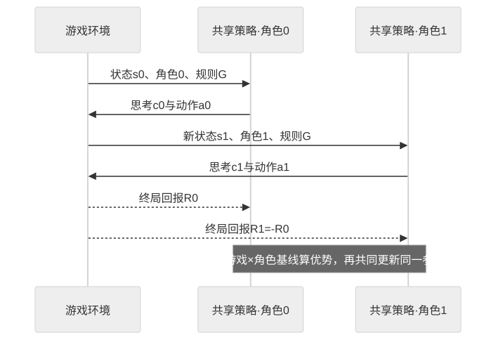

> - **公开入口：** [论文页](https://arxiv.org/abs/2506.24119) · [PDF](https://arxiv.org/pdf/2506.24119) · [正式页面](https://openreview.net/forum?id=7Yayy5fNLg) · [TeX 源码入口](https://arxiv.org/e-print/2506.24119)
> - **归档：** 2026 · ICLR 2026 · 严格策略 RL · 系列第 46/51 篇
> - **模块：** G. 搜索、工具、多轮与自演化
> - 正文中的本地文件名、SHA-256 与版本记录用于说明核验过程；博客不镜像原论文 PDF 或 TeX。

> **时间边界：** 2026 年条目只代表截至 2026-08-29 的暂定重点，不是全年定论。

> **一句话地图：** 同一个策略在语言化的双人零和游戏中同时扮演双方，经历多轮思考—行动—观察，只在终局得到一正一负的稀疏奖励；对每个“游戏×角色”维护独立回报基线后做在线策略梯度。对手随策略共同变强，便形成无需人工标难度的自博弈课程。

## 0. 阅读导航

- 前置概念：零和博弈、多智能体轨迹、终局回报、REINFORCE、方差降低、自博弈和课程学习。
- 读完应能解释：为什么这是真正的多轮多代理 RL；一套参数怎样同时扮演玩家 0/1；为何奖励和为零不等于两个角色训练难度相同；固定强对手与自博弈有什么机制差别。
- 分类：**严格在线、多智能体、多轮策略 RL**。它不是对专家对局做 SFT，也不是对固定偏好对做 DPO。
- 年份口径：arXiv 首次公开于 2025，本地 PDF 标有 ICLR 2026 conference paper，故按正式会议年归档。
- 重要性口径：本文第 9 节的影响均是**截至 2026-08-29 的暂定判断**；2026 年尚未结束，不能据此下年度历史定论。

## 1. 它遇到了什么具体问题？

数学 RLVR 依赖答案验证器和领域题库。论文问了一个更激进的问题：能否只让模型玩规则明确的语言游戏，不给数学题、不设计复杂过程奖励，也练出可迁移的推理习惯？

三类旧故障阻挡了这条路。第一，固定对手会被模型摸透；回报继续上升可能只是找到对手漏洞，而非推理继续进步。第二，多轮零和轨迹只有终局输赢，一局中几十次语言动作共享同一回报，方差很大。第三，同一策略扮演双方时，先后手、游戏和角色难度不同；若所有回报共用一个基线，角色结构会伪装成优势信号，梯度容易震荡甚至“thinking collapse”——模型不再生成完整思考。

*图 1｜根据相邻正文中的问题、机制或算法流程重绘。*

论文的机制解释是：零和规则把复杂奖励压成可信终局输赢；自博弈让数据分布随能力移动；角色条件优势估计 RAE 去掉“这个游戏/角色本来就容易赢”的系统偏移。可证伪预测是：固定训练步与采样预算后，自博弈应保持对近期自身接近 50% 的胜率，同时在外部推理基准持续提升；如果只提高游戏胜率而推理不变，迁移机制就不成立。

## 2. 前人怎样解决，为什么仍然不够？

| 旧方法 | 解决了什么 | 机制缺口 |
|---|---|---|
| 专家游戏轨迹 SFT | 模仿合法动作和强策略 | 离线数据固定，不能针对当前模型弱点自适应 |
| 单轮 RLVR | 可验证结果奖励稳定 | 没有多轮对手互动，训练题仍需领域标注 |
| 固定随机/强模型对手 | 让胜负可采样 | 随机奖励无结构；强对手一旦被利用就形成平台 |
| 普通 REINFORCE | 可直接从终局回报更新所有动作 | 多游戏、多角色回报分布混合，方差和偏差结构大 |
| 独立双策略自博弈 | 双方可以分别学习 | 要维护两套大模型，参数和系统成本翻倍 |

SPIRAL 的最小机制是：一个共享策略显式接收角色标识，自己与自己在线对局；只增加按游戏与角色分组的指数移动平均基线。论文还用 25,000 条 Qwen3-32B 专家游戏轨迹做 SFT 对照，避免把“游戏数据本身有用”误当作自博弈特有效果。

## 3. 核心想法：先说人话

把模型想成一个棋手俱乐部，今天的模型既坐左边也坐右边。每个回合，它读到完整局面、自己是玩家几、游戏规则，然后输出带思考与动作标签的文本。环境解析动作、更新局面，再轮到另一角色。终局玩家 0 得 $+1$，玩家 1 就得 $-1$；平局均为 0。

只有输赢还不够。假设某游戏先手天然赢 70%，先手得到 $+1$ 不能全部算“超常发挥”。RAE 给每个游戏和角色设一条长期平均线：先手只奖励超过先手自己的期望，后手只与后手历史比较。这与考试按不同科目分别标准化相似；但它没有解决逐步信用分配，整局中同一角色的所有 token 仍共享一个终局优势。

*图 2｜根据相邻正文中的问题、机制或算法流程重绘。*

自博弈课程不是提前排好的“初级—高级题”。当策略变强时，对面的同策略也变强，昨日有效的套路会被今日对手反制。若对近期自身始终约五五开，而对固定外部模型的胜率上升，就说明课程在移动。

## 4. 算法与信息流

1. 从游戏集合 $\mathcal G$ 采样 TicTacToe、Kuhn Poker 或 Simple Negotiation。
2. 初始化文本状态；同一策略 $\pi_\theta$ 根据角色 $p\in\{0,1\}$、规则与历史生成思考 $c_t$ 和动作 $a_t$。
3. 环境检查动作并返回新观察，双方交替直至终局。
4. 由规则给角色 0 回报 $R_0=\rho_G(s_T)$，角色 1 得 $R_1=-R_0$。
5. 读取该游戏与角色的 EMA 基线 $b_{G,p}$，计算 $A_{G,p}=R_p-b_{G,p}$。
6. 把角色 $p$ 的每次模型生成动作乘同一个 $A_{G,p}$，做 on-policy REINFORCE 更新。
7. 更新基线和策略，下一批双方都由新策略生成，课程随之变化。

主实验训练 400 步、每步 128 个样本、8 张 H100，Adam 学习率 $10^{-6}$、温度 1.0；训练游戏为三种，评估覆盖八个推理基准和七个分布外游戏（正文实验设置，PDF 第 6 页）。

## 5. 公式逐步推导

### 5.1 符号表

| 符号 | 大白话含义 | 数学对象 | 来源 |
|---|---|---|---|
| $G,p$ | 游戏与角色编号 | 离散变量 | 环境采样/角色轮次 |
| $s_t,y_t^{(p)}$ | 第 $t$ 轮状态与角色输出 | 文本序列 | 多轮轨迹 |
| $\tau$ | 一整局双方交互 | 轨迹 | 两个角色共同生成 |
| $R_p(\tau)$ | 角色 $p$ 的终局输赢 | 标量 | 游戏规则 |
| $b_{G,p},A_{G,p}$ | 游戏角色基线与优势 | 标量 | EMA 与回报 |
| $\alpha$ | EMA 保留旧基线的比例 | $[0,1]$ | 超参数 |

### 5.2 零和语言游戏

对任何终局和双方动作，奖励满足

$$
r_0(s,a^{(0)},a^{(1)})+r_1(s,a^{(0)},a^{(1)})=0.
$$

论文只在终局给分：

$$
R_0(\tau)=\rho_G(s_T),\qquad R_1(\tau)=-\rho_G(s_T).
$$

共享策略仍显式条件于角色：

$$
y_t^{(p)}\sim\pi_\theta(\cdot\mid s_t,p,G).
$$

若不给角色标识，同一句“我应下注”在玩家 0 和玩家 1 的信息集里会混成一个条件分布，策略无法知道自己在优化哪一方。

### 5.3 从双策略目标到共享策略梯度

若双方参数独立，玩家 $p$ 最大化

$$
J_p(\theta_p)=
\mathbb E_{G,\tau\sim\pi_{\theta_0}\times\pi_{\theta_1}}[R_p(\tau)].
$$

SPIRAL 令 $\theta_0=\theta_1=\theta$。用对数导数技巧，一局的共享梯度是

$$
\nabla_\theta J=
\mathbb E\left[
\sum_{t\in T_0}R_0\nabla_\theta\log\pi_\theta(y_t^{(0)}|s_t,0,G)
+
\sum_{t\in T_1}R_1\nabla_\theta\log\pi_\theta(y_t^{(1)}|s_t,1,G)
\right].
$$

两项奖励符号相反不等于梯度抵消，因为角色条件、状态与实际输出都不同：赢方动作被提高，输方动作被降低。

### 5.4 RAE 为什么降低方差

按游戏与角色更新

$$
b_{G,p}\leftarrow\alpha b_{G,p}+(1-\alpha)R_p(\tau),
\qquad
A_{G,p}=R_p(\tau)-b_{G,p}.
$$

最终梯度为

$$
\nabla_\theta J_{\rm SPIRAL}=
\mathbb E\left[
\sum_{p\in\{0,1\}}\sum_{t\in T_p}
A_{G,p}\nabla_\theta\log\pi_\theta(y_t^{(p)}|s_t,p,G)
\right].
$$

只依赖游戏/角色而不依赖当前动作的基线，在理想采样下不改变期望梯度，却去掉角色长期胜率造成的常量偏移。

### 5.5 数值玩具例：同一场胜负怎样产生两种优势

设 Kuhn Poker 当前基线为 $b_{G,0}=0.4$、$b_{G,1}=-0.1$。本局玩家 0 获胜，$R_0=1,R_1=-1$，则

$$
A_{G,0}=1-0.4=0.6,\qquad
A_{G,1}=-1-(-0.1)=-0.9.
$$

玩家 0 的每次生成 log 概率得到 $+0.6$ 权重，玩家 1 得 $-0.9$。后者惩罚更大，因为它比该角色平常表现差得更多。若 $\alpha=0.95$，更新后

$$
b'_{G,0}=0.95(0.4)+0.05(1)=0.43,\quad
b'_{G,1}=0.95(-0.1)+0.05(-1)=-0.145.
$$

若错误地共用全局零基线，两角色权重仅为 $+1/-1$，会忽略角色 0 本来容易、角色 1 本来较难的事实。反过来，RAE 也不告诉我们第几步导致输赢；错误早期动作和无关措辞仍一起受罚。

## 6. 实验到底检验了什么？

| 研究问题 | 对照/控制 | 指标与样本 | 原文结果与定位 | 能说明什么 | 证据边界 |
|---|---|---|---|---|---|
| 游戏自博弈能否迁移到推理？ | 同一基座比较 Base、25K 专家游戏 SFT、SPIRAL | 8 个推理基准平均 | Qwen3-4B：34.0→SFT 39.7→SPIRAL 44.5；Qwen3-8B：39.5→46.1→49.6；表 1，PDF 第 6 页 | 在线自博弈超过仅模仿游戏专家轨迹 | 训练数据与优化方式同时变，不能量化“自博弈”单独占多少 |
| 增益是否跨架构？ | 四类基座/五组模型 | 同一 8 基准 | Octothinker 25.8→33.8，Llama-3.1-8B 23.9→25.9，DeepSeek-Distill-Qwen-7B 60.4→61.8；表 1 | 多个基座均有正平均增益 | 强模型增益较小；只测选定规模和任务 |
| 改善伴随哪些推理模式？ | 训练早中晚轨迹分类 | 290 游戏轨迹、46,792 数学解答 | 游戏期望值模式晚期 78%；迁移到数学 28%；数学平均 31.2→39.6；图 4，PDF 第 7 页 | 模式频率与表现同步变化 | GPT-4.1-as-judge 分类是相关性，不证明模式造成分数提升 |
| 自博弈是否优于固定对手？ | Random、Mistral、Gemini 与 self-play，同为 400 步 | 游戏/数学/通用曲线 | Gemini 对手胜率 0→62.5%，self-play 对近期自身保持 50.9%–52.3%；表 3、图 5，PDF 第 8–9 页 | 固定对手被利用后平台，自博弈维持移动难度 | 近期自身胜率约 50% 是对称性预期，不单独证明课程质量 |
| 游戏技能是否有专门迁移？ | 单游戏 specialists 与多游戏模型 | 7 个 OOD 游戏 | TicTacToe→Snake 56.0%，Poker→Pig Dice 91.7%，Negotiation→Truth/Deception 55.8%；多游戏平均 59.5%；表 4–5，PDF 第 8–9 页 | 相近认知结构存在选择性迁移 | 游戏由作者按技能标签选择，样本有限 |
| RAE 是否必要？ | RAE REINFORCE 对 vanilla REINFORCE | 推理分、长度、梯度范数 | 无 RAE 数学约 35%→12%，一般推理 44%→40%，200 步后思考坍缩；图 6/9，PDF 第 9、20 页 | 分角色基线与稳定训练强相关 | 未与其他强方差降低器做全面比较 |

附录的三随机种子复现实验给 Qwen3-4B SPIRAL 平均 44.5±0.5，而 SFT-Multi 为 39.6±0.4（表 10，PDF 第 22 页），减轻了单次随机性的担忧；但游戏集合仍只有三种训练环境。

## 7. 结果如何理解？

表 1 最关键的不是 44.5 本身，而是同一游戏信息的 SFT 只到 39.7、在线 SPIRAL 到 44.5。这支持“和不断变化的对手互动”比“模仿专家答案”多提供了东西。固定 Gemini 对手的胜率最终 62.5%，却不等于推理持续成长；模型可能只在榨取一个静态策略。

图 4 的案例分析适合生成假设，不宜作因果结论。期望值、模式识别和分类讨论都在游戏与数学中增加，但由 GPT-4.1 自动标注，而且多个训练变化同时发生。更严格实验应在生成时消融某类思考，或控制答案正确性比较有无模式轨迹。

RAE 的崩溃对照最接近机制证据：去掉唯一关键的游戏×角色基线后，长度、梯度和外部推理同时恶化。不过结论应是“该设置下 RAE 必要”，不是“所有多代理 RL 只能用 RAE”。

## 8. 优点、代价与失效条件

### 优点

- 胜负由游戏规则给出，不需人工过程奖励或数学训练数据。
- 一个共享模型扮演双方，避免维护两个完整 LLM。
- 自博弈自然改变任务难度，减少固定对手被利用。
- RAE 是很小、可解释的干预，并有直接崩溃消融。

### 代价与已观察失败

- 400 步×128 多轮轨迹需要 8 张 H100；语言游戏 rollout 远贵于单轮答案。
- vanilla REINFORCE 出现思考长度与数学分数坍缩。
- 零和奖励只表达输赢，不奖励合作、沟通质量或社会福利。
- 同一终局回报分给所有本角色动作，信用分配仍粗糙。
- 共享参数会让两个角色梯度互相干扰，RAE 只处理均值/方差的一部分。

### 失效条件

1. 游戏存在解析器漏洞，策略学会非法文本攻击而非推理；
2. 对局高度对称且大量平局，终局奖励几乎无方差；
3. 自博弈进入循环策略或共同遗忘，当前对手不代表历史策略；
4. 训练游戏与目标推理没有共享结构，迁移消失；
5. 非零和、合作或多人任务不满足一正一负的奖励假设；
6. EMA 更新太慢跟不上策略，或太快导致基线噪声。

可证伪预测：加入历史对手池后，若循环/遗忘是限制，跨 checkpoint 的 Nash-style exploitability 应下降且 OOD 推理更稳；若没有改善，就不能把剩余波动归因于只对当前自己训练。另一个预测是打乱角色标签会破坏 RAE 并重现思考坍缩；若不受影响，角色条件基线的机制解释需要重审。

## 9. 截至 2026-08-29 的暂定影响

截至 2026-08-29，SPIRAL 的暂定重要性在于把 LLM 自博弈从单轮回答推进到真正的语言化多轮、双方在线共进化，并显示非数学游戏可能迁移出数学推理收益。它为“用环境规则自动造课程”提供了具体范例。

但 2026 年尚未结束，引用、复现和后续系统尚不足以下历史定论。三种训练游戏、有限模型规模与 LLM-as-judge 模式分析都限制外推；未来是否成为通用代理训练路线，取决于合作博弈、工具环境、历史对手池和更严格因果消融。

## 10. 三个自检问题

1. 为什么固定 Gemini 对手胜率升到 62.5% 不自动等于推理能力持续提高？
2. 同一策略扮演双方时，零和回报为何不会让两个梯度简单抵消？
3. RAE 解决了哪一种方差结构，又没有解决哪一种逐步信用分配问题？

## 11. 复现检查单与证据边界

- [ ] 固定游戏规则、动作解析器、角色提示、平局/非法动作奖励和最大轮数。
- [ ] 报告每个游戏×角色的回报、基线、优势方差与梯度范数，而不只报总胜率。
- [ ] 用固定对手、专家 SFT、当前自博弈和历史对手池做等 rollout 预算对照。
- [ ] 记录跨 checkpoint 对战矩阵，防止“对当前自己五五开”掩盖循环与遗忘。
- [ ] 对 LLM-as-judge 的推理模式做人工复核或干预实验。

**本地证据记录**

- 本地 PDF SHA-256：papers/2026/spiral/paper.pdf，800adadf52c98736517c362e18cb1786d48538c2f53c6ec2391fd3763e01e610。
- 使用的 TeX/Markdown/PDF 文本：papers/2026/spiral/reading/paper.txt 为最终会议 PDF 文本；reading/packet.md 用于章节索引；reading/source-expanded.tex 与 source/technical_report.tex 用于公式交叉核验。
- 版本差异：arXiv 编号属于 2025 首发，本地 PDF 明确标注 ICLR 2026 conference paper；本讲义采用会议 PDF 的表格与三种子附录，不把首发年份当正式发表年。
- 证据限制：没有独立复算训练；推理模式由 GPT-4.1 判断；自博弈、RAE、在线数据与多轮交互是组合干预，除 RAE 消融外不能完全拆分。

---

本文属于[《强化学习论文精读：2016–2026》](/series/reinforcement-learning-paper-reading/)。
实验数字以文首链接的最终 PDF 为准；图为教学重绘，不是论文原图。
