> - **公开入口：** [论文页](https://arxiv.org/abs/2602.04879) · [PDF](https://arxiv.org/pdf/2602.04879) · [TeX 源码入口](https://arxiv.org/e-print/2602.04879)
> - **归档：** 2026 · ICML 2026, PMLR 306 · 严格策略 RL · 系列第 47/51 篇
> - **模块：** F. 可验证奖励与推理 RL
> - 正文中的本地文件名、SHA-256 与版本记录用于说明核验过程；博客不镜像原论文 PDF 或 TeX。

> **时间边界：** 2026 年条目只代表截至 2026-08-29 的暂定重点，不是全年定论。

> **一句话地图：** PPO/GRPO 用被采样 token 的新旧概率比决定是否裁剪，但在长尾大词表中，稀有 token 的微小绝对变化会产生巨大比率，常见 token 的巨大概率质量移动却可能躲过裁剪。DPPO 保留策略梯度和方向性遮罩，改用相对 rollout 策略的 TV/KL 分布距离判断是否越界。

## 0. 阅读导航

- 前置概念：behavior/rollout policy、training policy、重要性比率、PPO clipping、总变差距离、KL、训练—推理分布不匹配。
- 读完应能说明：PPO 的 token ratio 为什么只是 trust region 的单样本代理；DPPO 的 D 代表什么；为什么锚点必须是实际生成 rollout 的分布；binary/Top-K 近似牺牲了什么。
- 分类：**严格在线策略 RL 的 trust-region 方法**。论文采用组相对优势等 critic-free 估计，但 DPPO 不是“普通 PPO 改名”，关键改动是越界判据从采样 token ratio 换成分布 divergence。
- 年份/版本：本地 PDF 为 ICML 2026、PMLR 306 定稿；本地 TeX 是 Hugging Face 文本镜像，图像与元数据可能不完整，所有数字以 PDF 为准。
- 重要性：第 9 节仅作**截至 2026-08-29 的暂定判断**；年度未结束，不写成长期定论。

## 1. 它遇到了什么具体问题？

PPO 的经典直觉是“更新不要离采样策略太远”。实践却常用单个被采样动作的概率比

$$
r_t=\frac{\pi(y_t|s_t)}{\mu(y_t|s_t)}
$$

是否超出 $[1-\epsilon,1+\epsilon]$ 来代替整套动作分布的距离。在动作数很少时，这个代理尚可；LLM 词表有数万 token 且长尾严重，同一个比率可能对应完全不同的概率质量移动。

论文观察到两类相反失败：

1. **过度约束稀有 token。** $10^{-4}\to10^{-2}$ 的比率为 100，看似剧烈，实际只移动 0.0099 概率质量。探索性推理词容易被裁掉，学习变慢。
2. **约束不足高概率 token。** $0.99\to0.80$ 的比率约 0.808，可能仍在 $\epsilon=0.2$ 边界内，却移动了 0.19 的概率质量，足以让策略分布大变并引发崩溃。

*图 1｜根据相邻正文中的问题、机制或算法流程重绘。*

训练—推理 mismatch 让问题更严重：即使参数相同，推理引擎生成数据的分布 $\mu_{\theta'}$ 与训练引擎重算的分布 $\pi_{\theta'}$ 也可能不同。若 trust region 锚在重算分布，约束的是错误对象。论文的可证伪预测是：稳定性取决于相对**真实 rollout 分布**的 divergence；换成重算锚点应使 mismatch 增长并崩溃，而直接控制 rollout divergence 应稳定。

## 2. 前人怎样解决，为什么仍然不够？

| 方法 | 处理方式 | 仍有问题 |
|---|---|---|
| TRPO | 显式约束完整策略的 KL/TV | 二阶优化和全词表距离对 LLM 昂贵 |
| PPO/GRPO | 裁剪采样 token ratio | ratio 受原概率尺度支配，不等于分布距离 |
| Clip-Higher | 放宽正优势的上裁剪界 | 缓解稀有探索词被裁，仍是人工 ratio 阈值 |
| CISPO/PG-TIS | 截断 importance ratio，但继续某些梯度 | 可忽略真正大的分布漂移，实验中会崩溃 |
| MiniRL | 用训练引擎重算旧策略概率作锚 | 没约束实际生成数据的 rollout 分布 |
| 精确全词表 KL/TV | 机制上正确 | 保存/计算两个完整词表分布，显存和带宽不可承受 |

DPPO 的最小干预是保留 PPO 式“只阻止继续向外走”的非对称结构：正优势且 $r_t>1$，或负优势且 $r_t<1$ 时，若分布距离 $D>\delta$ 才把该 token 梯度遮掉。判断越界看 divergence，判断更新方向仍看 ratio。

## 3. 核心想法：先说人话

假设一个城市有十万人。某小店顾客从 1 人涨到 100 人，增长 100 倍，但只多 99 人；最大商场客流从 99,000 降到 80,000，看起来只变成 0.808 倍，却移动了 19,000 人。PPO ratio 只看“倍数”，DPPO 更关心“整座城市的人搬了多少”。

DPPO 还问：相对哪一天的城市地图？必须相对真正产生这批数据的推理引擎分布 $\mu$，不是训练引擎用同参数重算出的 $\pi_{\theta'}$。二者在 MoE 路由、数值精度或并行实现下可能不同。

*图 2｜根据相邻正文中的问题、机制或算法流程重绘。*

binary 近似只分“本次采样 token”和“其他所有 token”；Top-K 显式保留行为策略概率最高的 $K$ 个 token，再把剩余合成 other。二者都是对真 divergence 的下界：算得小不保证真距离小，但比单点 ratio 更贴近绝对概率质量。

## 4. 算法与信息流

1. rollout policy $\mu_{\theta'}$ 对每个提示生成多条回答，规则或奖励模型给序列回报。
2. 以组内平均回报估计 token 共享优势 $\hat A_t$。
3. 训练策略 $\pi_\theta$ 计算采样 token importance ratio $r_t$。
4. 同时计算相对 $\mu_{\theta'}$ 的 binary-TV、binary-KL 或 Top-K divergence $D_t$。
5. 若正优势更新正在增加该 token 概率，或负优势更新正在减少它，并且 $D_t>\delta$，遮掉该 token 梯度；向 ratio 1 回归的更新永不阻挡。
6. 对剩余 token 做 importance-weighted 策略梯度，更新 $\theta$，继续在线采样。

论文把 GRPO 定义为使用 ratio clipping 的 PPO 变体，不以优势是否来自 critic 区分 PPO。DPPO 同样可配组相对优势；“D”指 Divergence，不是 distributed/decentralized。

## 5. 公式逐步推导

### 5.1 符号表

| 符号 | 普通含义 | 数学对象 | 来源 |
|---|---|---|---|
| $\mu,\pi$ | rollout/行为策略与待更新训练策略 | 词表上的条件分布 | 推理与训练引擎 |
| $y_t,s_t$ | 被采样 token 与当前前缀状态 | 离散动作、文本状态 | rollout |
| $r_t$ | 新旧策略在采样 token 上的概率比 | 正实数 | $\pi/\mu$ |
| $\hat A_t$ | 该 token 所属回答的优势 | 实数 | 组相对回报 |
| $D_t,\delta$ | 分布距离及允许阈值 | 非负实数 | TV/KL 与超参数 |
| $M_t$ | 是否保留该 token 梯度 | $\{0,1\}$ | DPPO mask |

### 5.2 为什么 trust region 出现在性能下界中

对有限长度 LLM 回答，论文先把真实改进写成

$$
\mathcal J(\pi)-\mathcal J(\mu)
=L'_\mu(\pi)-\Delta(\mu,\pi),
$$

其中一阶代理

$$
L'_\mu(\pi)=
\mathbb E_{y\sim\mu}\left[
R(y)\sum_{t=1}^{|y|}
\left(\frac{\pi(y_t|s_t)}{\mu(y_t|s_t)}-1\right)
\right].
$$

$\Delta$ 包含后续 token 比率的高阶连乘。若 $\pi$ 离 $\mu$ 很近，高阶误差小，一阶代理才可信。论文给出平均 token TV 形式的下界：

$$
\mathcal J(\pi)-\mathcal J(\mu)
\ge L'_\mu(\pi)-4\xi\,\bar D_{\rm TV}(\mu,\pi),
$$

$\xi=\max_y|R(y)|$。这说明 trust region 不是装饰：不控制策略距离，最大化代理可能不改善真实回报。

### 5.3 PPO ratio 只是 TV 的一个随机样本

总变差为

$$
D_{\rm TV}(\mu\|\pi)
=\frac12\sum_a|\mu(a|s)-\pi(a|s)|
=\frac12\mathbb E_{a\sim\mu}\left|
\frac{\pi(a|s)}{\mu(a|s)}-1
\right|.
$$

PPO 看到的只有一次采样 $a=y_t$ 的 $|r_t-1|$，是上述期望的单样本估计。大词表中它方差很大，并且数值被分母 $\mu(y_t|s_t)$ 放大。

### 5.4 DPPO mask

DPPO 目标写成

$$
L_\mu^{\rm DPPO}(\pi)
=\mathbb E_{y\sim\mu}
\left[\sum_t M_t^{\rm DPPO}\,r_t\,\hat A_t\right],
$$

其中

$$
M_t=
\begin{cases}
0,&\hat A_t>0,\ r_t>1,\ D_t>\delta,\\
0,&\hat A_t<0,\ r_t<1,\ D_t>\delta,\\
1,&\text{其他情况}.
\end{cases}
$$

第一行阻止已经过度增加的好样本 token 继续外移；第二行阻止已经过度降低的坏样本 token 继续外移。若正优势 token 当前 $r_t<1$，提高它是在回到 rollout 策略，哪怕 $D_t$ 大也不遮。

### 5.5 可计算的 divergence 近似

binary-TV 只看采样 token：

$$
D_{\rm TV}^{\rm Bin}(t)=
|\mu(y_t|s_t)-\pi(y_t|s_t)|.
$$

binary-KL 把其余词合成一类：

$$
D_{\rm KL}^{\rm Bin}
=\mu_t\log\frac{\mu_t}{\pi_t}
+(1-\mu_t)\log\frac{1-\mu_t}{1-\pi_t}.
$$

Top-K 则对 $K$ 个头部 token、采样 token 与 other 类计算普通 TV/KL。粗粒化会降低 divergence，因此它们是下界；Top-K 更准确但需额外概率。

### 5.6 数值玩具例：倍数与质量移动方向相反

论文的两个动作例子为

$$
\mu(a_{\rm low})=10^{-4},\quad\pi(a_{\rm low})=10^{-2},
$$
$$
\mu(a_{\rm high})=0.99,\quad\pi(a_{\rm high})=0.80.
$$

稀有 token 比率为 $100$，PPO 在 $\epsilon=0.2$ 时强烈裁剪；binary-TV 却只有

$$
|0.0001-0.01|=0.0099.
$$

高概率 token 比率为 $0.80/0.99\approx0.808$，几乎还在 $[0.8,1.2]$ 内；binary-TV 是

$$
|0.99-0.80|=0.19,
$$

约为前者 19.2 倍。若 $\hat A=-1,\delta=0.05$，高概率 token 的 $r<1,D>\delta$，DPPO 遮掉继续降低它的更新；稀有正优势 token 的 $r>1$ 但 $D<\delta$，仍可学习。这个例子直接展示两种方法判决相反。

## 6. 实验到底检验了什么？

| 研究问题 | 对照与控制 | 指标/样本 | 原文结果与定位 | 支持什么 | 不能说明什么 |
|---|---|---|---|---|---|
| 极低学习率还需 trust region 吗？ | PG-IS/CISPO、MiniRL、GRPO-ClipHigher 与 DPPO-TV/KL | 1,460 个初始模型可解 MATH 题，奖励与 mismatch | 无/错配 trust region 方法 mismatch 增长并崩溃；DPPO 近满训练奖励；图 3，PDF 第 6 页 | 小步更新也会累积训练—推理差异 | 特定 1.5B 模型与可解训练集，非所有系统 |
| 锚点应是 rollout 还是重算策略？ | DPPO-KL-Rollout 对 DPPO-KL-Recompute | 奖励、参数同值时的分布差 | 换成重算锚点后 mismatch 增长并崩溃；图 4，PDF 第 7 页 | trust region 必须约束真实数据生成分布 | mismatch 来源依硬件/引擎，幅度可能不同 |
| 哪类更新造成崩溃？ | 从无 mask 的 PG-IS 加最小负样本 mask | bad updates、奖励 | 只挡负优势且概率绝对下降超过 0.5 可稳定；阈值 0.8 或错误锚点失败；图 5，PDF 第 7 页 | 大 divergence 的负样本外移是主要故障 | 是该 sanity setting 的机制定位 |
| 放松低概率 token 是否提效？ | 不同概率区间与遮罩方向 | 奖励、被裁 token 概率/熵 | 放松低概率 token 加快学习；向错误方向放松会熵塌缩；图 6–7，PDF 第 8 页 | 不是“裁得越少越好”，方向性必要 | 曲线为主，精确速度倍数未报告 |
| 是否扩展到大模型和多配置？ | GRPO-ClipHigher、CISPO、binary TV/KL；MoE/Dense/LoRA、R3 有无 | AIME24/25 Avg@32、训练奖励 | DPPO 在五种设置更快、更稳；无 R3 也常胜过带 R3 baseline；图 8–9、13–17，PDF 第 9、24–28 页 | 机制跨模型/并行配置复现 | 多数结果是曲线，缺少统一终点数表与多随机种子 |
| 能否用于非规则 RLHF？ | GRPO 与 DPPO-Binary-TV，同 RM/数据 | learned reward、AlpacaEval 2.0 | step150 reward 51.32 vs 36.70；LC-WR 80.90 vs 77.05，raw 79.93 vs 72.20；表 2，PDF 第 24 页 | 不只适用于数学规则奖励 | 后期 reward 升而 AlpacaEval 降，存在 reward hacking |
| binary 是否足够？ | binary 与 Top-K $K=20$ TV/KL | AIME24/25 曲线 | binary 捕捉大部分收益，Top-K结果相近；图 11，PDF 第 10 页 | 廉价粗粒化在这些设置可用 | 下界可能漏掉未采样尾部的大规模重排 |

表 2 还报告初始/GRPO/DPPO 平均长度为 3147/1756/2003。作者选择 step 150 评 AlpacaEval，因为 step 450 learned reward 虽为 70.27 对 45.24，外部评分反而下降；这是一条重要负结果。

## 7. 结果如何理解？

最强机制证据来自“换锚点即崩”的图 4，而不是方法名字。若只要任何 KL 都行，相对重算策略的 DPPO-KL 也应稳定；事实相反，说明约束必须围住真正生成数据的 $\mu$。

图 5 把故障进一步收窄到负优势、大 divergence、继续远离 rollout 的更新。DPPO 不是无条件把所有 $D>\delta$ token 冻结；它保留回归方向，因此既有 trust region 又不妨碍纠偏。

AlpacaEval 结果说明 learned reward 的提升能部分外推，但也暴露 reward hacking：后期 RM 分更高，外部指标更差。DPPO 改善的是优化稳定性，不会自动修复奖励函数错位。

## 8. 优点、代价与失效条件

### 优点

- 从概率质量而非概率倍数解释 PPO/GRPO 的长尾词表故障。
- 提出明确可检验预测，并用无约束、错锚点、最小 mask 逐步定位。
- binary 近似几乎无额外词表存储，便于大模型部署。
- 同时覆盖 RLVR、RLHF、MoE、Dense、LoRA 与路由重放。

### 代价与限制

- binary/Top-K 只是下界，可能低估多个未采样 token 同时移动。
- 仍需选择 $\delta$，TV 与 KL 阈值不可直接互换。
- DPPO 依赖 rollout 概率可信保存；若推理引擎概率本身错误，锚点仍不可靠。
- 大模型证据多为单条训练曲线，随机种子和统计区间不足。
- trust region 只约束优化，不保证奖励正确，后期仍观察到 reward hacking。

### 失效条件

1. rollout 引擎不返回可比 token 概率；
2. tokenizer/词表或路由在推理与训练端不一致；
3. 分布变化集中在 binary/Top-K 未显式表示的尾部；
4. $\delta$ 太小导致学习停滞，太大失去稳定保护；
5. 奖励模型有漏洞，稳定优化反而更快利用漏洞；
6. 数据极离策略，单步 importance weighting 本身方差过大。

可证伪预测：在保持总体 TV 相同的人工分布扰动中，只改变 sampled-token ratio，PPO 的 mask 率应剧烈变化而 DPPO 基本不变；若 DPPO 同样随 ratio 变化，说明实现没有真正解耦。另一预测是提高 Top-K 后，若尾部重排是主要风险，真 KL 与近似差距及崩溃率应下降；若无变化，binary 已捕捉主要质量。

## 9. 截至 2026-08-29 的暂定影响

截至 2026-08-29，DPPO 的暂定价值是把“调大 PPO clip 能让推理 RL 更快”的经验现象提升为可检验的分布距离机制，并把训练—推理 mismatch 纳入 trust-region 锚点定义。它可能影响后续 RL 框架保存 rollout logits、设计 mask 和诊断 bad updates 的方式。

但 2026 年尚未结束，独立复现、长期引用和更大生产系统结果仍有限。不能据一篇论文断言 DPPO 已取代 PPO/GRPO；特别是其大规模图表缺少充分多种子统计，binary 下界在更长尾、更强 MoE 中是否安全仍待验证。

## 10. 三个自检问题

1. 为什么 $10^{-4}\to10^{-2}$ 的 ratio 比 $0.99\to0.80$ 大得多，TV 却小得多？
2. DPPO 为什么还需要 ratio 判断方向，却不用 ratio 判断越界？
3. learned reward 后期继续上升而 AlpacaEval 下降，说明 DPPO 没有解决哪类问题？

## 11. 复现检查单与证据边界

- [ ] 分别保存 rollout 引擎 $\mu$、训练引擎同参数重算分布与当前 $\pi$，不可混名。
- [ ] 报告 ratio、binary/Top-K/可抽样真 divergence、mask 率与 bad update 方向。
- [ ] 固定 rollout token、batch、优势估计、学习率后比较 PPO、CISPO 与 DPPO。
- [ ] 至少三随机种子报告崩溃概率，不只挑稳定曲线。
- [ ] RLHF 同时报告 RM reward、外部 judge、人评与长度，监控 reward hacking。

**本地证据记录**

- 本地 PDF SHA-256：papers/2026/dppo-trust-region/paper.pdf，e27a6333f8e3b7790145d25e1be19bf7e6164c9c4ae1651ccc2640bf8302eb3c。
- 使用的 TeX/Markdown/PDF 文本：papers/2026/dppo-trust-region/reading/paper.txt 为 ICML/PMLR 最终 PDF 文本；reading/packet.md 为索引；reading/source-expanded.tex 与 source/paper/*.tex 用于定理和公式核验。
- 版本差异：本地 PDF 标明 ICML 2026/PMLR 306；TeX 来自 Hugging Face 文本镜像，可能缺二进制图和精确 arXiv archive 元数据，故所有数字、图表定位均服从 PDF。
- 证据限制：未独立重跑训练；多数 scaling 结果为曲线而非带方差终点表；AlpacaEval 的“新 SOTA”是论文发布时口径，本讲义只保留具体数值，不把动态排行榜地位写成永久事实。

---

本文属于[《强化学习论文精读：2016–2026》](/series/reinforcement-learning-paper-reading/)。
实验数字以文首链接的最终 PDF 为准；图为教学重绘，不是论文原图。
