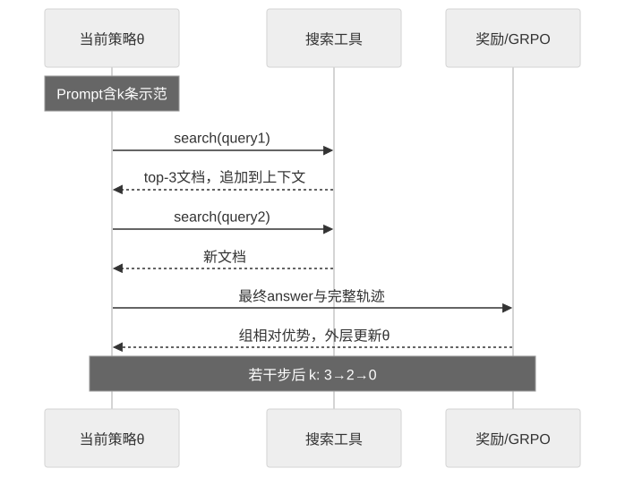

> - **公开入口：** [论文页](https://arxiv.org/abs/2603.08068) · [PDF](https://arxiv.org/pdf/2603.08068) · [TeX 源码入口](https://arxiv.org/e-print/2603.08068)
> - **归档：** 2026 · arXiv preprint · 严格策略 RL · 系列第 48/51 篇
> - **模块：** G. 搜索、工具、多轮与自演化
> - 正文中的本地文件名、SHA-256 与版本记录用于说明核验过程；博客不镜像原论文 PDF 或 TeX。

> **时间边界：** 2026 年条目只代表截至 2026-08-29 的暂定重点，不是全年定论。

> **一句话地图：** 训练开始把三条工具使用示范放进 rollout prompt，让指令模型在上下文中模仿搜索格式；外层仍用 GRPO 根据最终答案与格式奖励更新参数。课程依次把示范从 3 条减到 2 条再到 0 条，迫使已参数化的工具能力在零示范下独立运行。

## 0. 阅读导航

- 前置概念：工具调用轨迹、上下文学习、外层参数更新、GRPO、终局奖励、loss mask、课程学习。
- 读完应能区分三件事：上下文中的 few-shot 引导；单条轨迹内由搜索结果改变后续动作；跨 rollout 的梯度更新。论文所称 in-context RL 同时使用前两者作探索脚手架，但能力被“内化”依赖第三种参数更新。
- 分类：**严格工具环境策略 RL / 课程式 RLVR**。训练每阶段都有真实 rollout、搜索工具反馈、复合奖励与 GRPO 更新；没有 cold-start SFT。示范本身只是 prompt，不发生梯度模仿。
- 版本：本地材料为 arXiv 预印本，尚无正式会议/期刊版本。数字只按本地 PDF，不把未来修订当成已发生事实。
- 重要性：第 9 节仅为**截至 2026-08-29 的暂定判断**；2026 年仍未结束。

## 1. 它遇到了什么具体问题？

工具使用 RL 有一个冷启动悖论。模型一开始不会输出合法的搜索标签，也不知道“先搜实体、读结果、再搜日期”的多轮节奏；终局答案几乎全错，稀疏奖励没有方向。常见解法先用人工工具轨迹 SFT，再做 RL，但高质量搜索轨迹昂贵，而且 SFT 会把能力限制在教师示范分布。

直接在 prompt 永久放 few-shot 示例也能让模型调用工具，却带来推理 token 开销，并让部署依赖固定脚手架。论文希望把示范只用于训练早期探索：先让模型看会，再在继续 RL 时撤掉，最终零示范也能搜索。

*图 1｜根据相邻正文中的问题、机制或算法流程重绘。*

论文的机制解释是：few-shot 上下文先改变 rollout 分布，让“合法且偶尔正确”的轨迹进入采样；GRPO 把这些成功行为写入参数；逐阶段撤示范制造新的分布压力，防止模型永远依赖上下文。可证伪预测是：若真正发生参数内化，最终零示范策略应显著超过从同一初始模型直接做零示范 RL，并在去掉示范后有效搜索次数逐渐恢复；若只能在示范存在时工作，就只是 prompting 而非内化。

## 2. 前人怎样解决，为什么仍然不够？

| 旧路线 | 做法 | 仍有缺口 |
|---|---|---|
| 冷启动 SFT→RL | 先学工具格式与专家轨迹，再探索 | 需要标注轨迹，错误教师步骤会被模仿 |
| 直接零示范 RL | 只用最终答案奖励 | 初始合法工具轨迹太少，奖励稀疏 |
| 永久 few-shot prompting | 推理时一直附示范 | token 成本高，无法证明参数学会 |
| RAG/IRCoT | 固定检索或手工交替规则 | 工具调用策略不随奖励在线改进 |
| Rejection Sampling | 采样并筛正确工具轨迹再 SFT | 数据筛选/监督学习，不是在线策略 RL |
| Search-R1/ZeroSearch 等 | 用 RL 学搜索 | 常依赖不同冷启动、模拟搜索或训练设计 |

ICRL 的最小干预不是增加一个新网络，而是改变 rollout prompt 的课程：$3\to2\to0$ 条示范。每阶段仍沿用同一参数并做 GRPO。论文还比较 $3\to2\to1\to0$，发现看似更平滑的课程反而让模型过早结束搜索，这是一个有价值的负结果。

## 3. 核心想法：先说人话

老师先在考试卷首页放三道“如何查资料”的完整例题。学生一边参考例题一边作答，答对得分，答错不得分；评分之后学生真的更新知识。下一阶段只留两道例题，最后全部拿走。如果最后仍会查，能力才算写进参数。

这里有两层时间尺度：

- **内层轨迹/上下文适应：** 参数 $\theta$ 固定。模型输出 think/search，搜索引擎返回 top-3 文档并追加进上下文，模型根据新观察决定下一次搜索或答案。它没有在一条轨迹中反向传播。
- **外层 RL 学习：** 同一问题采 8 条轨迹，按最终答案和格式算回报，GRPO 更新 $\theta$。参数变化发生在轨迹之间。
- **课程外层：** 完成若干步后，把 prompt 中示范数 $k$ 从 3 降至 2，再降至 0；新阶段继承上阶段参数。

因此“in-context RL”不是“冻结模型只在上下文里从奖励自学”，也不是经典 meta-RL 的隐藏环境识别。这里 in-context examples 用来引导 RL 探索，真正长期能力仍由梯度参数更新获得。

*图 2｜根据相邻正文中的问题、机制或算法流程重绘。*

## 4. 算法与信息流

1. 用 NQ 问答作为 RL 训练题；准备三条由 GPT-5.2 生成的 web 工具示范，仅放在 prompt。
2. 阶段 $k=3$：对每题把三示范、工具说明与实际问题拼成上下文。
3. 旧策略每题采样 8 条轨迹；动作可以是 think、search 或 answer。
4. Serper/Google 搜索或 BM25 返回 top-3 文档，观察被追加到轨迹；最多 6 次搜索。
5. exact match 给准确性奖励，XML 标签与是否搜索给格式奖励；按 $\alpha=0.8$ 合成。
6. 检索文档不是模型动作，对这些 token 做 loss masking；只更新模型生成的思考、查询和答案 token。
7. 用组均值和标准差构造优势，做带 KL 的 GRPO 更新。
8. 转入 $k=2$，最后 $k=0$，参数连续继承。

训练最大 prompt 5,000 token、响应 2,048 token，每题 8 rollout、温度 1、batch 64、KL 系数 0.001、4 张 A100 80GB（正文 §3.1，PDF 第 5–6 页）。论文文本的学习率跨栏断行为 $1e{-6}$，复现时应以配置核实。

## 5. 公式逐步推导

### 5.1 符号表

| 符号 | 普通含义 | 数学对象 | 来源 |
|---|---|---|---|
| $q,\mathcal T$ | 用户问题与外部工具 | 文本/环境函数 | 数据集与搜索/Python |
| $\mathcal H_t$ | 到第 $t$ 步的动作和工具观察历史 | 上下文序列 | 内层交互 |
| $\mathcal P_k$ | 含 $k$ 条示范的 prompt | token 序列 | 课程阶段 |
| $\tau_i,R_i,A_i$ | 第 $i$ 条轨迹、回报和优势 | 序列/标量 | rollout、奖励、组统计 |
| $\pi_\theta,\pi_{\rm old},\pi_{\rm ref}$ | 当前、采样旧策略、KL 参考策略 | 条件分布 | 外层训练 |
| $\alpha,\beta$ | 准确性权重、KL 权重 | 超参数 | 0.8、0.001 |

### 5.2 工具交互策略

工具历史进入自回归条件：

$$
\pi_\theta(y\mid q,\mathcal T)
=\prod_{t=1}^{|y|}
\pi_\theta(y_t\mid y_{<t},q,\mathcal H_t).
$$

若 $y_t$ 是 search，环境执行查询并把观察加入 $\mathcal H_{t+1}$。工具文档 token 出现在上下文却不是策略采样动作，因此其 log 概率不应进入策略梯度；这就是 loss mask 的原因。

### 5.3 外层 RL 目标

$$
\max_{\pi_\theta}
\mathbb E_{q,y\sim\pi_\theta}[r_\phi(q,y)]
-\beta D_{\rm KL}(\pi_\theta\|\pi_{\rm ref}).
$$

第一项鼓励正确、合法工具轨迹；第二项限制模型远离参考语言分布。这里每次梯度更新都会改变 $\theta$，所以不是只靠上下文的无参数学习。

### 5.4 从组回报到 GRPO

同题采 $N$ 条轨迹，优势为

$$
A_i=\frac{R(\tau_i)-\operatorname{mean}(R_1,\ldots,R_N)}
{\operatorname{std}(R_1,\ldots,R_N)}.
$$

token ratio 为

$$
r_{i,t}(\theta)=
\frac{\pi_\theta(\tau_{i,t}\mid q,\tau_{i,<t})}
{\pi_{\theta_{\rm old}}(\tau_{i,t}\mid q,\tau_{i,<t})}.
$$

GRPO 对每个模型生成 token 使用裁剪代理，再减 KL。检索到的 information span 被 mask，不计入求和；但它通过改变后续状态间接影响回报和动作。

### 5.5 课程怎样改变条件分布

在阶段 $k$：

$$
\pi_\theta(y\mid\mathcal P_k,q,\mathcal T)
=\prod_t\pi_\theta(y_t\mid\mathcal P_k,y_{<t},q,\mathcal H_t).
$$

$k$ 从 3 变 2 或 0 时，输入分布突然改变；参数没有重置。前阶段 RL 已提高合法工具轨迹概率，下一阶段再用奖励筛选无需完整示范的行为。这是 curriculum transfer，而非在一次 forward 内自动把三示范“蒸馏”掉。

### 5.6 数值玩具例：复合奖励与组优势

奖励为

$$
R=0.8R_{\rm acc}+0.2R_{\rm format}.
$$

假设同题四条轨迹：

- 轨迹 1 答对、格式完美：$R=0.8(1)+0.2(1)=1.0$；
- 轨迹 2 答错、格式完美：$R=0.2$；
- 轨迹 3 答对，但格式罚后 $R_{\rm format}=0.5$：$R=0.9$；
- 轨迹 4 答错、格式为 0：$R=0$。

组均值 $\bar R=0.525$。总体标准差为

$$
\sigma=\sqrt{\frac{(1-.525)^2+(.2-.525)^2+(.9-.525)^2+(0-.525)^2}{4}}
\approx0.431.
$$

优势约为 $[1.10,-0.75,0.87,-1.22]$。轨迹 3 虽格式不完美，因答案正确仍是正优势；轨迹 2 格式正确却答错，低于组均值而被压低。若八条全得 0，标准差为零，实际实现需跳过或加稳定项；课程的作用正是提高早期出现非零成功轨迹的概率。

## 6. 实验到底检验了什么？

| 研究问题 | 对照/控制 | 指标/样本 | 原文结果与定位 | 支持什么 | 证据边界 |
|---|---|---|---|---|---|
| 无 cold-start SFT 能否学会 web 搜索？ | Qwen2.5-3B/7B 的 prompting、SFT、拒绝采样和搜索 RL baselines | 五个 QA 集 EM，各最多 500 题 | 3B ICRL 平均 40.16，最佳 baseline Search-R1 31.10；7B 为 49.12，ParallelSearch 41.78；表 3，PDF 第 5 页 | few-shot rollout 课程+RL 在该设置有效 | baseline 数据、工具和训练预算未完全统一披露 |
| 相对 cold-start SFT+RL 如何？ | 3B ICRL 无 SFT vs O²-Searcher 有 SFT | 同五集 EM | 40.16 vs 37.26；TriviaQA 72.6 vs 59.7；表 4，PDF 第 6 页 | 不做工具轨迹 SFT 也能达到更高平均 | 不是同代码/同搜索后端的严格组件消融 |
| 课程应平滑到 1-shot 吗？ | $3\to2\to0$ vs $3\to2\to1\to0$ | 五集 EM、搜索轮数 | 3→2→0 的 TriviaQA/2Wiki 为 75.4/53.6；四阶段仅 20.8/26.8，但超 80% 两轮内结束；图 2，PDF 第 7 页 | 1-shot 阶段诱导过早停止，课程不是越细越好 | 只比较两种手工日程，未控制各阶段总步数细节 |
| 是否随模型规模扩展？ | Qwen2.5-14B Direct、CoT、ICRL | 五集 EM | 24.80/31.16/51.84；ICRL 的 2Wiki 61.8、Musique 25.6；表 6，PDF 第 7 页 | 更大模型下仍有大幅增益 | 缺少 14B 搜索 RL 强 baseline |
| 是否迁移到 Python 工具数学？ | Qwen3-8B ICRL 无 SFT vs ReTool 有 SFT | AIME24/25 accuracy | ICRL 64.1/51.7，ReTool 67.0/49.3；表 7，PDF 第 8 页 | 课程可换工具类型，AIME25 略优 | 只有两套基准与一个 baseline，AIME 样本小 |
| 零示范阶段是否继续形成工具行为？ | 观察 3-shot、2-shot、0-shot 训练曲线 | 长度、奖励、有效搜索数 | 去示范后长度先降后升，有效搜索在 0-shot 增加；图 3，PDF 第 8 页 | 与“能力逐渐内化”一致 | 曲线相关性；没有直接和从头 0-shot RL 同预算对照 |

表 5 的个案中，模型先搜索“两任期先例是谁”，再搜索其就职日期，最终得到 April 30, 1789（PDF 第 6 页）。它展示状态—工具—状态链条，但单个成功案例不能估计普遍信用分配质量。

## 7. 结果如何理解？

最有说服力的数字是同一 Qwen2.5 系列从 3B 的 40.16、7B 的 49.12 到 14B 的 51.84，说明方法没有只在一个规模生效。但这些是整套课程结果，不能证明提升只来自“in-context”三个字；搜索后端、格式奖励、GRPO 和课程共同作用。

$3\to2\to1\to0$ 的负结果尤其重要。多一个过渡阶段看似更平滑，却使 80% 以上问题两轮内结束，同时准确率崩掉。作者解释为 1-shot 阶段过早压短探索；这提出“课程改变的不只示范依赖，也改变计算长度”的机制假设。

论文声称无需 labeled tool traces 是准确的：三条示范由 GPT-5.2 生成并放入 prompt，不作为 SFT 标签。但这不等于“没有外部监督”：NQ 有 gold answer，exact match 是任务监督；格式规则也是人工设计。

## 8. 优点、代价与失效条件

### 优点

- 用极少 prompt 示例跨过工具 RL 冷启动，不需数千条 SFT 轨迹。
- 明确把检索内容从 loss 中 mask，避免把环境 observation 当模型动作。
- 逐步撤示范提供可解释课程，并有反直觉的 1-shot 消融。
- web search 与 Python 工具都给出实验，显示一定跨工具性。

### 代价与已观察问题

- 实际调用 Serper/Google 或 BM25，训练依赖外部检索质量、时变索引与费用。
- exact match 对等价表达敏感，可能把语义正确答案判错。
- 终局回报分给整条轨迹，哪一次查询真正有用仍不清楚。
- 最大 2,048 响应 token、6 次搜索限制更长研究型任务。
- 三条示范由更强模型生成，质量与选择会影响探索。
- 论文没有系统报告多随机种子、GPU 总时长或搜索 API 总调用成本。

### 失效条件

1. 基座连示范格式都无法模仿，早期仍全零奖励；
2. 工具返回噪声、过时或提示注入内容；
3. gold answer 不适合 exact match；
4. 示范与目标工具/领域差太远；
5. 撤示范过快导致合法搜索概率跌回零，过慢则形成依赖；
6. format reward 权重过高，策略只优化标签而不查到正确事实。

可证伪预测：冻结最终参数，在 0/1/2/3-shot prompt 下测试；若能力已内化，0-shot 与 3-shot 差距应显著小于初始模型，且打乱示范答案不应摧毁 0-shot 表现。若最终模型仍强依赖正确示范内容，内化说法过强。另一个预测是只 mask 检索 observation、不 mask 模型 search query 应最好；若把 observation 也当动作训练反而无害，论文的信用归属解释需重审。

## 9. 截至 2026-08-29 的暂定影响

截至 2026-08-29，这篇预印本的暂定价值是提出一种很便宜的工具 RL 冷启动替代：不把少量示范做成 SFT 数据，而把它们放进 rollout context，再用阶段课程撤除。它也提醒研究者严格区分“上下文让当前轨迹会做”与“梯度让未来零示范也会做”。

但论文仍是 arXiv 预印本，2026 年尚未结束，尚不能称为已确立范式。外部搜索是时变环境，baseline 公平性、多随机种子、真正从头 0-shot RL 对照与 prompt 示例敏感性都需要独立复现。

## 10. 三个自检问题

1. ICRL 的一条搜索轨迹内部会更新模型参数吗？真正参数更新发生在哪里？
2. 为什么检索返回的 information token 要从策略损失中 mask，而模型写出的 search query 不能 mask？
3. 四阶段课程让模型更快结束却准确率更低，这对“更平滑课程一定更好”提出了什么反例？

## 11. 复现检查单与证据边界

- [ ] 保存三条示范全文、生成模型、检索索引/API 日期与 top-k 设置。
- [ ] 分阶段报告合法搜索率、全零奖励组比例、EM、格式分、搜索轮数和 token。
- [ ] 加入从头 0-shot RL、永久 3-shot、仅 prompt 无 RL、SFT 与课程 RL 的同预算对照。
- [ ] 分开统计模型动作 token 与工具 observation token，验证 loss mask。
- [ ] 至少三随机种子，并在固定检索快照上复算，排除网络时变。

**本地证据记录**

- 本地 PDF SHA-256：papers/2026/in-context-rl-tool-use/paper.pdf，161d5b8001dfa1500b4d161619ac2e8dbc0e293f63ccdfd3bbd87168fc40fa01。
- 使用的 TeX/Markdown/PDF 文本：papers/2026/in-context-rl-tool-use/reading/paper.txt 为定量主证据；reading/packet.md 为章节/图表索引；reading/source-expanded.tex 与 source/example_paper.tex 用于公式和算法核验。
- 版本差异：当前只有 arXiv 预印本，没有正式会议版本；本讲义不推测未来审稿或修订。正文 PDF 的学习率因双栏提取断行，讲义仅按可读文本记录并提示配置复核。
- 证据限制：未实际调用外部搜索复跑；最多每集抽 500 题；多处比较使用不同论文实现；缺少充分多种子和搜索成本；“内化”主要由零示范终点与训练动态间接支持。

---

本文属于[《强化学习论文精读：2016–2026》](/series/reinforcement-learning-paper-reading/)。
实验数字以文首链接的最终 PDF 为准；图为教学重绘，不是论文原图。
