> - **公开入口：** [论文页](https://arxiv.org/abs/2603.15255) · [PDF](https://arxiv.org/pdf/2603.15255) · [TeX 源码入口](https://arxiv.org/e-print/2603.15255)
> - **归档：** 2026 · arXiv preprint · 严格策略 RL · 系列第 49/51 篇
> - **模块：** G. 搜索、工具、多轮与自演化
> - 正文中的本地文件名、SHA-256 与版本记录用于说明核验过程；博客不镜像原论文 PDF 或 TeX。

> **时间边界：** 2026 年条目只代表截至 2026-08-29 的暂定重点，不是全年定论。

> **一句话地图：** 输入是一小批可验证的数学/代码种子；Challenger 造题，Planner 写计划，Solver 作答，Critic 检查题目与计划质量，外部验证器判答案；四个角色以角色内归一化的 REINFORCE++ 更新共享骨干，得到一个由自生成课程驱动的推理模型。

## 0. 阅读导航

- 需要的前置概念：可验证奖励、策略梯度、优势归一化、执行测试、课程学习、共享参数多任务训练。
- 读完应能解释：四个角色各看见什么、产生什么；难度奖励为何是“求解失败率”；Critic 为什么不能替代外部正确性验证；共享骨干为何同时带来迁移与相关偏差。
- 原论文版本与定位口径：本讲义核对本地最终 PDF `arXiv:2603.15255v2`（PDF 首页标注 2026-03-17）。它是预印本；截至 **2026-08-29**，本文的重要性和后续影响都只是暂定判断，不能写成经长期复现确认的结论。
- 方法类别：这是带可验证奖励的**多角色策略梯度 RL/self-play**，不是把角色对话本身当作学习；真正训练信号来自格式分、Critic 质量分、外部验证结果及其组合。

## 1. 它遇到了什么具体问题？

许多可验证奖励 RL 依赖大量人工题库；只让模型“自己出题、自己解题”虽能减少标注，却会出现三种可观察失败。第一，题越来越像现有题或变成无效题，课程数量增长但信息量下降。第二，长链问题没有显式计划，求解器在早期步骤走偏后只在终局得到一个 0。第三，出题者、求解者和评价者若共享模型偏见，可能把格式漂亮、实际上含糊或验证器可被钻空子的样本误当高质量训练信号。

论文把问题限制在数学与代码这类“答案能由 ground truth 或执行测试自动判定”的领域，并以 500 条种子启动闭环。因而它回答的是：在可验证域内，角色分工和质量门控能否让小种子课程持续产生有用训练信号；它没有回答开放式写作、事实核验或主观判断能否安全自演化。

*图 1｜根据相邻正文中的问题、机制或算法流程重绘。*

## 2. 前人怎样解决，为什么仍然不够？

R1-Zero 类可验证奖励训练把终局正确性直接作为策略梯度信号，优点是客观，缺点是仍需要题目分布。Absolute Zero/AZR 一类自博弈让模型生成可验证题目，减少外部题库，但若缺少独立质量控制，出题者可能把“让当前求解器失败”误当“题好”。多代理演化方法让角色协作，却不一定显式插入计划角色或把题目质量、计划质量、答案正确性分开。

SAGE 的最小机制是四个职责分离的策略头/角色提示：Challenger 决定课程，Planner 把长任务压成步骤，Solver 执行，Critic 只做质量和格式门控；答案仍交给外部验证器。这里“多代理”不意味着四个独立基础模型：论文使用共享 LLM backbone，因此参数更新会跨角色耦合。角色分工提供结构，但不是统计独立性。

## 3. 核心想法：先说人话

把训练看成一所会自编教材的学校。出题者若出了一道质量合格、当前学生常做错的题，就得高分；规划者的解题提纲越合理越得分；学生最终做对得最高权重；审稿人负责把坏题和坏提纲挡在门外。然后四种工作都反向更新同一套“教师—学生”基础能力。

这个类比的边界很重要：Critic 不是掌握真理的校长。数学答案和代码正确性由 ground-truth/verifier 或测试执行决定；Critic 只打题目和计划的质量分。也正因此，外部验证器能削弱但不能消除闭环偏差：题意含糊、测试不完备、模板同质化仍可能让四个角色在共享盲点上“达成一致”。

论文声称的最小闭环包括：质量不足的题不使用难度奖励；质量不足的计划不喂给 Solver；角色奖励分别计算后做角色内标准化；每轮从通过筛选的自生成样本继续训练。实验中的训练后期验证准确率下降说明门控并未保证单调改进。

## 4. 算法与信息流

*图 2｜根据相邻正文中的问题、机制或算法流程重绘。*

一次 SAGE step 可拆为：① Challenger 根据参考题生成新题与验证器；② Critic 给题目质量分，外部程序确认验证器有效，当前 Solver 重复采样估计难度；③ 通过阈值的题交给 Planner；④ Critic 给计划打分，只有达到 `β=0.3` 才把计划作为 Solver 条件；⑤ 外部验证器给答案正确性；⑥ 各角色把奖励转换为角色内标准化优势，使用 Task-Relative REINFORCE++ 更新。论文实验以 LoRA rank 128、学习率 `3×10^-6` 在 Qwen2.5-3B/7B-Instruct 与 Qwen3-4B-Base 上训练（实验设置，PDF 第 6 页附近）。

为避免把“几段对话”含混地称为 trajectory，可把一轮角色交互记成教学用记录 $\xi=(q,v,s_q,p,s_p,\{a_j,s_{gt,j}\}_{j=1}^{N_s},r_c,r_p,r_s,r_{cr})$：它依次保存生成题/验证器、质量分、计划、计划分、多次答案及外部验证、各角色奖励。论文的 self-evolution 闭环正是用这类交互所产生的角色轨迹更新共享参数，再由更新后的 Challenger 生成下一批课程；$\xi$ 是本讲义的记账表示，不是论文另行提出的数据协议。

采样是当前策略生成的新轨迹，因而是在线/近在线策略梯度训练；但环境是可验证题目生成与求解，不等同于真实用户在线服务。冻结项包括 ground-truth/执行测试规则；更新项是 Challenger、Planner、Solver、Critic 对应策略，而它们共享骨干。Critic 是否训练可消融，但正确性判定始终不应写成 Critic 的主观分。

## 5. 公式逐步推导

### 5.1 符号表

| 符号 | 普通含义 | 数学对象/形状 | 从哪里得到 |
|---|---|---|---|
| $\xi$ | 一轮四角色交互轨迹（讲义记号） | 异构事件元组 | 按 SAGE step 汇总 |
| (q,v) | 新题与验证器 | 文本/可执行程序 | Challenger 采样 |
| (s_q,s_p) | 题目、计划质量 | 归一化到 ([0,1]) 的标量 | Critic |
| (s_{gt}) | 单个答案是否通过 | 通常为 0/1 | 外部答案或执行验证器 |
| $\bar s_{gt}$ | 多次作答平均通过率 | $[0,1]$ 标量 | $N_s$ 次 Solver 采样 |
| $r_d$ | 对 Challenger 的难度奖励 | $[0,1]$ 标量 | $1-\bar s_{gt}$ |
| (r_f) | 标签/格式完整度 | ([0,1]) 标量 | 软格式检查 |
| $\alpha,\beta$ | 题目、计划门槛 | 0.7、0.3 | 论文默认设置 |
| (A^{role}_{norm}) | 角色内标准化优势 | 标量 | 角色 batch 奖励统计 |

### 5.2 推导起点与假设

Critic 可能输出 0–1 或 1–10 尺度，论文先做确定性归一化：

$$
\operatorname{Norm}(s)=\begin{cases}s,&0\le s\le1\$s-1)/9,&1<s\le10\\0.5,&\text{其他输入。}\end{cases}
$$

这不是概率校准，只是量纲映射。对题 (q)，Solver 采样 (N_s) 个答案，经验通过率

$$
\bar s_{gt}=\frac1{N_s}\sum_{j=1}^{N_s}V_{gt}(q,a_j,v),\qquad r_d=1-\bar s_{gt}.
$$

第二步是经验估计：失败率被当成难度代理。若题目质量 (s_q\ge\alpha=0.7) 且验证器有效，则

$$
r_c=(s_q+r_d+r_f)/3;
$$

若质量不达标，论文抑制“越难越好”的激励，改为 (r_c=(s_q+r_f)/2)。这一步避免无解烂题仅因 Solver 全错而得满分，但阈值仍是启发式门控。

Planner 奖励为 $r_p=\lambda_{plan}s_p+\lambda_f r_f$，默认各 0.5。仅当 $s_p\ge\beta=0.3$ 时使用计划；令通过门控的分数为 $\tilde s_p$，Solver 奖励

$$
r_s=w_p\tilde s_p+w_cs_{gt}+w_fr_f,
$$

默认 (w_p,w_c,w_f=(0.2,0.6,0.2))。这是加权设计，不是从最优性定理推出；它明确让外部正确性占最大权重。最后论文公式（1）按角色 batch 标准化：

$$
A^{role}_{norm}=\frac{r-\mu_{role}}{\sigma_{role}+\epsilon}.
$$

它保持角色内奖励相对次序，却使不同角色的绝对奖励尺度不可直接比较；共享骨干上的梯度仍可能冲突。

### 5.3 一组小数字走完更新

设 Critic 给题目原始分 8/10，则归一化后 $s_q=(8-1)/9=0.778$，超过 0.7。Solver 对该题采样 4 次，通过序列为 $(1,0,0,1)$，所以 $\bar s_{gt}=0.5$、$r_d=0.5$。若格式分 $r_f=0.9$，Challenger 得

$$
r_c=(0.778+0.5+0.9)/3=0.726.
$$

Planner 得 $s_p=0.8,r_f=1$，则 $r_p=0.9$，计划通过门控。某次 Solver 最终答对，得到 $r_s=0.2\times0.8+0.6\times1+0.2\times1=0.96$。若该角色 batch 奖励均值 0.76、标准差 0.10、忽略很小的 $\epsilon$，此样本标准化优势约为 $2.0$，REINFORCE++ 会提高生成该动作轨迹的对数概率。反例：题目质量只有 0.4、即便四次全错使 $r_d=1$，也不能靠难度“翻身”，奖励只为 $(0.4+0.9)/2=0.65$。

## 6. 实验到底检验了什么？

| 研究问题 | 对照与控制变量 | 指标/样本 | 原论文结果与定位 | 能说明什么 | 不能说明什么 |
|---|---|---|---|---|---|
| 四角色组合是否优于基座/AZR/MAE？ | 同一 Qwen 骨干，三种规模 | 代码、数学 greedy pass@1 | 3B 总均值 40.4→42.0；7B 47.6→50.1；Qwen3-4B 55.7→55.9，Table 1，PDF 第 6 页 | 在这套训练预算和基准上组合方法有增益 | 不能把组合正结果归因于任一角色，也不能证明规模越大增益越大 |
| OOD 是否改善？ | ID 与竞赛/OOD 分组 | ID/OOD 平均 | 7B OOD 24.6→28.8，ID 76.3→77.4，Table 2，PDF 第 6 页 | 该设置下没有用 ID 下降换全部 OOD 增益 | OOD 基准仍是同类数学/代码，不代表开放域 |
| 哪个角色训练有贡献？ | 3B 上逐项关闭角色训练 | 各基准与总均值 | full 42.0；无 Challenger 39.5；无 Solver 38.2；无 Critic 40.4，Table 3，PDF 第 7 页 | 各训练分支与组合性能相关，Solver 消融降幅最大 | 共享参数和交互改变，非严格单一因果；未单独消融 Planner 训练 |
| 自生成越多是否持续变好？ | 跟踪训练 step 与题池 | 验证准确率、有效题数 | 约 step 100–120 达峰后下降，题池仍增，Figure 3，PDF 第 9 页 | 直接显示过度专门化/早停需要 | 不能确定下降来自同质化、灾难遗忘还是优化噪声中的哪一个 |

## 7. 结果如何理解？

主结果不是“每项都赢”。3B 的 SAGE 总均值 42.0 高于基座 40.4；7B 在 LiveCodeBench 为 26.4、OlympiadBench 为 38.7，相对基座分别是 17.5 和 28.0。Qwen3-4B 的 LiveCodeBench 从 21.5 到 30.6，但总均值只从 55.7 到 55.9，且 MBPP+、GSM8K、MATH、AIME25、AMC、Olympiad 等若干单项低于基座（Table 1，第 6 页）。因此更准确的结论是：组合训练改变了能力分布，并在部分困难 OOD 项上较强，而非全面单调提升。

消融把 full 与删掉某角色训练比较，支持“每个分支都有用”的系统论证，但角色共享骨干且数据流相互依赖，删除 Challenger 同时改变后续数据分布，不能当作纯粹 Challenger 梯度的因果效应。Figure 3 更重要：验证准确率约从 29.1 升到 65.8（step 0–80），约 100–140 附近峰值 69.5，随后到 step 240 约 61.6；有效题池从约 1,136 扩到 20,532。数量约增 18 倍仍伴随性能回落，直接反驳“自生成数据越多必然越好”。

## 8. 优点、代价与失效条件

### 优点

角色职责与奖励来源清楚；答案正确性交给外部验证器，降低 Critic 自说自话；低质量题不享受难度奖励，低质量计划不进入 Solver；实验同时给主表、OOD 表、角色消融和训练曲线，而不是只报终点最好分数。

### 代价

每道题要生成题、验证器、计划、多个答案和 Critic 评分，采样与执行测试成本高。共享骨干节省模型副本，却带来角色梯度干扰；阈值、权重、格式标签和早停点均需调节。500 条种子仍是人工分布先验。

### 已观察到的失败

训练后期验证准确率下降；Qwen3-4B 总体增益很小且多个单项回落。论文 Limitations（PDF 第 11 页）承认可验证域、500 种子、仅数学/代码及早停需求。

### 尚未验证的外推与失效条件

若验证器不完备，Challenger 与 Solver 可共同学会利用测试漏洞，这是一种“共谋式 reward hacking”；共享骨干还可能让四角色形成相关盲点。若 Critic 偏爱某种措辞，质量门控会收窄课程，导致同质化。若 Critic 对自己模型家族的计划系统性高估，自我评判偏差会沿“评分→筛选→再训练→更相似输出”闭环放大。开放式任务没有可靠 (V_{gt}) 时，最关键的防线消失。一个可证伪预测是：用独立模型 Critic、去重课程和更强隐藏测试分别干预，若后期回落主要来自共享自评/同质化/验证器漏洞，相应干预应显著推迟 Figure 3 的峰值并提高隐藏测试通过率；若无变化，该机制解释不成立。

## 9. 它怎样影响后来的大模型强化学习？

截至 **2026-08-29**，只能作暂定判断：SAGE 把“自生成课程—显式规划—外部验证—质量门控”放进同一个多角色策略梯度闭环，为研究课程漂移提供了清楚样例。当前本地原论文没有提供后来工作对它的明确继承证据，因此不能宣称它已经形成技术谱系或成为标准方案。更稳妥的潜在影响是提出三个可复现实验问题：共享/独立角色的偏差差异、Critic 与 verifier 的职责分离、以及题池扩张与验证性能脱钩。

可证伪预测：在同等 token/执行预算下，若角色分工本身是关键，打乱 Planner 输出或用同参数单提示串行模拟四阶段，应比保留角色条件的 SAGE 更差；若二者无显著差异，收益可能主要来自额外采样和数据筛选，而非“多代理”结构。

## 10. 三个自检问题

1. 为什么 Solver 失败率只能在题目质量达标后作为 Challenger 难度奖励？
2. Critic 与外部 verifier 分别判断什么，二者混为一谈会造成什么错误结论？
3. Figure 3 中题池持续扩大而验证准确率回落，对“自演化会单调改善”这一说法意味着什么？

## 11. 原文定位与核验记录

- 原论文：`arXiv:2603.15255v2`，本地 PDF 首页版本日期 2026-03-17；截至 2026-08-29 仍按 arXiv 预印本处理。
- PDF SHA-256：`357b4d3139b998b894fda17607c1ef6c45414ef76c76fb18c902c5ed07352371`。
- 使用的 TeX/Markdown/PDF 文本：`papers/2026/sage-multi-agent-self-evolution/source/acl_latex.tex`、`reading/source-expanded.tex`、`reading/paper.txt` 与最终 `paper.pdf`；定量数字以 PDF 为准。
- 关键公式：角色归一化公式（1）；§4.1–§4.6 的 Challenger/Planner/Solver/Critic 奖励与联合训练。
- 关键图表：Figure 2 流程（PDF 第 3 页）；Tables 1–2（第 6 页）；Table 3（第 7 页）；Figure 3（第 9 页）；Limitations（第 11 页）。
- 源码版本差异：本地 TeX 来自文本镜像，结构与公式可核对；最终 PDF 标明 v2，图形与精确排版以 PDF 为准。未把源码注释中的未呈现结果当证据。
- 二手资料仅用于：未使用；所有数字来自本地最终 PDF。
- 尚未核验：独立会议出版/同行评审状态、外部复现、长期训练稳定性、开放域与非共享骨干结果。

---

本文属于[《强化学习论文精读：2016–2026》](/series/reinforcement-learning-paper-reading/)。
实验数字以文首链接的最终 PDF 为准；图为教学重绘，不是论文原图。
