> - **公开入口：** [论文页](https://arxiv.org/abs/2606.07367) · [PDF](https://arxiv.org/pdf/2606.07367) · [TeX 源码入口](https://arxiv.org/e-print/2606.07367)
> - **归档：** 2026 · ICML 2026 claimed on arXiv/PDF; proceedings URL pending · 离线到在线智能体 RL · 系列第 50/51 篇
> - **模块：** G. 搜索、工具、多轮与自演化
> - 正文中的本地文件名、SHA-256 与版本记录用于说明核验过程；博客不镜像原论文 PDF 或 TeX。

> **时间边界：** 2026 年条目只代表截至 2026-08-29 的暂定重点，不是全年定论。

> **一句话地图：** 输入是专家轨迹与当前 agent 的环境轨迹；weighted IQL 学习数据内 critic，GAE 把终局环境奖励回传为逐步优势，BPPO 在同批状态—动作上更新策略；新策略再与环境交互刷新数据，形成 offline-to-online 的迭代 agent RL。

## 0. 阅读导航

- 需要的前置概念：离线 RL、IQL/expectile regression、Bellman backup、GAE、PPO importance ratio、行为克隆、状态—动作分布偏移。
- 读完应能解释：为什么“每轮内部离线”与“跨轮在线采样”并不矛盾；数据筛选/回溯标注为什么不是 RL 本身；辅助惩罚为什么训练 critic 却不进入最终 GAE。
- 原论文版本与定位口径：本地最终 PDF 是 `arXiv:2606.07367v1`（首页日期 2026-06-05）。PDF/TeX 声称 ICML 2026，但截至 **2026-08-29** 本项目尚无 proceedings URL，故 venue 只能写作 **“ICML 2026 claimed on arXiv/PDF; proceedings pending”**，不是已独立核验的会议录论文。
- 重要性口径：论文很新，以下“影响”均为截至 2026-08-29 的暂定判断。实验数字只说明本 PDF 中的设置。

## 1. 它遇到了什么具体问题？

长时程 LLM agent 在 ALFWorld、WebShop、ScienceWorld 中连续思考和执行许多动作，通常只在结束时看到成功/失败。失败轨迹前十步奖励全为 0，普通策略梯度很难判断究竟哪一步错；若用大量搜索回溯估 Q，又消耗环境交互。另一条路是训练过程奖励模型（PRM），但用旧策略数据训练的 critic 一旦去给新状态或新动作打分，就会发生分布外外推：看似高分的候选可能只是 critic 不认识。

Q-Evolve 的可观察失败机制是“稀疏终奖 + critic/策略联合外推”：弱策略很少到达成功终点，Bellman target 缺信号；critic 在离线数据外的估计误差又可能被策略优化放大。论文把解决范围限定为有可交互环境、文本 observation/action、可获得少量专家轨迹且环境会返回错误反馈的 agent 任务。

*图 1｜根据相邻正文中的问题、机制或算法流程重绘。*

## 2. 前人怎样解决，为什么仍然不够？

行为克隆只模仿专家动作，稳定但不会利用失败轨迹，也不能明确降低坏动作概率。Rejection sampling fine-tuning 只保留成功轨迹，本质是数据选择与监督学习，舍弃失败步骤的信用信息。在线 PPO/GRPO 能用环境回报更新策略，但稀疏奖励下要大量 rollout。QLASS 等搜索式方法通过额外环境探索估计 Q，交互昂贵；test-time reranking 还可能用 critic 评分分布外候选。IQL 避免显式最大化分布外动作，但标准 IQL 在大量零奖励轨迹上仍可能学得慢。AWR 按 $\exp(A)$ 模仿数据动作，却仍对负优势动作做正向似然训练，只是权重更小。

Q-Evolve 的最小组合是：专家成功轨迹补正样本，当前策略轨迹覆盖真实错误；规则回溯标注格式/非法/无变化错误；weighted IQL 强调成功轨迹和临近终点步骤；GAE 用环境奖励构造过程优势；BPPO 在这一轮固定混合数据的动作上做带符号更新。要精确区分：**收集、合并、筛选和规则标注是数据构造，不是 RL；critic 的 Bellman 学习与 BPPO 策略更新才构成 RL 优化；跨轮让新策略回环境采样，则使整体成为 offline-to-online/迭代在线 agent RL。**

## 3. 核心想法：先说人话

不要让一个只看过旧路线的导航员给任意新岔路打分。每一轮先把专家路线和当前司机真实走过的路线冻结成地图，只在地图上的路段学“这里以后能否到终点”；再把终点成败沿路线向前分摊，调整司机对这些已走过动作的概率。更新后司机重新上路，走出的新路线加入下一轮地图。

“in-distribution”是每一轮的局部约束，不是永久不探索。策略更新的训练样本来自当前混合 buffer，但新一轮 rollout 会访问新状态；因此分布边界随轮次移动。论文不是简单筛掉低分数据：它在固定数据上拟合 (Q,V)，通过 GAE 计算有正有负的 (A_t)，再显式提高好动作、压低坏动作。反过来，它也不是标准全在线 actor–critic：critic 先在每轮固定 buffer 上离线训练，与策略优化解耦。

## 4. 算法与信息流

*图 2｜根据相邻正文中的问题、机制或算法流程重绘。*

Algorithm 1（PDF 第 7 页）明确给出 $K$ 轮：先在专家集行为克隆；每轮用当前 $\pi_\theta$ 与环境交互得到 $D_{self}$，与 $D_{expert}$ 合并；按后继 observation 标出格式错、非法动作、状态未变；固定该轮数据训练 $V,Q$；用环境终奖和 $V$ 算 GAE；在数据动作上最大化 BPPO surrogate；再进入下一轮。

Figure 2（PDF 第 4 页）给出的回溯惩罚示例为格式非法 -0.3、环境不兼容 -0.2、observation 无变化 -0.1。它们帮助 critic 区分执行有效性，但论文最终 GAE 排除 (r^{aux})，以免把启发式协议惩罚变成任务目标。实验主设置用 Llama-2-7B-Chat，每任务自采 3 条轨迹；评估平均累积回报（PDF 第 7 页）。

## 5. 公式逐步推导

### 5.1 符号表

| 符号 | 普通含义 | 数学对象/形状 | 从哪里得到 |
|---|---|---|---|
| (u,h_t,o_t,a_t) | 任务、历史、观察、文本动作 | 序列 | 环境轨迹 |
| $Q,V,\bar Q$ | 动作价值、状态价值、慢更新目标 | 标量函数 | weighted IQL |
| (r^{env},r^{aux}) | 环境回报、规则辅助回报 | 标量 | 环境/回溯解析 |
| (w_t) | IQL transition 权重 | 正标量 | 时间位置与终局成功标记 |
| $\delta_t,A_t$ | TD residual、GAE 过程优势 | 标量 | $V,r^{env}$ |
| (eta_t) | 新旧策略对数据动作的概率比 | 正标量 | (pi_phi/pi_{old}) |
| (epsilon_{low},epsilon_{high}) | 非对称 clip 幅度 | 标量，前者更大 | 超参数 |

### 5.2 推导起点与假设

IQL 的 (V) 不是对任意动作求显式 max，而以 expectile 拟合数据动作的高价值部分。论文公式（1）：

$$
L_V=\mathbb E_D[L_2^m(\bar Q-V)],\quad
L_2^m(\delta)=|m-\mathbf 1(\delta<0)|\delta^2.
$$

给定 (V)，公式（2）的 Bellman 回归为

$$
L_Q=\mathbb E_D[(r_{t+1}+\gamma V_{t+1}-Q_t)^2].
$$

这是基于数据转移的 bootstrapping 估计，可靠性依赖混合数据覆盖。实际 shaped reward 为 (r^{env}+r^{aux})。为强化成功轨迹和后段步骤，论文令

$$
w_t=0.5(t/T+d)+0.5,\quad d\in\{0,1\},
$$

并把 (w_t) 乘进 (L_V,L_Q)。这是启发式重加权，不等于无偏校正；成功轨迹 (d=1) 的每步都比同位置失败轨迹多 0.5 权重。

过程优势用论文公式（6）：

$$
\delta_t=r^{env}_{t+1}+\gamma V_{t+1}-V_t,\qquad
A_t=\delta_t+\lambda\gamma A_{t+1},\quad A_T=0.
$$

这里刻意不用 (r^{aux})。它是多步估计/设计选择，非真实逐步奖励的直接观测。随后公式（7）在数据动作上使用 PPO 风格 surrogate：

$$
L_\pi=\mathbb E_D[\min(\eta_tA_t,
\operatorname{clip}(\eta_t,1-\epsilon_{low},1+\epsilon_{high})A_t)]
+\alpha\,KL(\pi_\phi\mid\pi_{ref}).
$$

其中 (eta_t=pi_phi(a_t|u,h_t,o_t)/pi_{old}(a_t|u,h_t,o_t))，且 (epsilon_{low}>epsilon_{high})，允许更大幅压低负优势动作、谨慎提高正优势动作。PDF 对“最大化 surrogate”与正号 KL 的记法需结合实现理解；讲义不把该排版写成已证明的严格目标。所谓“provable policy optimization”不能消除函数逼近、有限样本或跨轮分布移动的误差。

### 5.3 一组小数字走完更新

设一条 (T=4) 的成功轨迹 (d=1)。第 3 步权重 (w_3=0.5(3/4+1)+0.5=1.375)；同位置失败轨迹只有 0.875。若后两步环境奖励为 (r_4=0,r_5=1)，取 (gamma=0.9,lambda=0.8)，critic 给 (V_3=0.30,V_4=0.60,V_5=0)，则

$$
\delta_4=1-0.60=0.40,\ A_4=0.40;
$$
$$
\delta_3=0+0.9\times0.60-0.30=0.24,\quad
A_3=0.24+0.8\times0.9\times0.40=0.528.
$$

若第 3 步数据动作的新旧概率比 (eta_3=1.3)，(epsilon_{high}=0.2)，正优势项被截到 (1.2\times0.528=0.6336)，不能继续激进增加。若另一步 (A=-0.5,eta=0.5,epsilon_{low}=0.4)，下界是 0.6，clip 项为 -0.3，而未截项 -0.25，取 min 得 -0.3，目标会更强地惩罚把负优势动作降得过头的越界更新。这个例子展示的是一轮固定数据上的更新；下一轮必须重新与环境交互，不能把旧 buffer 当作永远“in-distribution”。

## 6. 实验到底检验了什么？

| 研究问题 | 对照与控制变量 | 指标/样本 | 原论文结果与定位 | 能说明什么 | 不能说明什么 |
|---|---|---|---|---|---|
| 综合任务回报是否提高？ | Llama-2-7B-Chat；与 SFT/RFT/PPO/ETO/QLASS 等比 | WebShop、SciWorld seen/unseen、ALFWorld seen/unseen平均回报 | Q-Evolve 五项 70.5/76.3/69.7/90.7/89.6，平均 79.4；QLASS 平均 74.5，Table 2，PDF 第 7 页 | 在论文协议下总体最好 | 基线训练预算、闭源模型和算法结构不同，不能视作纯机制因果 |
| 组件是否都必要？ | ALFWorld 单轮逐项消融 | seen/unseen | full 87.9/86.6；无 RR 83.6/82.7；无 W-IQL 83.6/76.1；无 GAE 74.3/74.6；无 PI 58.6/59.0，Table 3，第 8 页 | 组合中 GAE/PI 与较大差值相关 | 多组件相互依赖，消融并不证明各自独立贡献 |
| 辅助奖励应否进入优势？ | 不同过程奖励定义 | ALFWorld seen/unseen | GAE 仅 (r^{env}) 为 87.9/86.6；含 (r^{aux}) 为 81.4/82.8，Table 4，第 8 页 | 支持“辅助信号训 critic、环境目标更适合训 policy” | 只在该规则和环境验证，不能推广到所有 shaping |
| 环境样本效率如何？ | Qwen2.5-7B；在线 RL 基线均 320K steps | ALFWorld seen/unseen | Q-Evolve 1-iter 用 13K 得 88.6/87.3；SFT+PPO 320K 得 72.6/77.6，Table 5，第 9 页 | 在报告配置下环境 step 更少 | 未等化专家数据、总 token、critic 训练算力或 wall-clock |
| 跨模型是否成立？ | Llama-3-8B-Instruct | 五项任务 | Q-Evolve 71.1/86.4/82.4/89.6/90.3，Table 6，第 9 页 | 至少另一模型家族同方向 | 仍只有少数文本环境与一次论文实现 |

## 7. 结果如何理解？

Table 2 的平均 79.4 是五个不同任务分数的算术平均，不能解释成成功率统一提升。最直接的机制证据来自 Table 3/4：把 critic 只拿去 test-time scaling（w/o PI）反而只有 58.6/59.0，低于 SFT 60.0/67.2；说明一个在旧数据上训练的 scorer 并不会自动改善其分布外候选。BPPO 在同批动作上更新，比 AWR 的 64.3/67.9 明显高，但仍是组合内部比较。

论文正文第 8 页另称 ALFWorld 上 QLASS 使用 600K、Q-Evolve 使用 20K；Table 5 的另一套 Qwen2.5-7B 对比则写 Q-Evolve 13K、在线 RL 基线 320K。二者属于不同设置，不能混成同一个样本效率数字。Figure 3/交互改进展示 Iter-1 到 Iter-2 继续增益，但只有少数轮次，不足以证明无限自演化稳定。

## 8. 优点、代价与失效条件

### 优点

论文把 critic 学习、过程优势和策略更新的分布支持统一到每轮 buffer；用专家成功与当前策略失败互补；明确展示 (r^{aux}) 进入 critic 但不进入 GAE 的消融；同时报告环境 step，而非只报性能。

### 代价

每轮需环境 rollout、完整 IQL critic 训练、GAE 重标和策略训练；专家数据不是免费。规则解析依赖环境错误字符串，迁移环境需要重写。critic 和策略跨轮共同变化，超参数、旧策略版本、buffer 组成与数据陈旧度都影响稳定性。

### 已观察到的失败

分布外 test-time scaling 可能低于 BC/SFT；AWR 明显弱于 BPPO；把辅助惩罚直接放进 GAE 会下降。论文因此没有证明“过程奖励越多越好”，只支持特定分工。

### 尚未验证的外推

若专家轨迹覆盖错误、环境反馈不可解析、成功轨迹极少、终奖与用户真实目标错位，weighted IQL 会优先传播错误目标。跨轮新策略仍会访问 critic 未见状态，局部 in-distribution 约束不能保证全局无分布偏移。可证伪预测：固定专家数据与总环境 steps，只提高自采失败轨迹比例，若混合覆盖机制正确，critic 校准和 policy 回报应先改善后在成功信号稀释时恶化；若始终单调改善或完全不变，论文对成功/失败互补的机制解释需修正。

## 9. 它怎样影响后来的大模型强化学习？

截至 **2026-08-29**，可暂定把 Q-Evolve 看作“每轮离线、跨轮在线”的 agent RL 范例：不靠树搜索回溯环境来标每一步，而用数据内 value learning 和 GAE；同时它提醒过程 reward 的可靠性取决于评分分布。由于论文发布时间很近，本地材料没有后续论文明确继承证据，不能写成已形成主流路线。

另一个可证伪预测是：若收益主要来自“筛出好轨迹”，则只对同一混合数据做成功轨迹 SFT/RFT，等化 token 后应接近 BPPO；若 BPPO 的负优势抑制和时序信用确实关键，Q-Evolve 应在相同数据上显著领先，尤其在早期合法但导致远期失败的动作上。这个对照也能把 RL 信用分配与单纯数据筛选分开。

## 10. 三个自检问题

1. 为什么 Q-Evolve 可以同时被称为“单轮离线数据内优化”和“跨轮 offline-to-online agent RL”？
2. (r^{aux}) 在 critic 与 GAE 中分别如何使用，Table 4 为什么支持这种分离？
3. 为什么 w/o PI 的 test-time critic reranking 失败，且这不能简单归因于 critic“能力不够”？

## 11. 原文定位与核验记录

- 原论文：`arXiv:2606.07367v1`，PDF 首页日期 2026-06-05。
- venue：PDF/TeX 自称 ICML 2026；截至 2026-08-29 会议录链接待核，故记录为“ICML 2026 claimed on arXiv/PDF; proceedings pending”，未独立核验。
- PDF SHA-256：`f454a10d1a81c70b827f97979d64b28d6dfc5d83fa0a80f4619cc87d55a1df58`。
- 使用的 TeX/Markdown/PDF 文本：`papers/2026/q-evolve/source/paper_after_icml.tex`、`source/Appendix.tex`、`source/math_commands.tex`、`reading/source-expanded.tex`、`reading/paper.txt` 与最终 `paper.pdf`；定量数字以 PDF 为准。
- 关键公式：IQL 公式（1）–（2）；回溯奖励公式（3）；weighted IQL 权重与损失（4）–（5）；GAE 公式（6）；BPPO 公式（7）。
- 关键图表：Figure 2（PDF 第 4 页）；Algorithm 1 与 Table 2（第 7 页）；Tables 3–4（第 8 页）；Tables 5–6（第 9 页）。
- 源码版本差异：本地源码主文件名为 `paper_after_icml.tex` 且含被注释的旧表/数字；只采用最终 PDF 实际呈现内容。源码来自文本镜像，官方 source/Internet Archive 获取曾有告警，故二进制图与最终排版以 PDF 为准。
- 二手资料仅用于：未使用。
- 尚未核验：ICML proceedings、外部复现、总计算量/墙钟公平性、更多轮自演化的稳定性及真实生产 agent 分布。

---

本文属于[《强化学习论文精读：2016–2026》](/series/reinforcement-learning-paper-reading/)。
实验数字以文首链接的最终 PDF 为准；图为教学重绘，不是论文原图。
