> - **公开入口：** [论文页](https://arxiv.org/abs/2607.01120) · [PDF](https://arxiv.org/pdf/2607.01120) · [TeX 源码入口](https://arxiv.org/e-print/2607.01120)
> - **归档：** 2026 · arXiv systems position paper · 系统立场/技术报告 · 系列第 51/51 篇
> - **模块：** G. 搜索、工具、多轮与自演化
> - 正文中的本地文件名、SHA-256 与版本记录用于说明核验过程；博客不镜像原论文 PDF 或 TeX。

> **时间边界：** 2026 年条目只代表截至 2026-08-29 的暂定重点，不是全年定论。

> **一句话地图：** 输入是部署中多轮、工具增强的 agent 事件流；ATDP 记录可归因轨迹，data proxy 截获并治理数据，evolution control plane 选择记忆/技能/harness/工具/权重等干预；AReaL2.0 原型只实现其中“在线轨迹进入策略权重 RL 更新”的一条支路。

## 0. 阅读导航

- 需要的前置概念：agent trajectory、在线 RL、actor/rollout/learner 解耦、异步队列与参数陈旧度、数据治理、canary/rollback、部分可观测决策过程。
- 读完应能解释：普通可观测日志为何不是 RL-ready 轨迹；gateway、router、data proxy、agent-compute worker 各自职责；论文愿景与 AReaL2.0 已实现原型的边界。
- 原论文版本与定位口径：本地最终 PDF 是 `arXiv:2607.01120v2`（首页日期 2026-07-02）。它是 **systems position paper/技术报告**，不是提出一个单一新 RL 算法，也不是已证明的一般自进化理论。
- 截至 **2026-08-29**，所有重要性与影响判断均为暂定。PDF 没有性能表、吞吐、延迟、收敛曲线或受控用户实验，架构可行性图不能当作规模化有效性证据。

## 1. 它遇到了什么具体问题？

生产 agent 的部署对象不再只是一次 prompt→completion：它会连续读文件、检索、调用工具、写记忆、等待人类批准。系统每天可能产生大量轨迹，但模型、system prompt、tool schema 与 harness 仍靠工程师手工查看日志、离线整理数据、训练、再部署。可观察失败不是“缺一个更强 PPO 变体”，而是学习闭环缺少三种基础设施。

第一，普通 tracing 只记请求、延迟和报错，常丢掉动作发生时的上下文、版本、后来到达的奖励和训练资格，无法做逐步信用分配或可复现回放。第二，不同 agent 框架、模型供应商、工具、租户之间没有统一的数据截获与治理边界。第三，即使发现失败，也没有统一控制面判断该改记忆、prompt、skill、tool schema、模型权重，还是回滚/不动。

*图 1｜根据相邻正文中的问题、机制或算法流程重绘。*

## 2. 前人怎样解决，为什么仍然不够？

传统 LLM RL 系统优化 rollout 与 learner 的 GPU 利用率。HybridFlow/verl 处理 actor 重分片和放置，StreamRL 缓解流水线与长尾生成气泡，AsyncFlow 用异步流和延迟参数同步，原 AReaL 进一步把 rollout generation 与 policy optimization 全异步解耦，并处理 staleness（论文 Related Work，PDF 第 3–4 页附近）。这些系统解决“训练作业怎样高效跑”，却通常假设环境、轨迹格式和训练任务已经准备好。

MCP/A2A 关注工具或 agent 互操作，D4RL/RLDS 关注离线轨迹数据，Agent Data Protocol 统一多种 agent 数据用于 SFT；生产可观测平台关注调试与合规。论文认为它们没有同时保存逐步因果上下文、迟到奖励、harness/tool 版本、治理字段、回放边界和 training eligibility，也不决定何时触发哪类演化。

AReaL2.0 的最小系统干预不是“再加一个 loss”，而是把接口补齐：用 ATDP 定义学习单位，用 data proxy 连接部署流量与训练数据，用 control plane 把失败机制路由到合适干预面。原型再把已有 AReaL 的 rollout/inference/training worker 包装成可插入现有 agent 服务的微服务。

## 3. 核心想法：先说人话

把生产 agent 想成一条需要审计的自动化流水线。日志只能告诉你“机器停了”；学习数据必须告诉你停机前看到什么、按了哪个按钮、按钮版本、结果、后来质检分、成本和权限。数据代理负责在每个稳定边界抓到这些事件并先脱敏；控制平面再决定是改操作手册、换工具、补记忆、训练司机，还是回滚。

类比的边界是：记录得更全不等于因果识别已经解决，控制平面列出候选动作也不等于能自动选对。论文的三个 pillar 是设计主张。AReaL2.0 prototype 只展示一条接线原则：agent 保留原 planning/tool/sandbox/memory，只把 LLM API 指向 gateway，让服务轨迹经 proxy 进入在线 policy-model RL。它没有实现完整 ATDP、跨租户治理、反事实回放、自动多表面选择，也没有用实验表证明规模收益。

## 4. 算法与信息流

*图 2｜根据相邻正文中的问题、机制或算法流程重绘。*

ATDP 把轨迹定义为 typed event sequence：

$$
\tau=(e_1,\ldots,e_T),\quad e_t=\langle o_t,h_t,a_t,y_t,r_t,m_t\rangle.
$$

(o_t) 是可观测状态，(h_t) 是计划/置信度等受限内部状态，(a_t) 是消息、工具调用、代码编辑或记忆更新，(y_t) 是工具返回/退出码/用户接受等结果，(r_t) 可为标量或自然语言批评，(m_t) 保存模型、工具、harness、租户、成本、延迟等元数据。论文强调 bounded revelation：足够支持归因，不要求暴露全部隐藏 chain-of-thought。

系统解耦有两层。原 AReaL 的算法执行层让 rollout 生产者与 policy learner 异步，生成可用较旧 checkpoint、学习器消费队列轨迹，以资源利用换取 bounded staleness；本文并未重新给出该目标或新的稳定性定理。AReaL2.0 的服务层再把公开 API、session 路由、数据生命周期、推理/训练算力分开：Gateway 不承担训练；Router 保持多轮 session affinity；Data Proxy 构造 RL 可消费轨迹；Agent-Compute Worker 包装 rollout engine 和训练 actor。对多轮 tool-use workload，这比把每次 LLM completion 当独立样本更重要，因为奖励可能在多个 tool turn 后才到。

## 5. 公式逐步推导

### 5.1 符号表

| 符号 | 普通含义 | 数学对象/形状 | 从哪里得到 |
|---|---|---|---|
| $\tau,e_t$ | 完整轨迹、逐步事件 | typed sequence / record | ATDP |
| (o,h,a,y,r,m) | 观察、内部状态、动作、结果、奖励、元数据 | 异构字段 | proxy 截获/后补 |
| $\mathcal A_t$ | 已部署 agent 的完整状态 | 五元组 | 控制平面模型 |
| $\pi_{\theta_t},H_{\psi_t}$ | 权重策略、in-context harness | 参数化函数 | 部署版本库 |
| (D_t) | 最近窗口的 ATDP 轨迹 | 轨迹集合 | data proxy |
| (u) | 一次演化动作 | 离散/结构化动作 | control plane |
| (k) | 轨迹相对当前 learner 的版本滞后 | 非负整数 | checkpoint metadata |

### 5.2 推导起点与假设

论文把部署 agent 写成

$$
\mathcal A_t=\langle\pi_{\theta_t},H_{\psi_t},M_t,T_t,G_t\rangle,
$$

分别对应模型权重、harness、记忆、工具与治理/guardrail。控制平面观察窗口 (D_t=\{\tau_i\}_{i=t-W}^t)，再选择

$$
u^*=\arg\max_{u\in\mathcal U}J_{\mathcal A}(u\mid\mathcal A_t,D_t).
$$

这里是**问题形式化/设计目标**，不是论文已经给出可计算的 $J$、优化器或最优性证明。$\mathcal U$ 包含权重更新、harness 编辑、记忆/工具更新、rollback、no-op。实际系统必须把质量、风险、成本纳入多目标或约束；否则单一点击率奖励会诱发 Goodhart 式偏移。

为理解异步 actor/rollout/learner 的代价，可定义教学用 staleness $k=v_{learner}-v_{rollout}\ge0$。若 rollout 来自 $\pi_{\theta_{v-k}}$，而 learner 优化当前 $\pi_{\theta_v}$，on-policy 期望

$$
E_{\tau\sim\pi_{\theta_v}}[g(\tau)]
$$

被队列样本估计成 (E_{\tau\sim\pi_{\theta_{v-k}}}[g(\tau)])。两者不是恒等；需要丢弃过旧数据、重要性修正或 staleness-aware objective 才可能减小偏差。本文只援引原 AReaL 的相关原则，没有在 AReaL2.0 报告新的修正公式或误差界。

### 5.3 一组小数字走完更新

这是**教学玩具例，不是论文实验**。假设 agent 完成一次两步任务：(e_1) 调用工具 v3，返回超时 (y_1)，即时奖励尚未知；(e_2) 改用缓存，任务成功，次日用户给 (r_2=1)。ATDP 保留原始事件并 late-bind 奖励；若事后把 (r_1=-0.2) 附加而不改写原记录，control plane 能比较“tool v3 超时簇”而不是把全部功劳归给最后一条消息。

再假设 rollout worker 每分钟产 120 条、learner 每分钟消费 100 条。10 分钟队列净增长 ((120-100)\times10=200) 条；若每 100 条更新一个版本，队尾样本理论上可落后约 2 个版本。加第二个 learner 使总消费 200 条/分钟，队列可清空，但训练算力翻倍且 session/数据治理仍未解决。这个小数字说明“异步提高重叠”与“陈旧度/成本”是权衡；AReaL2.0 PDF 没有提供相应吞吐测量，不能引用玩具数作为性能结论。

## 6. 实验到底检验了什么？

| 研究问题 | 对照与控制变量 | 指标/样本 | 原论文结果与定位 | 能说明什么 | 不能说明什么 |
|---|---|---|---|---|---|
| 是否定义了 RL-ready 事件结构？ | 与普通 observability schema 作概念比较 | 字段完备性/设计原则 | ATDP 六字段事件与六项原则，Section 3，PDF 第 4–5 页 | 给出可讨论的协议草案 | 没有互操作实现、schema conformance test 或信用分配精度实验 |
| data proxy 是否覆盖生产边界？ | 概念列举不同框架/工具/租户 | interception、replay、governance 要求 | Section 4，PDF 第 5–7 页 | 明确代理应承担的职责 | 没有吞吐、延迟、丢包、隐私审计或多租户基准 |
| control plane 是否能自动选对干预？ | 列出 failure→surface 例子 | (J_A) 与候选集合 | Section 5，PDF 第 7–8 页 | 把选择问题形式化 | 没给算法、训练数据、准确率或受控反事实实验 |
| AReaL2.0 是否打通在线权重更新路径？ | Hermes agent motivating example；无基线 | 架构连通性描述 | gateway/router/proxy/worker 与 Figure 1，PDF 第 9 页 | 展示一条可实现的接口重组方案 | 没证明长期运行、稳定收敛、效率、安全或比原系统更优 |
| 是否实现完整自进化 substrate？ | 论文自述范围 | 已实现组件清单 | Section 6 末与 Conclusion，PDF 第 10 页 | 明确承认只覆盖 policy-weight branch | 不能把愿景中的 memory/skill/harness 自动演化当成现有能力 |

## 7. 结果如何理解？

这篇报告的“结果”是系统分解与原型设计，不是基准性能。Figure 1（PDF 第 9 页）显示 agent 保留 planning、tool execution、sandbox、memory，只改 LLM endpoint，gateway 经 router/data proxies 连接 agent-compute workers 与 online RL training。它证明的是作者给出了具体组件边界；图本身不证明部署只需“零改动”、线上流量一定安全可学或异步 RL 一定稳定。

作者在 Section 6 明确说 prototype 是 scoped proof of feasibility，且“without claiming to realize the full landscape”。尚缺完整 ATDP 实现、工具/检索/记忆/浏览器/人类反馈捕获、replay/counterfactual eval、tenant privacy/training eligibility，以及能在 memory、skill、harness、tool、policy、rollback、no-op 中自动选择的 control plane。读者应把这些缺口视作论文证据边界，而不是脚注式工程待办。

## 8. 优点、代价与失效条件

### 优点

把“部署日志很多但不可学习”的系统根因说清；不把自进化等同于模型权重更新；ATDP 支持迟到奖励、版本化回放与治理；prototype 复用现有 agent harness，通过稳定 API 边界降低集成耦合；明确把 rollback/no-op 当作演化动作。

### 代价

lossless 事件、token/logprob、工具版本与快照存储昂贵；跨租户聚合受隐私、授权和许可限制；可回放外部副作用通常做不到完全确定；异步 rollout 会产生 policy staleness；在线训练与服务争夺 GPU，更新还需 shadow、regression、canary 和 rollback。

### 已观察到的失败

PDF 没有运行失败案例或量化实验，因而不存在可据此声称“已修复”的 failure。报告自身承认 prototype 仅实现 policy-weight branch，完整 substrate 尚未实现。

### 尚未验证的外推与失效条件

若 proxy 漏掉 tool side effect、用户同意或版本元数据，回放会把相关性误作因果；若奖励来自易操纵的点击/停留时长，自动 control plane 会放大代理目标；若 workload 漂移快于训练与 canary，更新上线即陈旧；若 rollout/learner staleness 无界，on-policy 算法假设失效。可证伪预测：在同一生产 shadow 流量上，完整 ATDP 应比普通 tracing 显著提高故障根因定位与反事实 replay 成功率；若等化人工审查预算后无提升，协议额外字段的核心价值主张被削弱。

## 9. 它怎样影响后来的大模型强化学习？

截至 **2026-08-29**，这篇 2026 年 7 月预印本还不能谈已验证的“后来影响”。暂定价值在于把 agentic RL 系统分成 data plane、control plane 和 compute workers，并把自进化的对象从 $\theta$ 扩展到 harness、memory、tools 与 governance。是否会形成标准取决于真实 schema、开源实现、跨框架互操作和长期线上证据。

可证伪预测：若 actor/rollout/learner 与服务控制面的解耦确实适合长尾多轮 workload，在相同 GPU 与 SLA 下，它应比同步 batch 管线降低 rollout idle time，同时在限定 staleness 后保持相近学习曲线；若吞吐提高仅靠接受无界陈旧数据且回报显著下降，则“系统效率使能自进化”的论点不成立。

## 10. 三个自检问题

1. ATDP 比普通可观测日志多保存哪些对信用分配和回放关键的信息？
2. 原 AReaL 的 rollout/learner 异步解耦与 AReaL2.0 的 gateway/router/proxy/worker 服务解耦分别解决什么问题？
3. 为什么 Figure 1 不能证明完整自进化系统已经实现，也不能证明在线 RL 更快或更安全？

## 11. 原文定位与核验记录

- 原论文：`arXiv:2607.01120v2`，PDF 首页日期 2026-07-02；定位为 arXiv systems position paper / 技术报告。
- PDF SHA-256：`5e6db7dd3810d2a45a381198f8af53edc116c8ef54f1fffd71180f3faa016e28`。
- 使用的 TeX/Markdown/PDF 文本：`papers/2026/areal2-agentic-rl-systems/source/main.tex`、`source/macro.tex`、`reading/source-expanded.tex`、`reading/paper.txt` 与最终 `paper.pdf`；最终表述与页码以 PDF 为准。
- 关键公式：Section 3 的 ATDP 轨迹/事件；Section 5 的 agent 五元组、轨迹窗口与演化动作 argmax。
- 关键图表：唯一核心架构 Figure 1（PDF 第 9 页）；Sections 3–6（PDF 第 4–10 页）。PDF 无定量实验表。
- 源码版本差异：本地 TeX 与 PDF 的章节/架构一致；文本包来自镜像。未把 TeX 注释掉的未来系统描述当作已实现功能。
- 二手资料仅用于：未使用；对 AReaL/AsyncFlow 等只复述本文 Related Work 的定位，没有外推其数字。
- 尚未核验：独立同行评审/正式出版状态、公开 prototype 对应 commit、真实 Hermes 在线训练、吞吐/延迟/陈旧度/收敛/隐私与安全指标、跨租户长期运行。

---

本文属于[《强化学习论文精读：2016–2026》](/series/reinforcement-learning-paper-reading/)。
实验数字以文首链接的最终 PDF 为准；图为教学重绘，不是论文原图。
