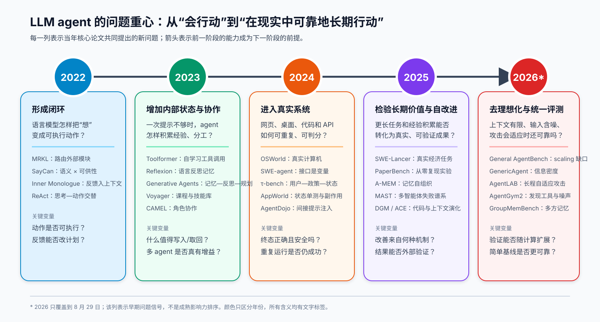

这套专题收录截至 **2026-08-29** 的 32 篇 LLM Agent 核心论文：2022 年 6 篇、2023 年 7 篇、2024 年 7 篇、2025 年 7 篇、2026 年 5 篇。年份按首次公开的完整版本计算，排序不是性能榜，而是一条研究问题如何演化的时间线。

**图 1｜研究问题的演化，而非性能排行榜。** 2022 年先把语言推理接到动作、工具和环境反馈；2023 年加入反思、长期记忆、多智能体与更真实的网页环境；2024 年进入桌面、软件、API、安全和科研；2025–2026 年继续追问长程可靠性、自修改、有限上下文、噪声与适应性攻击。

## 怎么读

- **按历史顺序建立全景**：从 [SayCan](/blog/agent-paper-01-saycan/) 读到 [AgentGym2](/blog/agent-paper-32-agentgym2/)，观察“能行动”怎样逐步变成“能可靠行动”。
- **控制循环与工具线**：[MRKL](/blog/agent-paper-02-mrkl-systems/) → [ReAct](/blog/agent-paper-06-react/) → [Toolformer](/blog/agent-paper-07-toolformer/) → [SWE-agent](/blog/agent-paper-15-swe-agent/)。
- **记忆、自改进与多智能体线**：[Reflexion](/blog/agent-paper-08-reflexion/) → [Generative Agents](/blog/agent-paper-10-generative-agents/) → [A-MEM](/blog/agent-paper-21-a-mem/) → [MAST](/blog/agent-paper-23-mast/) → [ACE](/blog/agent-paper-27-ace/)。
- **现实评测与安全线**：[WebArena](/blog/agent-paper-12-webarena/) → [OSWorld](/blog/agent-paper-14-osworld/) → [τ-bench](/blog/agent-paper-16-tau-bench/) → [AgentDojo](/blog/agent-paper-17-agentdojo/) → [AgentLAB](/blog/agent-paper-28-agentlab-security/)。

## 每篇都回答什么

每篇都围绕同一组问题展开：论文要解决什么失败；此前路线如何处理；新方法的输入、状态、决策、动作和反馈怎样闭环；公式中每个符号是什么意思；实验究竟支持到哪里；优点、局限、可证伪预测和最小复现路线分别是什么。正文会明确区分**论文事实**、**跨论文解释**与**我们的判断**。

## 证据与下载边界

每篇开头都链接对应的 arXiv 摘要页、核验 PDF 和 TeX 源码包。正文中的 `source/...:Lx–Ly` 是解压 arXiv 源码包后的精确坐标；PDF 页码对应文首链接的版本。为控制仓库体积并尊重原论文分发方式，博客只托管中文讲解和原创机制图，不镜像论文 PDF 或 TeX。
