这套专题收录 **2016–2026 共 51 篇**重要强化学习论文。年份按正式会议或期刊发表年归档；只有预印本或技术报告时采用首次公开年。2026 年只覆盖到 **2026-08-29**，因此该年的重要性判断是暂定的。

**图 1｜研究问题的演化，而不是性能排行榜。** 每个阶段继承前面的估计、优化或系统问题，同时引入新的动作空间、奖励来源和轨迹长度。

## 先说明分类

本专题把“解决决策问题”和“训练时真的做策略 RL”分开：PPO、GRPO、RLVR 和多轮环境策略更新属于严格 RL；DPO、KTO、ORPO、SimPO 等是直接偏好优化；过程奖励模型与 RewardBench 是奖励建模/评测；Decision Transformer 等采用离线序列建模。

每篇都回答同一组问题：观察到什么失败、失败机制是什么、以前怎样处理、本文做了什么最小改动、公式怎样变成算法、实验支持到哪里、优缺点与可证伪预测是什么。阅读方法借鉴 [Keshav 的三遍阅读法](https://www.cs.princeton.edu/courses/archive/fall10/cos597B/papers/howtoread-keshav.pdf)，图解遵守图文邻近、信号提示与去冗余原则。

**图 2｜理解依赖图。** 箭头表示建议先理解的机制，不表示后者只继承了前者一篇论文。

## 15 篇最短主线

1. [GAE：在“看得远但噪声大”和“看得近但偏差大”之间连续调节](/blog/rl-paper-03-gae/) — GAE 用 λ 控制 policy-gradient 优势估计的偏差—方差权衡，成为 PPO 和主流 RLHF 实现的标准部件。
2. [PPO：用裁剪概率比限制一批数据被“用过头”](/blog/rl-paper-04-ppo/) — clipped surrogate 近似 trust region，并允许同一批 rollout 做多轮 minibatch 更新；后来成为经典 RLHF 的核心优化器。
3. [从人类偏好学深度强化学习：先学“怎样算好”，再让策略去优化](/blog/rl-paper-05-deep-rl-human-preferences/) — 从成对轨迹偏好学习奖励模型，再用 RL 优化策略，是现代 RLHF 最直接的算法原型。
4. [从人类偏好微调语言模型：reward model、PPO 与 KL 约束的早期完整范式](/blog/rl-paper-13-lm-human-preferences/) — 首次把预训练语言模型、成对文本偏好奖励、KL 约束和 PPO 结合到多个自然语言任务，是语言模型 RLHF 的直接起点。
5. [Learning to summarize from human feedback：把“人更喜欢哪篇摘要”变成语言模型的奖励](/blog/rl-paper-17-summarize-human-feedback/) — 清晰展示语言模型 + 成对偏好奖励模型 + RL 能在摘要任务上超过监督微调与参考摘要，是大模型 RLHF 里程碑。
6. [InstructGPT：把“续写互联网文本”改造成“按人的意图办事”](/blog/rl-paper-21-instructgpt/) — 把 SFT→奖励模型→PPO 三阶段 RLHF 扩展到真实而广泛的指令分布，成为现代指令对齐的标准参照。
7. [Constitutional AI：用原则驱动自我修订与 AI 偏好标签](/blog/rl-paper-24-constitutional-ai/) — 形成“宪法原则→自我批评/修订→AI 偏好→奖励模型→RL”的完整 RLAIF 范式。
8. [DPO：把“奖励模型 + PPO”化成一次偏好分类](/blog/rl-paper-26-dpo/) — 用 KL 约束 RLHF 的最优策略—奖励闭式关系，把奖励模型 + PPO 化为单阶段偏好分类损失。
9. [Let's Verify Step by Step：把“答案错了”拆成“第几步开始错”](/blog/rl-paper-29-verify-step-by-step/) — 系统比较过程监督 PRM 与结果监督 ORM，并发布 PRM800K，奠定可验证推理的过程奖励建模。
10. [DeepSeekMath / GRPO：用同题多个答案的相对得分取代巨大的价值模型](/blog/rl-paper-31-deepseekmath-grpo/) — 提出无 critic、用组内奖励标准化估计 baseline 的 GRPO，并把可验证答案奖励用于数学推理，是 reasoning RL 的关键算法源头。
11. [DeepSeek-R1：可验证奖励怎样把长推理“练”出来](/blog/rl-paper-38-deepseek-r1/) — 展示无人工推理轨迹的 RL 可显著激发长链推理，并把 GRPO、RLVR 与 reasoning-model 蒸馏推向主流。
12. [DAPO：让长思维链强化学习既能探索，也能稳定获得有效梯度](/blog/rl-paper-40-dapo/) — 可完整复现的大规模 reasoning RL 系统；把 clip-higher、dynamic sampling、token-level loss 与过长样本处理拆成可验证干预。
13. [Understanding R1-Zero-Like Training：先审计 base、模板和 loss，再谈“推理涌现”](/blog/rl-paper-41-dr-grpo-critical/) — 纠正“RL 产生 aha moment”的轻率解释，检测 base-model/template 偏差与 GRPO 长度偏差，并提出 Dr.GRPO。
14. [Search-R1：用最终答案奖励学习“何时搜、搜什么、何时停”](/blog/rl-paper-42-search-r1/) — 把 RLVR 扩展到 reasoning-search 交替轨迹，并用 retrieved-token masking 避免工具返回内容进入策略梯度。
15. [RAGEN：多轮智能体强化学习为何先变好、再掉进“回声陷阱”](/blog/rl-paper-43-ragen/) — 系统揭示多轮 RL 的 Echo Trap、reward-variance cliff、梯度尖峰和 reasoning signal 衰减。

## 七个机制模块

### A. 策略梯度与价值学习

建立价值、优势、策略梯度、可信更新与连续控制的基本故障模型。

| 年份 | 论文 | 训练类型 |
|---:|---|---|
| 2016 | [Dueling DQN：把“这个状态好不好”和“此刻该按哪个键”分开学](/blog/rl-paper-02-dueling-dqn/) | 严格策略 RL |
| 2017 | [分布式强化学习：C51 不只猜平均回报，还猜回报的整个分布](/blog/rl-paper-06-distributional-rl/) | 严格策略 RL |
| 2016 | [GAE：在“看得远但噪声大”和“看得近但偏差大”之间连续调节](/blog/rl-paper-03-gae/) | 严格策略 RL |
| 2017 | [PPO：用裁剪概率比限制一批数据被“用过头”](/blog/rl-paper-04-ppo/) | 严格策略 RL |
| 2018 | [Soft Actor-Critic：让策略既追求高回报，也保留多种好选择](/blog/rl-paper-07-soft-actor-critic/) | 严格策略 RL |
| 2018 | [TD3：别让 actor 把 critic 的估计误差当成捷径](/blog/rl-paper-08-td3/) | 严格策略 RL |

### B. 扩展、探索与世界模型

理解 actor–learner 解耦、回放状态、内在奖励和潜空间规划。

| 年份 | 论文 | 训练类型 |
|---:|---|---|
| 2016 | [A3C：用许多不同步的学习者替代经验回放](/blog/rl-paper-01-a3c/) | 严格策略 RL |
| 2018 | [IMPALA：让大量 actor 放手采样，再用 V-trace 修正“旧策略数据”](/blog/rl-paper-09-impala/) | 严格策略 RL |
| 2019 | [R2D2：让循环网络从回放中学习，而不被“过期记忆”带偏](/blog/rl-paper-11-r2d2/) | 严格策略 RL |
| 2019 | [RND：用“还没学会模仿随机老师”衡量新奇](/blog/rl-paper-12-rnd/) | 严格策略 RL |
| 2019 | [PlaNet：不预测未来像素，也能在“脑内”试动作](/blog/rl-paper-10-planet/) | 严格策略 RL |
| 2020 | [Dreamer：让策略在潜空间里“做梦”学会长期控制](/blog/rl-paper-14-dreamer/) | 严格策略 RL |
| 2020 | [MuZero：不知道游戏规则，也能学会为搜索服务的世界模型](/blog/rl-paper-15-muzero/) | 严格策略 RL |

### C. 离线 RL 与序列建模

区分离线策略改进、保守价值学习和回报条件序列建模。

| 年份 | 论文 | 训练类型 |
|---:|---|---|
| 2020 | [CQL：离线强化学习里，先把没见过动作的虚高分压下来](/blog/rl-paper-16-cql/) | 严格策略 RL |
| 2021 | [Decision Transformer：把离线决策改写成“按目标回报续写动作”](/blog/rl-paper-18-decision-transformer/) | 离线序列建模，非策略梯度 |
| 2021 | [Trajectory Transformer：把动力学、行为约束和规划装进一次序列生成](/blog/rl-paper-19-trajectory-transformer/) | 离线序列建模，非策略梯度 |

### D. 人类偏好与经典 RLHF

沿偏好标签、奖励模型、KL 约束和策略更新追踪完整 RLHF 闭环。

| 年份 | 论文 | 训练类型 |
|---:|---|---|
| 2017 | [从人类偏好学深度强化学习：先学“怎样算好”，再让策略去优化](/blog/rl-paper-05-deep-rl-human-preferences/) | 严格策略 RL |
| 2019 | [从人类偏好微调语言模型：reward model、PPO 与 KL 约束的早期完整范式](/blog/rl-paper-13-lm-human-preferences/) | 严格策略 RL |
| 2020 | [Learning to summarize from human feedback：把“人更喜欢哪篇摘要”变成语言模型的奖励](/blog/rl-paper-17-summarize-human-feedback/) | 严格策略 RL |
| 2021 | [WebGPT：让语言模型浏览网页，并把人类偏好变成可优化的答案分数](/blog/rl-paper-20-webgpt/) | 严格策略 RL |
| 2022 | [InstructGPT：把“续写互联网文本”改造成“按人的意图办事”](/blog/rl-paper-21-instructgpt/) | 严格策略 RL |
| 2022 | [HH-RLHF：同一个奖励怎样兼顾“有帮助”与“不伤人”](/blog/rl-paper-22-hh-rlhf/) | 严格策略 RL |
| 2022 | [Sparrow：把笼统“安全”拆成可逐条追问的规则](/blog/rl-paper-23-sparrow/) | 严格策略 RL |
| 2023 | [RL4LMs 与 NLPO：给语言策略优化一套可比较的试验台](/blog/rl-paper-25-rl4lms-nlpo/) | 严格策略 RL |
| 2023 | [Fine-Grained RLHF：告诉模型“哪一句、错在哪”](/blog/rl-paper-27-fine-grained-rlhf/) | 严格策略 RL |

### E. AI 反馈、直接偏好与奖励评测

准确区分 RLAIF、奖励评测和不做在线策略梯度的直接偏好目标。

| 年份 | 论文 | 训练类型 |
|---:|---|---|
| 2022 | [Constitutional AI：用原则驱动自我修订与 AI 偏好标签](/blog/rl-paper-24-constitutional-ai/) | 严格策略 RL |
| 2024 | [RLAIF vs. RLHF：把偏好标注员从人换成大模型，其他环节尽量不动](/blog/rl-paper-30-rlaif-vs-rlhf/) | 严格策略 RL |
| 2023 | [DPO：把“奖励模型 + PPO”化成一次偏好分类](/blog/rl-paper-26-dpo/) | 直接偏好优化，非策略 RL |
| 2023 | [RRHF：把候选答案按奖励排序，再让语言模型学会同样排序](/blog/rl-paper-28-rrhf/) | 直接偏好优化，非策略 RL |
| 2024 | [KTO：不凑偏好对，也能用“好/坏”标签直接对齐](/blog/rl-paper-33-kto/) | 直接偏好优化，非策略 RL |
| 2024 | [ORPO：把 SFT 与偏好惩罚合成一次训练](/blog/rl-paper-34-orpo/) | 直接偏好优化，非策略 RL |
| 2024 | [SimPO：让训练奖励与生成时的平均似然对齐](/blog/rl-paper-35-simpo/) | 直接偏好优化，非策略 RL |
| 2024 | [Self-Rewarding Language Models：同一个模型既作答又当裁判](/blog/rl-paper-36-self-rewarding-lm/) | 直接偏好优化，非策略 RL |
| 2025 | [RewardBench：先测清“裁判”会不会判，再让策略听它的话](/blog/rl-paper-37-rewardbench/) | 奖励建模/评测，非策略 RL |

### F. 可验证奖励与推理 RL

审查 GRPO/RLOO/DPPO 的优势、归一化、裁剪和可验证奖励机制。

| 年份 | 论文 | 训练类型 |
|---:|---|---|
| 2024 | [Let's Verify Step by Step：把“答案错了”拆成“第几步开始错”](/blog/rl-paper-29-verify-step-by-step/) | 奖励建模/评测，非策略 RL |
| 2024 | [DeepSeekMath / GRPO：用同题多个答案的相对得分取代巨大的价值模型](/blog/rl-paper-31-deepseekmath-grpo/) | 严格策略 RL |
| 2024 | [RLOO：把一整段回答当成一个动作，用其他采样估计它的起跑线](/blog/rl-paper-32-rloo/) | 严格策略 RL |
| 2025 | [DeepSeek-R1：可验证奖励怎样把长推理“练”出来](/blog/rl-paper-38-deepseek-r1/) | 严格策略 RL |
| 2025 | [Kimi k1.5：把长上下文、可验证奖励和训练系统一起扩展](/blog/rl-paper-39-kimi-k1-5/) | 严格策略 RL |
| 2025 | [DAPO：让长思维链强化学习既能探索，也能稳定获得有效梯度](/blog/rl-paper-40-dapo/) | 严格策略 RL |
| 2025 | [Understanding R1-Zero-Like Training：先审计 base、模板和 loss，再谈“推理涌现”](/blog/rl-paper-41-dr-grpo-critical/) | 严格策略 RL |
| 2026 | [DPPO：大词表里，概率“倍数”不是策略“距离”](/blog/rl-paper-47-dppo-trust-region/) | 严格策略 RL |

### G. 搜索、工具、多轮与自演化

进入长轨迹工具环境、自博弈、多代理学习和 agentic RL 系统。

| 年份 | 论文 | 训练类型 |
|---:|---|---|
| 2025 | [Search-R1：用最终答案奖励学习“何时搜、搜什么、何时停”](/blog/rl-paper-42-search-r1/) | 严格策略 RL |
| 2025 | [RAGEN：多轮智能体强化学习为何先变好、再掉进“回声陷阱”](/blog/rl-paper-43-ragen/) | 严格策略 RL |
| 2025 | [SWE-RL：不用执行测试，也能从真实补丁的“相似程度”训练代码修复策略吗？](/blog/rl-paper-44-swe-rl/) | 严格策略 RL |
| 2025 | [Absolute Zero：模型自己出题、自己解题，但“零数据”究竟零掉了什么？](/blog/rl-paper-45-absolute-zero/) | 严格策略 RL |
| 2026 | [SPIRAL：让同一个语言模型在零和游戏里左右互搏](/blog/rl-paper-46-spiral/) | 严格策略 RL |
| 2026 | [ICRL for Tool Use：训练时给示范扶手，再一阶阶撤掉](/blog/rl-paper-48-in-context-rl-tool-use/) | 严格策略 RL |
| 2026 | [SAGE：让出题、规划、求解和质检共同训练，但闭环仍受验证器与课程漂移约束](/blog/rl-paper-49-sage-multi-agent-self-evolution/) | 严格策略 RL |
| 2026 | [Q-Evolve：在每轮混合数据支持内分配过程信用，再用新交互进入下一轮](/blog/rl-paper-50-q-evolve/) | 离线到在线智能体 RL |
| 2026 | [AReaL2.0：把自进化 agent 的瓶颈从单个 RL 算法提升为数据协议、代理与控制平面](/blog/rl-paper-51-areal2-agentic-rl-systems/) | 系统立场/技术报告 |

## 年份索引

| 年份 | 篇数 | 说明 |
|---:|---:|---|
| 2016 | 3 | 正式发表年优先 |
| 2017 | 3 | 正式发表年优先 |
| 2018 | 3 | 正式发表年优先 |
| 2019 | 4 | 正式发表年优先 |
| 2020 | 4 | 正式发表年优先 |
| 2021 | 3 | 正式发表年优先 |
| 2022 | 4 | 正式发表年优先 |
| 2023 | 4 | 正式发表年优先 |
| 2024 | 8 | 正式发表年优先 |
| 2025 | 9 | 正式发表年优先 |
| 2026 | 6 | 截至 2026-08-29 暂定 |

## 证据与下载边界

本地研究档案包含 51 份 PDF、41 个原始 TeX bundle、9 个明确标注限制的 TeX 文本树，以及 1 份 MinerU Markdown。博客只发布原创中文讲解和教学重绘 SVG，不复制论文 PDF、TeX、MinerU 全文或第三方样式/图片；每篇开头提供论文官方入口。

实验数字以链接的最终 PDF 为准。早期 TeX 与最终 PDF 不一致时，正文会明确记录版本差异；benchmark 改善、机制证据和历史影响也分别表述。
